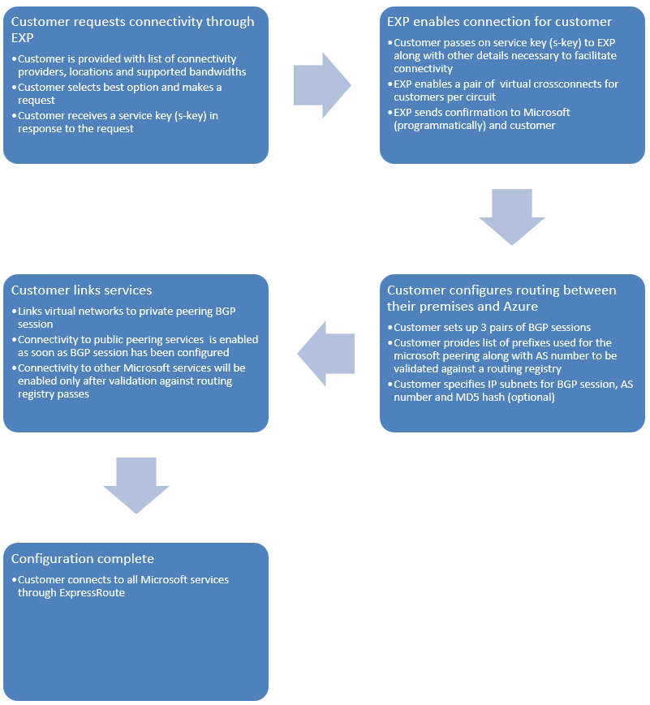

<properties
   pageTitle="透過交換提供者設定 ExpressRoute"
   description="本教學課程帶領您透過交換提供者 (EXP) 設定 ExpressRoute。"
   documentationCenter="na"
   services="expressroute"
   authors="cherylmc"
   manager="adinah"
   editor="tysonn" />
<tags
   ms.service="expressroute"
   ms.devlang="na"
   ms.topic="hero-article" 
   ms.tgt_pltfrm="na"
   ms.workload="infrastructure-services"
   ms.date="04/29/2015"
   ms.author="cherylmc"/>

#  透過 Exchange 提供者設定 ExpressRoute 連線

若要透過交換提供者設定 ExpressRoute 連線，您需要依適當的順序完成多個步驟。這些指示協助您執行下列動作：

- 建立和管理 ExpressRoute 線路
- 設定 ExpressRoute 線路的 BGP 對等
- 將虛擬網路連結至 ExpressRoute 線路

##  組態必要條件

開始設定之前，請驗證您符合下列必要條件：

- Azure 訂閱
- 最新版的 Azure PowerShell
- 下列虛擬網路需求：
	- Azure 中用於虛擬網路的一組 IP 位址首碼
	- 內部部署的一組 IP 首碼 (可包含公用 IP 位址)
	- 必須以 /28 子網路建立虛擬網路閘道。
	- 虛擬網路外的另一組 IP 首碼 (/28)。這用於設定 BGP 對等。
	- 網路的 AS 編號。如需 AS 編號的詳細資訊，請參閱 [自發系統 (AS) 編號](http://www.iana.org/assignments/as-numbers/as-numbers.xhtml)。
	- MD5 雜湊 (若需要已驗證的 BGP 工作階段)
	- 供傳送流量的 VLAN ID。每一個線路需要 2 個 VLAN ID：一個用於虛擬網路，另一個用於公用 IP 位址上裝載的服務。
	- 網路的[自發系統 (AS) 編號](http://www.iana.org/assignments/as-numbers/as-numbers.xhtml)。
	- 兩個 1 Gbps / 10 Gbps 交叉連接至交換提供者的乙太網路交換中心。
	- 一對支援 BGP 路由的路由器

##  部署工作流程

##  使用 PowerShell 進行組態設定

Windows PowerShell 是功能強大的指令碼環境，可讓您控制和自動化部署及管理 Azure 中的工作負載。如需詳細資訊，請參閱 [MSDN](https://msdn.microsoft.com/library/windowsazure/jj156055.aspx) 中的 PowerShell 文件。

1. **匯入 ExpressRoute 的 PowerShell 模組。**

	    Import-Module 'C:\Program Files (x86)\Microsoft SDKs\Azure\PowerShell\ServiceManagement\Azure\Azure.psd1'
	    Import-Module 'C:\Program Files (x86)\Microsoft SDKs\Azure\PowerShell\ServiceManagement\Azure\ExpressRoute\ExpressRoute.psd1'

2. **取得支援的提供者、位置和頻寬清單。**

	建立線路之前，您需要有服務提供者、支援的位置和每個位置的頻寬選項等清單。下列 PowerShell Cmdlet 會傳回此資訊，在稍後的步驟中將會用到。

    	PS C:> Get-AzureDedicatedCircuitServiceProvider
		**The information returned will look similar to the example below:**

		Name                 DedicatedCircuitLocations      DedicatedCircuitBandwidths
		----                 -------------------------      --------------------------
		AT&T                 Silicon Valley,Washington DC   10Mbps:10, 50Mbps:50, 100Mbps:100, 500Mbps:500, 1Gbps:1000
		British Telecom      London,Amsterdam               10Mbps:10, 50Mbps:50, 100Mbps:100, 500Mbps:500, 1Gbps:1000
		Equinix              Amsterdam,Atlanta,Chicago,Dall 200Mbps:200, 500Mbps:500, 1Gbps:1000, 10Gbps:10000
		                     as,New York,Seattle,Silicon
		                     Valley,Washington
		                     DC,London,Hong
		                     Kong,Singapore,Sydney,Tokyo
		IIJ                  Tokyo                          10Mbps:10, 50Mbps:50, 100Mbps:100, 500Mbps:500, 1Gbps:1000
		Level 3              London,Silicon                 200Mbps:200, 500Mbps:500, 1Gbps:1000
		Communications -     Valley,Washington DC
		Exchange
		Level 3              London,Silicon                 10Mbps:10, 50Mbps:50, 100Mbps:100, 500Mbps:500, 1Gbps:1000
		Communications -     Valley,Washington DC
		IPVPN
		Orange               Amsterdam,London               10Mbps:10, 50Mbps:50, 100Mbps:100, 500Mbps:500, 1Gbps:1000
		SingTel Domestic     Singapore                      10Mbps:10, 50Mbps:50, 100Mbps:100, 500Mbps:500, 1Gbps:1000
		SingTel              Singapore                      10Mbps:10, 50Mbps:50, 100Mbps:100, 500Mbps:500, 1Gbps:1000
		International
		TeleCity Group       Amsterdam,London               200Mbps:200, 500Mbps:500, 1Gbps:1000, 10Gbps:10000
		Telstra Corporation  Sydney                         10Mbps:10, 50Mbps:50, 100Mbps:100, 500Mbps:500, 1Gbps:1000
		Verizon              Silicon Valley,Washington DC   10Mbps:10, 50Mbps:50, 100Mbps:100, 500Mbps:500, 1Gbps:1000

3. **建立專用線路**

	下列範例顯示如何透過 Equinix Silicon Valley 建立 200 Mbps ExpressRoute 線路。如果您使用不同的提供者和不同的設定，請在提出要求時替換成該資訊。

	以下是新服務金鑰的要求範例：

		#Creating a new circuit
		$Bandwidth = 200
		$CircuitName = "EquinixSVTest"
		$ServiceProvider = "Equinix"
		$Location = "Silicon Valley"

		New-AzureDedicatedCircuit -CircuitName $CircuitName -ServiceProviderName $ServiceProvider -Bandwidth $Bandwidth -Location $Location

		#Getting service key
		Get-AzureDedicatedCircuit

	回應如下列範例所示：

		Bandwidth                        : 200
		CircuitName                      : EquinixSVTest
		Location                         : Silicon Valley
		ServiceKey                       : *********************************
		ServiceProviderName              : equinix
		ServiceProviderProvisioningState : NotProvisioned
		Status                           : Enabled

	您隨時可以使用 Get-AzureCircuit Cmdlet 擷取此資訊。執行呼叫時，若未指定任何參數，將會列出所有線路。ServiceKey 欄位會列出您的服務金鑰。

		PS C:> Get-AzureDedicatedCircuit

		Bandwidth                        : 200
		CircuitName                      : EquinixSVTest
		Location                         : Silicon Valley
		ServiceKey                       : *********************************
		ServiceProviderName              : equinix
		ServiceProviderProvisioningState : NotProvisioned
		Status                           : Enabled

4. **將服務金鑰傳送至交換提供者。**

	交換提供者會使用服務金鑰來啟用他們那一端的連線。您必須提供其他資訊給連線提供者來啟用連線。

5. **定期檢查線路金鑰的情況和狀態。**

	這樣可讓您知道提供者已啟用您的線路。線路啟用之後，*ServiceProviderProvisioningState* 會顯示為 *Provisioned*，如下列範例所示。

		PS C:> Get-AzureDedicatedCircuit

		Bandwidth                        : 200
		CircuitName                      : EquinixSVTest
		Location                         : Silicon Valley
		ServiceKey                       : *********************************
		ServiceProviderName              : equinix
		ServiceProviderProvisioningState : Provisioned
		Status                           : Enabled

6. **設定虛擬網路的路由。**

	我們使用 BGP 工作階段來交換路由，也確保我們具有高可用性。請使用下列範例為您的線路建立 BGP 工作階段。建立工作階段時，請替換成您自己的值。

		#Setting up a bgp session
		$ServiceKey = "<your key>"
		$PriSN = "<subnet/30 you use IP #1 and Azure uses IP #2>"
		$SecSN = "<subnet/30 use IP #1 and Azure uses IP #2>"
		$ASN = <your ASN>
		$VLAN = <your vlan ID>

		#Create a new bgp peering session
		New-AzureBGPPeering -ServiceKey $ServiceKey -PrimaryPeerSubnet $PriSN -SecondaryPeerSubnet $SecSN -PeerAsn $ASN VlanId $VLAN –AccessType Private
		#Get BGP parameters and Azure ASN
		Get-AzureBGPPeering -ServiceKey $ServiceKey –AccessType Private
		#Update BGP peering config
		Set-AzureBGPPeering  -ServiceKey $ServiceKey -PrimaryPeerSubnet $PriSN -SecondaryPeerSubnet $SecSN -PeerAsn $ASN -VlanId $VLAN –AccessType Private
		#Removing BGP peering config
		Remove-AzureBGPPeering -ServiceKey $ServiceKey –AccessType Private

	您可以使用 Get-AzureBGPPeering 並提供服務金鑰，以取得線路的路由資訊。您也可以使用 Set-AzureBGPPeering 來更新 BGP 設定。執行此命令時，BGP 工作階段不會啟動。線路至少必須連結一個 VNet，BGP 工作階段才能啟動。

	下列回應提供後續步驟所需的資訊。請使用對等 ASN，在路由器的 VRF 上設定 BGP。

		PS C:> New-AzureBGPPeering -ServiceKey $ServiceKey -PrimaryPeerSubnet $PriSN -SecondaryPeerSubnet $SecSN -PeerAsn $ASN -VlanId $VLAN –AccessType Private

		AzureAsn            : 12076
		PeerAsn             : 65001
		PrimaryAzurePort    : EQIX-SJC-06GMR-CIS-1-PRI-A
		PrimaryPeerSubnet   : 10.0.1.0/30
		SecondaryAzurePort  : EQIX-SJC-06GMR-CIS-2-SEC-A
		SecondaryPeerSubnet : 10.0.2.0/30
		State               : Enabled
		VlanId              : 100

7. **對裝載於公用 IP 位址的服務設定路由。**

	我們使用 BGP 工作階段來交換路由，也確保我們具有高可用性。請使用下列範例為您的線路建立 BGP 工作階段。建立工作階段時，請替換成您自己的值。

		#Setting up a bgp session
		$ServiceKey = "<your key>"
		$PriSN = "<subnet/30 subnet you use IP #1 and Azure uses IP #2>"
		$SecSN = "< subnet/30 subnet you use IP #1 and Azure uses IP #2>"
		$ASN = <your ASN>
		$VLAN = <your vlan ID>

		#Create a new bgp peering session
		New-AzureBGPPeering -ServiceKey $ServiceKey -PrimaryPeerSubnet $PriSN -SecondaryPeerSubnet $SecSN -PeerAsn $ASN -VlanId $VLAN –AccessType Public
		#Get BGP parameters and Azure ASN
		Get-AzureBGPPeering -ServiceKey $ServiceKey –AccessType Public
		#Update BGP peering config
		Set-AzureBGPPeering  -ServiceKey $ServiceKey -PrimaryPeerSubnet $PriSN -SecondaryPeerSubnet $SecSN -PeerAsn $ASN -VlanId $VLAN –AccessType Public
		#Removing BGP peering config
		Remove-AzureBGPPeering -ServiceKey $ServiceKey –AccessType Public

	您可以使用 Get-AzureBGPPeering 並提供服務金鑰，以取得線路的路由資訊。您也可以使用 Set-AzureBGPPeering 來更新 BGP 設定。執行此命令時，BGP 工作階段不會啟動。線路至少必須連結一個 VNet，BGP 工作階段才能啟動。

	下列回應提供後續步驟所需的資訊。請使用對等 ASN，在路由器的 VRF 上設定 BGP。

		PS C:> New-AzureBGPPeering -ServiceKey $ServiceKey -PrimaryPeerSubnet $PriSN -SecondaryPeerSubnet $SecSN -PeerAsn $ASN -VlanId $VLAN –AccessType Private

		AzureAsn            : 12076
		PeerAsn             : 65001
		PrimaryAzurePort    : EQIX-SJC-06GMR-CIS-1-PRI-A
		PrimaryPeerSubnet   : 10.0.1.8/30
		SecondaryAzurePort  : EQIX-SJC-06GMR-CIS-2-SEC-A
		SecondaryPeerSubnet : 10.0.2.8/30
		State               : Enabled
		VlanId              : 101

8. **設定虛擬網路和閘道。**

	請參閱[設定 ExpressRoute 的虛擬網路和閘道器](https://msdn.microsoft.com/library/azure/dn643737.aspx)。請注意，閘道器子網路必須是 /28，才能使用 ExpressRoute 連線。

9. **將網路連結至線路。** 必須確認線路處於下列狀態和情況，才能繼續執行下列指示：
	- ServiceProviderProvisioningState: Provisioned
	- Status: Enabled

			PS C:> $Vnet = "MyTestVNet"
			New-AzureDedicatedCircuitLink -ServiceKey $ServiceKey -VNetName $Vnet
 

<!---HONumber=July15_HO2-->