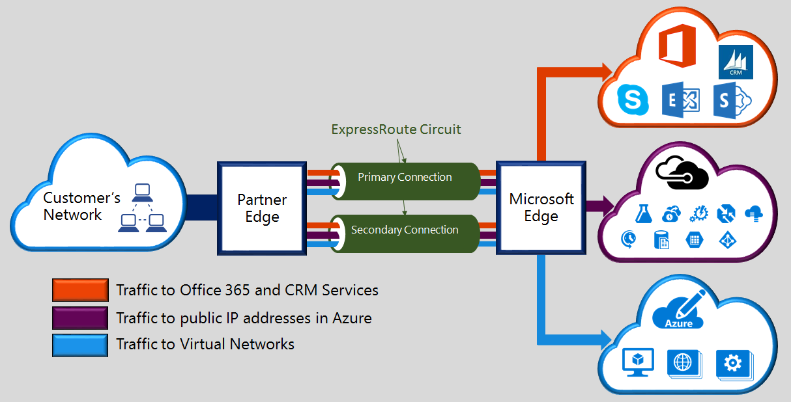
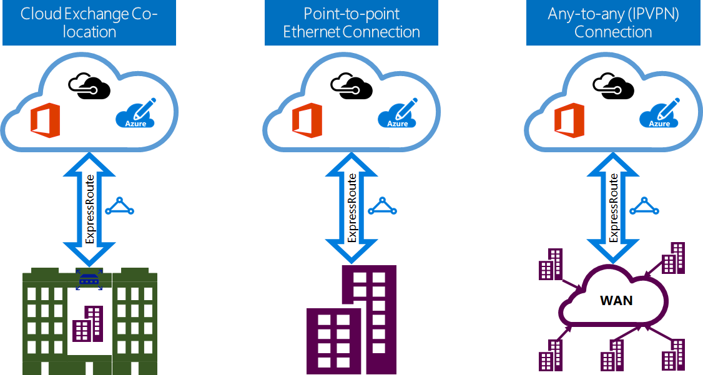

<properties 
   pageTitle="Inleiding tot ExpressRoute | Microsoft Azure"
   description="Deze pagina biedt een overzicht van de service ExpressRoute, met inbegrip van hoe een ExpressRoute-verbinding werkt."
   documentationCenter="na"
   services="expressroute"
   authors="cherylmc"
   manager="carmonm"
   editor=""/>
<tags 
   ms.service="expressroute"
   ms.devlang="na"
   ms.topic="get-started-article" 
   ms.tgt_pltfrm="na"
   ms.workload="infrastructure-services" 
   ms.date="06/13/2016"
   ms.author="cherylmc"/>

# Technisch overzicht van ExpressRoute

Met Microsoft Azure ExpressRoute kunt u uw on-premises netwerken in de Microsoft Cloud uitbreiden via een speciale persoonlijke verbinding die wordt gefaciliteerd door een connectiviteitsprovider. Met ExpressRoute kunt u verbindingen tot stand brengen met Microsoft Cloud-services, zoals Microsoft Azure, Office 365 en CRM Online. Via een connectiviteitsprovider in een co-locatiefaciliteit is connectiviteit mogelijk vanuit een any-to-any (IP VPN) netwerk, een point-to-point Ethernet-netwerk of een virtuele overlappende verbinding. ExpressRoute-verbindingen gaan niet via het openbare internet. Daardoor zijn ExpressRoute-verbindingen betrouwbaarder en sneller en hebben ze lagere latenties en betere beveiliging dan gewone verbindingen via internet.

**De belangrijkste voordelen zijn:**

- Laag-3-connectiviteit tussen uw on-premises netwerk en de Microsoft Cloud via een connectiviteitsprovider. Connectiviteit is mogelijk van een any-to-any (IPVPN) netwerk, een point-to-point Ethernet-verbinding of langs een virtuele overlappende verbinding via een Ethernet-exchange.
- Connectiviteit met Microsoft Cloud-services tussen alle gebieden in de geopolitieke regio.
- Globale connectiviteit met Microsoft-services tussen alle regio's met de ExpressRoute Premium-invoegtoepassing.
- Dynamische routering tussen uw netwerk en Microsoft via standaardprotocollen (BGP).
- Ingebouwde redundantie op elke peeringlocatie voor hogere betrouwbaarheid.
- [SLA](https://azure.microsoft.com/support/legal/sla/) voor verbindingsbedrijfstijd.
- QoS en ondersteuning voor meerdere serviceklassen van speciale toepassingen, zoals Skype voor Bedrijven.

Zie de [Veelgestelde vragen over ExpressRoute](expressroute-faqs.md) voor meer informatie.

## Hoe kan ik ExpressRoute gebruiken om mijn netwerk te verbinden met Microsoft?

U kunt op drie manieren een verbinding maken tussen uw on-premises netwerk en de Microsoft Cloud:

### Co-locatie op een cloudexchange

Als u zich bevindt op dezelfde locatie als een exchange-cloud, kunt u virtuele overlappende verbindingen met de Microsoft Cloud aanvragen via de Ethernet exchange van de co-locatieprovider. Co-locatieproviders kunnen Laag-2-overlappende verbindingen of beheerde Laag-3 overlappende verbindingen tussen uw infrastructuur in de co-locatiefaciliteit en de Microsoft Cloud aanbieden.

### Point-to-Point Ethernet-verbindingen 

U kunt uw on-premises datacenters/kantoren met de Microsoft Cloud verbinden via point-to-point Ethernet-koppelingen. Point-to-point Ethernet-providers kunnen Laag-2-verbindingen of beheerde Laag-3-verbindingen bieden tussen uw locatie en de Microsoft Cloud.

### Any-to-any (IPVPN) netwerken

U kunt uw WAN integreren met de Microsoft Cloud. IPVPN-providers (doorgaans MPLS VPN) bieden any-to-any connectiviteit tussen uw filialen en datacenters. De Microsoft Cloud kan ook worden verbonden met uw WAN, zodat het er net zo uitziet als een filiaal. WAN-providers bieden doorgaans beheerde Laag-3-connectiviteit. ExpressRoute-functies en -mogelijkheden zijn identiek in alle bovenstaande connectiviteitsmodellen. 

Connectiviteitsproviders kunnen een of meer connectiviteitsmodellen bieden. Overleg met uw connectiviteitsprovider om na te gaan welk model voor u het meest geschikt is.

## ExpressRoute-functies

ExpressRoute ondersteunt de volgende functies en mogelijkheden: 

### Laag-3-connectiviteit

Microsoft maakt gebruik van een standaardprotocol voor dynamische routering (BGP) voor het uitwisselen van routes tussen uw on-premises netwerk, uw exemplaren in Azure en openbare Microsoft-adressen.  We stellen meerdere BGP-sessies met uw netwerk in voor verschillende verkeersprofielen. Meer informatie vindt u in het artikel [ExpressRoute circuit and routing domains](expressroute-circuit-peerings.md) (ExpressRoute-circuit en -routeringsdomeinen).

### Redundantie

Elk ExpressRoute-circuit bestaat uit twee verbindingen met twee Microsoft Enterprise-randrouters (MSEE's) van de connectiviteitsprovider/uw netwerkrand. Microsoft vereist een dubbele BGP-verbinding van de connectiviteitsprovider/uw kant. Een voor elke MSEE. U kunt ervoor kiezen om geen redundante apparaten/Ethernet-circuits aan uw kant te implementeren. Connectiviteitsproviders gebruiken redundante apparaten echter om ervoor te zorgen dat uw verbindingen op een redundante manier worden doorgegeven aan Microsoft. Onze [SLA](https://azure.microsoft.com/support/legal/sla/) is alleen geldig als er een redundante Laag-3-connectiviteit is geconfigureerd. 

### Connectiviteit met Microsoft Cloud-services

[AZURE.INCLUDE [expressroute-office365-include](../../includes/expressroute-office365-include.md)]

ExpressRoute-verbindingen maken toegang mogelijk tot de volgende services:

- Microsoft Azure-services
- Microsoft Office 365-services
- Microsoft CRM Online-services 
 
Op de pagina [Veelgestelde vragen over ExpressRoute](expressroute-faqs.md) vindt u een gedetailleerde lijst met services die via ExpressRoute worden ondersteund.

### Connectiviteit met alle regio's binnen een geopolitieke regio

U kunt verbinding maken met Microsoft op een van onze [peeringlocaties](expressroute-locations.md), zodat u toegang hebt tot alle regio's binnen de geopolitieke regio. 

Als u bijvoorbeeld via ExpressRoute bent verbonden met Microsoft in Amsterdam, hebt u toegang tot alle Microsoft-cloudservices die worden gehost in Noord-Europa en West-Europa. Raadpleeg het artikel [ExpressRoute partners and peering locations](expressroute-locations.md) (Overzicht van ExpressRoute-partners en -peeringlocaties) voor een overzicht van de geopolitieke regio's, bijbehorende Microsoft Cloud-regio's en bijbehorende ExpressRoute-peeringlocaties.

### Globale connectiviteit met de Premium-invoegtoepassing voor ExpressRoute

U kunt de Premium-invoegtoepassing voor ExpressRoute inschakelen om connectiviteit uit te breiden tot buiten de geopolitieke grenzen. Als u bijvoorbeeld via ExpressRoute bent verbonden met Microsoft in Amsterdam, hebt u toegang tot alle Microsoft Cloud-services die worden gehost in alle regio's van de wereld (uitgezonderd nationale clouds). U hebt toegang tot services die zijn geïmplementeerd in Zuid-Amerika of Australië op dezelfde manier als waarop u toegang hebt tot regio's in Noord- en West-Europa.

### Uitgebreid connectiviteitsecosysteem van partners

ExpressRoute heeft een voortdurend groeiend ecosysteem van connectiviteitsproviders en SI-partners. Raadpleeg het artikel [ExpressRoute providers and locations](expressroute-locations.md) (Overzicht van ExpressRoute-providers en -locaties) voor de meest recente informatie.

### Connectiviteit met nationale clouds

Microsoft stuurt geïsoleerde cloudomgevingen aan voor speciale geopolitieke regio's en klantsegmenten. Raadpleeg de pagina [ExpressRoute providers and locations](expressroute-locations.md) (Overzicht van ExpressRoute-providers en -locaties) voor een lijst van nationale clouds en providers.

### Ondersteunde bandbreedte-opties

U kunt ExpressRoute-circuits aanschaffen voor een breed scala aan bandbreedten. De lijst met ondersteunde bandbreedten vindt u hieronder. Controleer ook de lijst met ondersteunde bandbreedten van uw connectiviteitsproviders.

- 50 Mbps
- 100 Mbps
- 200 Mbps
- 500 Mbps
- 1 Gbps
- 2 Gbps
- 5 Gbps
- 10 Gbps

### Dynamische schaling van bandbreedte

U kunt de bandbreedte van het ExpressRoute-circuit (zo goed mogelijk) vergroten zonder de verbindingen te moeten verbreken. 

### Flexibele factureringsmodellen

U kunt een factureringsmodel selecteren dat voor u het meest geschikt is. Kies een van de hieronder vermelde factureringsmodellen. Raadpleeg de pagina [Veelgestelde vragen over ExpressRoute](expressroute-faqs.md) voor meer informatie. 

- **Onbeperkt gegevensverkeer**. U betaalt maandelijks een vast bedrag voor het ExpressRoute-circuit, en alle binnenkomende en uitgaande gegevensoverdracht is verder gratis. 
- **Naar gebruik**. U betaalt maandelijks een vast bedrag voor het ExpressRoute-circuit. Alle binnenkomende gegevensoverdracht is gratis. Uitgaande gegevensoverdracht wordt in rekening gebracht per GB aan gegevensoverdracht. De tarieven voor gegevensoverdracht verschillen per regio.
- **Premium-invoegtoepassing voor ExpressRoute**. De Premium-invoegtoepassing voor ExpressRoute is een invoegtoepassing via het ExpressRoute-circuit. De Premium-invoegtoepassing voor ExpressRoute biedt de volgende mogelijkheden: 
    - Ruimere routelimieten voor openbare en persoonlijke Azure-peering van 4000 routes naar 10.000 routes.
    - Globale connectiviteit voor services. Een ExpressRoute-circuit, gemaakt in een willekeurige regio (met uitzondering van nationale clouds), hebben toegang tot resources in elke andere regio ter wereld. Zo is een virtueel netwerk, gemaakt in West-Europa, toegankelijk via een ExpressRoute-circuit dat is ingericht in Silicon Valley.
    - Aantal VNet-koppelingen per ExpressRoute-circuit verhoogd van 10 tot een hogere limiet, afhankelijk van de bandbreedte van het circuit.

## Volgende stappen

- Meer informatie over ExpressRoute-verbindingen en -routeringsdomeinen. Zie [ExpressRoute circuits and routing domains](expressroute-circuit-peerings.md) (ExpressRoute-circuits en -routeringsdomeinen).
- Zoek een serviceprovider Zie [ExpressRoute partners and peering locations](expressroute-locations.md) (ExpressRoute-partners en -peeringlocaties).
- Controleer of aan alle vereisten is voldaan. Zie [ExpressRoute prerequisites](expressroute-prerequisites.md) (Vereisten voor ExpressRoute).
- Raadpleeg de vereisten voor [Routering](expressroute-routing.md), [NAT](expressroute-nat.md) en [QoS](expressroute-qos.md).
- Configureer uw ExpressRoute-verbinding.
    - [Een ExpressRoute-circuit maken](expressroute-howto-circuit-classic.md)
    - [Routering configureren](expressroute-howto-routing-classic.md)
    - [Een VNet koppelen aan een ExpressRoute-circuit](expressroute-howto-linkvnet-classic.md)

<!--HONumber=Sep16_HO3-->

