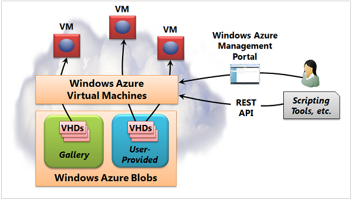
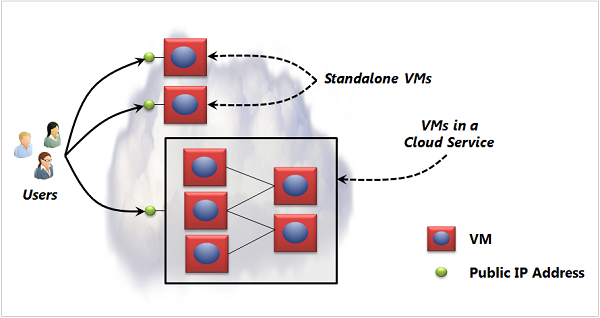
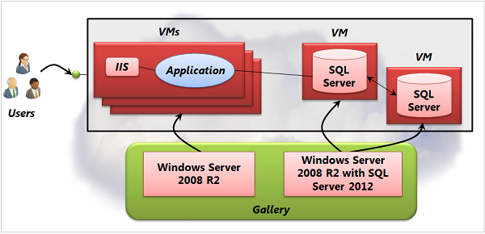
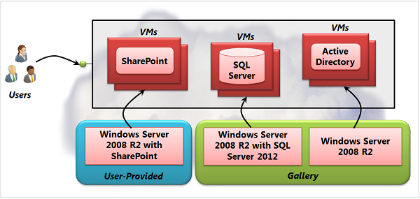
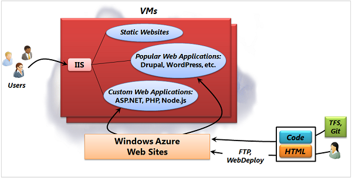
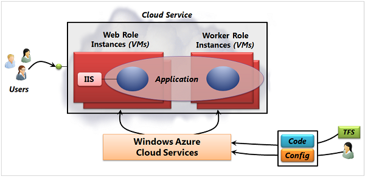

<properties  umbracoNaviHide="0" pageTitle="Application Model" metaKeywords="Azure, Azure, application model, Azure application model, development model, Azure development model, hosted service, Azure hosted service, web role, worker role" description="Learn about the Azure hosted service application model. Understand core concepts, design considerations, defining and configuring your application, and scaling." linkid="dev-net-fundamentals-application-model" urlDisplayName="Application Model" headerExpose="" footerExpose="" disqusComments="1" title="Application Model" authors="" />

# Azure-uitvoeringsmodellen

In Azure zijn verschillende modellen voor het uitvoeren van toepassingen beschikbaar. Elk model bevat een andere reeks services. Uw keuze voor een model is afhankelijk van wat u precies wilt doen. In dit artikel worden drie modellen behandeld, met een omschrijving van elke technologie en voorbeelden van het gebruik ervan.

## Inhoud

* [Virtual Machines](#VMachine)
* [Web Sites](#WebSites)
* [Cloud Services](#CloudServices)
* [Wat kan ik het beste gebruiken? Een keuze maken](#WhatShouldIUse)

<h2>Virtual Machines</h2>

Met Azure Virtual Machines kunnen ontwikkelaars, IT-medewerkers en anderen virtuele machines in de cloud maken en gebruiken. Omdat
*infrastructuur als een service (IaaS)* beschikbaar wordt gesteld, kan deze technologie op tal van manieren worden gebruikt. In [afbeelding 1](#Fig1) worden de basisonderdelen ervan weergegeven.

**Afbeelding 1: met Azure Virtual Machines wordt infrastructuur als een service beschikbaar gesteld.**

Zoals uit de afbeelding blijkt kunt u virtuele machines zowel via de Azure Management Portal als met de REST-API Azure Service Management maken. De Management Portal is toegankelijk via alle veelgebruikte browsers, zoals Internet Explorer, Mozilla en Chrome. Voor de REST-API biedt Microsoft clientscripthulpprogramma's voor Windows-, Linux- en Macintosh-systemen. Deze interface mag ook met andere software worden gebruikt.

Ongeacht de manier waarop u toegang tot het platform krijgt, u bent verplicht om bij het maken van een nieuwe VM een virtuele harde schijf (VHD) voor de installatiekopie van de VM te selecteren. Deze VHD's zijn opgeslagen in Azure-blobs.

U kunt op twee manieren aan de slag:

1.  Uw eigen VHD uploaden 2.  VHD's gebruiken die door Microsoft en partners van Microsoft
    beschikbaar worden gesteld in de Azure Virtual Machines-galerie of
    op [VM Depot][1], de opensourcewebsite van Microsoft.

In de galerie en op VM Depot staan diverse VHD's, waaronder nieuwe installatiekopieën van Microsoft- en Linux-besturingssystemen evenals installatiekopieën met geïnstalleerde producten van Microsoft en derden. Er komen voortdurende nieuwe opties bij. Denk bijvoorbeeld aan verschillende versies, edities en configuraties van:

* Windows Server
* Linux-servers zoals Suse, Ubuntu en CentOS
* SQL Server
* BizTalk Server
* SharePoint Server

Behalve een VHD moet u ook de grootte van de nieuwe VM opgeven. De volledige statistieken voor elke grootte worden vermeld [in de Azure-bibliotheek][2].

* **Extra klein** met een gedeelde kern en 768 MB geheugen.
* **Klein** met 1 kern en 1,75 GB geheugen.
* **Gemiddeld** met 2 kernen en 3,5 GB geheugen.
* **Groot** met 4 kernen en 7 GB geheugen.
* **Extra groot** met 8 kernen en 14 GB geheugen.
* **A6** met 4 kernen en 28 GB geheugen.
* **A7** met 8 kernen en 56 GB geheugen.

Tot slot selecteert u in welk Azure-datacenter in de VS, Europa of Azië de nieuwe VM moet worden uitgevoerd.

Zodra een VM is geactiveerd, betaalt u voor elk uur dat deze actief is. U stopt met betalen zodra u deze VM verwijdert. Het bedrag dat u betaalt, is niet afhankelijk van de mate waarin de VM wordt gebruikt, maar wordt precies per minuut berekend. Een VM die een uur niet-actief is, kost hetzelfde als een VM die drukbezet is.

Aan elke actieve VM is een *besturingssysteemschijf* gekoppeld die in een blob wordt bewaard. Wanneer u een VM maakt met een VHD uit de galerie, wordt deze VHD naar de besturingssysteemschijf van de VM gekopieerd. Alle wijzigingen die u in het besturingssysteem van de actieve VM aanbrengt, worden hier opgeslagen. Als u bijvoorbeeld een toepassing installeert waardoor het Windows-register wordt gewijzigd, wordt die wijziging op de besturingssysteemschijf van de VM opgeslagen. De volgende keer wanneer u een VM via deze besturingssysteemschijf maakt, heeft de VM de status waarin u deze hebt achtergelaten. Op VHD's die in de galerie zijn opgeslagen, past Microsoft indien nodig updates toe, zoals patches voor het besturingssysteem. Voor wat betreft de VHD's op uw eigen besturingssysteemschijven bent u echter zelf verantwoordelijk voor het toepassen van deze updates (hoewel Windows Update standaard is ingeschakeld).

Actieve VM's kunnen ook met het hulpprogramma sysprep worden gewijzigd en vastgelegd. Met sysprep worden specifieke gegevens, zoals de computernaam, verwijderd zodat een VHD-installatiekopie kan worden gebruikt voor het maken van extra VM's met dezelfde algemene configuratie. Deze installatiekopieën worden op de Management Portal opgeslagen bij de installatiekopieën die u hebt geüpload zodat deze als uitgangspunt voor extra VM's kunnen worden gebruikt.

Met Virtual Machines wordt ook de hardware bewaakt die wordt gebruikt voor de hosting van elke VM die u maakt. Een storing op een fysieke server waarop een VM wordt uitgevoerd, wordt opgemerkt en deze VM wordt vervolgens op een andere computer gestart. En aangenomen dat u over de juiste licentie beschikt, kunt u een gewijzigde VHD van uw besturingssysteemschijf kopiëren en ergens anders uitvoeren, bijvoorbeeld in het datacenter op uw eigen locatie of bij een andere cloudprovider.

Naast een besturingssysteemschijf beschikt de VM over een of meer gegevensschijven. Hoewel het lijkt te gaan om schijfstations die aan de VM zijn gekoppeld, is de inhoud van elk van deze schijven in feite in een blob opgeslagen. Alles wat naar een gegevensschijf wordt geschreven, wordt altijd in de onderliggende blob opgeslagen. Net als alle andere blobs worden deze door Azure zowel binnen één datacenter als over meerdere datacenters gerepliceerd als beveiliging in geval van storingen.

Actieve VM's kunnen worden beheerd via de Management Portal, met PowerShell en andere scripthulpprogramma's of rechtstreeks via de REST-API. (Feitelijk kunt u alles wat u via de Management Portal kunt doen, ook via deze API programmeren.) Ook partners van Microsoft, zoals RightScale en ScaleXtreme, bieden beheerservices op basis van de REST-API.

Azure Virtual Machines kan op tal van manieren worden gebruikt. Microsoft richt zich vooral op de volgende scenario's:

* **VM's voor ontwikkelen en testen.** Ontwikkelgroepen hebben meestal
  behoefte aan VM's met specifieke configuraties voor het maken van
  toepassingen. Met Azure Virtual Machines is het mogelijk om deze VM's
  op een eenvoudige, rendabele manier te maken en te gebruiken, en
  vervolgens te verwijderen wanneer ze niet meer nodig zijn.
* **Toepassingen in de cloud uitvoeren.** Met het oog op de kosten
  kunnen sommige toepassingen beter in de openbare cloud worden
  uitgevoerd. Denk bijvoorbeeld aan een toepassing met sterke pieken in
  de vraag. Natuurlijk is het altijd mogelijk om uw eigen datacenter uit
  te rusten met voldoende computers voor het uitvoeren van een
  dergelijke toepassing, maar waarschijnlijk worden de meeste ervan dan
  een groot deel van de tijd niet gebruikt. Door deze toepassing op
  Azure uit te voeren betaalt u alleen voor extra VM's wanneer deze
  nodig zijn; u stelt ze buiten bedrijf zodra de piek voorbij is. Of
  stel dat u als beginnend bedrijf snel en zonder verplichtingen
  behoefte hebt aan computercapaciteit op aanvraag. Ook dan kan Azure de
  juiste keuze zijn.
* **Uw eigen datacenter naar de openbare cloud uitbreiden.** Met Azure
  Virtual Network kan uw organisatie een virtueel netwerk (VNET) maken
  waarmee het net lijkt of een groep Azure VM's deel uitmaakt van het
  netwerk op uw eigen locatie. Dit maakt het mogelijk om SharePoint en
  andere toepassingen uit te voeren op Azure, een aanpak die mogelijk
  eenvoudiger te implementeren en/of minder kostbaar is dan uitvoering
  in uw eigen datacenter.
* **Herstel na noodgevallen.** In plaats van voortdurend te betalen voor
  een reservedatacenter dat zelden of nooit wordt gebruikt, betaalt u
  met herstel op basis van IaaS alleen voor benodigde computerbronnen
  wanneer u deze ook echt nodig hebt. Bij uitval van uw primaire
  datacenter kunt u bijvoorbeeld VM's op Azure maken voor het uitvoeren
  van essentiële toepassingen, en deze vervolgens buiten gebruik stellen
  wanneer u ze niet meer nodig hebt.

Dit zijn niet alleen mogelijkheden, het zijn goede voorbeelden van de manier waarop u Azure Virtual Machines kunt inzetten.

### VM's groeperen: cloudservices

Een nieuwe VM die u met Azure Virtual Machines maakt, kunt u als zelfstandig definiëren of opnemen in een groep VM's die samen in een
*cloudservice* worden uitgevoerd. (Ondanks dat de namen op elkaar lijken, is dit iets anders dan Cloud Services, de PaaS-technologie van Azure; deze twee zijn niet hetzelfde.) Aan elke zelfstandige VM wordt een eigen openbaar IP-adres toegewezen, terwijl alle VM's in dezelfde cloudservice via één enkel openbaar IP-adres toegankelijk zijn. In [afbeelding 2](#Fig2) wordt dit verduidelijkt.

**Afbeelding 2: elke zelfstandige VM heeft een eigen openbaar IP-adres, terwijl VM's die in een cloudservice zijn gegroepeerd, met één enkel openbaar IP-adres worden aangeduid.**

Als u bijvoorbeeld een virtuele machine maakt voor het maken en testen van een eenvoudige toepassing, kiest u waarschijnlijk voor een zelfstandige VM. Maar als u een toepassing met meerdere lagen maakt, met een web-front-end, een database en mogelijk zelfs een middelste laag, ligt het voor de hand om meerdere VM's in een cloudservice op te nemen, zoals in afbeelding 2 wordt aangegeven.

Door VM's in een cloudservice te groeperen kunt u ook van andere opties gebruikmaken. Azure biedt taakverdeling voor VM's in dezelfde cloudservice; hierbij worden gebruikersaanvragen over de VM's verdeeld. VM's die op deze manier zijn verbonden, kunnen ook rechtstreeks met elkaar communiceren via het lokale netwerk in een Azure-datacenter.

Verder kunnen VM's in dezelfde cloudservice in een of meer *beschikbaarheidssets* worden gegroepeerd. Wilt u begrijpen waarom dit belangrijk is, denk dan eens aan een webtoepassing die op meerdere front-end VM's wordt uitgevoerd. Bij implementatie van al deze VM's op dezelfde fysieke computer of zelfs in hetzelfde rek met computers kan één enkele hardwarestoring tot gevolg hebben dat ze allemaal ontoegankelijk worden. Zijn deze VM's echter in een beschikbaarheidsset gegroepeerd, dan worden ze door Azure over het datacenter verspreid, zodat geen ervan een enkel storingspunt deelt.

### Scenario: een toepassing met SQL Server uitvoeren

Voor meer inzicht in de werking van Azure Virtual Machines gaan we hieronder wat uitgebreider op een paar scenario's in. Stel dat u bijvoorbeeld een betrouwbare, schaalbare webtoepassing wilt maken die op Azure wordt uitgevoerd. Eén mogelijke manier is om de toepassingslogica op een of meer Azure VM's uit te voeren en de gegevens vervolgens met SQL Server te beheren. In [afbeelding 3](#Fig3) wordt dit verduidelijkt.

**Afbeelding 3: een toepassing die op Azure Virtual Machines wordt uitgevoerd, kan voor opslag gebruikmaken van SQL Server.**

In dit voorbeeld zijn beide soorten VM's gemaakt op basis van standaard VHD's in de galerie. De toepassingslogica wordt op Windows Server 2008 R2 uitgevoerd. De ontwikkelaar maakt dus drie VM's op basis van deze VHD en installeert de toepassing vervolgens op elk daarvan. Omdat al deze VM's zich in dezelfde cloudservice bevinden, kan hij taakverdeling voor de hardware configureren zodat aanvragen over de VM's worden verdeeld. De ontwikkelaar maakt op basis van de VHD in de galerie ook twee VM's met SQL Server 2012. Zodra deze zijn geactiveerd, configureert hij op elke instantie SQL Server voor databasespiegeling met automatische failover. Dit is niet vereist, want de toepassing kan ook met één SQL Server-instantie werken, maar deze aanpak resulteert in een hogere betrouwbaarheid.

### Scenario: een SharePoint-farm uitvoeren

Stel dat een organisatie een SharePoint-farm wil maken, maar deze niet in het eigen datacenter wil uitvoeren. Mogelijk komt dat omdat er in het datacenter op de eigen locatie een tekort aan bronnen is, of omdat de bedrijfseenheid die de farm maakt, liever niet met de interne IT-afdeling wil werken. In dit soort situaties ligt het voor de hand om SharePoint op Azure Virtual Machines uit te voeren. In [afbeelding 4](#Fig4) wordt dit verduidelijkt.

**Afbeelding 4: met Azure Virtual Machines is het mogelijk om een SharePoint-farm in de cloud uit te voeren.**

Een SharePoint-farm bestaat uit meerdere onderdelen; elk daarvan wordt uitgevoerd op een Azure VM die op basis van een andere VHD is gemaakt. Het volgende is nodig:

* Microsoft SharePoint. In de galerie zijn proefversies van
  installatiekopieën opgenomen of de organisatie stelt een eigen VHD
  beschikbaar.
* Microsoft SQL Server. Voor SharePoint is SQL Server nodig. Daarom
  maakt de organisatie VM's met SQL Server 2012 op basis van een
  standaard VHD in de galerie.
* Windows Server Active Directory. Voor SharePoint is ook Active
  Directory vereist. Daarom maakt de organisatie domeincontrollers in de
  cloud met een Windows Server-installatiekopie uit de galerie. Dit is
  geen absolute vereiste, want het is ook mogelijk om domeincontrollers
  op de eigen locatie te gebruiken, maar omdat er sprake is van
  regelmatige interactie tussen SharePoint en Active Directory,
  resulteert deze aanpak in betere prestaties.

Hoewel dat niet in de afbeelding wordt aangegeven, is deze SharePoint-farm waarschijnlijk verbonden met een netwerk op de eigen locatie via Azure Virtual Network. Hierdoor lijkt het voor de gebruikers van het netwerk alsof de VM's, evenals de toepassingen erop, lokaal zijn.

Zoals uit deze voorbeelden blijkt, kunt u met Azure Virtual Machines nieuwe toepassingen in de cloud maken en uitvoeren en bestaande toepassingen uitvoeren, maar u kunt deze service ook voor andere doeleinden inzetten. Welke optie u ook kiest, het doel van de technologie is altijd hetzelfde: een algemeen inzetbare grondslag bieden voor gegevensverwerking in de openbare cloud.

<h2>Web Sites</h2>

Webtechnologieën wordt op tal van manieren ingezet. Een onderneming wil mogelijk een website migreren of opzetten waarmee wekelijks miljoenen treffers kunnen worden afgehandeld en die in meerdere datacenters overal ter wereld wordt geïmplementeerd. Een webontwerpbureau laat mogelijk door een team ontwikkelaars een aangepaste webtoepassing bouwen om duizenden gebruikers van dienst te zijn. Een ontwikkelaar in een bedrijf bouwt mogelijk een toepassing in de cloud waarmee geverifieerde gebruikers uit de Active Directory van het bedrijf onkostendeclaraties kunnen volgen. Een IT-consultant werkt mogelijk met een veelgebruikte opensourcetoepassing om een contentmanagementsysteem voor een klein bedrijf op te zetten. Dit alles kan met Azure Virtual Machines worden gerealiseerd. Het vraagt echter wel wat vaardigheden en kost nogal wat inspanning om onbewerkte VM's te maken en te beheren. Als u een website of webtoepassing wilt implementeren, is er een eenvoudigere (en goedkopere) oplossing: de aanpak die bekend staat als platform as a service (PaaS). Zoals uit afbeelding 5 blijkt, is dit in Azure Web Sites beschikbaar.

**Afbeelding 5: Azure Web Sites ondersteunt statische websites, veelgebruikte webtoepassingen en aangepaste webtoepassingen die met diverse technologieën zijn gebouwd.**

Azure Web Sites is een aanvulling op Azure Cloud Services voor het maken van een platform as a service-oplossing die precies is afgestemd op het uitvoeren van webtoepassingen. Zoals uit de afbeelding blijkt, wordt Web Sites zowel uitgevoerd op een reeks afzonderlijke VM's die meerdere websites kunnen bevatten die door meerdere gebruikers zijn gemaakt, als op standaard VM's van een afzonderlijke gebruiker. VM's maken deel uit van een verzameling bronnen die door Azure Web Sites worden beheerd en daarmee een hoge betrouwbaarheid en fouttolerantie bieden. Het wijst zich eigenlijk vanzelf. Met Azure Web Sites hebben gebruikers keuze uit een scala van toepassingen, frameworks en sjablonen en maken ze binnen een paar tellen een website. Ze kunnen werken met hun favoriete ontwikkelprogramma's (WebMatrix, Visual Studio of elke andere editor) en beschikken over opties voor broncodebeheer om voortdurende integratie mogelijk te maken en samen als team te ontwikkelen. Toepassingen die met een MySQL DB werken, kunnen gebruikmaken van een MySQL-service die voor Azure beschikbaar wordt gesteld door ClearDB, een partner van Microsoft. Met Web Sites kunnen ontwikkelaars grote, schaalbare webtoepassingen maken. De technologie ondersteunt het maken van toepassingen met ASP.NET, PHP, Node.js en Python. Toepassingen kunnen bijvoorbeeld gebruikmaken van sticky sessies en bestaande webtoepassingen kunnen zonder verdere wijzigingen naar dit cloudplatform worden verplaatst. Toepassingen die met Web Sites zijn gebouwd, kunnen zonder problemen gebruikmaken van andere onderdelen van Azure, zoals Service Bus, SQL Database en Blob Storage. Ook is het mogelijk om meerdere exemplaren van een toepassing op verschillende WM's uit te voeren, waarbij Web Sites aanvragen automatisch over de VM's verdeeld. En omdat nieuwe instanties van Web Sites worden gemaakt op bestaande VM's, kan een nieuwe toepassingsinstantie zeer snel worden gestart. Dit gaat veel sneller dan wachten tot een nieuwe VM is gemaakt. Zoals u in [afbeelding 5](#Fig5) ziet, kunt u op diverse manieren code en andere webinhoud naar Web Sites publiceren. U kunt gebruikmaken van FTP, FTPS of de WebDeploy-technologie van Microsoft. Web Sites ondersteunt bovendien publicatie van code uit broncodebeheersystemen, waaronder Git, GitHub, CodePlex, BitBucket, Dropbox, Mercurial, Team Foundation Server en het cloudsysteem Team Foundation Service.

<h2>Cloud Services</h2>

Met Azure Virtual Machines beschikt u over IaaS, terwijl met Azure Web Sites webhosting mogelijk is. De derde optie, Cloud Services, biedt *platform as a service (PaaS)*. Deze technologie is bedoeld voor de ondersteuning van schaalbare, betrouwbare toepassingen met lage operationele kosten. Verder hoeven ontwikkelaars niet meer stil te staan bij het beheer van het platform dat ze gebruiken, waardoor ze zich volledig op hun toepassingen kunnen concentreren. In [afbeelding 6](#Fig6) wordt het concept verduidelijkt.

**Afbeelding 6: Azure Cloud Services biedt platform as a service.**

Net als de andere opties in Azure werkt Cloud Services met VM's. De technologie biedt twee VM-opties die op een klein punt van elkaar verschillen: door instanties van *webrollen* wordt een variant van Windows Server met IIS uitgevoerd, terwijl door instanties van *worker-rollen* dezelfde variant van Windows Server zonder IIS wordt uitgevoerd. In Cloud Services-toepassingen is altijd sprake van een bepaalde combinatie van deze twee opties.

Een eenvoudige toepassing kan bijvoorbeeld alleen met een webrol werken, terwijl een meer complexe toepassing een webrol gebruikt voor de afhandeling van binnenkomende aanvragen van gebruikers, waarna het werk als gevolg van dergelijke aanvragen vervolgens aan een worker-rol wordt doorgegeven. (Voor deze communicatie kan gebruik worden gemaakt van Service Bus of Azure-wachtrijen.)

Zoals uit de afbeelding blijkt, worden alle VM's in een afzonderlijke toepassing in dezelfde cloudservice uitgevoerd. Een beschrijving vindt u bij Azure Virtual Machines. Daarom is de toepassing voor gebruikers via één enkel openbaar IP-adres toegankelijk en worden aanvragen automatisch over de VM's van de toepassing verdeeld. En net als bij cloudservices die met Azure Virtual Machines zijn gemaakt, worden de VM's in een Cloud Services-toepassing geïmplementeerd op een manier waarmee wordt voorkomen dat er een enkel storingspunt in de hardware ontstaat.

Ook al worden toepassingen op virtuele machines uitgevoerd, het is van belang om voor ogen te houden dat Cloud Services zorgen voor PaaS, niet voor IaaS. Dit kan bijvoorbeeld als volgt worden verduidelijkt: Met IaaS, zoals Azure Virtual Machines, maakt en configureert u eerst de omgeving waarin de toepassing wordt uitgevoerd, en vervolgens implementeert u de toepassing in deze omgeving. Voor het beheer van tal van zaken in deze omgeving bent u zelf verantwoordelijk. U moet bijvoorbeeld zelf patches van het besturingssysteem op elke VM implementeren. Bij PaaS daarentegen is het alsof de omgeving al bestaat. U hoeft alleen maar de toepassing te implementeren. Beheer van het platform waarop de toepassing wordt uitgevoerd, en ook het implementeren van nieuwe versies van het besturingssysteem, wordt voor u gedaan.

Met Cloud Services maakt u geen virtuele machines, maar een configuratiebestand waaruit Azure benodigde aantallen kan afleiden, zoals drie instanties van webrollen en twee instanties van worker-rollen. Vervolgens worden deze door het platform voor u gemaakt. U kunt nog steeds de gewenste grootte van de VM's opgeven, met dezelfde opties als bij Azure VM's, maar u maakt deze expliciet niet zelf. Bij een grotere belasting van de toepassing kunt u om meer VM's vragen, waarna deze instanties door Azure worden gemaakt. Bij afname van de belasting kunt u deze instanties buiten gebruik stellen en hoeft u er niet meer voor te betalen.

Een Cloud Services-toepassing wordt meestal via een tweestapsprocedure aan gebruikers beschikbaar gesteld. Een ontwikkelaar uploadt de toepassing eerst naar het faseringsgebied van het platform. Zodra de ontwikkelaar de toepassing live beschikbaar wil stellen, kan via de Azure Management Portal een aanvraag worden ingediend om de toepassing in productie te nemen. De overschakeling tussen fasering en productie kan zonder downtime worden uitgevoerd. Het is dus mogelijk om een actieve toepassing zonder onderbreking voor gebruikers naar een nieuwe versie te upgraden.

In Cloud Services is ook een bewakingsfunctie beschikbaar. Net als bij Azure Virtual Machines wordt een storing in een fysieke server opgemerkt en worden de VM's op deze server opnieuw op een andere computer gestart. Met Cloud Services worden echter ook storingen in VM's en toepassingen opgemerkt, niet alleen hardwarestoringen. Anders dan bij Virtual Machines bevat elke webrol en elke worker-rol een agent. Daarom is het mogelijk om nieuwe VM's en toepassingsinstanties bij het optreden van een storing opnieuw te starten.

Uitgangspunt van Cloud Services is PaaS en dat heeft nog meer implicaties. Een van de belangrijkste is dat toepassingen die op basis van deze technologie zijn gebouwd, zodanig moeten zijn geschreven dat ze correct blijven werken als er een storing in een instantie van een webrol of worker-rol optreedt. Met het oog hierop moet een Cloud Services-toepassing geen status onderhouden in het bestandssysteem van de eigen VM's. Anders dan VM's die met Azure Virtual Machines zijn gemaakt, zijn schrijfbewerkingen naar Cloud Services-VM's niet definitief; Virtual Machines hebben helemaal geen gegevensschijf. In plaats daarvan moet een Cloud Services-toepassing expliciet alle statuswaarden naar SQL Database, blobs, tabellen of een andere externe opslag schrijven. Toepassingen die op deze manier zijn gebouwd, zijn eenvoudiger te schalen en zijn beter bestand tegen storingen, twee belangrijke doelstellingen van Cloud Services.

<h2>Wat kan ik het beste gebruiken? Een keuze maken</h2>

Met alle drie de Azure-uitvoeringsmodellen is het mogelijk om schaalbare, betrouwbare toepassingen in de cloud te bouwen. Gezien deze overeenkomst, doet de vraag zich voor welk model u het beste kunt gebruiken. Het antwoord hangt af van wat u voor ogen hebt.

Virtual Machines biedt de meest algemene oplossing. Wilt u zoveel mogelijk controle of hebt u algemene VM's nodig, bijvoorbeeld voor ontwikkelen en testen, dan is dit de beste optie. Virtual Machines is ook de beste keuze als u op uw eigen locatie kant-en-klare toepassingen in de cloud wilt uitvoeren, zoals uit het eerder beschreven SharePoint-voorbeeld blijkt. En omdat de VM's die u met deze technologie maakt, precies hetzelfde eruit zien als de VM's op uw eigen locatie, is het waarschijnlijk ook de beste keuze voor herstel na noodgevallen. Uiteraard is de keerzijde dat meer controle gepaard gaat met meer verantwoordelijkheid; met IaaS bent u verplicht om een aantal beheerderstaken op u te nemen.

Web Sites is de juiste keuze als u een eenvoudige website wilt maken. Dit gaat vooral op als uw site is gebaseerd op een bestaande toepassing, zoals Joomla, WordPress of Drupal. Web Sites is ook een goede keuze voor het maken van een webtoepassing met minimaal beheer, zelfs als deze uiterst schaalbaar moet zijn, of voor het verplaatsen van een bestaande IIS-webtoepassing naar de openbare cloud. Een ander voordeel is de snelle implementatie. Een nieuwe instantie van de toepassing kan bijna onmiddellijk in gebruik worden genomen, terwijl de implementatie van een nieuwe VM met Virtual Machines of Cloud Services meerdere minuten in beslag kan nemen.

Cloud Services, het uitvoeringsmodel dat aanvankelijk in Azure beschikbaar was, is expliciet gebaseerd op PaaS. Terwijl de scheidingslijn tussen PaaS en webhosting nogal onduidelijk is, verschilt Cloud Services op een aantal belangrijke punten van Web Sites, bijvoorbeeld:

* Anders dan bij Web Sites hebt u bij Cloud Services beheerderstoegang
  tot de VM's van uw toepassing. Hierdoor kunt u willekeurige software
  installeren die voor de toepassing nodig is, iets wat niet mogelijk is
  met Web Sites.
* Omdat Cloud Services zowel webrollen als worker-rollen biedt, is het
  een betere keuze dan Web Sites voor toepassingen met meerdere lagen
  die afzonderlijke VM's nodig hebben voor hun bedrijfslogica.
* Met Cloud Services is een afzonderlijke faserings- en
  productieomgeving beschikbaar, waardoor updates van toepassingen
  soepeler kunnen worden aangebracht dan bij Web Sites.
* Anders dan bij Web Sites kunt u gebruikmaken van netwerktechnologieën
  zoals Azure Virtual Network en Azure Connect om computers op uw
  locatie aan Cloud Services-toepassingen te koppelen.
* Bij Cloud Services kunt u via Extern bureaublad rechtstreeks
  verbinding maken met de VM's van een toepassing, wat niet mogelijk is
  met Web Sites.

Omdat het om PaaS gaat, biedt Cloud Services ook een aantal voordelen ten opzichte van Azure Virtual Machines. Zo worden u meer beheertaken uit handen genomen, zoals de implementatie van updates van het besturingssysteem. Daarom zijn de operationele kosten waarschijnlijk lager dan bij de op IaaS gebaseerde aanpak van Azure Virtual Machines.

Alle drie de Azure-uitvoeringsmodellen hebben zo hun voors en tegens. Als u de beste aanpak wilt kiezen, moet u deze modellen begrijpen en precies voor ogen hebben wat u wilt bereiken. Vervolgens kunt u het meest geschikte model kiezen.

Soms is geen enkel uitvoeringsmodel precies goed. In dat geval is het prima om opties te combineren. Stel dat u een toepassing maakt waarin u wilt profiteren van de beheervoordelen van de webrollen van Cloud Services, maar met het oog op de compatibiliteit of de prestaties ook gebruik wilt maken van de standaardversie van SQL Server. Het is dan het beste om uitvoeringsmodellen te combineren, zoals uit [afbeelding 7](#Fig7) blijkt.

**Afbeelding 7: voor een afzonderlijke toepassing kunt u meerdere uitvoeringsmodellen gebruiken.**

Zoals in de afbeelding te zien is, worden de VM's van Cloud Services in een andere cloudservice uitgevoerd dan de VM's van Virtual Machines. De communicatie blijft echter efficiënt verlopen. Daarom is het soms het beste om een toepassing op deze manier te bouwen.

Azure biedt verschillende uitvoeringsmodellen omdat cloudplatforms uiteenlopende scenario's moeten ondersteunen. Inzicht in elk model is nodig voor iedereen die dit platform effectief wil gebruiken, en omdat u dit artikel helemaal hebt doorgelezen geldt dit waarschijnlijk ook voor u.

[1]: http://vmdepot.msopentech.com/
[2]: http://msdn.microsoft.com/en-us/library/windowsazure/dn197896.aspx