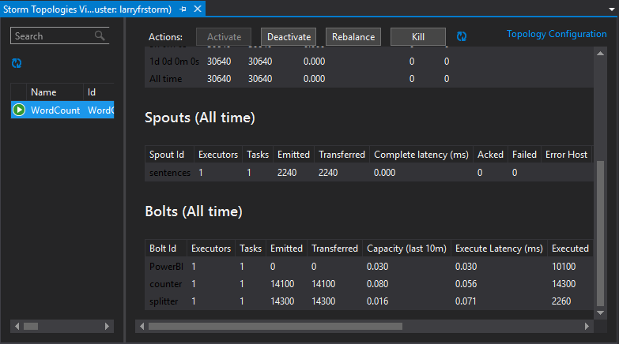
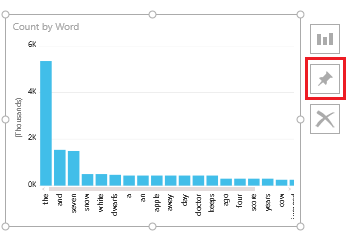

<properties
 pageTitle="從 Apache Storm 將資料寫入至 Power BI |Microsoft Azure"
 description="將資料從在 HDInsight 中的 Apache Storm 叢集上執行的 C# 拓撲寫入至 Power BI。此外，使用 Power BI 建立報表和即時儀表板。"
 services="hdinsight"
 documentationCenter=""
 authors="Blackmist"
 manager="paulettm"
 editor="cgronlun"/>

<tags
 ms.service="hdinsight"
 ms.devlang="dotnet"
 ms.topic="article"
 ms.tgt_pltfrm="na"
 ms.workload="big-data"
 ms.date="04/28/2015"
 ms.author="larryfr"/>

# 使用 Power BI (預覽) 視覺化 Apache Storm 拓撲的資料

Power BI 預覽可讓您以視覺化的方式將資料顯示為報表或儀表板。藉由使用 Power BI REST API，您可以輕鬆地使用資料，從在 Apache Storm on HDInsight 叢集上執行的拓撲到 Power BI。

在本文件中，您將學習如何使用 Power BI 從 Storm 拓撲所建立的資料建立報表和儀表板。

## 必要條件

- Azure 訂閱。請參閱[取得 Azure 免費試用](http://azure.microsoft.com/documentation/videos/get-azure-free-trial-for-testing-hadoop-in-hdinsight/)。

* 具備 [Power BI](https://powerbi.com) 存取權的 Azure Active Directory 使用者

* Visual Studio (下列其中一個版本)

    * [Visual Studio 2012](http://www.microsoft.com/download/details.aspx?id=39305) (含 Update 4)

    * Visual Studio 2013 [(含 Update 4)](http://www.microsoft.com/download/details.aspx?id=44921) 或 [Visual Studio 2013 Community](http://go.microsoft.com/fwlink/?linkid=517284&clcid=0x409)

    * Visual Studio 2015 [CTP6](http://visualstudio.com/downloads/visual-studio-2015-ctp-vs)

* HDInsight Tools for Visual Studio：如需安裝的相關資訊，請參閱[開始使用 HDInsight Tools for Visual Studio](../HDInsight/hdinsight-hadoop-visual-studio-tools-get-started.md)。

## 運作方式

這個範例包含隨機產生一個句子、將句子分成單字、計算字數，並將單字和計數傳送至 Power BI REST API 的 C# Storm 拓撲。[PowerBi.Api.Client](https://github.com/Vtek/PowerBI.Api.Client) Nuget 封裝可用來與 Power BI 通訊。

此專案中的下列檔案會實作 Power BI 特定功能：

* **PowerBiBolt.cs**：實作 Storm bolt，可將資料傳送給 Power BI

* **Data.cs**：描述會傳送給 Power BI 的資料物件/列

> [AZURE.WARNING]Power BI 似乎允許建立具有相同名稱的多個資料集。如果資料集不存在，而且您的拓撲建立了 Power BI Bolt 的多個執行個體，就可能會發生。若要避免這個問題，請將 bolt 的平行處理原則提示設為 1 (如同此範例)，或在部署拓撲之前建立資料集。
>
> 提供包含在此方案中的 **CreateDataset** 主控台應用程式做為如何建立拓撲外部資料集的範例。

## 註冊 Power BI 應用程式

1. 請遵循 [Power BI 快速入門](https://msdn.microsoft.com/en-US/library/dn931989.aspx)中的步驟註冊 Power BI。

2. 請遵循[註冊應用程式](https://msdn.microsoft.com/en-US/library/dn877542.aspx)中的步驟來建立應用程式註冊。這會在存取 Power BI REST API 時使用。

    > [AZURE.IMPORTANT]儲存 **用戶端識別碼** 以進行應用程式註冊。

## 下載範例

下載 [HDInsight C# Storm Power BI 範例](https://github.com/Blackmist/hdinsight-csharp-storm-powerbi)。若要下載它，請使用 [git](http://git-scm.com/) 分岔/複製它，或使用**下載**連結下載封存的 .zip。

## 設定範例

1. 在 Visual Studio 中開啟範例。從 [**方案總管**]，開啟 **SCPHost.exe.config** 檔案，並尋找 **<OAuth .../>** 項目。輸入這個項目下列屬性的值。

    * **用戶端**：您稍早建立的應用程式註冊之用戶端識別碼。

    * **使用者**：可存取 Power BI 的 Azure Active Directory 帳戶。

    * **密碼**：Azure Active Directory 帳戶的密碼。

2. (選擇性)。此專案所使用的預設資料集名稱是 **Words**。若要變更這種情況，請以滑鼠右鍵按一下 [**方案總管**] 中的 **WordCount** 專案，選取 [**屬性**]，然後選取 [**設定**]。將 **DatasetName** 項目變更為所要的值。

2. 儲存並關閉檔案。

## 部署範例

1. 從 [**方案總管**]，以滑鼠右鍵按一下 **WordCount** 專案，然後選取 [**提交至 Storm on HDInsight**]。從 [**Storm 叢集**] 下拉式清單對話方塊選取 HDInsight 叢集。

    > [AZURE.NOTE][**Storm 叢集**] 下拉式清單可能需要幾秒鐘的時間來填入伺服器名稱。
    >
    > 如果出現提示，請輸入您 Azure 訂閱的登入認證。如果您有多個訂用帳戶，請登入包含 Storm on HDInsight 叢集的訂用帳戶。

2. 順利提交拓撲時，應該會出現叢集的 Storm 拓撲。從清單中選取 [WordCount] 拓撲，以檢視執行中拓撲的詳細資訊。

    

    > [AZURE.NOTE]您也可以從伺服器總管檢視 Storm 拓撲：依序展開 Azure 和 HDInsight，並以滑鼠右鍵按一下 Storm on HDInsight 叢集，然後選取 [檢視 Storm 拓撲]。

3. 檢視**拓樸摘要**時，捲動直到您看到 **Bolt** 一節。在本節中，記下 **PowerBI** bolt 的 **Executed** 資料行。使用頁面頂端的 [重新整理] 按鈕，重新整理直到值變更為零以外的數目。當這個數字開始增加時，表示項目正在寫入至 Power BI。

## 建立報表

1. 在瀏覽器中，請瀏覽 [https://PowerBI.com](https://powerbi.com)。使用您的帳戶登入。

2. 在頁面的左邊，展開**資料集**。選取 **Words** 項目。這是範例拓撲所建立的資料集。

    

3. 從**欄位**區域，展開 **WordCount**。將**計數**和**單字**項目拖曳至頁面的中間部分。這會建立新的圖表，為每個字顯示一個列，指出這個字出現的次數。

    

4. 從頁面的左上方，選取 [**儲存**] 來建立新的報表。輸入 **Word Count** 做為報表的名稱。

5. 選取 Power BI 標誌以返回儀表板。**Word Count** 報表現在會出現在 [**報表**] 之下。

## 建立即時儀表板

1. 在**儀表板**旁邊，選取 **+** 圖示以建立新的儀表板。將新的儀表板命名為 **Live Word Count**。

2. 選取您稍早建立的 **Word Count** 報表。顯示時，選取圖表，然後選取圖表右上方的圖釘圖示。您應該會收到通知，表示它已釘選到儀表板。

    

2. 選取 Power BI 標誌以返回儀表板。選取 **Live Word Count** 儀表板。現在它包含 Word Count 圖表，且做為新項目的圖表更新會從在 HDInsight 上執行的 WordCount 拓撲傳送至 Power BI。

    

## 停止 WordCount 拓樸

拓撲會繼續執行，直到您將它停止，或刪除 Storm on HDInsight 叢集為止。請執行下列步驟來停止拓撲。

1. 在 Visual Studio 中，開啟 WordCount 拓樸的 [**拓樸摘要**] 視窗。如果拓撲摘要尚未開啟，請移至 [**伺服器總管**]，展開 **Azure** 和 **HDInsight** 項目，以滑鼠右鍵按一下 Storm on HDInsight 叢集，然後選取 [**檢視 Storm 拓撲**]。最後，選取 **WordCount** 拓樸。

2. 選取 [**刪除**] 按鈕以停止 **WordCount** 拓樸。

    ![拓撲摘要上的 [刪除] 按鈕](./media/hdinsight-storm-power-bi-topology/killtopology.png)

## 後續步驟

在本文件中，您已學會如何使用 REST 將資料從 Storm 拓撲傳送到 Power BI。如需如何使用其他 Azure 技術的資訊，請參閱下列項目：

* [Storm on HDInsight 的範例拓撲](hdinsight-storm-example-topology.md)
 

<!---HONumber=July15_HO2-->