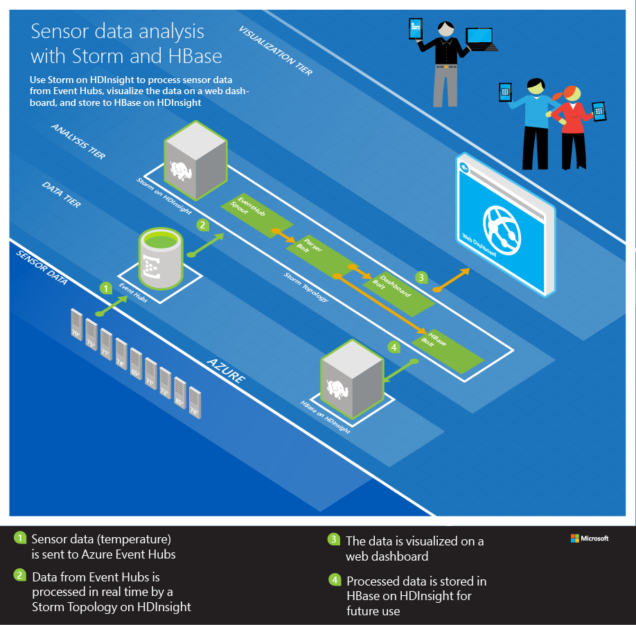
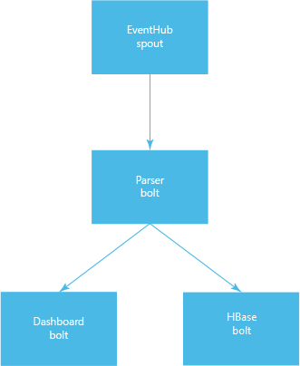

<properties
   pageTitle="使用 Apache Storm 和 HBase 分析感應器資料 | Microsoft Azure"
   description="了解如何透過虛擬網路連線至 Apache Storm。搭配使用 Storm 和 HBase 來處理事件中樞的感應器資料，並使用 D3.js 將其視覺化呈現。"
   services="hdinsight"
   documentationCenter=""
   authors="Blackmist"
   manager="paulettm"
   editor="cgronlun"/>

<tags
   ms.service="hdinsight"
   ms.devlang="java"
   ms.topic="article"
   ms.tgt_pltfrm="na"
   ms.workload="big-data"
   ms.date="07/06/2015"
   ms.author="larryfr"/>

# 在 HDInsight (Hadoop) 中使用 Apache Storm、事件中樞和 HBase 分析感應器資料

了解如何使用 Apache Storm on HDInsight 處理 Azure 事件中樞的感應器資料，並使用 D3.js 將其視覺化呈現。本文件也將說明如何透過 Azure 虛擬網路，將 Storm on HDInsight 與 HBase on HDInsight 連線，並將拓撲的資料儲存至 HBase。

## 必要條件

* Azure 訂閱。請參閱[取得 Azure 免費試用](http://azure.microsoft.com/documentation/videos/get-azure-free-trial-for-testing-hadoop-in-hdinsight/)。

* [Apache Storm on HDInsight 叢集](../hdinsight-storm-getting-started.md)

* [Node.js](http://nodejs.org/)：用於 Web 儀表板，並可將感應器資料傳送至事件中樞。

* [Java 和 JDK 1.7](http://www.oracle.com/technetwork/java/javase/downloads/index.html)

* [Maven](http://maven.apache.org/what-is-maven.html)

* [Git](http://git-scm.com/)

> [AZURE.NOTE]您也可以透過 [Chocolatey NuGet](http://chocolatey.org/) 封裝管理員取得 Java、JDK、Maven 和 Git。

## 架構

此範例由下列元件組成：

* **Azure 事件中樞**：提供收集自感應器的資料。在此範例中，我們提供的是應用程式產生的假資料。

* **Storm on HDInsight**：即時處理事件中樞的資料。

* **HBase on HDInsight** (選擇性)：提供持續的 NoSQL 資料存放區。

* **Azure 虛擬網路服務** (選擇性，使用 Base 者則務必使用)：確保 Storm on HDInsight 及 HBase on HDInsight 叢集之間能夠安全通訊。

* **儀表板網站**：即時建立資料圖表的範例儀表板。

	* 此網站採用 Node.js，因此可在任何用戶端作業系統上測試，或者也能部署至 Azure 網站。

	* [Socket.io](http://socket.io/) 用於 Storm 拓撲及網站間的即時通訊。

		> [AZURE.NOTE]這是實作的詳細資料。您可以使用任何通訊架構，例如原始 WebSockets 或 SignalR。

	* [D3.js](http://d3js.org/) 用於為傳送至網站的資料繪圖。

拓撲可透過 Storm on HDInsight 叢集所提供的 **com.microsoft.eventhubs.spout.EventHubSpout** 類別讀取事件中樞的資料。與網站之間的通訊必須透過 [socket.io-client.java](https://github.com/nkzawa/socket.io-client.java) 來達成。

或者，與 HBase 之間的通訊也能透過 Storm 中的 [org.apache.storm.hbase.bolt.HBaseBolt](https://storm.apache.org/javadoc/apidocs/org/apache/storm/hbase/bolt/class-use/HBaseBolt.html) 類別來達成。

此拓撲的圖表如下。

> [AZURE.NOTE]這是相當簡化的拓撲樣貌。執行過程中，系統會針對正在讀取之事件中樞的每個分割區，為各個元件建立執行個體。這些執行個體會分散至叢集的節點上，而資料在節點間路由傳送的情形如下：
>
> * 從 Spout 傳送至剖析器的資料會經過負載平衡。
> * 從剖析器傳送至儀表板及 HBase (若有使用) 的資料會依照裝置識別碼分組，讓相同裝置的訊息一律傳送至相同元件。

### 元件

* **事件中樞 Spout**：提供的 Spout 屬於 GitHub 上 [HDInsight Storm 範例](https://github.com/hdinsight/hdinsight-storm-examples)的一部分。

* **ParserBolt.java**：Spout 發出的資料為原始 JSON，有時會一次發出多個事件。此 Bolt 示範如何讀取 Spout 發出的資料，並將其以包含多個欄位之 Tuple 的形式發至新的串流。

* **DashboardBolt.java**：示範如何使用 Socket.io 用戶端程式庫，讓 Java 將資料即時傳送至 Web 儀表板。

## 準備您的環境

使用此範例之前，您必須建立 Azure 事件中樞供 Storm 拓撲讀取。由於用以讀取事件中樞資料的元件只能透過叢集取得，因此您也必須建立 Storm on HDInsight 拓撲。

> [AZURE.NOTE]最後將能透過 Maven 取得事件中樞 Spout。

### 設定事件中樞

事件中樞是此範例的資料來源。請使用下列步驟建立新的事件中樞。

1. 前往 [Azure 入口網站](https://manage.windowsazure.com)，依序選取 [新增 | 服務匯流排 | 事件中樞 | 自訂建立]。

2. 在 [新增事件中樞] 對話方塊中，輸入 [事件中樞名稱]，選取要建立中樞的 [區域]，然後建立新的命名空間或選取現有的命名空間。最後，按一下箭頭以繼續。

2. 在 [設定事件中樞] 對話方塊中，輸入 [資料分割計數] 和 [訊息保留] 值。在此範例中，資料分割計數使用 10，訊息保留使用 1。

3. 建立事件中樞後，選取命名空間，然後選取 [事件中樞]。最後，選取您稍早建立的事件中樞。

4. 選取 [設定]，然後使用下列資訊建立兩個新的存取原則。

	<table>
<tr><th>名稱</th><th>權限</th></tr>
<tr><td>裝置</td><td>傳送</td></tr>
<tr><td>Storm</td><td>接聽</td></tr>
</table>建立權限之後，在頁面底部選取 [儲存] 圖示。這會建立共用存取原則，用以傳送訊息至此中樞，以及讀取此中樞的訊息。

5. 儲存原則之後，使用頁面底部的 [共用存取金鑰產生器]，擷取「裝置」和「Storm」原則的金鑰。妥善儲存這些金鑰，以便稍後使用。

### 建立 Storm on HDInsight 叢集

1. 登入 [Azure 入口網站](https://manage.windowsazure.com/)。

2. 按一下左窗格的 [HDInsight]，然後按一下頁面左下角的 [+新增]。

3. 按一下第二欄的 HDInsight 圖示，然後選取 [自訂]。

4. 在 [叢集詳細資料] 頁面上，輸入新叢集的名稱，然後在 [叢集類型] 中選取 [Storm]。按一下箭頭以繼續。

5. 輸入 1 做為要用於此叢集的 [資料節點] 數目。

	> [AZURE.NOTE]為了將本文使用的叢集成本降到最低，請將 [叢集大小] 降到 1，並於使用完畢之後刪除叢集。

6. 輸入系統管理員的 [使用者名稱] 和 [密碼]，然後按一下箭頭以繼續。

4. 在 [儲存體帳戶] 中，選取 [建立新的儲存體] 或選取現有的儲存體帳戶。選取或輸入 [帳戶名稱] 和要使用的 [預設容器]。選取左下角的勾號圖示以建立 Storm 叢集。

## 下載並安裝 EventHubSpout

1. 下載 [HDInsight Storm 範例專案](https://github.com/hdinsight/hdinsight-storm-examples/)。下載後，找到 **lib/eventhubs/eventhubs-storm-spout-0.9-jar-with-dependencies.jar** 檔案。

2. 從命令提示字元中，使用下列命令將 **eventhubs-storm-spout-0.9-jar-with-dependencies.jar** 檔案安裝至本機 Maven 存放區。這可讓您在稍後的步驟中，輕鬆將檔案加入 Storm 專案中做為參考。

		mvn install:install-file -Dfile=target/eventhubs-storm-spout-0.9-jar-with-dependencies.jar -DgroupId=com.microsoft.eventhubs -DartifactId=eventhubs-storm-spout -Dversion=0.9 -Dpackaging=jar

## 下載並設定專案。

使用下列項目從 GitHub 下載專案。

	git clone https://github.com/Blackmist/hdinsight-eventhub-example

命令執行完畢後，您會擁有以下目錄架構：

	hdinsight-eventhub-example/
		TemperatureMonitor/ - this is the Java topology
			conf/
				Config.properties
				hbase-site.xml
			src/
			test/
			dashboard/ - this is the node.js web dashboard
			SendEvents/ - utilities to send fake sensor data

> [AZURE.NOTE]本文件不會深入探究此範例包含的程式碼，不過會附上程式碼的完整註解。

開啟 **Config.properties** 檔案，並新增您先前建立事件中樞時使用的資訊。資訊新增完畢後，請儲存檔案。

	eventhubspout.username = storm

	eventhubspout.password = <the key of the 'storm' policy>

	eventhubspout.namespace = <the event hub namespace>

	eventhubspout.entitypath = <the event hub name>

	eventhubspout.partitions.count = <the number of partitions for the event hub>

	## if not provided, will use storm's zookeeper settings
	## zookeeper.connectionstring=localhost:2181

	eventhubspout.checkpoint.interval = 10

	eventhub.receiver.credits = 1024

## 編譯並在本機測試

測試前，您必須先開啟儀表板，檢視拓撲輸出的資料並產生要存放在事件中樞的資料。

### 啟動 Web 應用程式

1. 開啟新的命令提示字元或終端機，將目錄變更至 **hdinsight-eventhub-example/dashboard**，然後使用以下命令安裝 Web 應用程式需要的相依項目：

		npm install

2. 使用下列命令啟動 Web 應用程式：

		node server.js

	您應該會看見類似下方的訊息：

		Server listening at port 3000

2. 開啟 Web 瀏覽器，在網址列輸入 **http://localhost:3000/**。您應該會看見以下的類似頁面：

	

	保持開啟此命令提示字元或終端機。測試完成後，使用 Ctrl-C 鍵中斷 Web 伺服器。

### 開始產生資料

> [AZURE.NOTE]本節所示步驟採用 Node.js，因此可在任何平台上執行。如需其他語言的範例，請查看 [SendEvents] 目錄。

1. 開啟新的命令提示字元或終端機，將目錄變更至 **hdinsight-eventhub-example/SendEvents/nodejs**，然後使用以下命令安裝應用程式需要的相依項目：

		npm install

2. 以文字編輯器開啟 **app.js** 檔案，並新增您稍早取得的事件中樞資訊：

		// ServiceBus Namespace
		var namespace = 'servicebusnamespace';
		// Event Hub Name
		var hubname ='eventhubname';
		// Shared access Policy name and key (from Event Hub configuration)
		var my_key_name = 'devices';
		var my_key = 'key';

2. 使用以下命令在事件中樞插入新項目：

		node app.js

	您應該會看見好幾行輸出資料，傳送至事件中樞的資料也會包含在內。此資訊類似以下內容：

		{"TimeStamp":"2015-02-10T14:43.05.00320Z","DeviceId":0,"Temperature":7}
		{"TimeStamp":"2015-02-10T14:43.05.00320Z","DeviceId":1,"Temperature":39}
		{"TimeStamp":"2015-02-10T14:43.05.00320Z","DeviceId":2,"Temperature":86}
		{"TimeStamp":"2015-02-10T14:43.05.00320Z","DeviceId":3,"Temperature":29}
		{"TimeStamp":"2015-02-10T14:43.05.00320Z","DeviceId":4,"Temperature":30}
		{"TimeStamp":"2015-02-10T14:43.05.00320Z","DeviceId":5,"Temperature":5}
		{"TimeStamp":"2015-02-10T14:43.05.00320Z","DeviceId":6,"Temperature":24}
		{"TimeStamp":"2015-02-10T14:43.05.00320Z","DeviceId":7,"Temperature":40}
		{"TimeStamp":"2015-02-10T14:43.05.00320Z","DeviceId":8,"Temperature":43}
		{"TimeStamp":"2015-02-10T14:43.05.00320Z","DeviceId":9,"Temperature":84}

### 啟動拓撲

2. 使用下列命令在本機上啟動拓撲：

	mvn compile exec:java -Dstorm.topology=com.microsoft.examples.Temperature

	這樣會啟動拓撲，從事件中樞讀取檔案，然後將檔案傳送至 Azure 網站中執行的儀表板。您應該會看見 Web 儀表板中出現資料行，如下所示：

	

3. 儀表板執行時，請使用前幾個步驟的 `node app.js` 命令，將新的資料傳送至儀表板。由於溫度值是隨機產生，因此圖形必須更新才能顯示新值。

3. 確定更新成功後，請按下 Ctrl+C 鍵停止拓撲。若要停止 SendEvent 應用程式，請選取視窗並按任意鍵。您也可以使用 Ctrl-C 鍵中斷 Web 伺服器。

## 封裝拓撲並部署到 HDInsight

在開發環境中，使用下列步驟在 HDInsight Storm 叢集上執行 Temperature 拓撲。

### 發佈網站儀表板。

1. 若要將儀表板部署至 Azure 網站，請依照[建置並部署 Node.js 網站至 Azure](../web-sites-nodejs-develop-deploy-mac.md) 所述的步驟操作。記下網站的 URL，其樣式大致如下：**mywebsite.azurewebsites.net**。

2. 網站建立後，前往 Azure 入口網站找到該網站，然後選取 [設定] 索引標籤。啟用 [Web 通訊端]，然後按一下頁面底部的 [儲存]。

2. 開啟 **hdinsight-eventhub-example\\TemperatureMonitor\\src\\main\\java\\com\\microsoft\\examples\\bolts\\DashboardBolt.java**，然後變更下行內容，使其指向所發佈儀表板的 URL：

		socket = IO.socket("http://mywebsite.azurewebsites.net");

3. 儲存 **DashboardBolt.java** 檔案。

### 封裝並部署拓撲

1. 使用下列命令從專案建立 JAR 封裝：

		mvn package

	這樣會在專案的 **target** 目錄中建立名為 **TemperatureMonitor-1.0-SNAPSHOT.jar** 的檔案。

2. 依照[部署及管理 Storm 拓撲](hdinsight-storm-deploy-monitor-topology.md)一文所述步驟，使用「Storm 儀表板」上傳 Storm on HDInsight 叢集的拓撲並加以啟動。

3. 拓撲啟動後，以瀏覽器開啟您發佈至 Azure 的網站，然後使用 `node app.js` 命令將資料傳送至事件中樞。您應該會看見顯示資訊的 Web 儀表板更新。

	

## 選擇性：使用 HBase

若要搭配使用 Storm 和 HBase，您必須先建立 Azure 虛擬網路，然後在網路中建立 Storm 及 HBase 叢集。

### 建立 Azure 虛擬網路 (選擇性)

如果您打算透過此範例使用 HBase，您必須建立內含 Storm on HDInsight 叢集和 HBase on HDInsight 叢集的 Azure 虛擬網路。

1. 登入 [Azure 入口網站](https://manage.windowsazure.com)。

2. 依序按一下頁面底部的 [+新增]、[網路服務]、[虛擬網路] 及 [快速建立]。

3. 輸入或選取下列值：

	- **名稱**：虛擬網路的名稱。

	- **位址空間**：為虛擬網路選擇夠大的位址空間，如此才能為叢集中的所有節點提供位址。否則，佈建作業將會失敗。

	- **最大 VM 計數**：選擇其中一個最大的虛擬機器計數。

	- **位置**：此位置必須與您即將建立的 HBase 叢集相同。

	- **DNS 伺服器**：本文使用的是 Azure 提供的內部 DNS 伺服器，因此您可以選擇 [無]。同時也支援更多自訂 DNS 伺服器的進階網路設定。如需詳細指引，請參閱[名稱解析 (DNS)](http://msdn.microsoft.com/library/azure/jj156088.aspx)。

4. 按一下 [建立虛擬網路]。新的虛擬網路名稱隨即會出現在清單中。稍待片刻，直到 [狀態] 欄顯示 [已建立]。

5. 在主要窗格上，按一下您剛建立的虛擬網路。

6. 按一下頁面頂端的 [儀表板]。

7. 將 [quick glance] 下方的 [VIRTUAL NETWORK ID] 記起來。佈建 Storm 和 HBase 叢集時需要用到它。

8. 按一下頁面頂端的 [設定]。

9. 在頁面底部，可看到預設的子網路名稱為 Subnet-1。使用 [加入子網路] 按鈕來加入 **Subnet-2**。這些子網路中將存放 Storm 和 HBase 叢集。

	> [AZURE.NOTE]在本文中，我們使用只有一個節點的叢集。如果您建立多節點的叢集，則必須驗證叢集使用之子網路的 [CIDR (位址計數)]。位址計數必須大於背景工作節點數量加上 7 的數目 (閘道器：2、前端節點：2、Zookeeper：3)。例如，如果您需要 10 個節點的 HBase 叢集，那麼子網路的位址計數必須大於 17 (10 + 7)。否則，部署作業將會失敗。
	>
	> 強烈建議您一個叢集只指定一個子網路。

11. 按一下頁面底部的 [儲存]。

### 在虛擬網路上建立 Storm 及 HBase 叢集

1. 登入 [Azure 入口網站](https://manage.windowsazure.com/)。

2. 按一下左窗格的 [HDInsight]，然後按一下頁面左下角的 [+新增]。

3. 按一下第二欄的 HDInsight 圖示，然後選取 [自訂]。

4. 在 [叢集詳細資料] 頁面上，輸入新叢集的名稱，然後在 [叢集類型] 中選取 [Storm]。按一下箭頭以繼續。

5. 輸入 1 做為要用於此叢集的 [資料節點] 數目。在 [區域/虛擬網路] 中，選取稍早建立的 Azure 虛擬網路。在 [虛擬網路子網路] 中，選取 [Subnet-1]。

	> [AZURE.NOTE]為了將本文使用的叢集成本降到最低，請將 [叢集大小] 降到 1，並於使用完畢之後刪除叢集。

6. 輸入系統管理員的 [使用者名稱] 和 [密碼]，然後按一下箭頭以繼續。

4. 在 [儲存體帳戶] 中，選取 [建立新的儲存體] 或選取現有的儲存體帳戶。選取或輸入 [帳戶名稱] 和要使用的 [預設容器]。選取左下角的勾號圖示以建立 Storm 叢集。

5. 重複上述步驟，以建立新的 HBase 叢集。主要差異如下：

	* **叢集類型**：選取 [HBase]

	* **虛擬網路子網路**：選取 [Subnet-2]

	* **儲存體帳戶**：您使用的容器應該與 Storm 叢集使用的容器不同。

### 探索 HBase DNS 尾碼

若要從 Storm 叢集寫入 HBase，該 HBase 叢集必須使用完整網域名稱 (FQDN)。請使用以下命令來探索此資訊：

	curl -u <username>:<password> -k https://<clustername>.azurehdinsight.net/ambari/api/v1/clusters/<clustername>.azurehdinsight.net/services/hbase/components/hbrest

在傳回的 JSON 資料中，找到 "host_name" 項目。這會包含叢集中節點的 FQDN，例如：

	...
	"host_name": "wordkernode0.<clustername>.b1.cloudapp.net
	...

以叢集名稱開頭的網域名稱部分即為 DNS 尾碼，例如：**mycluster.b1.cloudapp.net**。

### 啟用 HBase Bolt

1. 開啟 **hdinsight-eventhub-example\\TemperatureMonitor\\conf\\hbase-site.xml**，然後使用先前取得的 HBase 叢集 DNS 尾碼取代下行中的 `suffix` 項目。完成變更後，請儲存檔案。

		<value>zookeeper0.suffix,zookeeper1.suffix,zookeeper2.suffix</value>

	HBase Bolt 將藉此與 HBase 叢集通訊。

1. 以文字編輯器開啟 **hdinsight-eventhub-example\\TemperatureMonitor\\src\\main\\java\\com\\microsoft\\examples\\bolts**，並將開頭的 `//` 移除以取消以下行的註解。完成此項變更後，請儲存檔案。

		topologyBuilder.setBolt("HBase", new HBaseBolt("SensorData", mapper).withConfigKey("hbase.conf"), spoutConfig.getPartitionCount())
    	  .fieldsGrouping("Parser", "hbasestream", new Fields("deviceid")).setNumTasks(spoutConfig.getPartitionCount());

	這樣會啟用 HBase bolt。

	> [AZURE.NOTE]只有在部署至 Storm 叢集時，才應啟用 HBase Bolt，在本機上測試時則不應啟用。

### HBase 與 Storm 資料

執行拓撲前，您必須備妥 HBase 以接受資料。

1. 使用遠端桌面連線至 HBase 叢集。

2. 從桌面上啟動 HDInsight 命令列，並輸入下列命令：

    cd %HBASE_HOME% bin\\hbase shell

3. 在 HBase Shell 中輸入下列命令，以建立將儲存感應器資料的資料表：

    create 'SensorData', 'cf'

4. 輸入下列命令，以確認資料表不含任何資料：

    scan 'SensorData'

啟動 Storm 叢集上的拓撲並處理資料後，您可以再次利用 `scan 'SensorData'` 命令，確認該資料已經插入 HBase。

## 後續步驟

您現在已了解如何使用 Storm 來讀取事件中樞的資料，以及在外部儀表板上使用 SignalR 和 D3.js 顯示 Storm 的資訊。若您採用選擇性步驟，也會了解如何在虛擬網路中設定 HDInsight，以及如何使用 HBase Bolt 在 Storm 拓撲和 HBase 之間通訊。

* 如需 Storm 拓撲搭配使用 HDinsight 的更多範例，請參閱：

    * [Storm on HDInsight 的範例拓撲](hdinsight-storm-example-topology.md)

* 如需關於 Apache Storm 的詳細資訊，請參閱 [Apache Storm](https://storm.incubator.apache.org/) 網站 (英文)。

* 如需關於 HBase on HDInsight 的詳細資訊，請參閱 [HBase 與 HDInsight 概觀](hdinsight-hbase-overview.md)。

* 如需關於 Socket.io 的詳細資訊，請參閱 [socket.io](http://socket.io/) 網站 (英文)。

* 如需關於 D3.js 的詳細資訊，請參閱 [D3.js：資料驅動型文件](http://d3js.org/) (英文)。

* 如需關於以 Java 建立拓撲的詳細資訊，請參閱[為 Apache Storm on HDInsight 開發 Java 拓撲](hdinsight-storm-develop-java-topology.md)。

* 如需關於以 .NET 建立拓撲的詳細資訊，請參閱[使用 Visual Studio 為 Apache Storm on HDInsight 開發 C# 拓撲](hdinsight-storm-develop-csharp-visual-studio-topology.md)。

[azure-portal]: https://manage.windowsazure.com/

<!---HONumber=July15_HO2-->