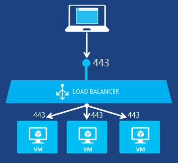

<properties 
   pageTitle="Internet facing load balancer overview | Microsoft Azure "
   description="Overview for Internet facing load balancer and its features. How a load balancer works for Azure using virtual machines and cloud services."
   services="load-balancer"
   documentationCenter="na"
   authors="joaoma"
   manager="adinah"
   editor="tysonn" />
<tags 
   ms.service="load-balancer"
   ms.devlang="na"
   ms.topic="article"
   ms.tgt_pltfrm="na"
   ms.workload="infrastructure-services"
   ms.date="10/16/2015"
   ms.author="joaoma" />

# Internet Facing load balancer between multiple Virtual Machines or services

One use for endpoints is the configuration of the Azure load balancer to distribute a specific type of traffic between multiple virtual machines or services. For example, you can spread the load of web request traffic across multiple web servers or web roles.

Azure load balancer maps the public IP address and port number of incoming traffic to the private IP address and port number of the virtual machine and vice versa for the response traffic from the virtual machine.

>[AZURE.NOTE] Azure load balancer will provide a hash distribution  network traffic among multiple virtual machine instances using the default settings (more info about hash distribution in [load balancer features](load-balancer-overview.md#load-balancer-features) . If you are looking for session affinity, check out [load balancer distribution mode](load-balancer-distribution-mode.md).

For a cloud service that contains instances of web roles or worker roles, you can define a public endpoint in the service definition (.csdef).
 
The servicedefinition.csdef file will contain the endpoint configuration and when you have multiple role instances for a web or worker role deployment, the load balancer will be setup for it. The way to add instances to your cloud deployement is changing the instance count on the service configuration file (.csfg).  

The following figure shows a load-balanced endpoint for encrypted web traffic that is shared among three virtual machines for the public and private TCP port of 443. These three virtual machines are in a load-balanced set.

)

When Internet clients send web page requests to the public IP address of the cloud service and TCP port 443, the Azure Load Balancer performs a hash based load balancing of those requests between the three virtual machines in the load-balanced set. You can get more information about load balancer algorithm at [load balancer overview page](load-balancer-overview.md#load-balancer-features).

## Next Steps

[Internal load balancer overview](load-balancer-internal-overview.md)

[Get started Configuring an Internet facing load balancer](load-balancer-internet-getstarted.md)

[Configure a Load balancer distribution mode](load-balancer-distribution-mode.md)

[Configure idle TCP timeout settings for your load balancer](load-balancer-tcp-idle-timeout.md)

 
