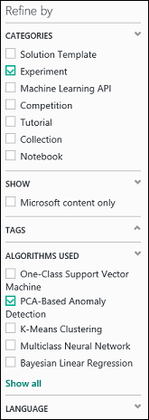

<properties
    pageTitle="Voorbeeldexperimenten voor uw eigen experimenten gebruiken | Microsoft Azure"
    description="U kunt nieuwe Azure Machine Learning-experimenten maken op basis van voorbeeldexperimenten en experimenten die zijn gedeeld door andere gebruikers."
    services="machine-learning"
    documentationCenter=""
    authors="cjgronlund"
    manager="paulettm"
    editor="cgronlun"/>

<tags
    ms.service="machine-learning"
    ms.workload="data-services"
    ms.tgt_pltfrm="na"
    ms.devlang="na"
    ms.topic="get-started-article"
    ms.date="04/28/2016"
    ms.author="chhavib;olgali"/>

# Voorbeeldexperimenten gebruiken om nieuwe experimenten te maken
Als u een experiment wilt maken, kunt u voorbeelden bekijken in de [Cortana Intelligence-galerie](http://gallery.cortanaintelligence.com/). Hier vindt u voorbeeldexperimenten die door het Machine Learning-team zijn geleverd, plus voorbeelden die zijn gedeeld door andere Machine Learning-gebruikers. Hier kunt u ook vragen stellen of opmerkingen plaatsen over experimenten.

[AZURE.INCLUDE [machine-learning-free-trial](../../includes/machine-learning-free-trial.md)]

## Bladeren door de Cortana Intelligence-galerie
Als u wilt zien welke experimenten beschikbaar zijn in de galerie, gaat u naar de [Galerie](http://gallery.cortanaintelligence.com/) en klikt u op **Experimenten** boven aan de pagina.
Op deze pagina kunt u **onlangs toegevoegde** experimenten bekijken, zien **wat populair is** of de meest recente **populaire Microsoft-experimenten** bekijken.

Door alle experimenten bladeren:

1. Klik op **Alles bekijken** boven aan de pagina.
2. Selecteer onder **Verfijnen op** **Experiment** om alle experimenten in de Galerie weer te geven.
3. U kunt de lijst verfijnen door filters aan de linkerkant te selecteren. Als u bijvoorbeeld wilt bladeren door experimenten die gebruikmaken van een op PCA-gebaseerd anomaliedetectie-algoritme, selecteert u **Experiment** onder **Categorieën** en selecteert u vervolgens **Op PCA-gebaseerd anomaliedetectie** onder **Gebruikte algoritmen** (als u dit algoritme niet ziet, klikt u op **Alles weergeven** onder aan de lijst).  
 
4. Met het zoekvak kunt u uw keuze verfijnen. Als u bijvoorbeeld wilt zoeken naar experimenten van Microsoft met betrekking tot cijferherkenning die gebruikmaken van een tweeklasse vectormachine-algoritme, voert u 'cijferherkenning' in het zoekvak in en selecteert u **Experiment**, **Alleen inhoud van Microsoft**, en **Tweeklasse ondersteunende vectormachine**:
 
5. Klik op een experiment voor meer informatie. Als u het experiment wilt uitvoeren of wijzigen, klikt u op **Openen in Studio** op de pagina van het experiment.

> [AZURE.NOTE] Als u een experiment in Machine Learning Studio wilt openen, moet u zich aanmelden met uw Microsoft-accountreferenties. Als u nog niet over een Machine Learning-werkruimte beschikt, wordt een gratis werkruimte gemaakt die u als proefversie kunt gebruiken. [Meer informatie over de gratis proefversie van Machine Learning](https://azure.microsoft.com/pricing/details/machine-learning/)

 

## Een sjabloon gebruiken in Machine Learning Studio

U kunt ook een nieuw experiment in Machine Learning Studio maken op basis van een sjabloon uit de Galerie.

1. Meld u aan met uw Microsoft-accountreferenties voor [Studio](https://studio.azureml.net) en klik vervolgens op **Nieuw*** om een nieuw experiment te maken.
2. Blader door de voorbeelden en klik op een van de voorbeelden.

Er wordt een nieuw experiment gemaakt in de werkruimte op basis van het voorbeeldexperiment als sjabloon. 

## Volgende stappen
- [Uw gegevens voorbereiden](machine-learning-data-science-import-data.md)
- [R gebruiken in uw experiment](machine-learning-r-quickstart.md)
- [Voorbeeld R-experimenten bekijken](machine-learning-r-csharp-web-service-examples.md)
- [Een API-webservice maken](machine-learning-publish-a-machine-learning-web-service.md)
- [Bladeren door kant-en-klare toepassingen](https://datamarket.azure.com/browse?query=machine+learning)

<!--HONumber=Jun16_HO2-->

