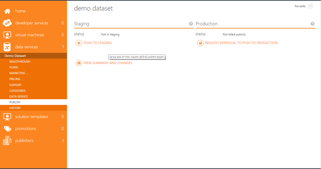
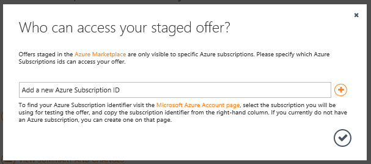
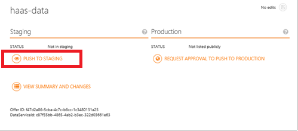
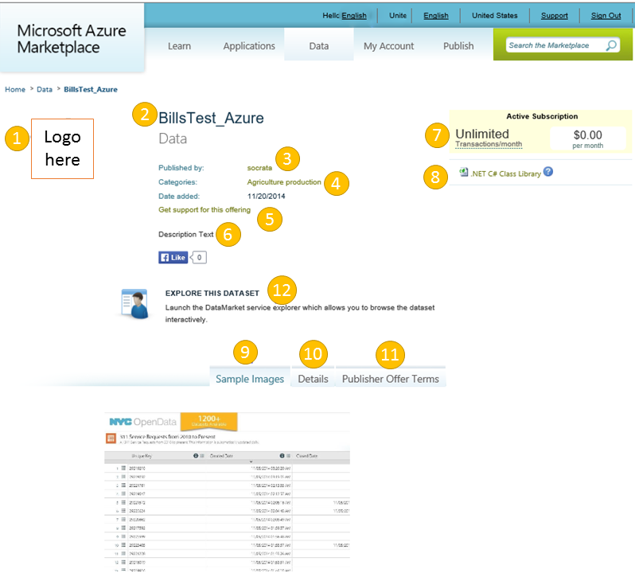

<properties
   pageTitle="Testing your Data Service offer for the Marketplace | Microsoft Azure"
   description="Understand how to test your Data Service offer for the Azure Marketplace."
   services="marketplace-publishing"
   documentationCenter=""
   authors="HannibalSII"
   manager=""
   editor=""/>

<tags
   ms.service="marketplace-publishing"
   ms.devlang="na"
   ms.topic="article"
   ms.tgt_pltfrm="na"
   ms.workload="na"
   ms.date="12/03/2015"
   ms.author="hascipio; avikova" />

# Testing your Data Service offer in Staging
After completing the first two steps of [Creating your Microsoft Developer account](marketplace-publishing-accounts-creation-registration.md) and [Creating your Data Service Offer in Publishing Portal](marketplace-publishing-data-service-creation.md) you’re ready for making your offer available in the Azure Marketplace. This topic will walk you through the first, intermediate, step called “Staging”

Staging means deploying your offer in a private "sandbox" where you can test and verify its functionality before pushing it to production. The offer will appear in staging just as it would to a customer who has deployed it.

## Step 1. Pushing your offer to staging
Pushing your offer to staging allows you to test the offer before it becomes available to future subscribers.  You can see how your offer will appear and function for those subscribing to your data.  

  

1.  Login into the [Publishing Portal](https://publish.windowsazure.com)
2.  Select **Data Services** in the left navigation window
3.  Select your offer you want to push to staging. You will see the above screen.
4.  Click **Push To Staging** button.  
5.  If there are issues with the offer that needed to be completed prior to pushing to staging, you will see a list displayed.  Correct these items by clicking on each item in the list. When all corrections made, click **Push to Staging** button again.

If there are no issues with your offer you will see the popup window below.  

If you’re not planning/not approved to surface your offer in Azure Portal (currently has limited capacity), then just close the pop-up window.

To test your Data Service in Azure Portal (in addition to the DataMarket portal), you will need an Azure Subscription ID to test with.  This Subscription ID will identify the account that will be allowed to test your offer.  

Cut and paste your Subscription ID and click the checkmark to continue.

  

> [AZURE.NOTE] These Azure subscriptions IDs are only required for testing and staging in the [Azure Management Portal](https://manage.windowsazure.com). They are not required to test in Azure Marketplace.

The next screen that appears shows that publishing is taking place by displaying the “In progress” icon highlighted yellow below. Pushing to staging takes between 10 to 15 minutes.  If it takes longer, first refresh your browser (press F5 in IE).  In the rare cases where your offer is still pushing to staging after an hour, click the contact us link to let us know that there is an issue.

  

When the Push to Staging completes the “In progress” icon will stop moving and the status will be updated to “Staged”.  You are now ready to test your offer.  

## Step 2. Test your staged offer in DataMarket

Click the link following the text **“See Your service offer at…”** to display the screen that the subscriber will see when your offer goes to production and will appear in DataMarket.

  

Test or verify each of the 12 items marked above to ensure all logos, prices/transactions, text, images, documentation, and links are correct and working properly.  This is a good time to ensure any test values you entered when creating your offer have been replaced with actual values.

1. Offer logo
2. Offer name
3. Publisher name/link to your company's website
4. Search categories for your offer
5. Your offer's support link to assist subscribers
6. Contextual description for your offer
7. Offer plan depicting billing details
8. Link to implementation code
9. Sample images that illustrate use of offer data
10. Input/Output metadata for each service within the offer
11. Offer's Terms of Use
12. Preview of the offer's data

Finally, check the service will work through the Datamarket by clicking the link “EXPLORE THIS DATASET”.  A new window will open in the tool we call “Service Explorer” so you can preview the results of a query against your service.  In this window, you can enter the parameters needed and see the results displayed from a query against your service.   Also, displayed is the URL for your Query.  

> [AZURE.NOTE] Be sure to review the textual description of the service displayed at the top.  And if your offer consists of more than one service call, click the tabs at the bottom to switch to the next service to review and test.

## Next step
If you are having issues and need help resolving them please contact [Azure Publisher Support]( http://go.microsoft.com/fwlink/?LinkId=272975).

If you are satisfied and ready to publish your offer please read the [Request Approval to Push To Production](marketplace-publishing-push-to-production.md) documentation.

## See Also
- [Getting Started: How to publish an offer to the Azure Marketplace](marketplace-publishing-getting-started.md)

