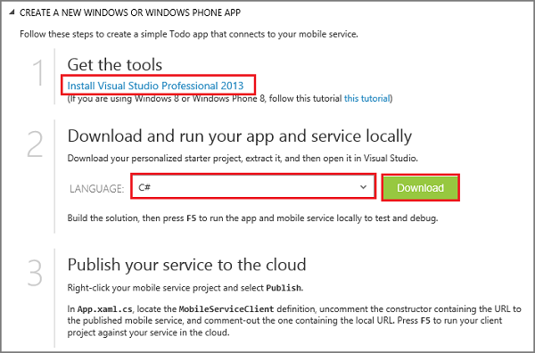

<properties
	pageTitle="Get Started with Mobile Services for Windows Universal apps | Microsoft Azure"
	description="Follow this tutorial to get started using Azure Mobile Services for universal Windows app development in C#."
	services="mobile-services"
	documentationCenter="windows"
	authors="ggailey777"
	manager="dwrede"
	editor=""/>

<tags
	ms.service="mobile-services"
	ms.workload="mobile"
	ms.tgt_pltfrm="mobile-windows"
	ms.devlang="dotnet"
	ms.topic="hero-article"
	ms.date="11/06/2015"
	ms.author="glenga"/>

# Get started with Mobile Services

[AZURE.INCLUDE [mobile-service-note-mobile-apps](../../includes/mobile-services-note-mobile-apps.md)]

&nbsp;

[AZURE.INCLUDE [mobile-services-selector-get-started](../../includes/mobile-services-selector-get-started.md)]
&nbsp;

>[AZURE.TIP] If you are new to mobile development using Microsoft Azure, [get started with Azure Mobile Apps](app-service-mobile-dotnet-backend-windows-store-dotnet-get-started-preview.md) instead of Azure Mobile Services; Mobile Apps gives you [additional advantages](app-service-mobile-value-prop-migration-from-mobile-services-preview.md).

This tutorial shows you how to add a cloud-based backend service to a universal Windows app using Azure Mobile Services. Universal Windows app solutions include projects for both Windows Store 8.1 and Windows Phone Store 8.1 apps and a common shared project. For more information, see [Build universal Windows apps that target Windows and Windows Phone](http://msdn.microsoft.com/library/windows/apps/xaml/dn609832.aspx).

In this tutorial, you will create both a new mobile service and a simple *To do list* app that stores app data in the new mobile service. The mobile service that you will create uses the supported .NET languages using Visual Studio for server-side business logic and to manage the mobile service. To create a mobile service that lets you write your server-side business logic in JavaScript, see the JavaScript backend version of this topic.

>[AZURE.NOTE]This topic shows you how to create a new mobile service project and universal Windows app by using the Azure classic portal. By using Visual Studio 2013 Update 3, you can also add a new mobile service project to an existing Visual Studio solution. For more information, see [Add Mobile Services to an existing app](mobile-services-dotnet-backend-windows-universal-dotnet-get-started-data.md).

>To add a mobile service to an Windows Phone 8.0 or Windows Phone Silverlight 8.1 app project, see [Add Mobile Services to an existing Windows Phone app](mobile-services-dotnet-backend-windows-phone-get-started-data.md).

[AZURE.INCLUDE [mobile-services-windows-universal-get-started](../../includes/mobile-services-windows-universal-get-started.md)]

To complete this tutorial, you need the following:

* An active Azure account. If you don't have an account, you can sign up for an Azure trial and get up to 10 free mobile services that you can keep using even after your trial ends. For details, see [Azure Free Trial](http://azure.microsoft.com/pricing/free-trial/?WT.mc_id=A0E0E5C02&amp;returnurl=http%3A%2F%2Fazure.microsoft.com%2Fen-us%2Fdocumentation%2Farticles%2Fmobile-services-dotnet-backend-windows-store-dotnet-get-started%2F).
* [Visual Studio 2013].

## Create a new mobile service

[AZURE.INCLUDE [mobile-services-dotnet-backend-create-new-service](../../includes/mobile-services-dotnet-backend-create-new-service.md)]

## Create a new universal Windows app

Once you have created your mobile service, you can follow an easy quickstart in the Azure classic portal to either create a new app or modify an existing app to connect to your mobile service.

In this section you will create a new universal Windows app that is connected to your mobile service.

1. In the [Azure classic portal], click **Mobile Services**, and then click the mobile service that you just created.

2. In the quickstart tab, click **Windows** under **Choose platform** and expand **Create a new Windows Store app**.

   	This displays the three easy steps to create a Windows Store app connected to your mobile service.

  	

3. If you haven't already done so, download and install [Visual Studio 2013] on your local computer or virtual machine.

4. Under **Download and run your app and service locally**, select a language for your Windows Store app, then click **Download**.

  	This downloads a solution contains projects for both the mobile service and for the sample _To do list_ application that is connected to your mobile service. Save the compressed project file to your local computer, and make a note of where you save it.

## Test the app against the local mobile service

[AZURE.INCLUDE [mobile-services-dotnet-backend-test-local-service-dotnet](../../includes/mobile-services-dotnet-backend-test-local-service-dotnet.md)]

>[AZURE.NOTE]You can review the code that accesses your mobile service to query and insert data, which is found in the MainPage.xaml.cs file.

## Publish your mobile service

[AZURE.INCLUDE [mobile-services-dotnet-backend-publish-service](../../includes/mobile-services-dotnet-backend-publish-service.md)]

<ol start="4">
<li>
In the Shared code project, open the App.xaml.cs file, locate the code that creates a <a href="http://msdn.microsoft.com/library/Windowsazure/microsoft.windowsazure.mobileservices.mobileserviceclient.aspx" target="_blank">MobileServiceClient</a> instance, comment-out the code that creates this client using <em>localhost</em> and uncomment the code that creates the client using the remote mobile service URL, which looks like the following:

        <pre><code>public static MobileServiceClient MobileService = new MobileServiceClient(
            "https://todolist.azure-mobile.net/",
            "XXXX-APPLICATION-KEY-XXXXX");</code></pre>

	
The client will now access the mobile service published to Azure.
</li>
</ol>

## Test the app against the mobile service hosted in Azure

Now that the mobile service is published and the client is connected to the remote mobile service hosted in Azure, we can run the app using Azure for item storage.

[AZURE.INCLUDE [mobile-services-windows-universal-test-app](../../includes/mobile-services-windows-universal-test-app.md)]

## Next Steps
Now that you have completed the quickstart, learn how to perform additional important tasks in Mobile Services:

* [Add Mobile Services to an existing app][Get started with data]
   Learn more about storing and querying data using Mobile Services.

* [Get started with offline data sync]
   Learn how to use offline data sync to make your app responsive and robust.

* [Add authentication to your Mobile Services app ][Get started with authentication]
   Learn how to authenticate users of your app with an identity provider.

* [Add push notifications to your app][Get started with push notifications]
   Learn how to send a very basic push notification to your app.

* [Troubleshoot a Mobile Services .NET backend]
    Learn how to diagnose and fix issues that can arise with a Mobile Services .NET backend.

For more information about universal Windows apps, see [Supporting multiple device platforms from a single mobile service](mobile-services-how-to-use-multiple-clients-single-service.md#shared-vs).

[AZURE.INCLUDE [app-service-disqus-feedback-slug](../../includes/app-service-disqus-feedback-slug.md)]

<!-- Anchors. -->

<!-- Images. -->

<!-- URLs. -->
[Visual Studio 2013]: https://go.microsoft.com/fwLink/p/?LinkID=257546
[Get started with data]: mobile-services-dotnet-backend-windows-universal-dotnet-get-started-data.md
[Get started with data]: ../mobile-services-dotnet-backend-windows-store-dotnet-get-started-data.md
[Get started with offline data sync]: mobile-services-windows-store-dotnet-get-started-offline-data.md
[Get started with authentication]: ../mobile-services-dotnet-backend-windows-store-dotnet-get-started-users.md
[Get started with push notifications]: ../mobile-services-dotnet-backend-windows-store-dotnet-get-started-push.md
[Visual Studio Professional 2013]: https://go.microsoft.com/fwLink/p/?LinkID=257546
[Mobile Services SDK]: http://go.microsoft.com/fwlink/?LinkId=257545
[JavaScript and HTML]: mobile-services-win8-javascript/
[Azure classic portal]: https://manage.windowsazure.com/
[Troubleshoot a Mobile Services .NET backend]: mobile-services-dotnet-backend-how-to-troubleshoot.md
