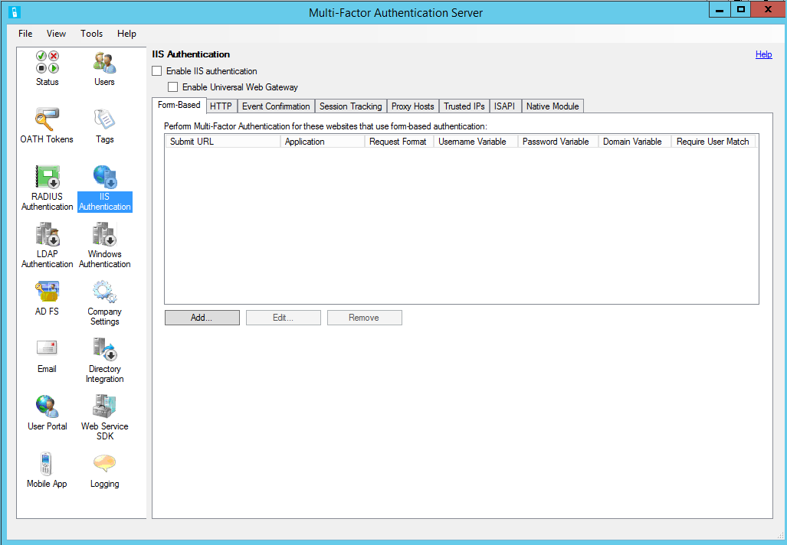
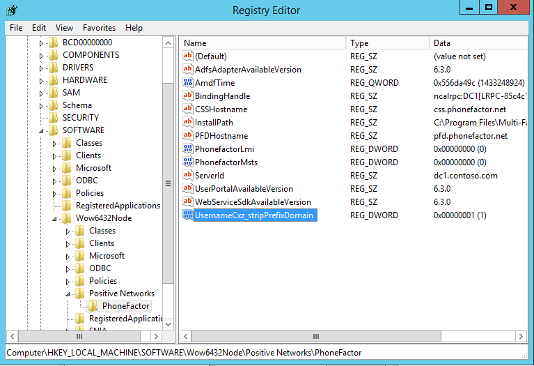
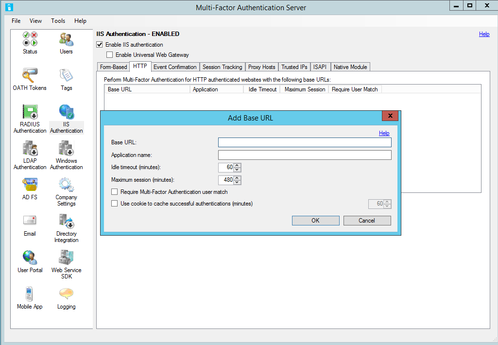

<properties 
    pageTitle="Cloudresources en on-premises resources beveiligen met behulp van de Azure Multi-Factor Authentication-server met AD FS 2.0" 
    description="Dit is de Azure Multi-Factor Authentication-pagina waarop wordt beschreven hoe u met Azure MFA en AD FS 2.0 aan de slag kunt gaan." 
    services="multi-factor-authentication" 
    documentationCenter="" 
    authors="billmath" 
    manager="stevenpo" 
    editor="curtland"/>

<tags 
    ms.service="multi-factor-authentication" 
    ms.workload="identity" 
    ms.tgt_pltfrm="na" 
    ms.devlang="na" 
    ms.topic="get-started-article" 
    ms.date="08/04/2016" 
    ms.author="billmath"/>
# Cloudresources en on-premises resources beveiligen met behulp van de Azure Multi-Factor Authentication-server met AD FS 2.0

Als uw organisatie is gefedereerd met Azure Active Directory en u hebt resources die zich on-premises of in de cloud bevinden die u wilt beveiligen, kunt u dit doen door de Azure Multi-Factor Authentication-server te gebruiken en deze te configureren voor gebruik met AD FS, zodat meervoudige verificatie wordt geactiveerd voor waardevolle eindpunten.

In deze documentatie wordt beschreven hoe u de Azure Multi-Factor Authentication-server gebruikt met AD FS 2.0.  Zie [Secure cloud and on-premises resources using Azure Multi-Factor Authentication Server with Windows Server 2012 R2 AD FS](multi-factor-authentication-get-started-adfs-w2k12.md) (Cloudresources en on-premises resources beveiligen met behulp van de Azure Multi-Factor Authentication-server met Windows Server 2012 R2 AD FS) voor meer informatie over het gebruik van Azure Multi-Factor Authentication met Windows Server 2012 R2 AD FS.

## AD FS 2.0-proxy
Als u AD FS 2.0 wilt beveiligen met een proxy, installeert u de Multi-Factor Authentication-server op de ADFS-proxyserver en configureert u de server door de volgende stappen uit te voeren. 

### AD FS 2.0 beveiligen met een proxy

1. Klik in de Azure Multi-Factor Authentication-server in het menu links op het pictogram IIS-authenticatie.
2. Klik op het tabblad Op formulier gebaseerd.
3. Klik op de knop Bewerken....

4. Als u de gebruikersnaam, het wachtwoord en de domeinvariabelen automatisch wilt detecteren, voert u de aanmeldings-URL (bijvoorbeeld https://sso.contoso.com/adfs/ls) in het dialoogvenster Formulier-gebaseerde website automatisch configureren in en klikt u op OK.
5. Schakel het selectievakje Azure Multi-Factor Authentication vereisen in voor de gebruikers die zijn of moeten worden geïmporteerd in de server en zijn onderworpen aan meervoudige verificatie. Als een groot aantal gebruikers nog niet is geïmporteerd op de server en/of vrijgesteld zal zijn van meervoudige verificatie, laat u het vakje uitgeschakeld. Zie het Help-bestand voor meer informatie over deze functie.
6. Als de paginavariabelen niet automatisch kunnen worden gedetecteerd, klikt u op de knop Handmatig opgeven... in het dialoogvenster Formulier-gebaseerde website automatisch configureren.
7. Voer in het dialoogvenster Formulier-gebaseerde website toevoegen in het veld Indienings-URL de URL naar de aanmeldingspagina van AD FS in (bijvoorbeeld https://sso.contoso.com/adfs/ls) en voer een toepassingsnaam in (optioneel). De naam van de toepassing wordt vermeld in Azure Multi-Factor Authentication-rapporten en kan worden weergegeven in verificatieberichten via sms of mobiele apps. Zie het Help-bestand voor meer informatie over de indienings-URL.
8. Stel de indeling van de aanvraag  in op POST of GET.
9. Voer de gebruikersnaamvariabele (ctl00$ContentPlaceHolder1$UsernameTextBox) en wachtwoordvariabele (ctl00$ContentPlaceHolder1$PasswordTextBox) in. Als uw formulier-gebaseerde aanmeldingspagina een tekstvak voor een domein bevat, voert u de domeinvariabele in. Mogelijk moet u navigeren naar de aanmeldingspagina in een webbrowser, met de rechtermuisknop op de pagina klikken en Bron weergeven selecteren om de namen van de invoervakken op de aanmeldingspagina te vinden.
10. Schakel het selectievakje Azure Multi-Factor Authentication vereisen in voor de gebruikers die zijn of moeten worden geïmporteerd in de server en zijn onderworpen aan meervoudige verificatie. Als een groot aantal gebruikers nog niet is geïmporteerd in de server en/of vrijgesteld zal zijn van Multi-Factor Authentication, laat u het vakje uitgeschakeld.

11. Klik op de knop Geavanceerd... om geavanceerde instellingen te controleren, waaronder de mogelijkheid om een wisselbestand voor aangepaste weigering te selecteren, om geslaagde verificaties voor de website gedurende een bepaalde periode in een cache op te slaan met behulp van cookies en om te selecteren hoe de primaire referenties moeten worden geverifieerd.
12. Aangezien de AD FS-proxyserver waarschijnlijk niet aan het domein zal worden gekoppeld, gebruikt u waarschijnlijk LDAP om verbinding te maken met de domeincontroller voor het importeren van gebruikers en pre-authenticatie. Klik in het dialoogvenster Geavanceerde op formulier-gebaseerde website op het tabblad Primaire authenticatie en selecteer LDAP-binding voor het authenticatietype Pre-authenticatie.
13. Als u klaar bent, klikt u op de knop OK om terug te keren naar het dialoogvenster Formulier-gebaseerde website. Zie het Help-bestand voor meer informatie over de geavanceerde instellingen.
14. Klik op de knop OK om het dialoogvenster te sluiten.
15. Zodra de URL- en paginavariabelen zijn gedetecteerd of ingevoerd, worden de websitegegevens weergegeven in het deelvenster Op formulier gebaseerd.
16. Klik op het tabblad Native Module (Systeemeigen module) en selecteer de server, de website die de ADFS-proxy uitvoert (bijvoorbeeld 'Default Web Site' of 'Standaardwebsite') of de ADFS-proxytoepassing (bijvoorbeeld 'ls' onder 'adfs') om de IIS-invoegtoepassing op het gewenste niveau in te schakelen.
17. Klik op het vak IIS-verificatie inschakelen aan de bovenkant van het scherm.
18. De IIS-authenticatie is nu ingeschakeld. U moet echter de LDAP-verbinding met de domeincontroller configureren om de pre-authenticatie voor uw Active Directory (AD) via LDAP uit te voeren. Hiertoe klikt u op het pictogram Adreslijstintegratie.
19. Schakel op het tabblad Instellingen het keuzerondje Specifieke LDAP-configuratie gebruiken in.

20. Klik op de knop Bewerken....
21. Vul in de velden van het dialoogvenster LDAP-configuratie bewerken de benodigde informatie in om verbinding te maken met de AD-domeincontroller. Beschrijvingen van de velden zijn opgenomen in de onderstaande tabel. Opmerking: deze informatie is ook beschikbaar in het Help-bestand voor de Azure Multi-Factor Authentication-server.
22. Test de LDAP-verbinding door te klikken op de knop Testen.

23. Als de LDAP-verbindingstest is geslaagd, klikt u op de knop OK.
24. Daarna klikt u op het pictogram Bedrijfsinstellingen en selecteert u het tabblad Gebruikersnaamomzetting.
25. Selecteer het keuzerondje Het kenmerk Unieke LDAP-id gebruiken voor overeenkomende gebruikersnamen.
26. Als gebruikers hun gebruikersnaam invoeren in het AD FS-proxy-aanmeldformulier in de indeling domein\gebruikersnaam, moet de server het domein van de gebruikersnaam kunnen verwijderen bij het maken van de LDAP-query. Dat kan worden gedaan met behulp van een registerinstelling.
27. Open de Register-editor en ga op een 64-bits-server naar HKEY_LOCAL_MACHINE/SOFTWARE/Wow6432Node/Positive Networks/PhoneFactor. Op een 32-bits-server verwijdert u het gedeelte 'Wow6432Node' uit het pad. Maak een nieuwe DWORD-registersleutel met de naam UsernameCxz_stripPrefixDomain en stel de waarde in op 1. Azure Multi-Factor Authentication is nu de beveiliging van de AD FS-proxy. Zorg ervoor dat gebruikers uit Active Directory in de server zijn geïmporteerd. Zie de onderstaande sectie 'Goedgekeurde IP-adressen' als u interne IP-adressen in een lijst met toegestane IP-adressen wilt plaatsen, zodat tweeledige verificatie niet is vereist bij het aanmelden bij de website vanaf die locaties.

## AD FS 2.0 Direct zonder een proxy

Als u AD FS wilt beveiligen wanneer de AD FS-proxy niet wordt gebruikt, installeert u de Azure Multi-Factor Authentication-server op de AD FS-server en configureert u de server op de AD FS-server door de volgende stappen uit te voeren. 

### AD FS 2.0 beveiligen zonder een proxy
1. Klik in de Azure Multi-Factor Authentication-server in het menu links op het pictogram IIS-authenticatie.
2. Klik op het tabblad HTTP.
3. Klik op de knop Bewerken....
4. Voer in het dialoogvenster Basis-URL toevoegen in het veld Basis-URL de URL in voor de AD FS-website waar de HTTP-verificatie wordt uitgevoerd (bijvoorbeeld https://sso.domain.com/adfs/ls/auth/integrated) en voer een toepassingsnaam in (optioneel). De naam van de toepassing wordt vermeld in Azure Multi-Factor Authentication-rapporten en kan worden weergegeven in verificatieberichten via sms of mobiele apps.
5. Pas, indien gewenst, de tijd voor Time-out voor inactiviteit en voor Maximale sessie aan.
6. Schakel het selectievakje Azure Multi-Factor Authentication vereisen in voor de gebruikers die zijn of moeten worden geïmporteerd in de server en zijn onderworpen aan meervoudige verificatie. Als een groot aantal gebruikers nog niet is geïmporteerd op de server en/of vrijgesteld zal zijn van meervoudige verificatie, laat u het vakje uitgeschakeld. Zie het Help-bestand voor meer informatie over deze functie.
7. Schakel, indien gewenst, het selectievakje Cookie gebruiken om voltooide authenticaties in de cache op te slaan in.

8. Klik op de knop OK.
9. Klik op het tabblad Native Module (Systeemeigen module) en selecteer de server, de website die ADFS uitvoert (bijvoorbeeld 'Default Web Site' of 'Standaardwebsite') of de ADFS-toepassing (bijvoorbeeld 'ls' onder 'adfs') om de IIS-invoegtoepassing op het gewenste niveau in te schakelen.
10. Klik op het vak IIS-verificatie inschakelen aan de bovenkant van het scherm. Azure Multi-Factor Authentication is nu de beveiliging van AD FS. Zorg ervoor dat gebruikers uit Active Directory in de server zijn geïmporteerd. Zie de onderstaande sectie 'Goedgekeurde IP-adressen' als u interne IP-adressen in een lijst met toegestane IP-adressen wilt plaatsen, zodat tweeledige verificatie niet is vereist bij het aanmelden bij de website vanaf die locaties.

## Goedgekeurde IP-adressen
De goedgekeurde IP-adressen bieden gebruikers de mogelijkheid om Azure Multi-Factor Authentication over te slaan voor websiteverzoeken die afkomstig zijn van bepaalde IP-adressen of subnetten. Zo kunt u gebruikers vrijstellen van Azure Multi-Factor Authentication wanneer zij zich op kantoor aanmelden. Hiervoor geeft u het subnet van het kantoor op als een van de goedgekeurde IP-adressen. 

### Goedgekeurde IP-adressen configureren

1. Klik op het tabblad Goedgekeurde IP-adressen in de sectie IIS-verificatie.
1. Klik op de knop Bewerken....
1. Wanneer het dialoogvenster Goedgekeurd IP-adres toevoegen wordt weergegeven, selecteert u het keuzerondje Eén IP-adres, IP-bereik of Subnet.
1. Voer het IP-adres, het bereik van IP-adressen of het subnet in dat u op de lijst van goedgekeurde IP-adressen wilt plaatsen. Als een subnet wilt invoeren, selecteert u het geschikte netmasker en klikt u op de knop OK. Het goedgekeurde IP-adres is nu toegevoegd.

 

<!--HONumber=ago16_HO4-->

