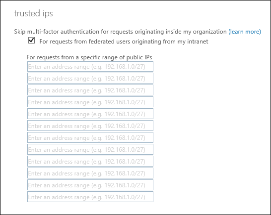

<properties 
    pageTitle="Cloudresources beveiligen met Azure Multi-Factor Authentication en AD FS" 
    description="Dit is de pagina Azure Multi-Factor Authentication waarop wordt beschreven hoe u aan de slag kunt met Azure MFA en AD FS in de cloud." 
    services="multi-factor-authentication" 
    documentationCenter="" 
    authors="billmath" 
    manager="stevenpo" 
    editor="curtland"/>

<tags 
    ms.service="multi-factor-authentication" 
    ms.workload="identity" 
    ms.tgt_pltfrm="na" 
    ms.devlang="na" 
    ms.topic="get-started-article" 
    ms.date="08/04/2016" 
    ms.author="billmath"/>

# Cloudresources beveiligen met Azure Multi-Factor Authentication en AD FS

Als uw organisatie is gefedereerd met behulp van Azure Active Directory en u resources hebt die worden gebruikt door Azure AD, kunt u Azure Multi-Factor Authentication of Active Directory Federation Services gebruiken om deze resources te beveiligen. Gebruik de onderstaande procedures voor het beveiligen van Azure Active Directory-resources met ofwel Azure Multi-Factor Authentication of Active Directory Federation Services.

## Als u Azure AD-resources wilt beveiligen met behulp van AD FS, moet u het volgende doen: 

1. Gebruik de stappen die worden beschreven in [Multi-Factor Authentication inschakelen](active-directory/multi-factor-authentication-get-started-cloud.md#turn-on-multi-factor-authentication-for-users) voor gebruikers die een account willen inschakelen.
2. Gebruik de volgende procedure om een regel voor claims in te stellen:

-   Start de AD FS-beheerconsole.
-   Navigeer naar de Relying Party-vertrouwensrelaties en klik met de rechtermuisknop op de Relying Party-vertrouwensrelatie. Selecteer Claimregels bewerken...
-   Klik op Regel toevoegen...
-   Selecteer in de vervolgkeuzelijst Claimregels verzenden met een aangepaste regel en klik op Volgende.
-   Voer een naam in voor de claimregel.
-   Voeg onder Aangepaste regel het volgende toe:

        => issue(Type = "http://schemas.microsoft.com/claims/authnmethodsreferences", Value = "http://schemas.microsoft.com/claims/multipleauthn");

    Overeenkomende claim:

        <saml:Attribute AttributeName="authnmethodsreferences" AttributeNamespace="http://schemas.microsoft.com/claims">
        <saml:AttributeValue>http://schemas.microsoft.com/claims/multipleauthn</saml:AttributeValue>
        </saml:Attribute>
- Klik op OK. Klik op Voltooien. Sluit de AD FS-beheerconsole.

Gebruikers kunnen zich vervolgens aanmelden via de on-premises methode (zoals smartcard).

## Goedgekeurde IP-adressen voor federatieve gebruikers
Met goedgekeurde IP-adressen zijn beheerders in staat om Multi-Factor Authentication te omzeilen voor bepaalde IP-adressen of voor federatieve gebruikers met verzoeken die afkomstig zijn uit hun eigen intranet. In de volgende secties wordt beschreven hoe goedgekeurde IP-adressen van Azure Multi-Factor Authentication bij federatieve gebruikers moeten worden geconfigureerd en hoe Multi-Factor Authentication kan worden omzeild als een verzoek afkomstig is uit het intranet van een federatieve gebruiker.  Dit wordt bereikt door AD FS zo te configureren dat deze gebruikmaakt van een passthrough of een binnenkomende claimsjabloon filtert met het claimtype Binnen bedrijfsnetwerk.  In dit voorbeeld wordt Office 365 gebruikt voor onze Relying Party-vertrouwensrelaties.

### De claimregels van AD FS configureren

Het eerste wat we moeten doen is de AD FS-claims configureren. We gaan twee claimregels maken, één voor het claimtype Binnen bedrijfsnetwerk en een extra regel om onze gebruikers aangemeld te houden.

1. Open AD FS-beheer.
2. Selecteer Relying Party-vertrouwensrelaties aan de linkerkant.
3. Klik in het midden met de rechtermuisknop op het identiteitsplatform van Microsoft Office 365 en selecteer **Claimregels bewerken...**

4. Klik bij Uitgifte transformatieregels op**Regel toevoegen.**

5. Selecteer in de wizard Transformatieclaimregels toevoegen Passthrough of Een binnenkomende claim filteren in de vervolgkeuzelijst en klik op Volgende.

6. Geef de claimregel een naam in het vak bij Naam claimregel. Bijvoorbeeld: BinnenBedrijfsNet.
7. In de vervolgkeuzelijst naast Binnenkomend claimtype, selecteert u Binnen bedrijfsnetwerk.

8. Klik op Voltooien.
9. Klik bij Uitgifte transformatieregels op**Regel toevoegen.**.
10. Selecteer in de wizard Transformatieclaimregels toevoegen Claim verzenden met een aangepaste regel in de vervolgkeuzelijst en klik op Volgende.
11. In het vak onder Naam claimregel typt u Gebruikers aangemeld houden.
12. In het vak Aangepaste regel typt u:
        
        c:[Type == "http://schemas.microsoft.com/2014/03/psso"]
            => issue(claim = c);

13. Klik op **Voltooien**.
14. Klik op **Toepassen**.
15. Klik op **OK**.
16. Sluit AD FS-beheer.

### Goedgekeurde IP-adressen van Azure Multi-Factor Authentication configureren bij federatieve gebruikers
Nu de claims zijn gemaakt, kunnen we goedgekeurde IP-adressen gaan configureren.

1. Meld u aan bij de Azure-beheerportal.
2. Klik aan de linkerkant op Active Directory.
3. Klik onder Adreslijst op de adreslijst die u wilt instellen voor goedgekeurde IP-adressen.
4. Klik op Configureren op de Adreslijst die u hebt geselecteerd.
5. Klik in de sectie Multi-Factor Authentication op Service-instellingen beheren.
6. Selecteer op de pagina Service-instellingen onder Goedgekeurde IP-adressen, **Voor aanvragen van federatieve gebruikers die uit mijn intranet afkomstig zijn.**

7. Klik op opslaan.
8. Nadat de updates zijn toegepast, klikt u op Sluiten.

Dat is alles. Vanaf dit moment hoeven Office 365-gebruikers alleen MFA te gebruiken wanneer een claim afkomstig is van buiten het bedrijfsintranet.

<!--HONumber=ago16_HO4-->

