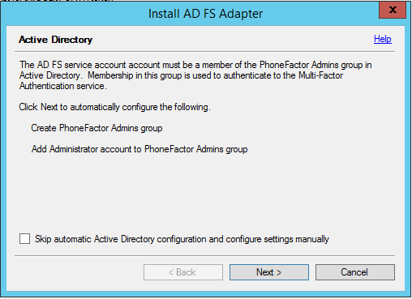
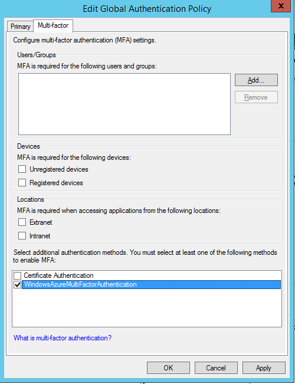

<properties
    pageTitle="Cloudresources en on-premises resources beveiligen met behulp van de Azure Multi-Factor Authentication-server met Windows Server 2012 R2 AD FS | Microsoft Azure"
    description="In dit artikel wordt beschreven hoe u aan de slag gaat met Azure Multi-Factor Authentication en AD FS in Windows Server 2012 R2."
    services="multi-factor-authentication"
    documentationCenter=""
    authors="billmath"
    manager="stevenpo"
    editor="curtland"/>

<tags
    ms.service="multi-factor-authentication"
    ms.workload="identity"
    ms.tgt_pltfrm="na"
    ms.devlang="na"
    ms.topic="get-started-article"
    ms.date="08/04/2016"
    ms.author="billmath"/>

# Cloudresources en on-premises resources beveiligen met behulp van de Azure Multi-Factor Authentication-server met AD FS in Windows Server 2012 R2

Als uw organisatie gebruikmaakt van Active Directory Federation Services (AD FS) en u cloud- of on-premises resources wilt beveiligen, kunt u Azure Multi-Factor Authentication Server implementeren en configureren voor gebruik met AD FS. Deze configuratie activeert Multi-Factor Authentication voor waardevolle eindpunten.

In dit artikel wordt besproken hoe u de Azure Multi-Factor Authentication-server gebruikt met AD FS in Windows Server 2012 R2. Lees over het [beveiligen van cloudresources en on-premises resources met behulp van de Azure Multi-Factor Authentication-server met AD FS 2.0](multi-factor-authentication-get-started-adfs-adfs2.md) voor meer informatie.

## Windows Server 2012 R2 AD FS beveiligen met Azure Multi-Factor Authentication-server

Bij de installatie van de Azure Multi-Factor Authentication-server hebt u de volgende opties:

- De Azure Multi-Factor Authentication-server lokaal op dezelfde server installeren als AD FS
- De Azure Multi-Factor Authentication-adapter lokaal installeren op de AD FS-server en de Multi-Factor Authentication-server op een andere computer installeren

Houd rekening met de volgende informatie voordat u begint:

- U bent niet verplicht de Azure Multi-Factor Authentication-server op uw AD FS-server te installeren. U moet echter de Multi-Factor Authentication-adapter voor AD FS installeren op een Windows Server 2012 R2 met AD FS. U kunt de server op een andere computer installeren als de versie hiervan wordt ondersteund en de AD FS-adapter afzonderlijk installeren op uw federatieve AD FS-server. Zie de volgende procedures voor informatie over hoe u de adapter afzonderlijk kunt installeren.
- Toen de AD FS-adapter van de Multi-Factor Authentication-server werd ontworpen, werd ervan uitgegaan dat AD FS de naam van de relying party zou kunnen doorgeven aan de adapter, die als een toepassingsnaam zou kunnen worden gebruikt. Dit bleek echter niet het geval te zijn. Als uw organisatie verificatiemethoden voor sms-berichten of mobiele apps gebruikt, bevatten de tekenreeksen die in Bedrijfsinstellingen zijn gedefinieerd een tijdelijke aanduiding, <$*application_name*$>. Deze tijdelijke aanduiding wordt niet automatisch vervangen bij het gebruik van de AD FS-adapter. U wordt aangeraden de tijdelijke aanduiding van de relevante tekenreeksen te verwijderen als u AD FS beveiligt.

- Het account waarmee u zich aanmeldt, moet gebruikersrechten hebben voor het maken van beveiligingsgroepen in de Active Directory-service.

- De wizard Multi-Factor Authentication AD FS-adapter installeren maakt een beveiligingsgroep met de naam PhoneFactor Admins in uw exemplaar van Active Directory en voegt de AD FS-serviceaccount van uw federatieve service vervolgens toe aan deze groep. U wordt aangeraden in uw domeincontroller te controleren of de PhoneFactor Admins-groep inderdaad is gemaakt en dat de AD FS-serviceaccount lid is van deze groep. Voeg, indien nodig, het AD FS-serviceaccount handmatig toe aan de groep PhoneFactor Admins in uw domeincontroller.
- Zie voor informatie over het installeren van de webservice-SDK met de gebruikersportal [De gebruikersportal implementeren voor de Azure Multi-Factor Authentication-server.](multi-factor-authentication-get-started-portal.md)

### De Azure Multi-Factor Authentication-server lokaal op de AD FS-server installeren

1. Download en installeer de Azure Multi-Factor Authentication-server op uw federatieve AD FS-server. Lees [Aan de slag met de Azure Multi-Factor Authentication-server](multi-factor-authentication-get-started-server.md) voor informatie over de installatie.
2. Klik in de beheerconsole van de Azure Multi-Factor Authentication-server op het **AD FS**-pictogram en selecteer daarna de opties **Registreren van gebruikers toestaan** en **Toestaan dat gebruikers de methode selecteren**.
3. Selecteer de aanvullende opties die u wilt opgeven voor uw organisatie.
4. Klik op **AD FS-adapter installeren**.

5. Als de computer lid is van een domein en de Active Directory-configuratie voor de beveiliging van de communicatie tussen de AD FS-adapter en de Multi-Factor Authentication-service niet is voltooid, wordt het venster **Active Directory** weergegeven. Klik op **Volgende** om deze configuratie automatisch te voltooien of schakel het selectievakje **Automatische Active Directory-configuratie overslaan en instellingen handmatig configureren** in en klik daarna op **Volgende**.
6. Als de computer nog niet lid is van een domein en de Lokale groep-configuratie voor de beveiliging van de communicatie tussen de AD FS-adapter en de Multi-Factor Authentication-service niet is voltooid, wordt het venster **Lokale groep** weergegeven. Klik op **Volgende** om deze configuratie automatisch te voltooien of schakel het selectievakje **Automatische lokale groep-configuratie overslaan en instellingen handmatig configureren** in en klik op **Volgende**.
7. Klik in de installatiewizard op **Volgende**. Azure Multi-Factor Authentication-server maakt de PhoneFactor Admins-groep en voegt de AD FS-serviceaccount toe aan de PhoneFactor Admins-groep.

8. Klik op de pagina **Installatieprogramma uitvoeren** op **Volgende**.
9. Klik in het installatieprogramma voor de Multi-Factor Authentication AD FS-adapter op **Volgende**.
10. Klik op **Sluiten** nadat de installatie is voltooid.
11. Wanneer de adapter is geïnstalleerd, moet u deze registreren bij AD FS. Open Windows PowerShell en voer de volgende opdracht uit: 
    `C:\Program Files\Multi-Factor Authentication Server\Register-MultiFactorAuthenticationAdfsAdapter.ps1`
   

12. Bewerk de Global Authentication Policy (Algemeen verificatiebeleid) in AD FS om uw zojuist geregistreerde adapter te gebruiken. Ga in de AD FS-beheerconsole naar het knooppunt **Authentication Policies**. Klik in het gedeelte **Multi-factor Authentication** op de koppeling **Edit** naast het gedeelte **Global Settings**. Selecteer in het venster **Edit Global Authentication Policy** **Multi-Factor Authentication** als een aanvullende verificatiemethode en klik op **OK**. De adapter wordt geregistreerd als WindowsAzureMultiFactorAuthentication. U moet de AD FS-service opnieuw starten voordat de registratie van kracht wordt.

De Multi-Factor Authentication-server is nu ingesteld voor gebruik als een extra verificatieprovider voor gebruik met AD FS.

## Een zelfstandig exemplaar van de AD FS-adapter installeren met behulp van de webservice-SDK
1. Installeer de webservice-SDK op de server waarop de Multi-Factor Authentication-server wordt uitgevoerd.
2. Kopieer de volgende bestanden uit de map \Program Files\Multi-Factor Authentication Server naar de server waarop u de AD FS-adapter wilt installeren:
  - MultiFactorAuthenticationAdfsAdapterSetup64.msi
  - Register-MultiFactorAuthenticationAdfsAdapter.ps1
  - Unregister-MultiFactorAuthenticationAdfsAdapter.ps1
  - MultiFactorAuthenticationAdfsAdapter.config
3. Voer het installatiebestand MultiFactorAuthenticationAdfsAdapterSetup64.msi uit.
4. Klik in het installatieprogramma van Multi-Factor Authentication AD FS-adapter op **Volgende** om de installatie uit te voeren.
5. Klik op **Sluiten** nadat de installatie is voltooid.
6. Bewerk het bestand MultiFactorAuthenticationAdfsAdapter.config als volgt:

|Stap MultiFactorAuthenticationAdfsAdapter.config| Substap|
|:------------- | :------------- |
|Stel het knooppunt **UseWebServiceSdk** in op **true**.||
|Stel de waarde voor **WebServiceSdkUrl** in op de URL van de webservice-SDK voor Multi-Factor Authentication.  Voorbeeld:  **https://contoso.com/&lt;certificatename&gt;/MultiFactorAuthWebServicesSdk/PfWsSdk.asmx**  Hierbij is certificatename de naam van uw certificaat. ||
|Configureer de webservice-SDK.  *Optie 1*: met behulp van een gebruikersnaam en wachtwoord|<ol type="a"><li>Stel de waarde voor **WebServiceSdkUsername** in op een account dat lid is van de veiligheidsgroep PhoneFactor Admins. Gebruik de indeling &lt;domein&gt;&#92;&lt;gebruikersnaam&gt;.<li>Stel de waarde voor **WebServiceSdkPassword** in op het juiste accountwachtwoord.</li></ol>
|De webservice-SDK configureren, *vervolg*  *Optie 2*: met behulp van een clientcertificaat|<ol type="a"><li>Verkrijg een certificaat van een certificeringsinstantie voor de server waarop de webservice-SDK wordt uitgevoerd. Lees hoe u [clientcertificaten kunt verkrijgen](https://technet.microsoft.com/library/cc770328.aspx).</li><li>Importeer het clientcertificaat in het persoonlijke certificaatarchief van de lokale computer op de server waarop de webservice-SDK wordt uitgevoerd. Opmerking: zorg ervoor dat het openbare certificaat van de certificeringsinstantie zich bevindt in de certificaatopslag met vertrouwde basiscertificaten.</li><li>Exporteer de openbare en persoonlijke sleutels van het clientcertificaat naar een PFX-bestand.</li><li>Exporteer de openbare sleutel in Base64-indeling naar een CER-bestand.</li><li>Controleer in Serverbeheer of het onderdeel Web Server (IIS)\Web Server\Security\IIS Client Certificate Mapping Authentication (Verificatie van IIS-clientcertificaattoewijzing) is geïnstalleerd. Als dit niet is geïnstalleerd, kiest u **Functies en onderdelen toevoegen** om dit onderdeel toe te voegen.</li><li>Dubbelklik in IIS-beheer op **Configuratie-editor** voor de website die de virtuele map van de webservice-SDK bevat. Opmerking: het is heel belangrijk dat u dit doet op het niveau van de website en niet op het niveau van de virtuele map.</li><li>Ga naar het gedeelte **system.webServer/security/authentication/iisClientCertificateMappingAuthentication**.</li><li>Stel **enabled** in op **true**.</li><li>Stel **oneToOneCertificateMappingsEnabled** in op **true**.</li><li>Klik op de knop **...** naast **oneToOneMappings** en klik vervolgens op de koppeling **Add**.</li><li>Open het CER-bestand dat u eerder hebt geëxporteerd in base 64-indeling. Verwijder *-----BEGIN CERTIFICATE-----*, *-----END CERTIFICATE-----* en alle regeleinden. Kopieer de resulterende tekenreeks.</li><li>Stel het **certificaat** in op de tekenreeks die u in de vorige stap hebt gekopieerd.</li><li>Stel **enabled** in op **true**.</li><li>Stel **userName** in op een account dat lid is van de veiligheidsgroep PhoneFactor Admins. Gebruik de indeling &lt;domein&gt;&#92;&lt;gebruikersnaam&gt;.</li><li>Stel het wachtwoord in op het juiste accountwachtwoord en sluit vervolgens de Configuratie-editor.</li><li>Klik op de koppeling **Toepassen**.</li><li>Dubbelklik in de virtuele map van de webservice-SDK op **Verificatie**.</li><li>Controleer of **ASP.NET-imitatie** en **Basisverificatie** zijn ingesteld op **Ingeschakeld** en of alle overige items zijn ingesteld op **Uitgeschakeld**.</li><li>Dubbelklik in de virtuele map van de webservice-SDK op **SSL-instellingen**.</li><li>Stel **Clientcertificaten** in op **Accepteren** en klik daarna op **Toepassen**.</li><li>Kopieer het PFX-bestand dat u eerder hebt geëxporteerd naar de server waarop de AD FS-adapter wordt uitgevoerd.</li><li>Importeer het PFX-bestand in het persoonlijke certificaatarchief van de lokale computer.</li><li>Klik met de rechtermuisknop en selecteer **Persoonlijke sleutels beheren**, en verleen leestoegang tot het account waarmee u zich aanmeldt bij de AD FS-service.</li><li>Open het clientcertificaat en kopieer de vingerafdruk van het tabblad **Details**.</li><li>Stel in het bestand MultiFactorAuthenticationAdfsAdapter.config **WebServiceSdkCertificateThumbprint** in op de tekenreeks die u in de vorige stap hebt gekopieerd.</li></ol>
| Bewerk het script Register-MultiFactorAuthenticationAdfsAdapter.ps1 door *-ConfigurationFilePath-&lt;pad&gt;* toe te voegen aan het einde van de opdracht `Register-AdfsAuthenticationProvider`, waarbij *&lt;pad&gt;* het volledige pad is naar het bestand MultiFactorAuthenticationAdfsAdapter.config.||

Voer het script \Program Files\Multi-Factor Authentication Server\Register-MultiFactorAuthenticationAdfsAdapter.ps1 uit in PowerShell om de adapter te registreren. De adapter wordt geregistreerd als WindowsAzureMultiFactorAuthentication. U moet de AD FS-service opnieuw starten voordat de registratie van kracht wordt.

<!--HONumber=ago16_HO5-->

