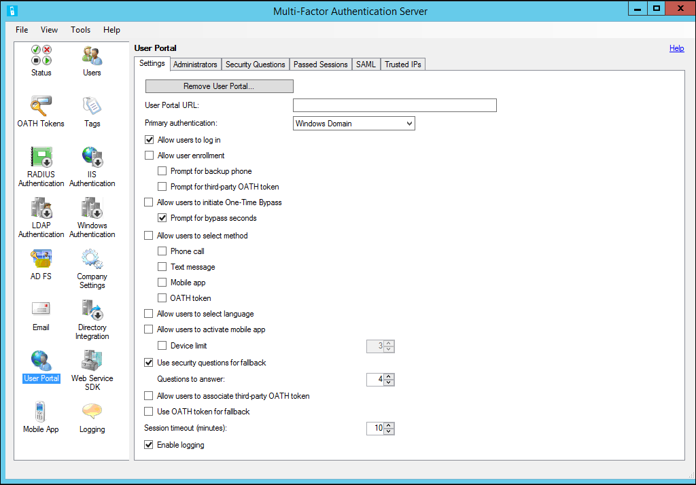

<properties 
	pageTitle="部署 Azure Multi-factor Authentication Server 使用者入口網站" 
	description="這是說明如何開始使用 Azure MFA 和使用者入口網站的 Azure Multi-Factor Authentication 頁面。" 
	services="multi-factor-authentication" 
	documentationCenter="" 
	authors="billmath" 
	manager="terrylan" 
	editor="bryanla"/>

<tags 
	ms.service="multi-factor-authentication" 
	ms.workload="identity" 
	ms.tgt_pltfrm="na" 
	ms.devlang="na" 
	ms.topic="article" 
	ms.date="06/02/2015" 
	ms.author="billmath"/>

# 部署 Azure Multi-factor Authentication Server 使用者入口網站

使用者入口網站可讓管理員安裝及設定 Azure Multi-Factor Authentication 使用者入口網站。使用者入口網站是一個 IIS 網站，可讓使用者註冊 Azure Multi-Factor Authentication 及維護自己的帳戶。使用者可以變更電話號碼、變更 PIN，或在下次登入時略過 Azure Multi-Factor Authentication。

使用者可以使用一般的使用者名稱和密碼登入使用者入口網站，並將需要完成 Azure Multi-Factor Authentication 通話或回答安全性問題，以完成驗證。如果允許使用者註冊，使用者將需要在第一次登入使用者入口網站時設定電話號碼和 PIN。

您可以設定使用者入口網站管理員，並授與新增使用者及更新現有使用者的權限。

## 在與 Azure Multi-Factor Authentication Server 相同的伺服器上部署使用者入口網站

若要在與 Azure Multi-Factor Authentication Server 相同的伺服器上安裝使用者入口網站，您必須滿足以下必要條件：

- 必須安裝 IIS，包括 asp.net 及 IIS 6 metabase 相容性 (適用於 IIS 7 或更高版本) 
- 登入的使用者必須擁有電腦及網域的管理員權限 (若有的話)。這是因為帳戶需有建立 Active Directory 安全性群組的權限。

### 部署 Azure Multi-Factor Authentication Server 使用者入口網站

<ol>
<li>在 Azure Multi-Factor Authentication Server 內：按一下左側功能表中的 [使用者入口網站] 圖示，然後按一下 [安裝使用者入口網站] 按鈕。<li>按 [下一步]。<li>按 [下一步]。<li>如果電腦已加入網域，但保護使用者入口網站和 Azure Multi-Factor Authentication 服務間之通訊的 Active Directory 設定尚未完成，Active Directory 步驟將會出現。按 [下一步] 按鈕以自動完成此設定。<li>按 [下一步]。<li>按 [下一步]。<li>按一下 [關閉]。<li>從任何電腦開啟網頁瀏覽器，並瀏覽至安裝使用者入口網站的 URL (如 https://www.publicwebsite.com/MultiFactorAuth)。確定未出現任何憑證警告或錯誤。</li>

## 在不同的伺服器上部署 Azure Multi-Factor Authentication Server 使用者入口網站

若要使用 Azure Multi-Factor Authentication 應用程式，使用者必須滿足以下條件，應用程式才能與使用者入口網站成功通訊：

如需硬體和軟體需求，請參閱＜硬體和軟體需求＞：

- 您必須使用 Azure Multi-Factor Authentication Server 6.0 或更高版本。
- 必須將使用者入口網站安裝在執行 Microsoft® Internet Information Services (IIS) 6.x、IIS 7.x 或更高版本的網際網路對向網頁伺服器上。
- 在使用 IIS 6.x 時，請確定 ASP.NET v2.0.50727 已安裝、註冊並設定為 [已允許]。
- 使用 IIS 7.x 或更高版本時所需的角色服務包括 ASP.NET 和 IIS 6 Metabase 相容性。
- 使用者入口網站應受到 SSL 憑證保護。
- 必須以 IIS 6.x、IIS 7.x 或更高版本將 Azure Multi-Factor Authentication Web 服務 SDK 安裝在 Azure Multi-Factor Authentication Server 所安裝的伺服器上。
- Azure Multi-Factor Authentication Web 服務 SDK 必須受到 SSL 憑證保護。
- 使用者入口網站必須要能透過 SSL 連接 Azure Multi-Factor Authentication Web 服務 SDK。
- 使用者入口網站必須要能使用隸屬於 "PhoneFactor Admins" 安全性群組之服務帳戶的認證驗證 Azure Multi-Factor Authentication Web 服務 SDK。如果 Azure Multi-Factor Authentication Server 在加入網域的伺服器上執行，此服務帳戶和群組也會存在於 Active Directory 中。如果伺服器未加入網域，此服務帳戶和群組會存在於 Azure Multi-Factor Authentication Server 本機。

若要將使用者入口網站安裝在 Azure Multi-Factor Authentication Server 以外的伺服器上，您必須進行以下三個步驟：

1. 安裝 Web 服務 SDK
2. 安裝使用者入口網站
3. 在 Azure Multi-Factor Authentication Server 中配置使用者入口網站設定

### 安裝 Web 服務 SDK

如果您尚未將 Azure Multi-Factor Authentication Web 服務 SDK 安裝在 Azure Multi-Factor Authentication Server 上，請移至該伺服器，然後開啟 Azure Multi-Factor Authentication Server。按一下 [Web 服務 SDK] 圖示，再按一下 [安裝 Web 服務 SDK...] 按鈕，然後遵循畫面呈現的指示。Web 服務 SDK 必須受到 SSL 憑證保護。自我簽署憑證適用於此目的，不過您必須將它匯入使用者入口網站 Web 伺服器上本機電腦帳戶的「信任的根憑證授權」存放區，這樣它才會在起始 SSL 連接時信任該憑證。

### 安裝使用者入口網站

將使用者入口網站安裝在其他伺服器之前，請注意以下事項：

- 在網際網路對向 Web 伺服器上開啟網頁瀏覽器，並瀏覽至輸入 web.config 檔案中的 Web 服務 SDK URL，如此將有所幫助。如果瀏覽器可以順利連接 Web 服務，它應該會提示您輸入認證。輸入使用者名稱和密碼 (與輸入 web.config 檔案中的使用者名稱和密碼完全相同)。確定未出現任何憑證警告或錯誤。
- 如果反向 Proxy 或防火牆座落於使用者入口網站 Web 伺服器之前，而且正在執行 SSL 卸載，您可以編輯使用者入口網站的 web.config 檔案，並將下列機碼新增至 <appSettings> 區段，讓使用者入口網站可以使用 http，而不是 https。<add key="SSL_REQUIRED" value="false"/>

#### 安裝使用者入口網站

<ol>

<li>在 Azure Multi-Factor Authentication Server 伺服器上開啟 Windows 檔案總管，接著瀏覽至安裝 Azure Multi-Factor Authentication Server 的資料夾 (如 C:\Program Files\Multi-Factor Authentication Server)。視需要為即將安裝使用者入口網站的伺服器選擇 32 位元或 64 位元版本的 MultiFactorAuthenticationUserPortalSetup 安裝檔案。將安裝檔案複製到網際網路對向伺服器。</li>

<li>在網際網路對向 Web 伺服器上，您必須以系統管理員權限執行安裝程式檔案。若要這樣做，最簡單的方式是以系統管理員身分開啟命令提示字元，再瀏覽至複製安裝檔案的位置。</li>

<li>執行 MultiFactorAuthenticationUserPortalSetup64 安裝檔案，視需要變更的網站和虛擬目錄名稱。</li>

<li>使用者入口網站安裝完成之後，瀏覽至 C:\inetpub\wwwroot\MultiFactorAuth (或根據虛擬目錄名稱瀏覽至適當目錄) 並編輯 web.config 檔案。</li>

<li>找出 USE_WEB_SERVICE_SDK 機碼，並將從 false 值變更為 true。找出 WEB_SERVICE_SDK_AUTHENTICATION_USERNAME 和 WEB_SERVICE_SDK_AUTHENTICATION_PASSWORD 機碼，並將值設定為隸屬於 PhoneFactor Admins 安全性群組之服務帳戶的使用者名稱和密碼 (請參閱前文的＜需求＞一節)。請務必將使用者名稱和密碼輸入行尾的引號之間 (value=””/>)。建議您使用合格的使用者名稱 (如 domain\username 或 machine\username)。</li>

<li>找出 pfup_pfwssdk_PfWsSdk 設定，並將值從 “http://localhost:4898/PfWsSdk.asmx” 變更為在 Azure Multi-Factor Authentication Server 上執行之 Web 服務 SDK 的 URL (如 https://computer1.domain.local/MultiFactorAuthWebServiceSdk/PfWsSdk.asmx)。由於此連接使用 SSL，所以您必須依據伺服器名稱參考 Web 服務 SDK，而不是 IP 位址，因為 SSL 憑證是針對伺服器名稱發行，所以使用的 URL 必須與憑證上的名稱相符。如果伺服器名稱無法解析為網際網路對向伺服器的 IP 位址，請在該伺服器上的主機檔案加入項目，讓 Azure Multi-Factor Authentication Server 的名稱能與其 IP 位址相對應。完成變更後，儲存 web.config 檔案。</li>

<li>如果安裝使用者入口網站的網站 (如預設網站) 尚未與公開簽署的憑證繫結，請在伺服器上安裝憑證 (如果尚未安裝)，開啟 IIS 管理員，然後將憑證繫結至網站。</li>

<li>從任何電腦開啟網頁瀏覽器，並瀏覽至安裝使用者入口網站的 URL (如 https://www.publicwebsite.com/MultiFactorAuth)。確定未出現任何憑證警告或錯誤。</li>

## 在 Azure Multi-Factor Authentication Server 中配置使用者入口網站設定
既然入口網站已安裝完成，您需要設定 Azure Multi-Factor Authentication Server，使其與入口網站搭配運作。

### 在 Azure Multi-Factor Authentication Server 中配置使用者入口網站設定

1. 在 Azure Multi-Factor Authentication Server 中，按一下 [使用者入口網站] 圖示。在 [設定] 索引標籤上，於 [使用者入口網站 URL] 文字方塊中輸入使用者入口網站的 URL。如果電子郵件功能已啟用，將使用者匯入 Azure Multi-Factor Authentication Server 時，系統會將此 URL 插入傳送給使用者的電子郵件中。
2. 選擇要在使用者入口網站中使用的設定。例如，如果您允許使用者控制其驗證方法，請確認 [允許使用者選取方法] 連同他們可以選擇的方法已核取。
3. 按一下右上角的 [說明] 連結有助於瞭解所有顯示的設定。

<!---HONumber=July15_HO2-->