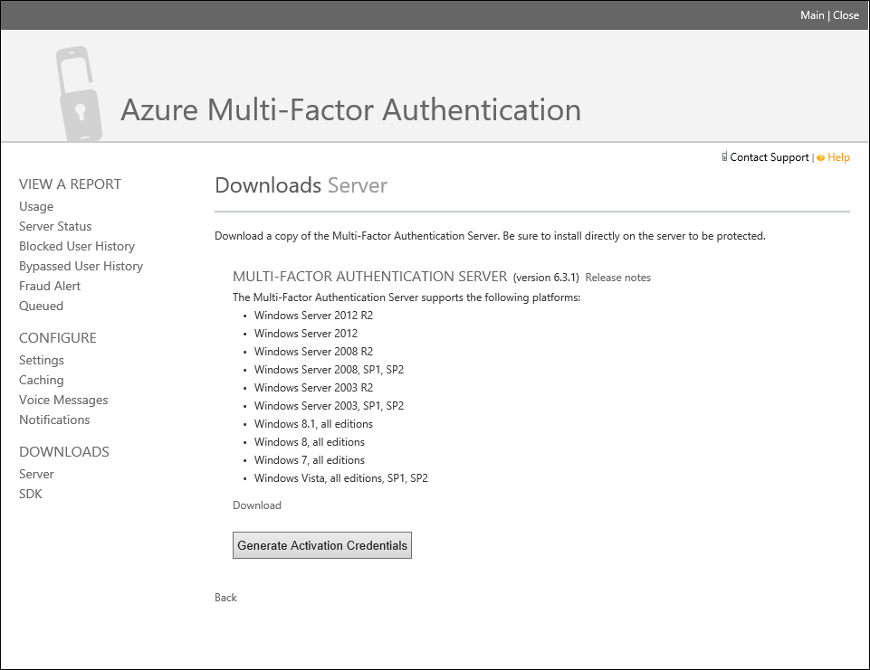
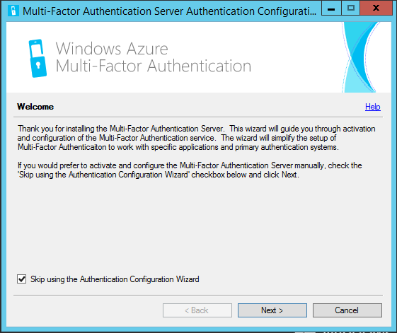
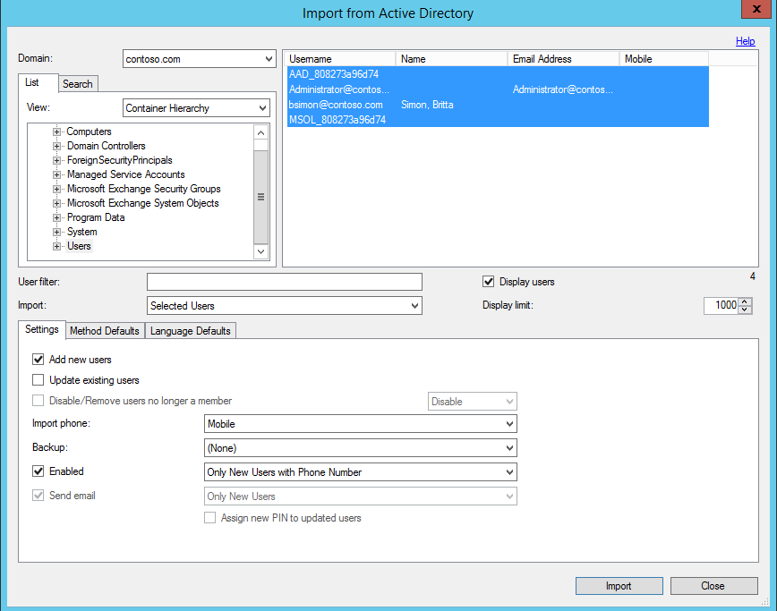
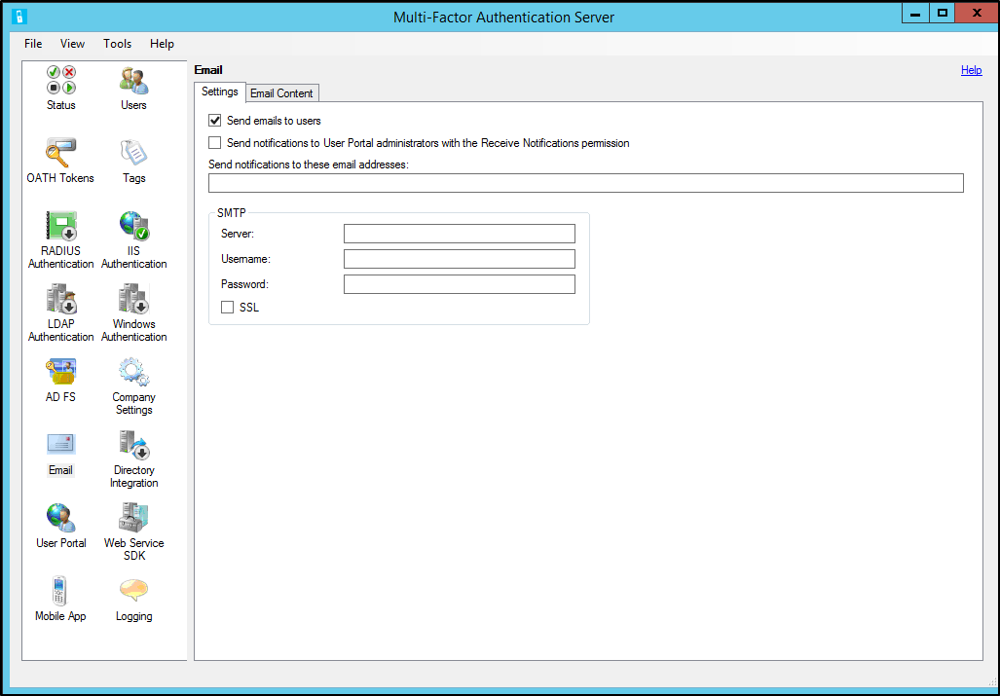
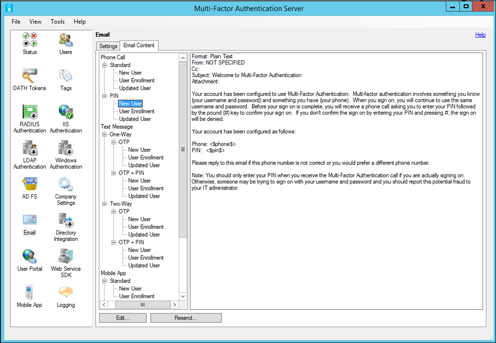

<properties 
    pageTitle="Aan de slag met de Azure Multi-Factor Authentication-server" 
    description="Dit is de Azure Multi-Factor Authentication-pagina waarop wordt beschreven hoe u met de Azure MFA-server aan de slag kunt gaan." 
    services="multi-factor-authentication"
    keywords="verificatieserver, app-activeringspagina voor azure multi factor authentication, downloaden bij verificatieserver" 
    documentationCenter="" 
    authors="billmath" 
    manager="femila" 
    editor="curtand"/>

<tags 
    ms.service="multi-factor-authentication" 
    ms.workload="identity" 
    ms.tgt_pltfrm="na" 
    ms.devlang="na" 
    ms.topic="get-started-article" 
    ms.date="08/15/2016" 
    ms.author="billmath"/>

# Aan de slag met de Azure Multi-Factor Authentication-server

Nu dat we hebben bepaald of we gebruikmaken van on-premises meervoudige verificatie, gaan we aan de slag. Op deze pagina vindt u informatie over een nieuwe installatie van de server en leert u deze in te stellen met on-premises Active Directory. Als de PhoneFactor-server al is geïnstalleerd en u een upgrade wilt uitvoeren, leest u het artikel [Upgrading to the Azure Multi-Factor Server](multi-factor-authentication-get-started-server-upgrade.md) (Een upgrade uitvoeren naar de Azure Multi-Factor Authentication-server). Als u op zoek bent naar informatie over het installeren van alleen de webservice, leest u het artikel [Deploying the Azure Multi-Factor Authentication Server Mobile App Web Service](multi-factor-authentication-get-started-server-webservice.md) (Webservice voor mobiele apps van Azure Multi-Factor Authentication-server implementeren).

## De Azure Multi-Factor Authentication-server downloaden

U kunt de Azure Multi-Factor Authentication-server op twee verschillende manieren downloaden. Beide downloads verlopen via de Azure-portal. Bij de eerste manier beheert u rechtstreeks de Multi-Factor Authentication-provider. De tweede manier verloopt via de service-instellingen. Voor de tweede manier is een Multi-Factor Authentication-provider of een Azure MFA-, Azure AD Premium- of Enterprise Mobility Suite-licentie vereist.

### De Azure Multi-Factor Authentication-server downloaden via de Azure-portal
--------------------------------------------------------------------------------

1. Meld u als beheerder aan bij de Azure-portal.
2. Selecteer links Active Directory.
3. Klik op de Active Directory-pagina bovenaan op **Providers voor Multi-Factor Authentication**.
4. Klik onderaan op **Beheren**.
5. Hierdoor opent u een nieuwe pagina.  Klik op **Downloads.**

6. Klik boven **Activeringsreferenties genereren** op **Downloaden.**

7. Sla de download op.

### De Azure Multi-Factor Authentication-server downloaden via de service-instellingen

1. Meld u als beheerder aan bij de Azure-portal.
2. Selecteer links Active Directory.
3. Dubbelklik op uw exemplaar van Azure AD.
4. Klik bovenaan op **Configureren.**

5. Selecteer onder Multi-Factor Authentication de optie **Service-instellingen beheren**.
6. Klik onderaan op de pagina met service-instellingen op **Naar de portal**.

7. Hierdoor opent u een nieuwe pagina. Klik op **Downloads**.
8. Klik boven **Activeringsreferenties genereren** op **Downloaden**.
9. Sla de download op.

## De Azure Multi-Factor Authentication-server installeren en configureren
Nu dat u de server hebt gedownload, kunt u deze installeren en configureren.  Zorg ervoor dat de server waarop u deze installeert aan de volgende vereisten voldoet.

Vereisten voor Azure Multi-Factor Authentication-server|Beschrijving|
:------------- | :------------- | 
Hardware|<li>200 MB aan vasteschijfruimte</li><li>Voor x32 of x64 geschikte processor</li><li>1 GB of meer RAM-geheugen</li>
Software|<li>Windows Server 2008 of een recentere versie als de host een serverbesturingssysteem is</li><li>Windows 7 of een recentere versie als de host een clientbesturingssysteem is</li><li>Microsoft .NET 4.0 Framework</li><li>IIS 7.0 of een recentere versie als de installatie wordt uitgevoerd vanuit de gebruikersportal of de webservice-SDK</li>

### Firewallvereisten voor Azure Multi-Factor Authentication-server
--------------------------------------------------------------------------------
Elke MFA-server moet kunnen communiceren op poort 443, uitgaand naar het volgende:

- https://pfd.phonefactor.net
- https://pfd2.phonefactor.net
- https://css.phonefactor.net

Als firewalls voor uitgaand verkeer op poort 443 worden beperkt, moeten de volgende IP-adresbereiken worden geopend:

IP-subnet|Netmasker|IP-bereik
:------------- | :------------- | :------------- |
134.170.116.0/25|255.255.255.128|134.170.116.1 – 134.170.116.126
134.170.165.0/25|255.255.255.128|134.170.165.1 – 134.170.165.126
70.37.154.128/25|255.255.255.128|70.37.154.129 – 70.37.154.254

Als u geen gebruik maakt van Azure Multi-Factor Authentication-functies voor gebeurtenisbevestiging en als gebruikers niet verifiëren met de mobiele apps voor Multi-Factor Authentication vanaf apparaten in het bedrijfsnetwerk, kunnen  de IP-bereiken tot het volgende worden teruggebracht:

IP-subnet|Netmasker|IP-bereik
:------------- | :------------- | :------------- |
134.170.116.72/29|255.255.255.248|134.170.116.72 – 134.170.116.79
134.170.165.72/29|255.255.255.248|134.170.165.72 – 134.170.165.79
70.37.154.200/29|255.255.255.248|70.37.154.201 – 70.37.154.206

### De Azure Multi-Factor Authentication-server installeren en configureren
--------------------------------------------------------------------------------

1. Dubbelklik op het uitvoerbare bestand. Hierdoor wordt de installatie gestart.
2. Zorg ervoor dat in het scherm Installatiemap selecteren de map juist is en klik op Volgende.
3. Nadat de installatie is voltooid, klikt u op Voltooien.  Hierdoor start u de configuratiewizard.
4. Schakel in het welkomstscherm van de configuratiewizard het selectievakje **De wizard Authenticatieconfiguratie overslaan** en klik op **Volgende**.  Hierdoor sluit u de wizard en start u de server.

5. Klik op de pagina waarvan we de server hebben gedownload op de knop **Activeringsreferenties genereren**.  Kopieer deze informatie naar de Azure MFA-server in de desbetreffende vakken en klik op **Activeren**.

De bovenstaande stappen geven een snelle installatie met behulp van de configuratiewizard weer.  U kunt de authenticatiewizard opnieuw uitvoeren door deze te selecteren in het menu Hulpmiddelen op de server.

##Gebruikers uit Active Directory importeren

Nu dat de server is geïnstalleerd en geconfigureerd, kunt u snel gebruikers importeren in de Azure MFA-server. 

### Gebruikers uit Active Directory importeren
--------------------------------------------------------------------------------

1. Selecteer links in de Azure MFA-server de optie **Gebruikers**.
2. Selecteer onderaan **Importeren uit Active Directory**.
3. Nu kunt u zoeken naar afzonderlijke gebruikers of in de AD-directory zoeken naar organisatie-eenheden met gebruikers.  In dit geval geven de we de organisatie-eenheid met gebruikers op.
4. Markeer rechts alle gebruikers en klik op **Importeren**.  Normaal verschijnt dan een pop-upvenster met de melding dat het importeren is gelukt.  Sluit het importvenster.

## E-mail verzenden naar gebruikers
Nu dat u uw gebruikers in de Azure Multi-Factor Authentication-server hebt geïmporteerd, is het raadzaam uw gebruikers via e-mail te informeren dat ze zijn geregistreerd voor meervoudige verificatie.

Met de Azure Multi-Factor Authentication-server kunt u uw gebruikers op verschillende manieren configureren voor het gebruik van Multi-Factor Authentication.  Als u bijvoorbeeld de telefoonnummers van de gebruikers weet of de telefoonnummers in de Azure Multi-Factor Authentication-server hebt kunnen importeren vanuit de gebruikerslijst van hun bedrijf, zal het e-mailbericht gebruikers laten weten dat ze zijn geconfigureerd voor het gebruik van Azure Multi-Factor Authentication, zal het enkele instructies bieden voor het gebruik van Azure Multi-Factor Authentication en zal het de gebruiker informeren over het telefoonnummer waarop zij hun verificaties zullen ontvangen.  

De inhoud van het e-mailbericht zal verschillen afhankelijk van de verificatiemethode die voor de gebruiker is ingesteld (bijvoorbeeld telefoonoproep, sms, mobiele app).  Als de gebruiker bijvoorbeeld bij de verificatie een pincode moet opgeven, zal het e-mailbericht hen informeren welke pincode initieel is ingesteld.  Doorgaans moeten gebruikers hun pincode wijzigen bij de eerste verificatie.

Als telefoonnummers van gebruikers niet zijn geconfigureerd of geïmporteerd in de Azure Multi-Factor Authentication-server, of als gebruikers vooraf geconfigureerd zijn om voor verificatie de mobiele app te gebruiken, kunt u ze een e-mailbericht verzenden om hen te laten weten dat ze zijn geconfigureerd voor het gebruik van Azure Multi-Factor Authentication en hen te instrueren hun accountregistratie te voltooien via de Azure Multi-Factor Authentication-gebruikersportal.  Het e-mailbericht zal een hyperlink bevatten waarop de gebruiker kan klikken om toegang te krijgen tot de gebruikersportal. Wanneer de gebruiker op de hyperlink klikt, wordt de webbrowser geopend en wordt de gebruiker naar de Azure Multi-Factor Authentication-gebruikersportal van het bedrijf geleid.   

### E-mailberichten en e-mailsjablonen configureren

Door links op het e-mailpictogram te klikken, kunt u de instellingen voor het verzenden van deze e-mails bepalen.  Hier kunt u de SMTP-gegevens van uw e-mailserver invoeren en kunt u een collectief e-mailbericht verzenden door het selectievakje E-mails versturen naar gebruikers in te schakelen.

Op het tabblad E-mailinhoud ziet u alle beschikbare e-mailsjablonen waaruit u kunt kiezen.  Afhankelijk van hoe u uw gebruikers hebt ingesteld voor het gebruik van meervoudige verificatie, kunt u de sjabloon kiezen die voor u  het meest geschikt is.

## Hoe de Azure Multi-Factor Authentication-server omgaat met gebruikersgegevens

Wanneer u de Multi-Factor Authentication (MFA)-server on-premises gebruikt, worden de gegevens van een gebruiker opgeslagen op de on-premises servers. In de cloud worden geen permanente gebruikersgegevens opgeslagen. Wanneer de gebruiker een tweeledige verificatie uitvoert, verzendt de MFA-server gegevens naar de Azure MFA-cloudservice om de verificatie uit te voeren. Wanneer deze verificatieaanvragen naar de cloudservice worden verzonden, worden de volgende velden in de aanvraag en logbestanden verzonden, zodat ze beschikbaar zijn in de verificatie-/gebruiksrapporten van de klant. Sommige velden zijn optioneel. Ze kunnen bijgevolg in de Multi-Factor Authentication-server worden in- of uitgeschakeld. De communicatie tussen de MFA-server en de MFA-cloudservice maakt gebruik van SSL/TLS via poort 443 (uitgaand). Deze velden zijn:

- Unieke id - gebruikersnaam of interne MFA-server-id
- Voor- en achternaam - optioneel
- E-mailadres - optioneel
- Telefoonnummer - bij het voeren van een telefoongesprek of bij een sms-verificatie
- Apparaattoken - bij verificatie met behulp van de mobiele app
- Verificatiemodus 
- Verificatieresultaat 
- Naam van MFA-server 
- IP van MFA-server 
- Client-IP – indien beschikbaar

Naast de bovenstaande velden worden ook het verificatieresultaat (geslaagd/geweigerd) en de reden voor eventuele weigeringen opgeslagen met de verificatiegegevens en beschikbaar gesteld in de verificatie-/gebruiksrapporten.

## Geavanceerde Azure Multi-Factor Authentication-serverconfiguraties
Gebruik de onderstaande tabel voor meer informatie over geavanceerde instellingen en configuratie-informatie.

Methode|Beschrijving
:------------- | :------------- | 
[Gebruikersportal](multi-factor-authentication-get-started-portal.md)|  Informatie over de installatie en configuratie van de gebruikersportal, inclusief implementatie en selfservice van gebruiker.
[Active Directory Federation Service](multi-factor-authentication-get-started-adfs.md)|Informatie over het instellen van Azure Multi-Factor Authentication met AD FS.
[RADIUS-authenticatie](multi-factor-authentication-get-started-server-radius.md)|  Informatie over de installatie en configuratie van de Azure MFA-server met RADIUS.
[IIS-authenticatie](multi-factor-authentication-get-started-server-iis.md)|Informatie over de installatie en configuratie van de Azure MFA-server met IIS.
[Windows-authenticatie](multi-factor-authentication-get-started-server-windows.md)|  Informatie over de installatie en configuratie van de Azure MFA-server met Windows-authenticatie.
[LDAP-authenticatie](multi-factor-authentication-get-started-server-ldap.md)|Informatie over de installatie en configuratie van de Azure MFA-server met LDAP-authenticatie.
[Extern bureaublad-gateway en Azure Multi-Factor Authentication-server met behulp van RADIUS](multi-factor-authentication-get-started-server-rdg.md)|  Informatie over de installatie en configuratie van de Azure MFA-server met extern bureaublad-gateway en gebruik van RADIUS.
[Synchroniseren met Windows Server Active Directory](multi-factor-authentication-get-started-server-dirint.md)|Informatie over de installatie en configuratie van de synchronisatie tussen Active Directory en de Azure MFA-server.
[Implementatie van de webservice voor mobiele apps van de Azure Multi-Factor Authentication-server](multi-factor-authentication-get-started-server-webservice.md)|Informatie over de installatie en configuratie van de webservice van de Azure MFA-server.

<!--HONumber=ago16_HO4-->

