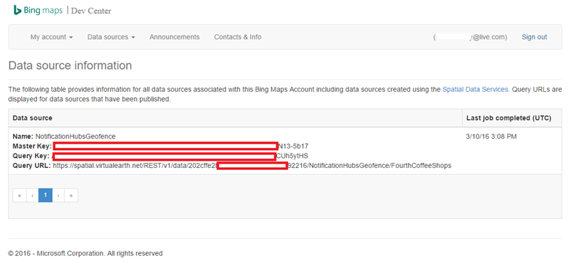
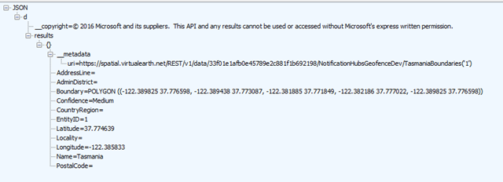
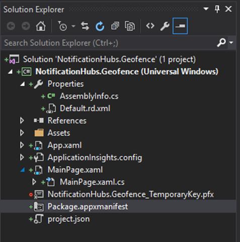
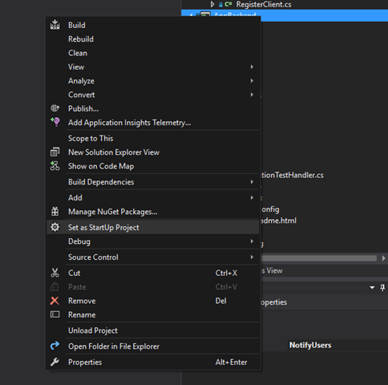
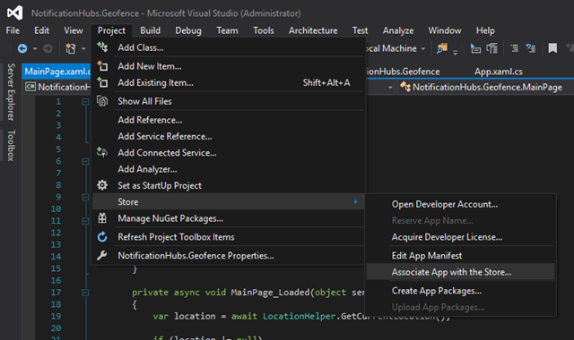

<properties
    pageTitle="Pushmeldingen met geofencing verzenden met Azure Notification Hubs en ruimtelijke Bing-gegevens | Microsoft Azure"
    description="In deze zelfstudie leert u hoe u locatiegebaseerde pushmeldingen kunt verzenden met Azure Notification Hubs en ruimtelijke Bing-gegevens."
    services="notification-hubs"
    documentationCenter="windows"
    keywords="pushmelding,pushmelding"
    authors="dend"
    manager="yuaxu"
    editor="dend"/>

<tags
    ms.service="notification-hubs"
    ms.workload="mobile"
    ms.tgt_pltfrm="mobile-windows-phone"
    ms.devlang="dotnet"
    ms.topic="hero-article"
    ms.date="05/31/2016"
    ms.author="dendeli"/>
    

# Pushmeldingen met geofencing verzenden met Azure Notification Hubs en ruimtelijke Bing-gegevens
 
 > [AZURE.NOTE] U hebt een actief Azure-account nodig om deze zelfstudie te voltooien. Als u geen account hebt, kunt u binnen een paar minuten een account voor de gratis proefversie maken. Zie [Gratis proefversie van Azure](https://azure.microsoft.com/pricing/free-trial/?WT.mc_id=A0E0E5C02) voor meer informatie.

In deze zelfstudie leert u hoe u locatiegebaseerde pushmeldingen kunt verzenden met Azure Notification Hubs en ruimtelijke Bing-gegevens. Deze gegevens worden uit een toepassing in het universele Windows-platform gehaald.

##Vereisten
Ten eerste moet u ervoor zorgen dat u beschikt over alle vereiste software en services:

* [Visual Studio 2015 Update 1](https://www.visualstudio.com/en-us/downloads/download-visual-studio-vs.aspx) of hoger ([Community Edition](https://go.microsoft.com/fwlink/?LinkId=691978&clcid=0x409) kan ook worden gebruikt). 
* Meest recente versie van de [Azure SDK](https://azure.microsoft.com/downloads/). 
* [Bing Maps Dev Center-account](https://www.bingmapsportal.com/) (u kunt gratis een account maken en dit koppelen aan uw Microsoft-account). 

##Aan de slag

U begint met het maken van het project. Open in Visual Studio een nieuw project van het type **Lege app (Universeel Windows)**.

Wanneer het maken van het project is voltooid, beschikt u over de basis voor de app. U gaat nu alles instellen voor de infrastructuur met geofencing. Omdat hiervoor Bing-services worden gebruikt, is er een openbaar REST-API-eindpunt waarmee query’s kunnen worden uitgevoerd op specifieke locaties:

    http://spatial.virtualearth.net/REST/v1/data/
    
U moet de volgende parameters opgeven om hiermee aan de slag te gaan:

* De **gegevensbron-id** en de **gegevensbronnaam**. In de Bing Kaarten-API bevatten gegevensbronnen verschillende gerangschikte metagegevens, zoals locaties en bedrijfsuren. U kunt er hier meer over lezen. 
* **Naam van de entiteit**: de entiteit die u als verwijzingspunt wilt gebruiken voor de melding. 
* **Bing Kaarten-API-sleutel**: dit is de sleutel die u eerder hebt verkregen tijdens het maken van het Bing Dev Center-account.
 
U gaat nu dieper in op de instellingen voor de bovenstaande elementen.

##De gegevensbron instellen

U kunt dit doen in het Bing Kaarten Dev Center. Klik op **Gegevensbronnen** in de bovenste navigatiebalk en selecteer **Gegevensbronnen beheren**.

Als u nog niet eerder met de Bing Kaarten-API hebt gewerkt, zijn er waarschijnlijk geen gegevensbronnen. U kunt een nieuwe gegevensbron maken door op Gegevens uploaden naar een gegevensbron te klikken. Vul alle vereiste velden in:

Wellicht vraagt u zich af wat het gegevensbestand is en wat u moet uploaden? Voor deze test gebruikt u de voorbeeldpipe waarmee een gedeelte van San Francisco dat aan het water ligt, wordt afgebakend:

    Bing Spatial Data Services, 1.0, TestBoundaries
    EntityID(Edm.String,primaryKey)|Name(Edm.String)|Longitude(Edm.Double)|Latitude(Edm.Double)|Boundary(Edm.Geography)
    1|SanFranciscoPier|||POLYGON ((-122.389825 37.776598,-122.389438 37.773087,-122.381885 37.771849,-122.382186 37.777022,-122.389825 37.776598))
    
Het bovenstaande staat voor deze entiteit:

Kopieer de bovenstaande tekenreeks en plak deze in een nieuw bestand. Sla het bestand op als **NotificationHubsGeofence.pipe** en upload het naar het Bing Dev Center.

>[AZURE.NOTE]Mogelijk wordt u gevraagd om een nieuwe sleutel op te geven als **hoofdsleutel**; deze verschilt van de **querysleutel**. Maak een nieuwe sleutel via het dashboard en vernieuw de pagina voor het uploaden van gegevensbronnen.

Wanneer u het gegevensbestand hebt geüpload, moet u de gegevensbron publiceren. 

Ga naar **Gegevensbronnen beheren**, zoals al eerder is gedaan, zoek de gegevensbron in de lijst en klik op **Publiceren** in de kolom **Acties**. Na enige tijd ziet u de gegevensbron op het tabblad **Gepubliceerde gegevensbronnen**:

Als u op **Bewerken** klikt, kunt u in één oogopslag zien welke locaties er zijn geïntroduceerd:

Op dit moment worden in de portal de grenzen van de geofence die is gemaakt, niet weergegeven. U hoeft alleen nog te bevestigen dat de opgegeven locatie zich in de juiste omgeving bevindt.

U hebt nu voldaan aan alle vereisten voor de gegevensbron. Klik voor meer informatie over de aanvraag-URL voor de API-aanroep in het Bing Maps Dev Center op **Gegevensbronnen** en selecteer **Gegevensbroninformatie**.

U zoekt de **Query-URL**. Dit is het eindpunt waarop u query’s kunt uitvoeren om te controleren of het apparaat zich momenteel binnen de grenzen van een locatie bevindt of niet. Als u deze controle wilt uitvoeren, moet u een GET-aanroep uitvoeren voor de query-URL, waarbij u de volgende parameters toevoegt:

    ?spatialFilter=intersects(%27POINT%20LONGITUDE%20LATITUDE)%27)&$format=json&key=QUERY_KEY

Op die manier geeft u een doelpunt op dat van het apparaat moet worden opgehaald. Bing Kaarten voert automatisch de berekeningen uit om te controleren of het apparaat zich binnen de geofence bevindt. Wanneer u de aanvraag hebt uitgevoerd via een browser (of cURL), ontvangt u standaard een JSON-antwoord:

Dit antwoord ontvangt u alleen als het punt zich binnen de opgegeven grenzen bevindt. Als dat niet het geval is, ontvangt u een lege **resultaten**bucket:

##De UWP-toepassing instellen

Nu de gegevensbron gereed is, gaat u aan de slag met de UWP-toepassing die al eerder is geopend.

U moet ten eerste de locatieservices inschakelen voor de toepassing. Dubbelklik hiervoor op het bestand `Package.appxmanifest` in **Solution Explorer**.

Klik op het tabblad pakketeigenschappen dat zojuist is geopend, op **Mogelijkheden** en selecteer **Locatie**:

Als de locatiemogelijkheid is gedeclareerd, maakt u in uw oplossing een nieuwe map met de naam `Core`. Voeg er een nieuw bestand aan toe met de naam `LocationHelper.cs`:

De klasse `LocationHelper` zelf is op dit moment vrij algemeen. U kunt er de locatie van een gebruiker mee ophalen via de systeem-API:

    using System;
    using System.Threading.Tasks;
    using Windows.Devices.Geolocation;

    namespace NotificationHubs.Geofence.Core
    {
        public class LocationHelper
        {
            private static readonly uint AppDesiredAccuracyInMeters = 10;

            public async static Task<Geoposition> GetCurrentLocation()
            {
                var accessStatus = await Geolocator.RequestAccessAsync();
                switch (accessStatus)
                {
                    case GeolocationAccessStatus.Allowed:
                        {
                            Geolocator geolocator = new Geolocator { DesiredAccuracyInMeters = AppDesiredAccuracyInMeters };

                            return await geolocator.GetGeopositionAsync();
                        }
                    default:
                        {
                            return null;
                        }
                }
            }

        }
    }

Zie het officiële [MSDN-document](https://msdn.microsoft.com/library/windows/apps/mt219698.aspx) voor meer informatie over het ophalen van de locatie van een gebruiker in uw UWP-apps.

Als u wilt controleren of het ophalen van de locatie werkt, opent u de codezijde van de hoofdpagina (`MainPage.xaml.cs`). Maak een nieuwe gebeurtenis-handler voor de gebeurtenis `Loaded` in de `MainPage`-constructor:

    public MainPage()
    {
        this.InitializeComponent();
        this.Loaded += MainPage_Loaded;
    }

U implementeert de gebeurtenis-handler als volgt:

    private async void MainPage_Loaded(object sender, RoutedEventArgs e)
    {
        var location = await LocationHelper.GetCurrentLocation();

        if (location != null)
        {
            Debug.WriteLine(string.Concat(location.Coordinate.Longitude,
                " ", location.Coordinate.Latitude));
        }
    }

De handler is gedeclareerd als asynchroon omdat `GetCurrentLocation` afwachtend is en daarom in een asynchrone context moet worden uitgevoerd. Omdat u onder bepaalde omstandigheden een null-locatie krijgt (de locatieservices zijn bijvoorbeeld uitgeschakeld of de toepassing beschikt niet over machtigingen om de locatie te openen), moet u er ook voor zorgen dat dit goed wordt afgehandeld met een null-controle.

Voer de toepassing uit. Controleer of u toegang tot de locatie toestaat:

Wanneer de toepassing is gestart, ziet u de coördinaten in het venster **Uitvoer**:

U weet nu dat de locatie kan worden opgehaald. Nu kunt u de testgebeurtenis-handler voor Geladen verwijderen omdat die verder niet meer wordt gebruikt.

De volgende stap is het vastleggen van locatiewijzigingen. Daarvoor gaat u terug naar de klasse `LocationHelper` en voegt u de gebeurtenis-handler voor `PositionChanged` toe:

    geolocator.PositionChanged += Geolocator_PositionChanged;

Tijdens de implementatie worden de locatiecoördinaten weergegeven in het venster **Uitvoer**:

    private static async void Geolocator_PositionChanged(Geolocator sender, PositionChangedEventArgs args)
    {
        await CoreApplication.MainView.CoreWindow.Dispatcher.RunAsync(CoreDispatcherPriority.Normal, () =>
        {
            Debug.WriteLine(string.Concat(args.Position.Coordinate.Longitude, " ", args.Position.Coordinate.Latitude));
        });
    }

##De back-end instellen

Download het [.NET-back-endvoorbeeld via GitHub](https://github.com/Azure/azure-notificationhubs-samples/tree/master/dotnet/NotifyUsers). Wanneer het downloaden is voltooid, opent u de map `NotifyUsers` en vervolgens het bestand `NotifyUsers.sln`.

Stel het project `AppBackend` in als **StartUp Project** open het.

Het project is al zodanig geconfigureerd dat er pushmeldingen worden verzonden naar doelapparaten. U hoeft dus slechts twee dingen te doen: de juiste verbindingsreeks gebruiken voor de Notification Hub en grensidentificatie toevoegen zodat de melding alleen wordt verzonden wanneer de gebruiker zich binnen de geofence bevindt.

Als u de verbindingsreeks wilt configureren, opent u `Notifications.cs` in de map `Models`. De `NotificationHubClient.CreateClientFromConnectionString`-functie bevat de informatie over de Notification Hub die u ook kunt inzien via de [Azure-portal](https://portal.azure.com) (bekijk de blade **Toegangsbeleid** in **Instellingen**). Sla het bijgewerkte configuratiebestand op.

Er moet nu een model worden gemaakt voor het Bing Kaarten-API-resultaat. Dat kunt u het eenvoudigst doen door met de rechtermuisknop op de map `Models` te klikken. Klik vervolgens op **Toevoegen** > **Klasse**. Noem deze `GeofenceBoundary.cs`. Wanneer u dit hebt gedaan, kopieert u de JSON uit de API-reactie die is besproken in het eerste gedeelte. Ga in Visual Studio naar **Bewerken** > **Plakken speciaal** > **JSON plakken als klassen**. 

Zo zorgt u ervoor dat het object naar behoren wordt gedeserialiseerd. De resulterende klasseset ziet er als volgt uit:

    namespace AppBackend.Models
    {
        public class Rootobject
        {
            public D d { get; set; }
        }

        public class D
        {
            public string __copyright { get; set; }
            public Result[] results { get; set; }
        }

        public class Result
        {
            public __Metadata __metadata { get; set; }
            public string EntityID { get; set; }
            public string Name { get; set; }
            public float Longitude { get; set; }
            public float Latitude { get; set; }
            public string Boundary { get; set; }
            public string Confidence { get; set; }
            public string Locality { get; set; }
            public string AddressLine { get; set; }
            public string AdminDistrict { get; set; }
            public string CountryRegion { get; set; }
            public string PostalCode { get; set; }
        }

        public class __Metadata
        {
            public string uri { get; set; }
        }
    }

Open vervolgens `Controllers` > `NotificationsController.cs`. De POST-aanroep naar het account om de doellengte- en -breedtegraad op te halen, moet worden verbeterd. Daarvoor voegt u twee tekenreeksen toe aan de functiehandtekening: `latitude` en `longitude`.

    public async Task<HttpResponseMessage> Post(string pns, [FromBody]string message, string to_tag, string latitude, string longitude)

Maak een nieuwe klasse in het project met de naam `ApiHelper.cs`. Deze klasse wordt gebruikt om verbinding te maken met Bing om te controleren op grensoverschrijdingen. Implementeer als volgt een `IsPointWithinBounds`-functie:

    public class ApiHelper
    {
        public static readonly string ApiEndpoint = "{YOUR_QUERY_ENDPOINT}?spatialFilter=intersects(%27POINT%20({0}%20{1})%27)&$format=json&key={2}";
        public static readonly string ApiKey = "{YOUR_API_KEY}";

        public static bool IsPointWithinBounds(string longitude,string latitude)
        {
            var json = new WebClient().DownloadString(string.Format(ApiEndpoint, longitude, latitude, ApiKey));
            var result = JsonConvert.DeserializeObject<Rootobject>(json);
            if (result.d.results != null && result.d.results.Count() > 0)
            {
                return true;
            }
            else
            {
                return false;
            }
        }
    }

>[AZURE.NOTE] Zorg ervoor dat u het API-eindpunt vervangt door de query-URL die u eerder hebt verkregen via het Bing Dev Center (dit geldt ook voor de API-sleutel). 

Als er resultaten zijn op basis van de query, bevindt het opgegeven punt zich binnen de grenzen van de geofence. `true` wordt dan geretourneerd. Als er geen resultaten zijn, wordt via Bing een melding weergegeven dat het punt zich buiten het kader bevindt, dus `false` wordt geretourneerd.

Maak in `NotificationsController.cs` een controle aan vóór de switch-instructie.

    if (ApiHelper.IsPointWithinBounds(longitude, latitude))
    {
        switch (pns.ToLower())
        {
            case "wns":
                //// Windows 8.1 / Windows Phone 8.1
                var toast = @"<toast><visual><binding template=""ToastText01""><text id=""1"">" +
                            "From " + user + ": " + message + "</text></binding></visual></toast>";
                outcome = await Notifications.Instance.Hub.SendWindowsNativeNotificationAsync(toast, userTag);

                // Windows 10 specific Action Center support
                toast = @"<toast><visual><binding template=""ToastGeneric""><text id=""1"">" +
                            "From " + user + ": " + message + "</text></binding></visual></toast>";
                outcome = await Notifications.Instance.Hub.SendWindowsNativeNotificationAsync(toast, userTag);

                break;
        }
    }

Daardoor worden er alleen meldingen verzonden wanneer het punt zich binnen de grenzen bevindt.

##Pushmeldingen testen in de UWP-app

Ga terug naar de UWP-app. Hier kunt u nu meldingen testen. Maak in de klasse `LocationHelper` een nieuwe functie (`SendLocationToBackend`):

    public static async Task SendLocationToBackend(string pns, string userTag, string message, string latitude, string longitude)
    {
        var POST_URL = "http://localhost:8741/api/notifications?pns=" +
            pns + "&to_tag=" + userTag + "&latitude=" + latitude + "&longitude=" + longitude;

        using (var httpClient = new HttpClient())
        {
            try
            {
                await httpClient.PostAsync(POST_URL, new StringContent("\"" + message + "\"",
                    System.Text.Encoding.UTF8, "application/json"));
            }
            catch (Exception ex)
            {
                Debug.WriteLine(ex.Message);
            }
        }
    }

>[AZURE.NOTE] Stel voor `POST_URL` de locatie in van de geïmplementeerde webtoepassing die u in het vorige gedeelte hebt gemaakt. U kunt de toepassing nu lokaal uitvoeren. Als u echter een openbare versie wilt implementeren, moet u deze hosten via een externe provider.

Zorg ervoor dat de UWP-app wordt geregistreerd voor pushmeldingen. Klik in Visual Studio op **Project** > **Store** > **App aan de Store koppelen**.

Wanneer u zich hebt aangemeld bij uw ontwikkelaarsaccount, selecteert u een bestaande app of maakt u een nieuwe app. Koppel het pakket daaraan. 

Ga naar het Dev Center en open de app die u zojuist hebt gemaakt. Klik op **Services** > **Pushmeldingen** > **Live Services site**.

Op de site bekijkt u het **toepassingsgeheim** en de **pakket-SID**. U hebt deze allebei nodig in de Azure-portal. Open de Notification Hub, klik op **Instellingen** > **Notification Services** > **Windows (WNS)** en voer de gegevens in de vereiste velden in.

Klik op **Opslaan**.

Klik met de rechtermuisknop op **Verwijzingen** in **Solution Explorer** en kies **NuGet-pakketten beheren**. U moet een verwijzing toevoegen aan de **beheerde Microsoft Azure Service Bus-bibliotheek**. Zoek naar `WindowsAzure.Messaging.Managed` en voeg dit toe aan uw project.

Voor testdoeleinden maakt u de gebeurtenis-handler voor `MainPage_Loaded` opnieuw. Voeg er dit codefragment aan toe:

    var channel = await PushNotificationChannelManager.CreatePushNotificationChannelForApplicationAsync();

    var hub = new NotificationHub("HUB_NAME", "HUB_LISTEN_CONNECTION_STRING");
    var result = await hub.RegisterNativeAsync(channel.Uri);

    // Displays the registration ID so you know it was successful
    if (result.RegistrationId != null)
    {
        Debug.WriteLine("Reg successful.");
    }

Hiermee wordt de app geregistreerd bij de Notification Hub. U bent er nu klaar voor! 

Voeg in `LocationHelper`, in de `Geolocator_PositionChanged`-handler een testcodefragment toe waardoor de locatie geforceerd in de geofence wordt geplaatst:

    await LocationHelper.SendLocationToBackend("wns", "TEST_USER", "TEST", "37.7746", "-122.3858");

Omdat u niet de echte coördinaten doorgeeft (die misschien niet binnen de grenzen liggen op dat moment) en omdat u vooraf gedefinieerde testwaarden gebruikt, wordt tijdens het bijwerken een melding weergegeven:

##Wat nu?

Er zijn een aantal stappen die u naast de bovenstaande stappen mogelijk moet uitvoeren om ervoor te zorgen dat de oplossing klaar is voor productie.

U moet er ten eerste voor zorgen dat de geofences dynamisch zijn. Hiervoor moet u extra bewerkingen uitvoeren met de Bing-API zodat u nieuwe grenzen kunt uploaden in de bestaande gegevensbron. Zie de [Bing Spatial Data Services-API-documentatie](https://msdn.microsoft.com/library/ff701734.aspx) voor meer informatie over dit onderwerp.

Ten tweede is het raadzaam de geofences met [tags](notification-hubs-tags-segment-push-message.md) als doel te definiëren omdat u er zeker van wilt zijn dat er aan de juiste deelnemers wordt geleverd.

In de bovenstaande oplossing wordt een scenario beschreven waarin u mogelijk veel verschillende doelplatforms hebt; daarom hebben we geofencing niet beperkt tot systeemspecifieke mogelijkheden. Los daarvan is het wel zo dat het universele Windows-platform [direct na aanschaf](https://msdn.microsoft.com/windows/uwp/maps-and-location/set-up-a-geofence) mogelijkheden biedt voor het detecteren van geofences.

Zie onze [documentatieportal](https://azure.microsoft.com/documentation/services/notification-hubs/) voor meer informatie over Notification Hubs-mogelijkheden.

<!--HONumber=Sep16_HO3-->

