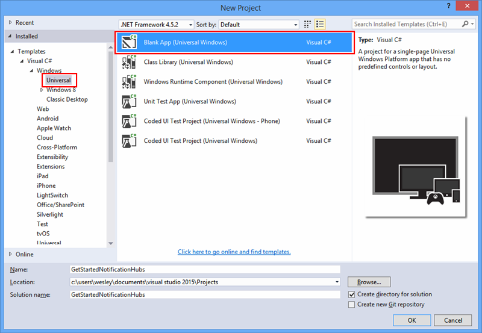
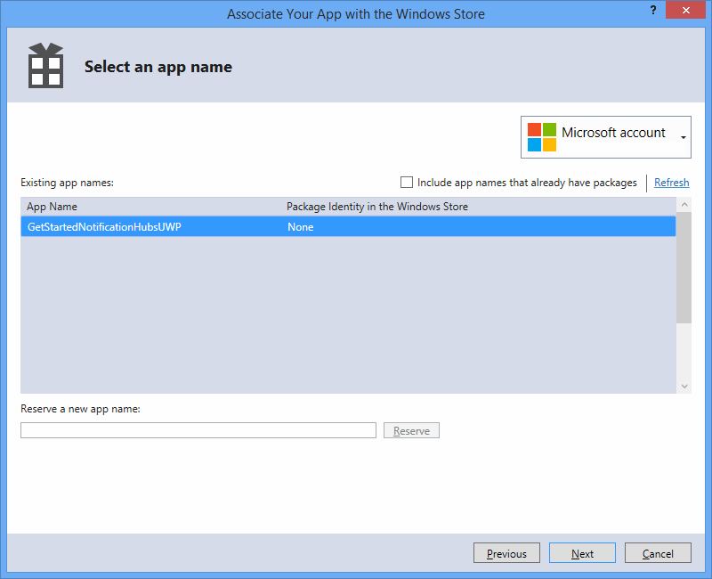
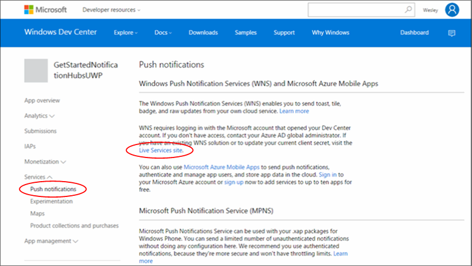

<properties
    pageTitle="Aan de slag met Azure Notification Hubs voor Windows Universal Platform-apps | Microsoft Azure"
    description="In deze zelfstudie leert u hoe u Azure Notification Hubs gebruikt om meldingen naar een Windows Universal Platform-toepassing te pushen."
    services="notification-hubs"
    documentationCenter="windows"
    authors="wesmc7777"
    manager="erikre"
    editor="erikre"/>

<tags
    ms.service="notification-hubs"
    ms.workload="mobile"
    ms.tgt_pltfrm="mobile-windows"
    ms.devlang="dotnet"
    ms.topic="hero-article"
    ms.date="07/21/2016"
    ms.author="wesmc"/>

# Aan de slag met Notification Hubs voor Windows Universal Platform-apps

[AZURE.INCLUDE [notification-hubs-selector-get-started](../../includes/notification-hubs-selector-get-started.md)]

##Overzicht

In deze zelfstudie leert u hoe u Azure Notification Hubs gebruikt om pushmeldingen te verzenden naar een Universal Windows Platform-app (UWP-app).

In deze zelfstudie maakt u een lege Windows Store-app die pushmeldingen ontvangt via Windows Push Notification Service (WNS). Als u klaar bent, kunt u de Notification Hub gebruiken om pushmeldingen uit te zenden naar alle apparaten waarop uw app wordt uitgevoerd.

## Voordat u begint

[AZURE.INCLUDE [notification-hubs-hero-slug](../../includes/notification-hubs-hero-slug.md)]

De volledige code voor deze zelfstudie vindt u [hier](https://github.com/Azure/azure-notificationhubs-samples/tree/master/dotnet/GetStartedWindowsUniversal) op GitHub.

##Vereisten

Voor deze zelfstudie hebt u het volgende nodig:

+ [Microsoft Visual Studio Community 2015](https://www.visualstudio.com/products/visual-studio-community-vs) of later

+ [Universal Windows App Development Tools geïnstalleerd](https://msdn.microsoft.com/windows/uwp/get-started/get-set-up)

+ Een actief Azure-account  Als u geen account hebt, kunt u binnen een paar minuten een account voor de gratis proefversie maken. Zie [Gratis proefversie van Azure](https://azure.microsoft.com/pricing/free-trial/?WT.mc_id=A0E0E5C02&amp;returnurl=http%3A%2F%2Fazure.microsoft.com%2Fen-us%2Fdocumentation%2Farticles%2Fnotification-hubs-windows-store-dotnet-get-started%2F) voor meer informatie.

+ Een actief Windows Store-account

Het voltooien van deze zelfstudie is een vereiste voor alle andere Notification Hubs-zelfstudies voor Windows Universal Platform-apps.

##Uw app registreren voor Windows Store

Als u pushmeldingen naar UWP-apps wilt verzenden, moet u uw app aan de Windows Store koppelen. Vervolgens moet u de Notification Hub configureren voor integratie met WNS.

1. Als u uw app nog niet hebt geregistreerd, gaat u naar het [Windows-ontwikkelaarscentrum](https://dev.windows.com/overview), meldt u zich aan met uw Microsoft-account en klikt u vervolgens op **Een nieuwe app maken**.

2. Typ een naam voor uw app en klik op **App-naam reserveren**.

    

    Hiermee maakt u een nieuwe Windows Store-registratie voor uw app.

3. Maak in Visual Studio een nieuw project voor Visual C# Store-apps met de sjabloon **Blank App** (Lege app) en klik op **OK**.

    

4. Accepteer de standaardwaarden voor het doel en de minimale platformversies.

5. Klik in Solution Explorer met de rechtermuisknop op het Windows Store-app-project, klik op **Store** en klik vervolgens op **App aan de Store koppelen**.

    

    Hierop wordt de wizard **Uw app koppelen aan Windows Store** weergegeven.

6. Klik in de wizard op **Aanmelden** en meldt u vervolgens aan met uw Microsoft-account.

7. Klik op de app die u in stap 2 hebt geregistreerd, klik op **Volgende** en klik vervolgens op **Koppelen**.

    

    Hierdoor worden de vereiste registratiegegevens voor Windows Store toegevoegd aan het toepassingsmanifest.

8. De pagina [Windows-ontwikkelaarscentrum](http://go.microsoft.com/fwlink/p/?LinkID=266582) wordt opnieuw weergegeven. Klik voor uw nieuwe app op **Services**, klik op **Pushmeldingen** en klik vervolgens op **Live Services-site** onder **Windows Push Notification Services (WNS) en Microsoft Azure Mobile Apps**.

    

9. Onthoud het wachtwoord voor het **Toepassingsgeheim** op de registratiepagina voor uw app en de **Beveiligings-id (SID) pakket** die zich in de platforminstellingen van de **Windows Store** bevindt.

    

    > [AZURE.WARNING]
    Het toepassingsgeheim en de pakket-SID zijn belangrijke beveiligingsreferenties. Deel deze waarden met niemand en distribueer ze niet met uw app.

##Uw Notification Hub configureren

[AZURE.INCLUDE [notification-hubs-portal-create-new-hub](../../includes/notification-hubs-portal-create-new-hub.md)]

<ol start="6">
<li>
Selecteer de optie <b>Meldingsservices</b> en de optie <b>Windows (WNS)</b>. Voer vervolgens het wachtwoord voor het <b>Toepassingsgeheim</b> in het veld <b>Beveiligingssleutel</b> in. Voer de waarde voor uw <b>Pakket-SID</b> in die u in het vorige gedeelte van WNS hebt gekregen en klik op <b>Opslaan</b>.

</li>
</ol>

&emsp;&emsp;

De Notification Hub is nu geconfigureerd om te werken met WNS en u hebt de verbindingsreeksen om uw app te registreren en meldingen te verzenden.

##Uw app verbinden met de Notification Hub

1. Klik met de rechtermuisknop op de oplossing in Visual Studio en klik vervolgens op **NuGet-pakketten beheren**.

    Hierop wordt het dialoogvenster **NuGet-pakketten beheren** weergegeven.

2. Zoek `WindowsAzure.Messaging.Managed` en klik op **Installeren**. Accepteer vervolgens de gebruiksvoorwaarden.

    ![][20]

    Hiermee wordt een verwijzing gedownload, geïnstalleerd en toegevoegd aan de Azure Messaging-bibliotheek voor Windows met het <a href="http://nuget.org/packages/WindowsAzure.Messaging.Managed/">WindowsAzure.Messaging.Managed NuGet-pakket</a>.

3. Open het projectbestand App.xaml.cs en voeg de volgende `using`-instructies toe. 

        using Windows.Networking.PushNotifications;
        using Microsoft.WindowsAzure.Messaging;
        using Windows.UI.Popups;

4. Voeg in App.xaml.cs ook de volgende **InitNotificationsAsync**-methodedefinitie toe aan de klasse **App**:

        private async void InitNotificationsAsync()
        {
            var channel = await PushNotificationChannelManager.CreatePushNotificationChannelForApplicationAsync();

            var hub = new NotificationHub("< your hub name>", "<Your DefaultListenSharedAccessSignature connection string>");
            var result = await hub.RegisterNativeAsync(channel.Uri);

            // Displays the registration ID so you know it was successful
            if (result.RegistrationId != null)
            {
                var dialog = new MessageDialog("Registration successful: " + result.RegistrationId);
                dialog.Commands.Add(new UICommand("OK"));
                await dialog.ShowAsync();
            }

        }

    Met deze code wordt de kanaal-URI voor de app opgehaald uit WNS en wordt vervolgens die kanaal-URI voor uw Notification Hub geregistreerd.

    >[AZURE.NOTE] Vervang de tijdelijke aanduiding voor uw hubnaam door de naam van de Notification Hub die wordt weergegeven in de Azure-portal. Vervang ook de tijdelijke plaatsaanduiding voor de verbindingstekenreeks door de **DefaultListenSharedAccessSignature**-verbindingstekenreeks die u in een eerder gedeelte hebt gekregen op de pagina **Toegangsbeleid** van uw Notification Hub.

5. Aan de bovenkant van de gebeurtenis-handler **OnLaunched** in App.xaml.cs voegt u de volgende aanroep toe aan de nieuwe **InitNotificationsAsync**-methode:

        InitNotificationsAsync();

    Hiermee wordt gegarandeerd dat de kanaal-URI in uw Notification Hub wordt geregistreerd telkens wanneer de toepassing wordt gestart.

6. Druk op de toets **F5** om de app uit te voeren. Er wordt een pop-upvenster met de registratiesleutel weergegeven.

    ![][19]

Uw app is nu gereed om pop-upmeldingen te ontvangen.

##Meldingen verzenden 

U kunt de ontvangst van meldingen in uw app snel testen door in de [Azure-portal](https://portal.azure.com/) meldingen te verzenden met behulp van de knop **Test Send** (Verzenden testen) op de Notification Hub, zoals in het volgende scherm wordt weergegeven.

Pushmeldingen worden gewoonlijk in een back-endservice zoals Mobile Services of ASP.NET verzonden met een compatibele bibliotheek. U kunt de REST API ook direct gebruiken om meldingsberichten te verzenden als er geen bibliotheek beschikbaar is voor uw back-end. 

In deze zelfstudie houden we het eenvoudig en wordt alleen gedemonstreerd hoe u uw clientapp test door meldingen te verzenden met de .NET SDK voor Notification Hubs in een consoletoepassing in plaats van een back-endservice. U kunt het beste de zelfstudie [Notification Hubs gebruiken om pushmeldingen naar gebruikers te verzenden] doornemen voor informatie over het verzenden van meldingen vanuit een ASP.NET-back-end. Voor het verzenden van meldingen kunt u echter de volgende methoden gebruiken:

* **REST-interface**: u kunt meldingen op elk back-endplatform ondersteunen met de [REST-interface](http://msdn.microsoft.com/library/windowsazure/dn223264.aspx).

* **Microsoft Azure Notification Hubs .NET SDK**: in NuGet Package Manager voor Visual Studio voert u [Install-Package Microsoft.Azure.NotificationHubs](https://www.nuget.org/packages/Microsoft.Azure.NotificationHubs/) uit.

* **Node.js**: [Notification Hubs gebruiken vanuit Node.js](notification-hubs-nodejs-push-notification-tutorial.md).

* **Azure Mobile Apps**: zie [Pushmeldingen toevoegen voor mobiele apps](../app-service-mobile/app-service-mobile-windows-store-dotnet-get-started-push.md) voor een voorbeeld van hoe u meldingen verzendt vanuit een Azure Mobile App die is geïntegreerd met Notification Hubs.

* **Java/PHP**: zie 'Notification Hubs gebruiken vanuit Java/PHP' voor een voorbeeld van hoe u meldingen verzendt met de REST API's ([Java](notification-hubs-java-push-notification-tutorial.md) | [PHP](notification-hubs-php-push-notification-tutorial.md)).

## (Optioneel) Meldingen verzenden vanuit een console-app

Als u meldingen wilt verzenden met een .NET-consoletoepassing, voert u de volgende stappen uit. 

1. Klik met de rechtermuisknop op de oplossing, selecteer **Toevoegen** en **Nieuw project**. Klik vervolgens onder **Visual C#** op **Windows** en **Consoletoepassing** en klik op **OK**.

    ![][13]

    Hiermee voegt u een nieuwe Visual C#-consoletoepassing toe aan de oplossing. U kunt dit ook in een afzonderlijke oplossing doen.

2. Klik in Visual Studio achtereenvolgens op **Extra**, **NuGet Package Manager** en **Package Manager-console**.

    Hiermee wordt de Package Manager-console in Visual Studio weergegeven.

3. Stel in het venster Package Manager-console het **standaardproject** in op uw nieuwe consoletoepassingsproject en voer vervolgens in het consolevenster de volgende opdracht uit:

        Install-Package Microsoft.Azure.NotificationHubs

    Hiermee wordt een verwijzing toegevoegd aan de Azure Notification Hubs SDK met het <a href="http://www.nuget.org/packages/Microsoft.Azure.NotificationHubs/">Microsoft.Azure.Notification Hubs NuGet-pakket</a>.

    

4. Open het bestand Program.cs en voeg de volgende `using`-instructie toe:

        using Microsoft.Azure.NotificationHubs;

5. Voeg in de klasse **Program** de volgende methode toe:

        private static async void SendNotificationAsync()
        {
            NotificationHubClient hub = NotificationHubClient
                .CreateClientFromConnectionString("<connection string with full access>", "<hub name>");
            var toast = @"<toast><visual><binding template=""ToastText01""><text id=""1"">Hello from a .NET App!</text></binding></visual></toast>";
            await hub.SendWindowsNativeNotificationAsync(toast);
        }

    Vervang de tijdelijke aanduiding voor uw hubnaam door de naam van de Notification Hub zoals die wordt weergegeven in de Azure-portal. Vervang ook de verbindingstekenreeks door de **DefaultFullSharedAccessSignature**-verbindingstekenreeks die u in het gedeelte genaamd 'Configure your notification hub' (Uw Notification Hub configureren) hebt gekregen van de pagina **Access Policies** (Toegangsbeleid) van uw Notification Hub.

    >[AZURE.NOTE]Zorg ervoor dat u de verbindingsreeks met het toegangsrecht **Full** (Volledig) gebruikt, dus niet **Listen** (Luisteren). Met een verbindingsreeks met het toegangsrecht Luisteren kunnen geen meldingen worden verzonden.

6. Voeg de volgende regels in de **Main**-methode toe:

         SendNotificationAsync();
         Console.ReadLine();

7. Klik met de rechtermuisknop op het consoletoepassingsproject in Visual Studio en klik op **Instellen als opstartproject** om het project als opstartproject in te stellen. Druk vervolgens op de toets **F5** om de toepassing uit te voeren.

    ![][14]

    U ontvangt een pop-upmelding op alle geregistreerde apparaten. Als u op de banner van de pop-up klikt of tikt, wordt de app geladen.

U vindt alle ondersteunde nettoladingen in de onderwerpen [pop-upcatalogus], [tegelcatalogus] en [badge-overzicht] op MSDN.

##Volgende stappen

In dit eenvoudige voorbeeld hebt u meldingen uitgezonden naar al uw Windows-apparaten via de portal of een console-app. U kunt het beste de zelfstudie [Notification Hubs gebruiken om pushmeldingen naar gebruikers te verzenden] doornemen. Hierin ziet u hoe u meldingen van een ASP.NET-back-end verzendt met tags voor specifieke gebruikers.

Zie [Notification Hubs gebruiken om belangrijk nieuws te verzenden] als u gebruikers wilt indelen op belangengroepen. 

Zie [Notification Hubs Guidance](notification-hubs-push-notification-overview.md) (Richtlijnen voor Notification Hubs) voor meer algemene informatie over Notification Hubs.

<!-- Images. -->
[13]: ./media/notification-hubs-windows-store-dotnet-get-started/notification-hub-create-console-app.png
[14]: ./media/notification-hubs-windows-store-dotnet-get-started/notification-hub-windows-toast.png
[19]: ./media/notification-hubs-windows-store-dotnet-get-started/notification-hub-windows-reg.png
[20]: ./media/notification-hubs-windows-store-dotnet-get-started/notification-hub-windows-universal-app-install-package.png

<!-- URLs. -->

[Notification Hubs gebruiken om pushmeldingen naar gebruikers te verzenden]: notification-hubs-aspnet-backend-windows-dotnet-notify-users.md
[Notification Hubs gebruiken om belangrijk nieuws te verzenden]: notification-hubs-windows-store-dotnet-send-breaking-news.md

[pop-upcatalogus]: http://msdn.microsoft.com/library/windows/apps/hh761494.aspx
[tegelcatalogus]: http://msdn.microsoft.com/library/windows/apps/hh761491.aspx
[badge-overzicht]: http://msdn.microsoft.com/library/windows/apps/hh779719.aspx

<!--HONumber=Sep16_HO3-->

