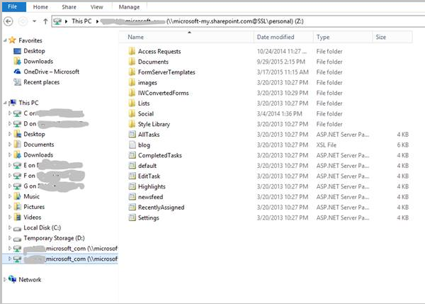

<properties
   pageTitle="OneDrive voor Bedrijven integreren met Azure RemoteApp | Microsoft Azure"
   description="Lees hoe u OneDrive voor Bedrijven integreert met Azure RemoteApp."
   services="remoteapp"
   documentationCenter=""
   authors="pavithir"
   manager="mbaldwin"
   editor=""/>

<tags
   ms.service="remoteapp"
   ms.devlang="na"
   ms.topic="hero-article"
   ms.tgt_pltfrm="na"
   ms.workload="compute"
   ms.date="03/31/2016"
   ms.author="elizapo"/>

# OneDrive voor Bedrijven integreren met Azure RemoteApp

U kunt OneDrive voor Bedrijven met Azure RemoteApp gebruiken als een bestandsopslagplaats. OneDrive voor Bedrijven is een uitstekende manier om bestanden gesynchroniseerd te houden op al uw apparaten en werkruimten. Een gebruiker kan zijn bestanden voor Azure RemoteApp-apps opslaan op zijn [gebruikersprofielschijf](remoteapp-upd.md) (UDP), maar deze bestanden zijn alleen toegankelijk via Azure RemoteApp. Met OneDrive voor Bedrijven daarentegen kan een gebruiker zijn of haar bestanden altijd en overal openen, zonder Azure RemoteApp. Dit artikel gaat over de ondersteunde versies van OneDrive voor Bedrijven en de verschillende manieren waarop beheerders OneDrive voor Bedrijven kunnen instellen voor Azure RemoteApp.

## Worden alle versies van OneDrive ondersteund?

Er zijn twee versies van OneDrive: OneDrive en OneDrive voor Bedrijven. Alleen OneDrive voor Bedrijven wordt ondersteund op Azure RemoteApp. De persoonlijke OneDrive werkt wel, maar wordt niet officieel ondersteund. Bovendien wordt alleen de meest recente versie van OneDrive voor Bedrijven, ook wel de Next Gen Sync-client genoemd, ondersteund door Azure RemoteApp (en RDSH-/Citrix-/Terminal-servers).

>[AZURE.NOTE]  OneDrive (voor consumenten/persoonlijke editie) wordt niet ondersteund door Azure RemoteApp. Bovendien worden niet alle versies van OneDrive voor Bedrijven ondersteund omdat ze nog niet zijn gecertificeerd voor Windows Server. Hoewel zowel de nieuwe client (Next Gen Sync-client) als de oudere versies van Groove goed lijken te werken in Azure RemoteApp, zoals wordt beschreven in [https://support.microsoft.com/en-us/kb/2965687](https://support.microsoft.com/kb/2965687), beschikken de oudere synchronisatie-engines niet over volledige functionaliteit op Citrix-/Terminal Servers (Windows Server).

## Wat zijn de verschillende installatieopties voor OneDrive voor Bedrijven?

- **Traditionele installatie van de synchronisatie-engine van OneDrive voor Bedrijven**: deze optie wordt op dit moment niet ondersteund in implementaties van Azure RemoteApp, RDSH en Citrix.
- **OneDrive voor Bedrijven 'virtualiseren'/van de lokale fat client omleiden naar de sessie**: Als u OneDrive synchroniseert met een map op het clientapparaat, onder een station, kunt u ervoor kiezen om dat station [om te leiden](remoteapp-redirection.md) naar Azure RemoteApp. Dat station moet hetzelfde zijn op alle clients van uw gebruikers en uw gebruikers moeten OneDrive gesynchroniseerd hebben met een map onder dat station. Als ze RemoteApp benaderen vanaf een andere client, is het mogelijk dat deze bestanden niet beschikbaar zijn (tijdelijke oplossing: bestanden kunnen altijd worden geopend met de onlineversie van OneDrive). 
- **OneDrive voor Bedrijven voorstellen als een station in de Azure RemoteApp-omgeving zonder de bestanden op te slaan in de cache/te synchroniseren**: (wijs de HTTP-URL van OneDrive voor Bedrijven toe aan een station op de virtuele machine) Het toewijzen van OneDrive voor Bedrijven aan het netwerkstation in de RDSH-omgeving wordt ondersteund. Scenario's waarin dit kan worden gebruikt: 
    - Als thin clients (geen lokale opslag) worden gebruikt om toegang te krijgen tot Azure RemoteApp: Toepassing vereist dat bestanden worden opgeslagen in OneDrive voor Bedrijven, maar ze moeten er lokaal 'uitzien' en de beheerder wil de bestanden niet synchroniseren met een virtuele machine.
    - Wanneer er veel grote bestanden in OneDrive voor Bedrijven zijn geselecteerd voor synchronisatie. Gezien de workload van de synchronisatie is het mogelijk dat niet alle bestanden zijn gesynchroniseerd wanneer de gebruiker ze wil gebruiken. En als de bestanden in totaal groter zijn dan 50 GB, kunnen ze niet worden opgeslagen in de UPD.

In bovenstaande scenario's kunnen beheerders kiezen voor de opties van het toewijzen van een station op de virtuele machine aan de HTTP-URL van OneDrive voor Bedrijven van de gebruiker. Enkele opties om deze functionaliteit in te schakelen:

- Hebben binaire Office-bestanden in de installatiekopie en activeren de synchronisatie-engine van OneDrive voor Bedrijven niet.
- Hebben GEEN binaire Office-bestanden in de installatiekopie. In dit geval wordt een vereiste gesteld: Bureaubladervaring-pakket. Met name de WebClient-service (ook wel WebDAV genoemd) moet worden geïnstalleerd als onderdeel van het Bureaubladervaring-pakket. 

### Bureaubladervaring-pakket installeren in Windows Server 2012 R2
Ga als volgt te werk om het Bureaubladervaring-pakket te installeren: 

1. Klik in Serverbeheer op **Beheren -> Rollen en functies toevoegen >**.
2. Klik op **Functies** en vervolgens op **Gebruikersinterfaces en infrastructuur -> Bureaubladervaring**.

### Een station toewijzen aan de URL van OneDrive voor Bedrijven

Volg de instructies in het ondersteuningsartikel: [https://support.microsoft.com/kb/2616712](https://support.microsoft.com/kb/2616712)
 
Een belangrijke stap in de installatie is dat u ervoor zorgt dat **Aangemeld blijven** is ingeschakeld.

De instructies in grote lijnen zijn als volgt:

1.  Zoek de URL voor de schijf. De URL die wordt gebruikt voor de stationstoewijzing, is de URL die u krijgt wanneer u in OneDrive voor Bedrijven Online naar uw basismap bladert. Bijvoorbeeld:
 
    https://microsoft-mijn.sharepoint.com/personal/alias_microsoft_com/_layouts/15/onedrive.aspx?AjaxDelta=1&isStartPlt1=iets
2.  Open de URL in een browser in de RemoteApp-sessie en schakel **Aangemeld blijven** in voordat u zich aanmeldt bij de URL voor uw account.
3.  Open Windows Verkenner en wijs een station toe aan de bovenstaande URL. Als de URL niet kan worden opgelost, kan de kortere vorm worden gebruikt:
    
    https://microsoft-mijn.sharepoint.com/personal/alias_microsoft_com. 

    Het toegewezen station wordt onmiddellijk gemaakt. Het ziet er als volgt uit:
 
    

<!--HONumber=Jun16_HO2-->

