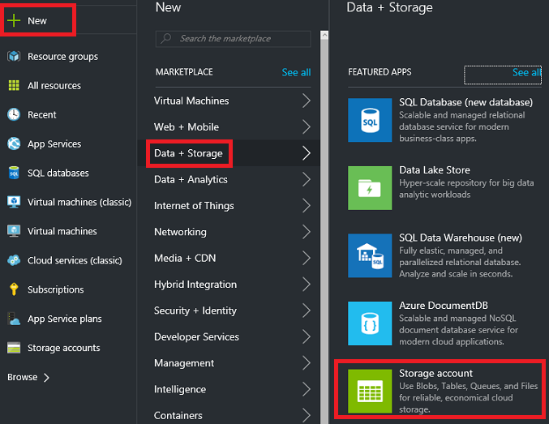
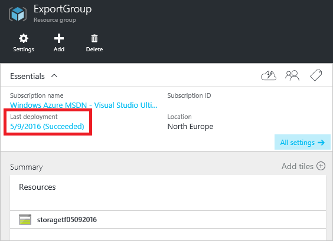
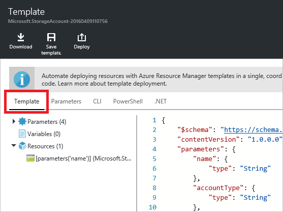
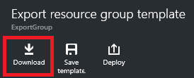

<properties
    pageTitle="Een Azure Resource Manager-sjabloon exporteren | Microsoft Azure"
    description="Gebruik Azure Resource Manager om een sjabloon uit een bestaande resourcegroep te exporteren."
    services="azure-resource-manager"
    documentationCenter=""
    authors="tfitzmac"
    manager="timlt"
    editor="tysonn"/>

<tags
    ms.service="azure-resource-manager"
    ms.workload="multiple"
    ms.tgt_pltfrm="na"
    ms.devlang="na"
    ms.topic="get-started-article"
    ms.date="05/10/2016"
    ms.author="tomfitz"/>

# Een Azure Resource Manager-sjabloon uit bestaande resources exporteren

Het kan een hele uitdaging zijn om inzicht te krijgen in het maken van Azure Resource Manager-sjablonen. Gelukkig helpt Resource Manager u met die taak. U kunt namelijk een sjabloon exporteren uit bestaande resources in uw abonnement. Deze gegenereerde sjabloon kunt u vervolgens gebruiken om meer te weten te komen over de sjabloonsyntaxis of om desgewenst het hergebruik van uw oplossing te automatiseren.

In deze zelfstudie meldt u zich aan bij de Azure Portal, maakt u een opslagaccount en exporteert u de sjabloon voor dat opslagaccount. U voegt een virtueel netwerk toe om de resourcegroep te wijzigen. Ten slotte exporteert u een nieuwe sjabloon die de huidige status weergeeft. Hoewel dit artikel gericht is op een vereenvoudigde infrastructuur, kunt u deze zelfde stappen gebruiken om een sjabloon voor een gecompliceerdere oplossing te exporteren.

## Een opslagaccount maken

1. Selecteer in de [Azure Portal](https://portal.azure.com) **Nieuw** > **Gegevens en opslag** > **Opslagaccount**.

      

2. Maak een opslagaccount met de naam **opslag**, uw initialen en de datum. De naam van het opslagaccount moet uniek zijn in Azure. Als u in eerste instantie een naam opgeeft die al wordt gebruikt, probeert u een variant. Gebruik voor de resourcegroep **ExportGroup**. Voor de overige eigenschappen kunt u de standaardwaarden gebruiken. Selecteer **Maken**.

      

Nadat de implementatie is voltooid, bevat uw abonnement het opslagaccount.

## De sjabloon exporteren voor implementatie

1. Ga naar de resourcegroepblade van uw nieuwe resourcegroep. U ziet dat het resultaat van de laatste implementatie wordt vermeld. Selecteer deze koppeling.

      

2. U ziet nu de geschiedenis van de implementaties voor de groep. In uw geval wordt er waarschijnlijk slechts één implementatie vermeld. Selecteer deze implementatie.

     

3. Er wordt een samenvatting van de implementatie weergegeven. Deze samenvatting bevat de status van de implementatie en bewerkingen, en de waarden die u hebt opgegeven voor de parameters. Selecteer **Sjabloon weergeven** om de sjabloon te bekijken die voor de implementatie is gebruikt.

     

4. Resource Manager haalt de volgende vijf bestanden voor u op:

   - De sjabloon die de infrastructuur voor uw oplossing definieert. Toen u het opslagaccount via de portal maakte, heeft Resource Manager een sjabloon gebruikt om het te implementeren. De sjabloon is opgeslagen voor toekomstig gebruik.

   - Een parameterbestand dat u kunt gebruiken om tijdens de implementatie waarden door te geven. Dit bestand bevat de waarden die u hebt opgegeven tijdens de eerste implementatie. Deze waarden kunt u echter wijzigen wanneer u de sjabloon opnieuw implementeert.

   - Een Azure PowerShell-scriptbestand dat u kunt gebruiken om de sjabloon te implementeren.

   - Een Azure CLI-scriptbestand dat u kunt gebruiken om de sjabloon te implementeren.

   - Een .NET-klasse die u kunt gebruiken om de sjabloon te implementeren.

     De bestanden zijn beschikbaar via de koppelingen in de blade. De sjabloon is standaard geselecteerd.

       

     Laten we wat aandachtiger naar de sjabloon kijken. De sjabloon moet er ongeveer zo uitzien:

        {      "$schema": "https://schema.management.azure.com/schemas/2015-01-01/deploymentTemplate.json#",      "contentVersion": "1.0.0.0",      "parameters": {        "name": {          "type": "String"        },        "accountType": {          "type": "String"        },        "location": {          "type": "String"        },        "encryptionEnabled": {          "defaultValue": false,          "type": "Bool"        }      },      "resources": [        {          "type": "Microsoft.Storage/storageAccounts",          "sku": {            "name": "[parameters('accountType')]"          },          "kind": "Storage",          "name": "[parameters('name')]",          "apiVersion": "2016-01-01",          "location": "[parameters('location')]",          "properties": {            "encryption": {              "services": {                "blob": {                  "enabled": "[parameters('encryptionEnabled')]"                }              },              "keySource": "Microsoft.Storage"            }          }        }      ]    }

     U ziet dat de sjabloon parameters definieert voor de naam, het type en de locatie van het opslagaccount. Een parameter geeft ook aan of versleuteling is ingeschakeld. De standaardwaarde is **onwaar**. Binnen de sectie **resources** ziet u de definitie voor het te implementeren opslagaccount.

Vierkante haken bevatten een expressie die tijdens de implementatie wordt geëvalueerd. De expressies tussen haakjes in de sjabloon worden gebruikt om tijdens de implementatie de parameterwaarden op te halen. U kunt nog veel meer expressies gebruiken. Verderop in dit artikel ziet u voorbeelden van andere expressies. Zie [Azure Resource Manager-sjabloonfuncties](resource-group-template-functions.md) voor de volledige lijst.

Zie [Azure Resource Manager-sjablonen samenstellen](resource-group-authoring-templates.md) voor meer informatie over de structuur van een sjabloon.

## Een virtueel netwerk toevoegen

De sjabloon die u in de vorige sectie hebt gedownload, weerspiegelde de infrastructuur voor die oorspronkelijke implementatie, maar er wordt geen rekening gehouden met eventuele wijzigingen na de implementatie.
Ter illustratie van dit probleem gaan we de resourcegroep wijzigen door via de portal een virtueel netwerk toe te voegen.

1. Selecteer in de resourcegroepblade **Toevoegen**. Selecteer vervolgens **Virtueel netwerk** in de beschikbare resources.

2. Geef het virtuele netwerk de naam **VNET** en gebruik de standaardwaarden voor de overige eigenschappen. Selecteer **Maken**.

      

3. Nadat het virtuele netwerk in de resourcegroep is geïmplementeerd, bekijkt u de geschiedenis van de implementatie opnieuw. U ziet nu twee implementaties. Selecteer de meest recente implementatie.

      

4. Bekijk de sjabloon voor deze implementatie. U ziet dat deze alleen de wijzigingen definieert die u hebt aangebracht om het virtuele netwerk toe te voegen.

Het is doorgaans een goed idee om te werken met een sjabloon die de gehele infrastructuur voor uw oplossing in één bewerking implementeert. Zo voorkomt u dat u rekening moet houden met allerlei verschillende sjablonen die moeten worden geïmplementeerd.

## De sjabloon voor de resourcegroep exporteren

Hoewel elke implementatie alleen de wijzigingen toont die u aan de resourcegroep hebt aangebracht, kunt u op elk gewenst moment een sjabloon exporteren om de kenmerken van uw hele resourcegroep weer te geven.  

1. Selecteer **Sjabloon exporteren** om de sjabloon voor een resourcegroep te bekijken.

      

2. Weer ziet u de vijf bestanden die u kunt gebruiken om de oplossing opnieuw te implementeren, maar deze keer is de sjabloon enigszins anders. Deze sjabloon heeft slechts twee parameters: één voor de opslagaccountnaam en één voor de virtuele-netwerknaam.

        "parameters": {
          "virtualNetworks_VNET_name": {
            "defaultValue": "VNET",
            "type": "String"
          },
          "storageAccounts_storagetf05092016_name": {
            "defaultValue": "storagetf05092016",
            "type": "String"
          }
        },

     Resource Manager heeft de sjablonen die tijdens de implementatie zijn gebruikt, niet opgehaald. In plaats daarvan heeft Resource Manager een nieuwe sjabloon gegenereerd die is gebaseerd op de huidige configuratie van de resources. Resource Manager kent de waarden niet die u als parameters wilt doorgeven. Daarom worden de meeste waarden vastgelegd op basis van de waarden in de resourcegroep. De locatie- en replicatiewaarde voor het opslagaccount worden bijvoorbeeld ingesteld op:

        "location": "northeurope",
        "tags": {},
        "properties": {
            "accountType": "Standard_RAGRS"
        },

3. Download de sjabloon zodat u er lokaal mee kunt werken.

      

4. Zoek het ZIP-bestand op dat u hebt gedownload en pak de inhoud uit. U kunt deze gedownloade sjabloon gebruiken om uw infrastructuur opnieuw te implementeren.

## Volgende stappen

Gefeliciteerd! U hebt geleerd hoe u een sjabloon kunt exporteren uit resources die u in de portal hebt gemaakt.

- In het tweede gedeelte van deze zelfstudie past u de sjabloon aan die u zojuist hebt gedownload, door meer parameters toe te voegen en de sjabloon opnieuw te implementeren via een script. Zie [Geëxporteerde sjabloon aanpassen en opnieuw implementeren](resource-manager-customize-template.md).
- Zie [Azure PowerShell gebruiken met Azure Resource Manager](powershell-azure-resource-manager.md) voor het exporteren van een sjabloon via PowerShell.
- Zie [De Azure CLI voor Mac, Linux en Windows gebruiken met Azure Resource Manager](xplat-cli-azure-resource-manager.md) voor het exporteren van een sjabloon via Azure CLI.

<!--HONumber=Jun16_HO2-->

