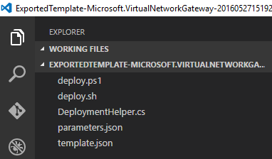
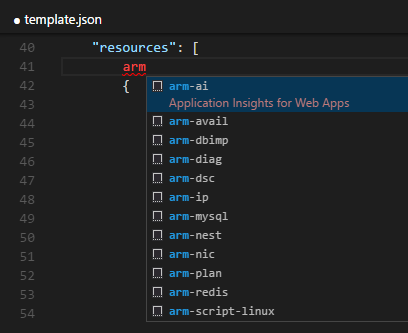

<properties
   pageTitle="VS Code gebruiken met Resource Manager-sjablonen | Microsoft Azure"
   description="Laat zien hoe u Visual Studio Code instelt voor het maken van Azure Resource Manager-sjablonen."
   services="azure-resource-manager"
   documentationCenter="na"
   authors="cmatskas"
   manager="timlt"
   editor="tysonn"/>

<tags
   ms.service="azure-resource-manager"
   ms.devlang="na"
   ms.topic="get-started-article"
   ms.tgt_pltfrm="na"
   ms.workload="na"
   ms.date="09/26/2016"
   ms.author="chmatsk;tomfitz"/>

# Werken met Azure Resource Manager-sjablonen in Visual Studio Code

Azure Resource Manager-sjablonen zijn JSON-bestanden die een resource en de bijbehorende afhankelijkheden beschrijven. Deze bestanden kunnen soms groot en complex zijn, dus hulpprogrammaondersteuning is belangrijk. Visual Studio Code is een nieuwe, lichte, open-source, platformoverschrijdende code-editor. Het programma ondersteunt het maken en bewerken van Resource Manager-sjablonen via een [nieuwe extensie](https://marketplace.visualstudio.com/items?itemName=msazurermtools.azurerm-vscode-tools). VS Code kan overal worden uitgevoerd en vereist geen toegang tot internet tenzij u ook uw Resource Manager-sjablonen wilt implementeren.

Als u VS Code nog niet hebt, kunt u het installeren via [https://code.visualstudio.com/](https://code.visualstudio.com/).

## De Resource Manager-extensie installeren

Als u met de JSON-sjablonen in VS Code wilt werken, moet u een extensie installeren. Met de volgende stappen downloadt en installeert u de taalondersteuning voor Resource Manager JSON-sjablonen:

1. VS Code starten 
2. Snel openen starten (Ctrl+P) 
3. Voer de volgende opdracht uit: 

        ext install azurerm-vscode-tools

4. Start VS Code opnieuw op wanneer u daarom wordt gevraagd om de extensie in te schakelen. 

 Klaar!

## Resource Manager-fragmenten instellen

In de vorige stappen is de hulpprogrammaondersteuning geïnstalleerd, maar nu moeten we VS Code configureren voor het gebruik van JSON-sjabloonfragmenten.

1. Kopieer de inhoud van het bestand uit de opslagplaats [azure-xplat-arm-tooling](https://raw.githubusercontent.com/Azure/azure-xplat-arm-tooling/master/VSCode/armsnippets.json) naar het klembord.
2. VS Code starten 
3. In VS Code kunt u het bestand met JSON-fragmenten openen door te navigeren naar **File** -> **Preferences** -> **User Snippets** -> **JSON**, of door op **F1** te drukken en **preferences** te typen totdat u **Preferences: Snippets** kunt selecteren.

    

    Selecteer in de opties **JSON**.

    

4. Plak de inhoud van het bestand bij stap 1 in het bestand met gebruikersfragmenten voor de laatste '}' 
5. Zorg ervoor dat de JSON correct is en geen golvende lijnen bevat. 
6. Sla het bestand met gebruikersfragmenten op en sluit het.

Dat is alles wat u nodig hebt om te starten met het gebruik van de Resource Manager-fragmenten. Nu gaan we deze installatie testen.

## Werken met de sjabloon in VS Code

De makkelijkste manier om aan de slag de gaan met een sjabloon is een Snel starten-sjabloon te pakken. Deze zijn beschikbaar op [Github](https://github.com/Azure/azure-quickstart-templates) of u kunt een eigen sjabloon gebruiken. U kunt via de portal gemakkelijk [een sjabloon exporteren](resource-manager-export-template.md) voor elk van de resourcegroepen. 

1. Als u een sjabloon van een resourcegroep hebt geëxporteerd, opent u de uitgepakte bestanden in VS Code.

    

2. Open het template.json-bestand zodat u het kunt bewerken en nog enkele andere resources toe kunt voegen. Na de **'resources': [** drukt u op Enter om een nieuwe regel te starten. Als u **arm** typt, ziet u een lijst met opties. Deze opties zijn de sjabloonfragmenten die u hebt geïnstalleerd. Dit ziet er als volgt uit: 

    

3. Kies het gewenste fragment. Voor dit artikel kies ik **arm-ip** voor het maken van een nieuw openbaar IP-adres. Plaats een komma na het sluitende haakje '}' van de nieuwe resource om te controleren of de sjabloonsyntaxis geldig is.

     

4. VS Code heeft ingebouwde IntelliSense. Tijdens het bewerken van sjablonen, stelt VS Code beschikbare waarden voor. Voor het toevoegen van een sectie met variabelen aan uw sjabloon, kunt u bijvoorbeeld **""** (twee dubbele aanhalingstekens) toevoegen en **Ctrl+Spatie** selecteren tussen deze aanhalingstekens. U krijgt opties te zien met onder andere **variabelen**.

    

5. IntelliSense kan ook beschikbare waarden of functies voorstellen. Als u een eigenschap wilt instellen voor een parameterwaarde, maakt u een expressie met **"[]"** en **Ctrl+Spatie**. U kunt de naam van een functie typen. Druk op **Tab** wanneer u de functie hebt gevonden die u wilt.

    

6. Selecteer weer **Ctrl+Spatie** binnen de functie voor een overzicht van de beschikbare parameters in uw sjabloon.

    

7. Als u problemen hebt met de schemavalidatie in de sjabloon, ziet u de vertrouwde golvende lijnen tijdens het typen in de editor. U kunt de lijst met fouten en waarschuwingen weergeven door **Ctrl+Shift+M** te typen of de symbolen te selecteren in de statusbalk linksonder.

    

    Door uw sjabloon te valideren, kunt u problemen met syntaxis opsporen. U komt mogelijk ook fouten tegen die u kunt negeren. In sommige gevallen vergelijkt de editor uw sjabloon met een niet-bijgewerkt schema, en wordt er dus een fout gerapporteerd die geen fout is. Stel, bijvoorbeeld, dat er onlangs een functie is toegevoegd aan Resource Manager, maar het schema nog niet is bijgewerkt. De editor meldt een fout ondanks het feit dat de functie tijdens de implementatie goed werkt.

    

## Uw nieuwe resources implementeren

Als de sjabloon klaar is, kunt u de nieuwe resources volgens de onderstaande instructies implementeren: 

### Windows

1. Een PowerShell-opdrachtprompt openen 
2. Om u aan te melden, typt u: 

        Login-AzureRmAccount 

3. Als u meerdere abonnementen hebt, haalt u een lijst met abonnementen op met:

        Get-AzureRmSubscription

    En selecteert u vervolgens het abonnement dat u wilt gebruiken.
   
        Select-AzureRmSubscription -SubscriptionId <Subscription Id>

4. De parameters in het parameters.json-bestand bijwerken
5. Voer de Deploy.ps1 uit om uw sjabloon te implementeren in Azure

### OSX/Linux

1. Een terminalvenster openen 
2. Om u aan te melden, typt u:

        azure login 

3. Als u meerdere abonnementen hebt, selecteert u het juiste abonnement met:

        azure account set <subscriptionNameOrId> 

4. Werk de parameters in het parameters.json-bestand bij.
5. Om de sjabloon te implementeren, voert u het volgende uit:

        azure group deployment create -f <PathToTemplate> 

## Volgende stappen

- Zie [Azure Resource Manager-sjablonen samenstellen](resource-group-authoring-templates.md) voor meer informatie over sjablonen.
- Zie voor meer informatie over de functies van de sjabloon [Azure Resource Manager-sjabloonfuncties](resource-group-template-functions.md).
- Zie voor meer voorbeelden van het werken met Visual Studio Code [Cloud-apps bouwen met Visual Studio Code](https://github.com/Microsoft/HealthClinic.biz/wiki/Build-cloud-apps-with-Visual-Studio-Code) van de [HealthClinic.biz](https://github.com/Microsoft/HealthClinic.biz) 2015 Connect [-demo](https://blogs.msdn.microsoft.com/visualstudio/2015/12/08/connectdemos-2015-healthclinic-biz/). Voor meer introductiehandleidingen van de demo van HealthClinic.biz, verwijzen wij u naar [Azure Developer Tools Quickstarts](https://github.com/Microsoft/HealthClinic.biz/wiki/Azure-Developer-Tools-Quickstarts).

<!--HONumber=Sep16_HO4-->

