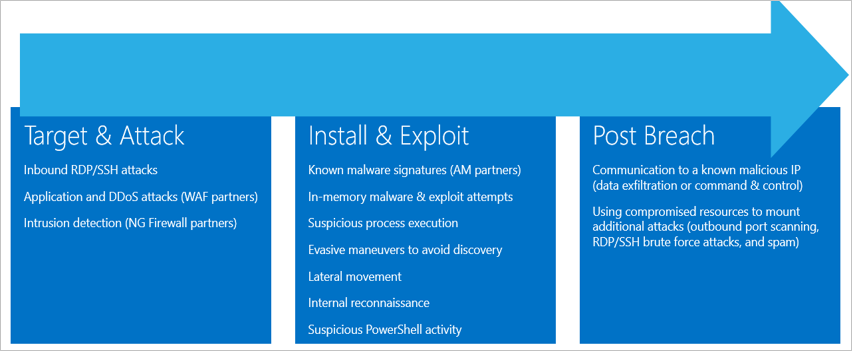
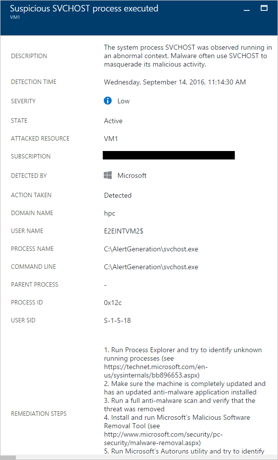
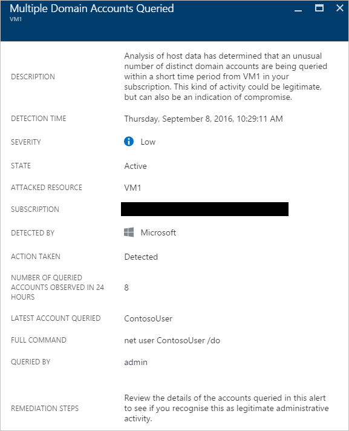
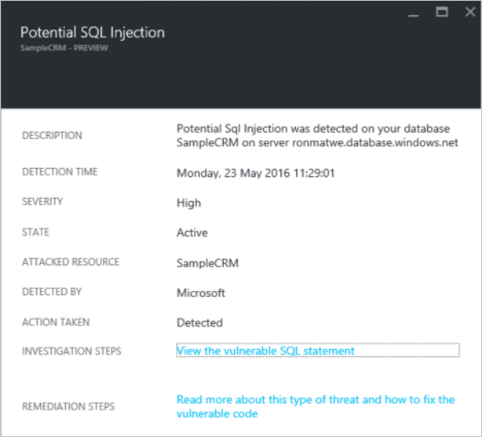
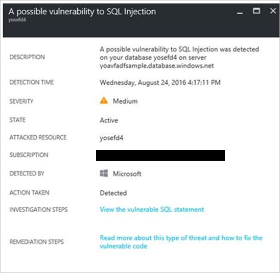

<properties
   pageTitle="Beveiligingswaarschuwingen per type in Azure Security Center | Microsoft Azure"
   description="Dit document helpt u te begrijpen welke verschillende typen beveiligingswaarschuwingen er beschikbaar zijn in Azure Security Center."
   services="security-center"
   documentationCenter="na"
   authors="YuriDio"
   manager="swadhwa"
   editor=""/>

<tags
   ms.service="security-center"
   ms.topic="hero-article"
   ms.devlang="na"
   ms.tgt_pltfrm="na"
   ms.workload="na"
   ms.date="09/20/2016"
   ms.author="yurid"/>

# Beveiligingswaarschuwingen per type in Azure Security Center
Dit document helpt u te begrijpen welke verschillende typen beveiligingswaarschuwingen er beschikbaar zijn in Azure Security Center. Lees [Beveiligingswaarschuwingen beheren en erop reageren in Azure Security Center](security-center-managing-and-responding-alerts.md) voor meer info over het beheren van waarschuwingen.

> [AZURE.NOTE] Als u geavanceerde detectie wilt inschakelen, voert u een upgrade uit naar Azure Security Center Standard. Er is een gratis proefversie voor 90 dagen beschikbaar. Als u een upgrade wilt uitvoeren, selecteert u de prijscategorie in het [beveiligingsbeleid](security-center-policies.md). Zie de [pagina met prijzen](https://azure.microsoft.com/pricing/details/security-center/) voor meer informatie.

## Welk type waarschuwingen zijn er beschikbaar?
Azure Security Center bevat tal van waarschuwingen die passen bij de respectievelijke fasen van de kill chain voor het elimineren van cyberbedreigingen. De afbeelding hieronder bevat enkele voorbeelden van de diverse waarschuwingen in relatie tot een aantal van deze fasen.

**Doel en aanval**

- Inkomende RDP-/SSH-aanvallen
- Toepassings- en DDoS-aanvallen (WAF-partners)
- Detecteren van indringers (NG Firewall-partners)

**Installatie en misbruik**

- Handtekeningen van bekende schadelijke software (AM-partners)
- In het geheugen aanwezige schadelijke software en pogingen tot misbruik
- Uitvoering van verdachte processen
- Ontwijkende manoeuvres om detectie te voorkomen
- Zijwaartse beweging
- Interne verkenning
- Verdachte PowerShell-activiteit

**Na een inbreuk**  

- Communicatie met een bekend schadelijk IP-adres (gegevensexfiltratie of opdrachtenbeheer)
- Verdachte resources gebruiken om nieuwe aanvallen te ondernemen (scannen van uitgaande poorten op RDP/SSH-beveiligingsaanvallen en spam)

Verschillende soorten aanvallen horen bij een respectievelijke fase en ze richten zich op verschillende subsystemen. Om aanvallen tijdens elk van deze fasen aan te pakken, beschikt Security Center over drie categorieën waarschuwingen:

- VMBA (Virtual Machine Behavioral Analysis)
- Netwerkanalyse
- Resourceanalyse

## VMBA (Virtual Machine Behavioral Analysis)

Azure Security Center kan gebruikmaken van gedragsanalyses om verdachte resources te identificeren op basis van de analyse van gebeurtenislogboeken van virtuele machines, bijvoorbeeld procesgebeurtenissen, aanmeldgebeurtenissen enzovoort. Er wordt ook gekeken naar andere signalen om te controleren op ondersteunend bewijs van een wijdverbreide aanval.

> [AZURE.NOTE] Lees [Detectiemogelijkheden van Azure Security Center](security-center-detection-capabilities.md) voor meer informatie over de werking van de detectiemogelijkheden van Azure Security Center.

### Crashanalyse

De analyse van een crashdumpgeheugen is een methode voor het detecteren van geavanceerde schadelijke software die in staat is traditionele beveiligingsoplossingen te misleiden. Diverse varianten schadelijke software proberen de kansen dat ze worden gedetecteerd door antivirusproducten te verkleinen doordat ze nooit iets naar de schijf schrijven of door softwareonderdelen te versleutelen die naar de schijf worden geschreven. Hierdoor wordt het moeilijk om ze te detecteren met traditionele benaderingen voor het elimineren van schadelijke software. Dergelijke schadelijke software kan echter worden gedetecteerd met behulp van de analyse van het geheugen, omdat de software sporen in het geheugen moet achterlaten om zijn schadelijke werk te kunnen doen.

Wanneer software vastloopt, bevat een crashdump een gedeelte van het geheugen ten tijde van de crash. De crash kan zijn veroorzaakt door schadelijke software, door gewoon gebruik of door problemen met het systeem. Door het geheugen in de crashdump te analyseren, kan Security Center technieken detecteren die worden gebruikt om misbruik te maken van zwakke plekken in software, toegang te krijgen tot vertrouwelijke gegevens en ongemerkt aanwezig te blijven in een aangetaste machine. Een crashanalyse wordt uitgevoerd met minimale gevolgen voor de prestaties van hosts omdat deze wordt uitgevoerd door de back-end van Security Center.

De volgende velden komen voor in de onderstaande crashdumpwaarschuwingen:

- DUMPFILE: naam van het crashdumpbestand
- PROCESSNAME: naam van het vastgelopen proces
- PROCESSVERSION: versie van het vastgelopen proces

### Shellcode gedetecteerd

Shellcode is de nettolading die wordt uitgevoerd nadat de schadelijke software misbruik heeft gemaakt van een beveiligingslek in de software. Deze waarschuwing geeft aan dat de crashdumpanalyse uitvoerbare code heeft gedetecteerd dat gedrag vertoont dat gewoonlijk wordt uitgevoerd door schadelijke nettoladingen. Hoewel niet-schadelijke software dit gedrag kan vertonen, is het niet gebruikelijk voor normale softwareontwikkelingsprocedures.

Deze waarschuwing geeft het volgende extra veld:

- ADDRESS: de locatie in het geheugen van de shellcode

Dit is een voorbeeld van dit type waarschuwing:

 

### Module-hijacking gedetecteerd

Windows maakt gebruik van Dynamic Link Libraries (DLL's) om software toe te staan gebruik te maken van de algemene Windows-systeemfunctionaliteit. DLL-hijacking treedt op wanneer malware de DLL-laadvolgorde wijzigt om schadelijke nettoladingen in het geheugen te laden, waarbij willekeurige code kan worden uitgevoerd. Deze waarschuwing geeft aan dat de crashdumpanalyse heeft gedetecteerd dat een gelijknamige module wordt geladen uit twee verschillende paden, waarbij een van de geladen paden afkomstig uit een algemene binaire locatie van het Windows-systeem.

Van tijd tot tijd wijzigen legitieme softwareontwikkelaars de laadvolgorde van de DLL wegens niet-kwaadwillende redenen, zoals instrumentering, uitbreiding van het Windows-besturingssysteem of Windows-toepassingen. Om te helpen onderscheid te maken tussen kwaadwillende en mogelijk goedaardige wijzigingen in de laadvolgorde van de DLL-bestand, controleert Azure Security Center of een geladen module aan een verdacht profiel voldoet. Het resultaat van deze controle wordt aangegeven door het veld "SIGNATURE" van de waarschuwing en is te zien aan de ernst van de waarschuwing, de omschrijving van de waarschuwing en herstelstappen voor de waarschuwing. Het analyseren van de kopie op schijf van de hijacking-module, zoals door de digitale handtekening van bestanden te verifiëren of een scan antivirusprogramma uit te voeren, kan meer informatie over de legitieme of schadelijke aard van de hijacking-module bieden.

Naast de algemene velden die worden beschreven in het gedeelte "Shellcode gedetecteerd" biedt deze waarschuwing de volgende velden:

- SIGNATURE: geeft aan of de hijacking-module aan een verdacht profiel voldoet
- HIJACKEDMODULE: de naam van de gehijackte Windows-systeemmodule
- HIJACKEDMODULEPATH: het pad van de gehijackte Windows-systeemmodule
- HIJACKINGMODULEPATH: het pad van de hijacking-module

Dit is een voorbeeld van dit type waarschuwing:

 

### Onechte Windows-module gedetecteerd

Malware kan veelvoorkomende namen van binaire Windows-systeembestanden (bijvoorbeeld SVCHOST.EXE) of modules (bijvoorbeeld NTDLL.DLL) gebruiken om ongemerkt binnen te komen en de aard van de schadelijke software voor systeembeheerders te verbergen. Deze waarschuwing geeft aan dat de crashdumpanalyse heeft gedetecteerd dat het crashdumpbestand modules bevat die namen van Windows-systeemmodules gebruiken, maar niet voldoen aan andere criteria die gangbaar zijn voor Windows-modules. Analyse van de kopie op schijf van de onechte module kan mogelijk meer informatie bieden over de legitieme of schadelijke aard van deze module. De analyse kan het volgende omvatten:

- Bevestigen dat het bestand in kwestie is geleverd als onderdeel van een betrouwbaar softwarepakket
- De digitale handtekening van het bestand controleren
- Een antivirusprogramma uitvoeren op het bestand

Naast de algemene velden die worden beschreven in het gedeelte "Shellcode gedetecteerd" biedt deze waarschuwing de volgende aanvullende velden:

- DETAILS: beschrijft of de metagegevens van de modules geldig zijn en of de module vanuit een systeempad is geladen.
- NAME: de naam van de onechte Windows-module
- PATH: het pad naar de onechte Windows-module.

Deze waarschuwing extraheert en toont ook bepaalde velden uit de PE-kop van de module, zoals "CHECKSUM" en "TIMESTAMP". Deze velden worden alleen weergegeven als de velden in de module zijn opgenomen. Zie de [Microsoft PE- en COFF-specificatie](https://msdn.microsoft.com/windows/hardware/gg463119.aspx) voor meer informatie over deze velden.

Dit is een voorbeeld van dit type waarschuwing:

 

### Gewijzigd binair systeembestand gedetecteerd

Malware kan belangrijke binaire systeembestanden wijzigen om stiekem toegang tot gegevens te krijgen of ongemerkt aanwezig te blijven op een geïnfecteerd systeem. Deze waarschuwing geeft aan dat de crashdumpanalyse heeft gedetecteerd dat belangrijke binaire Windows-besturingssysteembestanden zijn gewijzigd in het geheugen of op schijf.
Legitieme softwareontwikkelaars wijzigen van tijd tot tijd systeemmodules in het geheugen voor niet-kwaadwillende redenen, zoals omzeilingen of voor de compatibiliteit van toepassingen. Om te helpen onderscheid te maken tussen kwaadwillende en mogelijk goedaardige modules, controleert Azure Security Center of de gewijzigde module wel of niet aan een verdacht profiel voldoet. Het resultaat van deze controle wordt aangegeven door de ernst van waarschuwing, de omschrijving van de waarschuwing en de herstelstappen voor de waarschuwing.

Naast de algemene velden die worden beschreven in het gedeelte "Shellcode gedetecteerd" biedt deze waarschuwing de volgende aanvullende velden:

- MODULENAME: de naam van het gewijzigde binaire systeembestand
- MODULEVERSION: de versie van het gewijzigde binaire systeembestand

Dit is een voorbeeld van dit type waarschuwing:

 

### Verdachte processen uitgevoerd

Security Center stelt vast dat er verdachte processen worden uitgevoerd in de virtuele doelmachine en activeert een waarschuwing. De detectie zoekt niet naar de specifieke naam, maar zoekt via de parameter ervan. Vandaar dat, zelfs als de aanvaller de naam van het uitvoerbare bestand wijzigt, Security Center nog steeds in staat is om het te detecteren.
 
Dit is een voorbeeld van dit type waarschuwing:

### Query's op meerdere domeinaccounts uitgevoerd

Security Center kan meerdere pogingen detecteren waarbij query's op domeinaccounts zijn uitgevoerd, wat doorgaans gebeurt als aanvallers het netwerk verkennen. Aanvallers kunnen deze methode gebruiken om query's uit te voeren op het domein met het doel de gebruikers te identificeren, wat de beheerdersaccounts van het domein zijn, welke computers domeincontrollers zijn en of er mogelijk vertrouwensrelaties zijn tussen het domein en andere domeinen.

Dit is een voorbeeld van dit type waarschuwing:

## Netwerkanalyse

Het detecteren van netwerkbedreigingen van Security Center werkt volgens het automatisch verzamelen van beveiligingsgegevens van uw Azure IPFIX-verkeer (Internet Protocol Flow Information Export). Deze informatie wordt door Security Center geanalyseerd, waarbij vaak informatie uit meerdere bronnen wordt samengebracht om bedreigingen te analyseren.

### Verdacht uitgaand verkeer gedetecteerd

Netwerkapparaten kunnen op ongeveer dezelfde manier worden gedetecteerd en geprofileerd als andere typen systemen. Aanvallers beginnen gewoonlijk met het scannen/sweepen van poorten. In het onderstaande voorbeeld hebt u verdacht SSH-verkeer van een virtuele machine die een SSH-beveiligingsaanval of poort-sweepingaanval kan uitvoeren op een externe resource.

 

Deze waarschuwing biedt informatie waarmee u de resource die is gebruikt om deze aanval te initiëren, de aangetaste computer, de detectietijd, het protocol en de gebruikte poort kunt identificeren. Deze blade geeft u ook een lijst van herstelstappen die kunnen worden gebruikt om dit probleem te verhelpen.

### Netwerkcommunicatie met een kwaadwillende machine

Door gebruik te maken van de feeds van Microsoft met informatie over bedreigingen kan Azure Security Center verdachte computers die met kwaadwillende IP-adressen communiceren, in veel gevallen een command and control center, identificeren. In dit geval heeft Azure Security Center gedetecteerd dat de communicatie is uitgevoerd met behulp van Pony Loader-malware (ook wel bekend als [Fareit](https://www.microsoft.com/security/portal/threat/encyclopedia/entry.aspx?Name=PWS:Win32/Fareit.AF)).

Deze waarschuwing biedt informatie waarmee u de resource die is gebruikt om deze aanval te initiëren, de aangevallen resource, het IP-adres van het slachtoffer, het IP-adres van de aanvaller en de detectietijd kunt identificeren.

[AZURE.NOTE] Live IP-adressen zijn verwijderd uit deze schermafbeelding wegens privacydoeleinden.

### Mogelijke uitgaande Denial of Service-aanval gedetecteerd

Afwijkend netwerkverkeer afkomstig van een virtuele machine kan ertoe leiden dat Security Center een aanval van het type Denial of Service activeert.
 
Dit is een voorbeeld van dit type waarschuwing:

## Resourceanalyse

Een resourceanalyse door Security Center richt zich op PaaS-services, zoals de integratie met de functie [Azure SQL Db-bedreigingsdetectie](../sql-database/sql-database-threat-detection-get-started.md). Op basis van de analyseresultaten van deze gebieden, activeert Security Center een aan een resource gerelateerde waarschuwing.

### Mogelijke SQL-injectie

SQL-injectie is een aanval waarbij schadelijke code wordt ingevoegd in tekenreeksen die later worden doorgegeven aan een exemplaar van SQL Server om te worden geparseerd en uitgevoerd. Elke procedure die SQL-instructies construeert, moet worden gecontroleerd op beveiligingsproblemen met injectie omdat SQL Server alle syntactisch geldige query's uitvoert die deze ontvangt. SQL-bedreigingsdetectie maakt gebruik van machine learning, gedragsanalyse en detectie van afwijkingen om verdachte gebeurtenissen op te sporen die in uw Azure SQL-databases mogelijk plaatsvinden. Bijvoorbeeld:

- een voormalig medewerker heeft geprobeerd toegang tot een database te krijgen. 
- Waarschuwing over SQL-injectieaanvallen 
- Ongebruikelijke toegang tot de productiedatabase van een gebruiker thuis

Deze waarschuwing geeft informatie waarmee u de aangevallen resource, de detectietijd en de status van de aanval kunt identificeren en biedt ook een koppeling naar de stappen voor verder onderzoek.

### Beveiligingslek met betrekking tot SQL-injectie

Deze waarschuwing wordt geactiveerd wanneer er een toepassingsfout is gedetecteerd voor een database, die kan wijzen op een mogelijk beveiligingslek voor SQL-injectieaanvallen.

### Ongebruikelijke toegang vanaf onbekende locatie

Deze waarschuwing wordt geactiveerd wanneer er op een server een poging is gedetecteerd om toegang vanaf een onbekend IP-adres te krijgen, en dat een dergelijke poging in de afgelopen periode niet heeft plaatsgevonden.

## Zie ook

In dit document bent u meer te weten gekomen over de verschillende soorten beveiligingswaarschuwingen in Security Center. Zie de volgende onderwerpen voor meer informatie over Security Center:

- [Beveiligingsincidenten afhandelen in Azure Security Center](security-center-incident.md)
- [Detectiemogelijkheden van Azure Security Center](security-center-detection-capabilities.md)
- [Plannings- en bedieningsgids voor het Azure Beveiligingscentrum](security-center-planning-and-operations-guide.md)
- [Azure Security Center FAQ](security-center-faq.md): raadpleeg veelgestelde vragen over het gebruik van de service.
- [Azure-beveiligingsblog](http://blogs.msdn.com/b/azuresecurity/): lees blogberichten over de beveiliging en naleving van Azure.

<!--HONumber=Sep16_HO3-->

