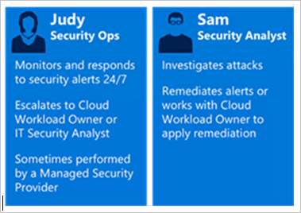
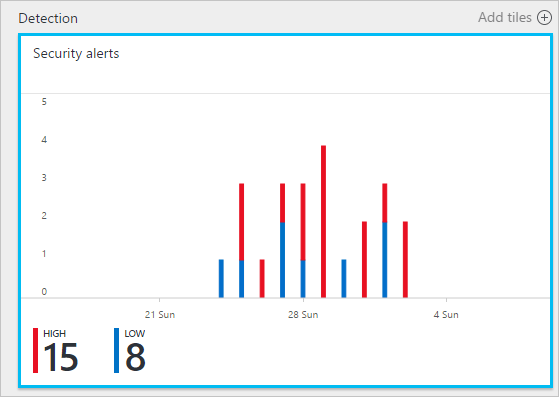
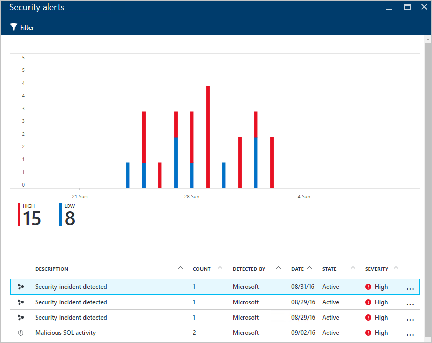
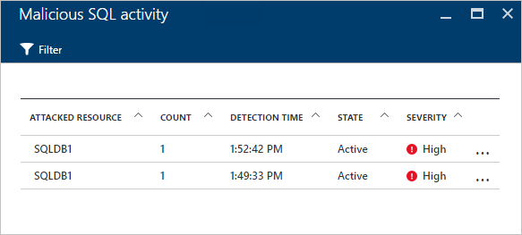

<properties
   pageTitle="Azure Security Center gebruiken voor reacties op incidenten | Microsoft Azure"
   description="In dit document wordt uitgelegd hoe u Azure Security Center kunt gebruiken voor een scenario voor een reactie op een incident."
   services="security-center"
   documentationCenter="na"
   authors="YuriDio"
   manager="swadhwa"
   editor=""/>

<tags
   ms.service="security-center"
   ms.topic="hero-article"
   ms.devlang="na"
   ms.tgt_pltfrm="na"
   ms.workload="na"
   ms.date="09/20/2016"
   ms.author="yurid"/>

# Azure Security Center gebruiken voor reacties op incidenten
Veel organisaties leren pas hoe ze moeten reageren op beveiligingsincidenten nadat ze het slachtoffer zijn geworden van een aanval. Om kosten en schade te beperken, is het belangrijk dat u een plan hebt voor het reageren op incidenten voordat er een aanval plaatsvindt. Azure Security Center kan worden gebruikt in verschillende stadia tijdens een reactie op een incident.

## Reageren op incidenten

Of een plan doeltreffend is, hangt af van drie centrale kenmerken ervan: het vermogen om te beschermen, te detecteren en op bedreigingen te reageren. Beveiliging heeft betrekking op het voorkomen van incidenten, detectie op het identificeren van bedreigingen in een vroeg stadium, en bij reageren gaat het om het verwijderen van de aanvaller en het herstellen van systemen om de gevolgen van een inbreuk zo beperkt mogelijk te houden. 

In dit artikel worden de fasen van een reactie op een beveiligingsincident gebruikt die worden beschreven in het artikel [Microsoft Azure Security Response in the Cloud](https://gallery.technet.microsoft.com/Azure-Security-Response-in-dd18c678) (Beveiligingsreactie van Microsoft Azure in de cloud) zoals weergegeven in het volgende diagram:

Security Center kan worden gebruikt tijdens de fasen detectie, beoordeling en het stellen van een diagnose. Meer informatie over elk van deze fasen. Hier vindt u een voorbeeld van hoe Security Center van dienst kan zijn tijdens de drie eerste fasen van een reactie op een incident:

- **Detecteren**: eerste indicatie dat er een gebeurtenis wordt onderzocht
    - Voorbeeld: de eerste keer dat tijdens een controle een beveiligingswaarschuwing met hoge prioriteit in het dashboard Security Center is gegenereerd.
- **Beoordelen**: de eerste beoordeling uitvoeren voor meer informatie over de verdachte activiteiten.
    - Voorbeeld: het verkrijgen van meer informatie over de beveiligingswaarschuwing.
- **Diagnose**: een technisch onderzoek uitvoeren, het bepalen van strategieën voor insluiting van een bedreiging, voor risicobeperking en voor een tijdelijke oplossing
    - Voorbeeld: de herstelstappen volgen die in Security Center voor de desbetreffende beveiligingswaarschuwing worden beschreven.

Het volgende scenario laat zien hoe u Security Center kunt gebruiken tijdens de detectie-, beoordelings- en diagnose-/reactiefasen van incidenten.  In Security Center is een [beveiligingsincident](security-center-incident.md) een samenloop van alle waarschuwingen voor een resource die overeenstemt met [kill chain](https://blogs.technet.microsoft.com/office365security/addressing-your-cxos-top-five-cloud-security-concerns/)-patronen. Incidenten verschijnen in de tegel en blade voor [Beveiligingswaarschuwingen](security-center-managing-and-responding-alerts.md). Een incident zal de lijst van gerelateerde waarschuwingen tonen, zodat u meer info krijgt over elke gebeurtenis. Security Center toont ook zelfstandige beveiligingswaarschuwingen die eveneens kunnen worden gebruikt voor het opsporen van verdachte activiteiten.

## Scenario

Contoso heeft enkele van de on-premises resources onlangs naar Azure gemigreerd, met inbegrip van een aantal line-of-business-werkbelastingen en SQL-databases op virtuele machines. Het Contoso Core Computer Security Incident Response Team (CSIRT) heeft een probleem met het onderzoeken van mogelijke beveiligingskwesties. De oorzaak hiervan is dat het bedrijf geen beveiligingsintelligence heeft die is geïntegreerd in hun huidige hulpmiddelen voor het reageren op incidenten. Dit gebrek aan integratie introduceert een probleem tijdens de detectiefase (teveel fout-positieven) en tijdens de beoordelings- en diagnosefasen. Als onderdeel van deze migratie besloten ze Security Center in te schakelen om hen te helpen dit probleem aan te pakken. 

De eerste fase van deze migratie werd afgesloten nadat alle resources waren voorbereid en alle aanbevelingen van Security Center op het gebied van beveiliging waren opgevolgd. Contoso CSIRT is het centrale punt voor het afhandelen van computerbeveiligingsincidenten. Het team bestaat uit een groep mensen met voldoende bevoegdheden voor het afhandelen van elk type beveiligingsincident. De teamleden hebben duidelijk gedefinieerde taken om ervoor te zorgen dat er geen onderdeel van een fase van een reactie over het hoofd wordt gezien. 

Voor dit scenario gaan we ons richten op de functies van de volgende personen die deel uitmaken van Contoso CSIRT:

Dena is verantwoordelijk voor beveiligingsbewerkingen, wat onder andere het volgende omvat:
- Het ononderbroken bewaken van en reageren op bedreigingen
- Indien nodig een probleem doorverwijzen naar de eigenaar van de werkbelastingen in de cloud of naar de beveiligingsanalist

Sam is een beveiligingsanalist en zijn verantwoordelijkheden omvatten:
- Het onderzoeken van aanvallen
- Het oplossen van problemen die worden vermeld in beveiligingswaarschuwingen 
- Samen met eigenaren van werkbelastingen bepalen hoe een probleem kan worden opgelost en deze oplossing toepassen

Zoals u ziet, hebben Dena en Rolf verschillende verantwoordelijkheden, en ze moeten informatie delen die ze van Security Center hebben gekregen. 

## Aanbevolen oplossing

Aangezien Dena en Rolf verschillende rollen hebben, zullen zij verschillende gebieden van Security Center gebruiken om relevante informatie voor hun dagelijkse activiteiten te verkrijgen. Dena gebruikt beveiligingswaarschuwingen als onderdeel van haar dagelijkse bewakingswerkzaamheden. 

Dena gebruikt beveiligingswaarschuwingen tijdens de detectie- en beoordelingsfasen. Zodra Dena de eerste beoordeling heeft uitgevoerd, kan ze het probleem doorverwijzen naar Rolf als er extra onderzoek vereist is. Op dit punt in het proces moet Sam de informatie van Security Center, soms in combinatie met andere gegevensbronnen, gebruiken om verder te gaan naar de diagnosefase.

## Deze oplossing implementeren 

Als u wilt zien hoe u Azure Security Center gebruikt in een scenario voor het reageren op incidenten, volgen we de stappen van Dena tijdens de detectie- en beoordelingsfasen, en gaan we vervolgens kijken naar wat Rolf doet om vast te stellen wat het probleem is. 

### Detectie- en beoordelingsfasen van reactie op incidenten 

Dena heeft zich aangemeld bij de Azure-portal en is in de Security Center-console. Als onderdeel van haar dagelijkse bewakingsactiviteiten is ze begonnen met het bekijken van de beveiligingswaarschuwingen met hoge prioriteit door de volgende stappen uit te voeren:

1. Klik op de tegel **Beveiligingswaarschuwingen** en open de blade **Beveiligingswaarschuwingen**.
    

    > [AZURE.NOTE] Voor dit scenario gaat Dena een waarschuwing Schadelijke SQL-activiteit beoordelen, zoals te zien is in de afbeelding hierboven. 
2. Klik op de waarschuwing **Schadelijke SQL-activiteit** en bekijk de aangevallen resources in de blade **Schadelijke SQL-activiteit**:  
    
    In deze blade kan Dena aantekeningen maken over de aangevallen resources, hoe vaak deze aanval heeft plaatsgevonden en wanneer deze is gedetecteerd.
3. Klik op de **aangevallen resource** voor meer informatie over deze aanval. 

Na het lezen van de beschrijving is Dena ervan overtuigd dat het hier niet om een fout-positief gaat en dat ze deze case naar Rolf moet doorverwijzen.

### Diagnosefase van reactie op incidenten 

Rolf ontvangt de case van Dena en begint de herstelstappen door te nemen die Security Center adviseert.

### Aanvullende resources

Het Incident Response Team kan ook profiteren van de mogelijkheden van [Security Center Power BI](security-center-powerbi.md) om diverse soorten rapporten weer te geven. Deze rapporten helpen het team tijdens het doen van nader onderzoek omdat hiermee aanbevelingen en beveiligingswaarschuwingen kunnen worden gevisualiseerd, gefilterd en geanalyseerd. Bedrijven die hun SIEM-oplossing (Security Information and Event Management) tijdens het onderzoeksproces gebruiken, kunnen ook [Security Center integreren met hun oplossing](security-center-integrating-alerts-with-log-integration.md). Azure-auditlogboeken en VM-beveiligingsgebeurtenissen kunnen ook worden geïntegreerd met behulp van het [Azure-hulpprogramma voor integratie van logboeken](https://blogs.msdn.microsoft.com/azuresecurity/2016/07/21/microsoft-azure-log-integration-preview/). Deze informatie kan worden gebruikt in combinatie met de informatie die door Security Center is verstrekt voor het onderzoeken van een aanval.

## Conclusie

Het is heel belangrijk voor uw organisatie om een team samen te stellen voordat er zich een incident voordoet. Dit heeft een positieve invloed op de manier waarop incidenten worden afgehandeld. Met de juiste hulpprogramma's voor het bewaken van resources is dit team in staat om nauwgezette stappen uit te voeren om een beveiligingsincident op te lossen. De [detectiemogelijkheden](security-center-detection-capabilities.md) van Security Center helpt IT-medewerkers om snel te reageren op beveiligingsincidenten en beveiligingsproblemen op te lossen.

<!--HONumber=Sep16_HO3-->

