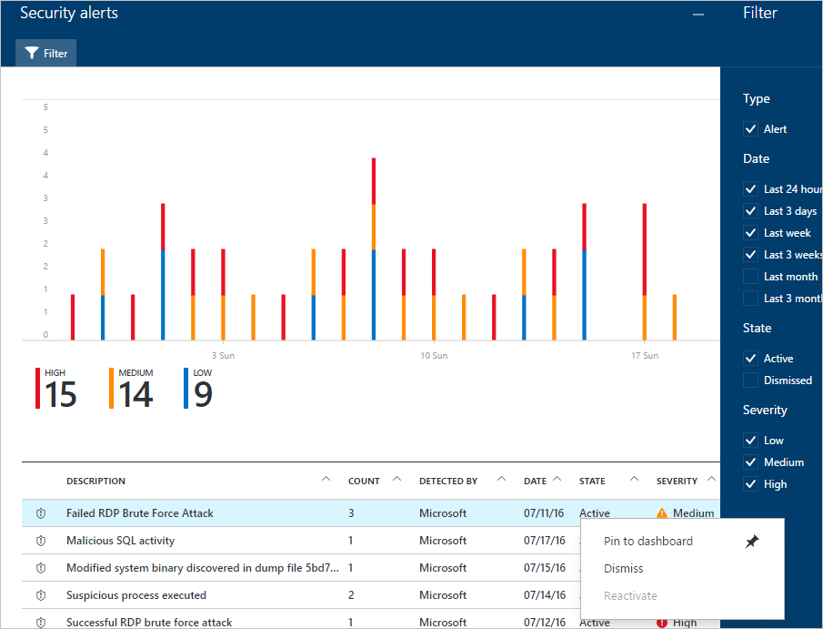
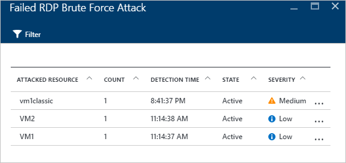
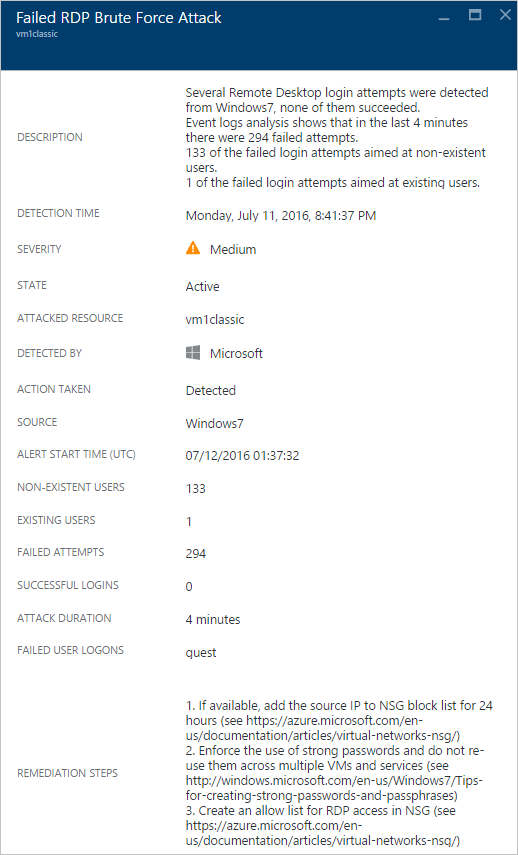

<properties
   pageTitle="Beveiligingswaarschuwingen beheren en erop reageren in Azure Security Center | Microsoft Azure"
   description="Dit document bevat informatie over het gebruik van de mogelijkheden van Azure Security Center om beveiligingswaarschuwingen te beheren en hierop te reageren."
   services="security-center"
   documentationCenter="na"
   authors="YuriDio"
   manager="swadhwa"
   editor=""/>

<tags
   ms.service="security-center"
   ms.topic="hero-article"
   ms.devlang="na"
   ms.tgt_pltfrm="na"
   ms.workload="na"
   ms.date="08/07/2016"
   ms.author="yurid"/>

# Beveiligingswaarschuwingen beheren en erop reageren in Azure Security Center
Dit document bevat informatie over het gebruik van Azure Security Center om beveiligingswaarschuwingen te beheren en hierop te reageren.

## Wat zijn beveiligingswaarschuwingen?
Security Center verzamelt, analyseert en integreert automatisch logboekgegevens van uw Azure-resources, het netwerk en verbonden partneroplossingen, zoals firewall- en eindpuntbeveiligingsoplossingen om werkelijke dreigingen te detecteren en fout-positieven te reduceren. In Security Center wordt een lijst met beveiligingswaarschuwingen met prioriteiten weergegeven samen met de informatie die u nodig hebt om snel onderzoek te doen naar het probleem en aanbevelingen voor het herstellen van een aanval. Azure Security Center voegt soortgelijke waarschuwingen ook samen om kettingpatronen onder te brengen in [incidenten](security-center-incident.md). 

> [AZURE.NOTE] Lees [Detectiemogelijkheden van Azure Security Center](security-center-detection-capabilities.md) voor meer informatie over de werking van de detectiemogelijkheden van Azure Security Center.

## Beveiligingswaarschuwingen beheren

U kunt uw huidige waarschuwingen controleren met de tegel **Beveiligingswaarschuwingen**. Open Azure Portal en voer de volgende stappen uit om meer informatie over elke waarschuwing weer te geven:

1. Op het Security Center-dashboard ziet u de tegel **Beveiligingswaarschuwingen**.

    

2.  Klik op de tegel om de blade **Beveiligingswaarschuwingen** met meer informatie over de waarschuwingen te openen (zie hieronder).

    

In het onderste gedeelte van deze blade vindt u de details voor elke waarschuwing. Als u wilt sorteren, klikt u op de kolom waarop u wilt sorteren. Hieronder volgt de definitie voor elke kolom:

- **Waarschuwing**: een korte beschrijving van de waarschuwing.
- **Aantal**: een lijst met alle waarschuwingen van dit specifieke type die zijn gedetecteerd op een specifieke dag.
- **Gedetecteerd door**: de service die verantwoordelijk is voor activering van de waarschuwing.
- **Datum**: de datum waarop de gebeurtenis heeft plaatsgevonden.
- **Status**: de huidige status voor deze waarschuwing. Er zijn twee soorten statussen:
    - **Actief**: de beveiligingswaarschuwing is gedetecteerd.
    - **Gesloten**: de beveiligingswaarschuwing is door de gebruiker gesloten. Deze status wordt meestal gebruikt voor waarschuwingen die zijn onderzocht, en die zijn verholpen of waarvan is vastgesteld dat ze eigenlijk geen aanval zijn.

- **Ernst**: de ernst kan hoog, gemiddeld of laag zijn.

### Waarschuwingen filteren

U kunt waarschuwingen filteren op basis van datum, status en ernst. Het filteren van waarschuwingen kan nuttig zijn wanneer u minder beveiligingswaarschuwingen wilt weergeven. U kunt u bijvoorbeeld concentreren op de beveiligingswaarschuwingen van de afgelopen 24 uur, omdat u een mogelijke inbreuk in het systeem onderzoekt.

1. Klik op **Filter** op de blade **Beveiligingswaarschuwingen**. De blade **Filter** wordt geopend en u selecteert de gewenste waarden voor datum, status en ernst.

    

2.  Nadat u een beveiligingswaarschuwing hebt onderzocht, kunt u tot de conclusie komen dat het om een fout-positief voor uw omgeving gaat of dat deze duidt op een verwachte werking voor een bepaalde resource. Als u om wat voor reden dan ook vaststelt dat een beveiligingswaarschuwing niet van toepassing is, kunt u de waarschuwing sluiten en vervolgens uit uw weergave filteren. Er zijn twee manieren om een beveiligingswaarschuwing te sluiten. Klik met de rechtermuisknop op een waarschuwing en selecteer **Sluiten** of beweeg de muisaanwijzer over een item, klik op de drie punten die worden weergegeven aan de rechterkant en selecteer **Sluiten**. U kunt de beveiligingswaarschuwingen die u hebt gesloten, weergeven door op **Filter** te klikken en **Gesloten** te selecteren.

    

### Reageren op beveiligingswaarschuwingen

Selecteer een beveiligingswaarschuwing voor meer informatie over de gebeurtenis(sen) waarmee de waarschuwing is geactiveerd en welke stappen u zo nodig moet uitvoeren om een aanval te verhelpen. Beveiligingswaarschuwingen zijn gegroepeerd op type en datum. Als u op een beveiligingswaarschuwing klikt, wordt een blade met een lijst gegroepeerde waarschuwingen geopend.

In dit geval verwijzen de geactiveerde waarschuwingen naar verdachte RDP-activiteiten (Remote Desktop Protocol). In de eerste kolom ziet u welke resources zijn aangevallen, de tweede kolom toont hoe vaak de resource is aangevallen, de derde kolom bevat de tijd waarop de aanval heeft gevonden; de vierde kolom bevat de status van de waarschuwing en in de vijfde kolom wordt de ernst van de aanval weergegeven. Bekijk deze informatie en klik op de resource die is aangevallen. Er wordt dan een nieuwe blade geopend.

U vindt in het veld **Omschrijving** van deze blade meer informatie over deze gebeurtenis. Deze aanvullende informatie biedt inzicht in wat de beveiligingswaarschuwing heeft geactiveerd, de doelresource, eventueel het bron-IP-adres en aanbevelingen voor het herstellen.  In sommige gevallen zal het bron-IP-adres leeg zijn (niet beschikbaar), omdat niet alle Windows-logboeken voor beveiligingsgebeurtenissen het IP-adres bevatten.

> [AZURE.NOTE] Het herstel dat door Security Center wordt voorgesteld, is afhankelijk van de beveiligingswaarschuwing. In sommige gevallen moet u wellicht andere Azure-mogelijkheden gebruiken om het aanbevolen herstel te implementeren. Als herstel voor deze aanval moet bijvoorbeeld het IP-adres op een zwarte lijst worden gezet dat door de aanval is gegenereerd. Hiervoor is de regel van een [netwerk-ACL](../virtual-network/virtual-networks-acl.md) of een [netwerkbeveiligingsgroep](../virtual-network/virtual-networks-nsg.md) nodig.

## Beveiligingswaarschuwingen per type
Dezelfde stappen die zijn gebruikt voor toegang tot de waarschuwing over de verdachte RDP-activiteit kunnen worden gebruikt voor toegang tot andere typen waarschuwingen. Hier volgen enkele andere voorbeelden van waarschuwingen die mogelijk worden weergegeven in Security Center:

### Mogelijke SQL-injectie
SQL-injectie is een aanval waarbij schadelijke code wordt ingevoegd in tekenreeksen die later worden doorgegeven aan een exemplaar van SQL Server om te worden geparseerd en uitgevoerd. Elke procedure die SQL-instructies construeert, moet worden gecontroleerd op beveiligingsproblemen met injectie omdat SQL Server alle syntactisch geldige query's uitvoert die deze ontvangt. 

 

Deze waarschuwing geeft informatie waarmee u de aangevallen resource, de detectietijd en de status van de aanval kunt identificeren en biedt ook een koppeling naar de stappen voor verder onderzoek.

### Verdacht uitgaand verkeer gedetecteerd

Netwerkapparaten kunnen op ongeveer dezelfde manier worden gedetecteerd en geprofileerd als andere typen systemen. Aanvallers beginnen gewoonlijk met het scannen/sweepen van poorten. In het onderstaande voorbeeld hebt u verdacht SSH-verkeer van een virtuele machine die een SSH-beveiligingsaanval of poort-sweepingaanval kan uitvoeren op een externe resource. 

Deze waarschuwing biedt informatie waarmee u de resource die is gebruikt om deze aanval te initiëren, de aangetaste computer, de detectietijd, het protocol en de gebruikte poort kunt identificeren. Deze blade geeft u ook een lijst van herstelstappen die kunnen worden gebruikt om dit probleem te verhelpen.

### Netwerkcommunicatie met een kwaadwillende machine
 
Door gebruik te maken van de feeds van Microsoft met informatie over bedreigingen kan Azure Security Center verdachte computers die met kwaadwillende IP-adressen communiceren, in veel gevallen een command and control center, identificeren. In dit geval heeft Azure Security Center gedetecteerd dat de communicatie is uitgevoerd met behulp van Pony Loader-malware (ook wel bekend als [Fareit](https://www.microsoft.com/security/portal/threat/encyclopedia/entry.aspx?Name=PWS:Win32/Fareit.AF)).

Deze waarschuwing biedt informatie waarmee u de resource die is gebruikt om deze aanval te initiëren, de aangevallen resource, het IP-adres van het slachtoffer, het IP-adres van de aanvaller en de detectietijd kunt identificeren.

> [AZURE.NOTE] Live IP-adressen zijn verwijderd uit deze schermafbeelding wegens privacydoeleinden.

### Shellcode gedetecteerd 

Shellcode is de nettolading die wordt uitgevoerd nadat de schadelijke software misbruik heeft gemaakt van een beveiligingslek in de software.  Deze waarschuwing geeft aan dat de crashdumpanalyse uitvoerbare code heeft gedetecteerd dat gedrag vertoont dat gewoonlijk wordt uitgevoerd door schadelijke nettoladingen.  Hoewel niet-schadelijke software dit gedrag kan vertonen, is het niet gebruikelijk voor normale softwareontwikkelingsprocedures. 

De volgende velden komen voor in alle crashdumpwaarschuwingen:

- DUMPFILE: naam van het crashdumpbestand 
- PROCESSNAME: naam van het vastgelopen proces 
- PROCESSVERSION: versie van het vastgelopen proces 

Deze waarschuwing geeft het volgende extra veld:

- ADDRESS: de locatie in het geheugen van de shellcode

Dit is een voorbeeld van dit type waarschuwing:

### Code-injectie gedetecteerd

Code-injectie is het invoegen van uitvoerbare modules in actieve processen of threads.  Deze methode wordt gebruikt door schadelijke software om toegang krijgen tot gegevens, zich te verbergen of te voorkomen dat deze wordt verwijderd (bijvoorbeeld persistentie).  Deze waarschuwing geeft aan dat de crashdumpanalyse een geïnjecteerde module bij de crashdump heeft gedetecteerd.
 
Legitieme softwareontwikkelaars voeren af en toe code-injectie uit voor niet-kwaadwillende redenen, bijvoorbeeld om een bestaande toepassing of een bestaand besturingssysteemonderdeel te wijzigen of uit te breiden.  Om te helpen onderscheid te maken tussen schadelijke en niet-schadelijke geïnjecteerde modules controleert Azure Security Center of de geïnjecteerde module voldoet aan een profiel met verdacht gedrag. Het resultaat van deze controle wordt aangegeven door het veld "SIGNATURE" van de waarschuwing en is te zien aan de ernst van de waarschuwing, de omschrijving van de waarschuwing en herstelstappen voor de waarschuwing.  

Naast de algemene velden die worden beschreven in het gedeelte "Shellcode gedetecteerd" biedt deze waarschuwing de volgende aanvullende velden:

- ADDRESS: de locatie in het geheugen van de geïnjecteerde module
- IMAGENAME: de naam van de geïnjecteerde module. Deze kan leeg zijn als de naam van de installatiekopie niet is opgegeven in de installatiekopie.
- SIGNATURE: geeft aan of de geïnjecteerde module aan een profiel met verdacht gedrag voldoet. De volgende tabel bevat voorbeelden van resultaten en hun beschrijving:

| **Waarde handtekening**                  | **Beschrijving**                                                                                                   |
|--------------------------------------|-------------------------------------------------------------------------------------------------------------------|
| Verdacht misbruik door reflective loader | Dit verdachte gedrag komt vaak overeen met het laden van geïnjecteerde code, onafhankelijk van het laadprogramma van het besturingssysteem |
| Verdacht misbruik via injectie          | Geeft een aanval aan die vaak overeenkomt met het injecteren van code in het geheugen                                       |
| Verdachte injectie-aanval         | Geeft een aanval aan die vaak overeenkomt met het gebruik van geïnjecteerde code in het geheugen                                   |
| Verdachte geïnjecteerde foutopsporingsprogramma-aanval | Geeft een aanval aan die vaak overeenkomt met detectie of omzeiling van een foutopsporingsprogramma                         |
| Verdachte injectie-aanval op afstand   | Geeft een aanval aan die vaak overeenkomt met command-n-control-scenario’s (C2)                                 |

Dit is een voorbeeld van dit type waarschuwing:

### Module-hijacking gedetecteerd

Windows maakt gebruik van Dynamic Link Libraries (DLL's) om software toe te staan gebruik te maken van de algemene Windows-systeemfunctionaliteit.  DLL-hijacking treedt op wanneer malware de DLL-laadvolgorde wijzigt om schadelijke nettoladingen in het geheugen te laden, waarbij willekeurige code kan worden uitgevoerd. Deze waarschuwing geeft aan dat de crashdumpanalyse heeft gedetecteerd dat een gelijknamige module wordt geladen uit twee verschillende paden, waarbij een van de geladen paden afkomstig uit een algemene binaire locatie van het Windows-systeem.

Van tijd tot tijd wijzigen legitieme softwareontwikkelaars de laadvolgorde van de DLL wegens niet-kwaadwillende redenen, zoals instrumentering, uitbreiding van het Windows-besturingssysteem of Windows-toepassingen.  Om te helpen onderscheid te maken tussen kwaadwillende en mogelijk goedaardige wijzigingen in de laadvolgorde van de DLL-bestand, controleert Azure Security Center of een geladen module aan een verdacht profiel voldoet.   Het resultaat van deze controle wordt aangegeven door het veld "SIGNATURE" van de waarschuwing en is te zien aan de ernst van de waarschuwing, de omschrijving van de waarschuwing en herstelstappen voor de waarschuwing.  Het analyseren van de kopie op schijf van de hijacking-module, zoals door de digitale handtekening van bestanden te verifiëren of een scan antivirusprogramma uit te voeren, kan meer informatie over de legitieme of schadelijke aard van de hijacking-module bieden.

Naast de algemene velden die worden beschreven in het gedeelte "Shellcode gedetecteerd" biedt deze waarschuwing de volgende velden:

- SIGNATURE: geeft aan of de hijacking-module aan een verdacht profiel voldoet
- HIJACKEDMODULE: de naam van de gehijackte Windows-systeemmodule
- HIJACKEDMODULEPATH: het pad van de gehijackte Windows-systeemmodule
- HIJACKINGMODULEPATH: het pad van de hijacking-module 

Dit is een voorbeeld van dit type waarschuwing:

### Onechte Windows-module gedetecteerd

Malware kan veelvoorkomende namen van binaire Windows-systeembestanden (bijvoorbeeld SVCHOST.EXE) of modules (bijvoorbeeld NTDLL.DLL) gebruiken om ongemerkt binnen te komen en de aard van de schadelijke software voor systeembeheerders te verbergen.  Deze waarschuwing geeft aan dat de crashdumpanalyse heeft gedetecteerd dat het crashdumpbestand modules bevat die namen van Windows-systeemmodules gebruiken, maar niet voldoen aan andere criteria die gangbaar zijn voor Windows-modules. Analyse van de kopie op schijf van de onechte module kan mogelijk meer informatie bieden over de legitieme of schadelijke aard van deze module. De analyse kan het volgende omvatten:

- Bevestigen dat het bestand in kwestie is geleverd als onderdeel van een betrouwbaar softwarepakket
- De digitale handtekening van het bestand controleren 
- Een antivirusprogramma uitvoeren op het bestand

Naast de algemene velden die worden beschreven in het gedeelte "Shellcode gedetecteerd" biedt deze waarschuwing de volgende aanvullende velden:

- DETAILS: beschrijft of de metagegevens van de modules geldig zijn en of de module vanuit een systeempad is geladen.
- NAME: de naam van de onechte Windows-module
- PATH: het pad naar de onechte Windows-module.

Deze waarschuwing extraheert en toont ook bepaalde velden uit de PE-kop van de module, zoals "CHECKSUM" en "TIMESTAMP".  Deze velden worden alleen weergegeven als de velden in de module zijn opgenomen. Zie de [Microsoft PE- en COFF-specificatie](https://msdn.microsoft.com/windows/hardware/gg463119.aspx) voor meer informatie over deze velden.

Dit is een voorbeeld van dit type waarschuwing:

### Gewijzigd binair systeembestand gedetecteerd 

Malware kan belangrijke binaire systeembestanden wijzigen om stiekem toegang tot gegevens te krijgen of ongemerkt aanwezig te blijven op een geïnfecteerd systeem.  Deze waarschuwing geeft aan dat de crashdumpanalyse heeft gedetecteerd dat belangrijke binaire Windows-besturingssysteembestanden zijn gewijzigd in het geheugen of op schijf. 

Legitieme softwareontwikkelaars wijzigen van tijd tot tijd systeemmodules in het geheugen voor niet-kwaadwillende redenen, zoals omzeilingen of voor de compatibiliteit van toepassingen. Om te helpen onderscheid te maken tussen kwaadwillende en mogelijk goedaardige modules, controleert Azure Security Center of de gewijzigde module wel of niet aan een verdacht profiel voldoet.   Het resultaat van deze controle wordt aangegeven door de ernst van waarschuwing, de omschrijving van de waarschuwing en de herstelstappen voor de waarschuwing. 

Naast de algemene velden die worden beschreven in het gedeelte "Shellcode gedetecteerd" biedt deze waarschuwing de volgende aanvullende velden:

- MODULENAME: de naam van het gewijzigde binaire systeembestand 
- MODULEVERSION: de versie van het gewijzigde binaire systeembestand

Dit is een voorbeeld van dit type waarschuwing:

## Zie ook

In dit document hebt u kunnen lezen hoe u het beveiligingsbeleid in Security Center configureert. Zie de volgende onderwerpen voor meer informatie over Security Center:

- [Beveiligingsincidenten afhandelen in Azure Security Center](security-center-incident.md)
- [Detectiemogelijkheden van Azure Security Center](security-center-detection-capabilities.md)
- [Plannings- en bedieningsgids voor het Azure Beveiligingscentrum](security-center-planning-and-operations-guide.md)
- [Azure Security Center FAQ](security-center-faq.md): raadpleeg veelgestelde vragen over het gebruik van de service.
- [Azure-beveiligingsblog](http://blogs.msdn.com/b/azuresecurity/): lees blogberichten over de beveiliging en naleving van Azure.

<!--HONumber=ago16_HO4-->

