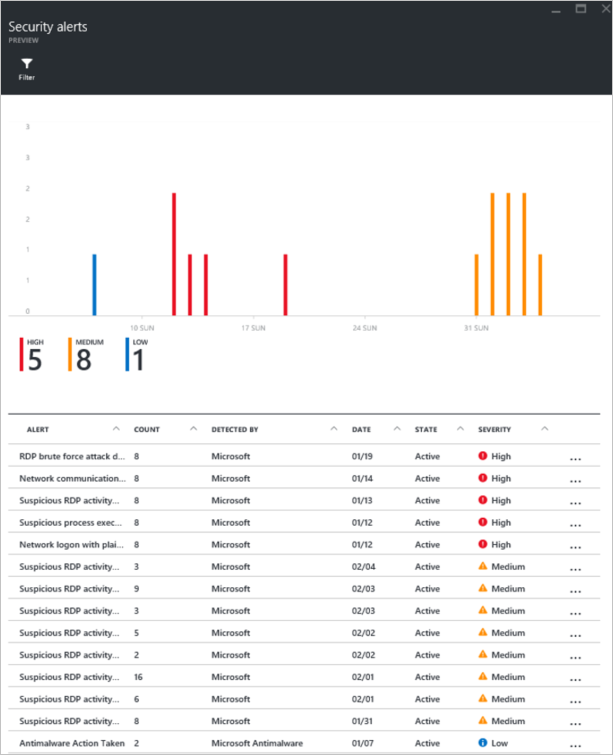
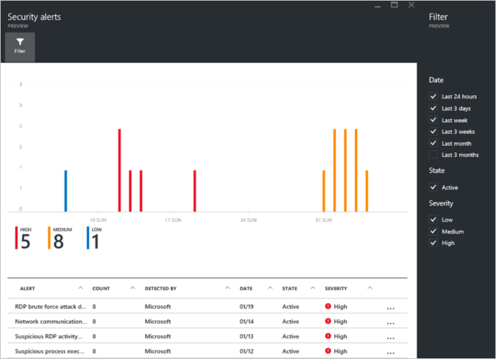
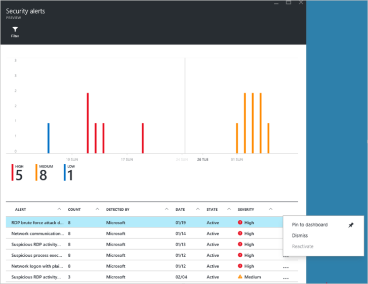

<properties
   pageTitle="Beveiligingswaarschuwingen beheren en erop reageren in Azure Security Center | Microsoft Azure"
   description="Dit document bevat informatie over het gebruik van de mogelijkheden van Azure Security Center om beveiligingswaarschuwingen te beheren en hierop te reageren."
   services="security-center"
   documentationCenter="na"
   authors="YuriDio"
   manager="swadhwa"
   editor=""/>

<tags
   ms.service="security-center"
   ms.topic="hero-article"
   ms.devlang="na"
   ms.tgt_pltfrm="na"
   ms.workload="na"
   ms.date="04/22/2016"
   ms.author="yurid"/>

# Beveiligingswaarschuwingen beheren en erop reageren in Azure Security Center
Dit document bevat informatie over het gebruik van de mogelijkheden van Azure Security Center om beveiligingswaarschuwingen te beheren en hierop te reageren.

> [AZURE.NOTE] De informatie in dit document is van toepassing op de preview-versie van Azure Security Center.

## Wat is Azure Security Center?
 Azure Security Center helpt u bij het detecteren, voorkomen van en reageren op bedreigingen dankzij een verhoogde zichtbaarheid van en controle over de beveiliging van uw Azure-resources. Het biedt geïntegreerde beveiligingsbewaking en beleidsbeheer voor uw abonnementen, helpt bedreigingen te detecteren die anders onopgemerkt zouden blijven, en werkt met een uitgebreid ecosysteem van beveiligingsoplossingen.

## Wat zijn beveiligingswaarschuwingen?
Security Center verzamelt, analyseert en integreert automatisch logboekgegevens van uw Azure-resources, het netwerk en geïntegreerde antimalware en firewalls om werkelijke dreigingen te detecteren en fout-positieven te reduceren. In Security Center wordt een lijst met beveiligingswaarschuwingen met prioriteiten, inclusief waarschuwingen van geïntegreerde partneroplossingen, weergegeven samen met de informatie die u nodig hebt om snel onderzoek te verrichten, en aanbevelingen voor het herstellen van een aanval.

De beveiligingsonderzoekers van Microsoft analyseren voortdurend opkomende bedreigingen overal ter wereld, met inbegrip van nieuwe aanvalspatronen en trends die worden waargenomen in de Microsoft-producten voor consumenten en bedrijven en in onlineservices. Security Center kan hierdoor de detectiealgoritmen bijwerken als er nieuwe beveiligingsproblemen en inbreuken worden gedetecteerd, waardoor klanten worden geholpen gelijke tred te houden met nieuwe bedreigingen. Hieronder volgen voorbeelden van enkele typen bedreigingen die door Security Center kunnen worden gedetecteerd:

- **Detectie van beveiligingsaanvallen via netwerkgegevens**: hierbij wordt gebruikgemaakt van machine learning-modellen die de normale patronen in het netwerkverkeer voor uw toepassingen kennen en is een effectievere detectie mogelijk van pogingen om toegang te krijgen die worden uitgevoerd door ongewenste actoren in plaats van legitieme gebruikers.
- **Detectie van beveiligingsaanvallen via eindpuntgegevens**: hiermee kan op basis van de analyse van computerlogboeken onderscheid worden gemaakt tussen mislukte en geslaagde pogingen.
- **VM's die communiceren met schadelijke IP-adressen**: hiermee wordt netwerkverkeer vergeleken met de kennis van Microsoft over wereldwijde dreigingen en worden geïnfecteerde computers gedetecteerd die met C&C-servers (Command and Control-servers) communiceren en omgekeerd.
- **Geïnfecteerde VM's**: hiermee worden op basis van gedragsanalyse van computerlogboeken en de correlatie met andere signalen afwijkende gebeurtenissen geïdentificeerd die waarschijnlijk het resultaat zijn van inbreuk op en misbruik van de computers.

## Beveiligingswaarschuwingen beheren

U kunt uw huidige waarschuwingen controleren met de tegel **Beveiligingswaarschuwingen**. Voer de volgende stappen uit om meer informatie over elke waarschuwing weer te geven:

1. Op het Security Center-dashboard ziet u de tegel **Beveiligingswaarschuwingen**.

    

2.  Klik op de tegel om de blade **Beveiligingswaarschuwingen** met meer informatie over de waarschuwingen te openen (zie hieronder).

    

In het onderste gedeelte van deze blade vindt u de details voor elke waarschuwing. Als u wilt sorteren, klikt u op de kolom waarop u wilt sorteren. Hieronder volgt de definitie voor elke kolom:

- **Waarschuwing**: een korte beschrijving van de waarschuwing.
- **Aantal**: een lijst met alle waarschuwingen van dit specifieke type die zijn gedetecteerd op een specifieke dag.
- **Gedetecteerd door**: de service die verantwoordelijk is voor activering van de waarschuwing.
- **Datum**: de datum waarop de gebeurtenis heeft plaatsgevonden.
- **Status**: de huidige status voor deze waarschuwing. Er zijn drie typen statussen:
    - **Actief**: de beveiligingswaarschuwing is gedetecteerd.
    - **Gesloten**: de beveiligingswaarschuwing is door de gebruiker gesloten. Deze status wordt meestal gebruikt voor waarschuwingen die zijn onderzocht, en die zijn verholpen of waarvan is vastgesteld dat ze eigenlijk geen aanval zijn.

- **Ernst**: de ernst kan hoog, gemiddeld of laag zijn.

U kunt waarschuwingen filteren op basis van datum, status en ernst. Het filteren van waarschuwingen kan nuttig zijn wanneer u minder beveiligingswaarschuwingen wilt weergeven. U kunt u bijvoorbeeld concentreren op de beveiligingswaarschuwingen van de afgelopen 24 uur, omdat u een mogelijke inbreuk in het systeem onderzoekt.

1. Klik op **Filter** op de blade **Beveiligingswaarschuwingen**. De blade **Filter** wordt geopend en u selecteert de gewenste waarden voor datum, status en ernst.

    

2.  Nadat u een beveiligingswaarschuwing hebt onderzocht, kunt u tot de conclusie komen dat het om een fout-positief voor uw omgeving gaat of dat deze duidt op een verwachte werking voor een bepaalde resource. Als u om wat voor reden dan ook vaststelt dat een beveiligingswaarschuwing niet van toepassing is, kunt u de waarschuwing sluiten en vervolgens uit uw weergave filteren. Er zijn twee manieren om een beveiligingswaarschuwing te sluiten. Klik met de rechtermuisknop op een waarschuwing en selecteer **Sluiten** of beweeg de muisaanwijzer over een item, klik op de drie punten die worden weergegeven aan de rechterkant en selecteer **Sluiten**. U kunt de beveiligingswaarschuwingen die u hebt gesloten, weergeven door op **Filter** te klikken en **Gesloten** te selecteren.

    

### Reageren op beveiligingswaarschuwingen
Selecteer een beveiligingswaarschuwing voor meer informatie over de gebeurtenis(sen) waarmee de waarschuwing is geactiveerd en welke stappen u zo nodig moet uitvoeren om een aanval te verhelpen. Beveiligingswaarschuwingen zijn gegroepeerd op type en datum. Als u op een beveiligingswaarschuwing klikt, wordt een blade met een lijst gegroepeerde waarschuwingen geopend.

In dit geval verwijzen de geactiveerde waarschuwingen naar verdachte RDP-activiteiten (Remote Desktop Protocol). In de eerste kolom ziet u welke resources zijn aangevallen; de tweede kolom bevat de tijd waarop de aanval heeft gevonden; de derde kolom bevat de status van de waarschuwing; en in de vierde kolom wordt de ernst van de aanval weergegeven. Bekijk deze informatie en klik op de resource die is aangevallen. Er wordt een nieuwe blade geopend met meer suggesties over wat u vervolgens kunt doen, zoals wordt weergegeven in het voorbeeld hieronder.

U vindt in het veld **Waarschuwing** van deze blade meer informatie over deze gebeurtenis. Deze aanvullende informatie biedt inzicht in wat de beveiligingswaarschuwing heeft geactiveerd, de doelresource, eventueel het bron-IP-adres en aanbevelingen voor het herstellen.  In sommige gevallen zal het bron-IP-adres leeg zijn (niet beschikbaar), omdat niet alle Windows-logboeken voor beveiligingsgebeurtenissen het IP-adres bevatten.

> [AZURE.NOTE] Het herstel dat door Security Center wordt voorgesteld, is afhankelijk van de beveiligingswaarschuwing. In sommige gevallen moet u wellicht andere Azure-mogelijkheden gebruiken om het aanbevolen herstel te implementeren. Als herstel voor deze aanval moet bijvoorbeeld het IP-adres op een zwarte lijst worden gezet dat door de aanval is gegenereerd. Hiervoor is de regel van een [netwerk-ACL](../virtual-network/virtual-networks-acl.md) of een [netwerkbeveiligingsgroep](../virtual-network/virtual-networks-nsg.md) nodig.

## Volgende stappen
In dit document hebt u kunnen lezen hoe u het beveiligingsbeleid in Security Center configureert. Zie de volgende onderwerpen voor meer informatie over Security Center:

- [Beveiligingsstatus bewaken in Azure Security Center](security-center-monitoring.md): meer informatie over het bewaken van de status van uw Azure-resources.
- [Partneroplossingen bewaken met Azure Security Center](security-center-partner-solutions.md): leer hoe u de integriteitsstatus van uw partneroplossingen kunt bewaken.
- [Azure Security Center FAQ](security-center-faq.md) (Veelgestelde vragen over Azure Security Center): raadpleeg veelgestelde vragen over het gebruik van de service.
- [Azure-beveiligingsblog](http://blogs.msdn.com/b/azuresecurity/): lees blogberichten over de beveiliging en naleving van Azure.

<!--HONumber=Jun16_HO2-->

