<properties
   pageTitle="Beveiligingsstatus bewaken in Azure Security Center | Microsoft Azure"
   description="Dit document helpt u aan de slag te gaan met de bewakingsmogelijkheden in Azure Security Center."
   services="security-center"
   documentationCenter="na"
   authors="YuriDio"
   manager="swadhwa"
   editor=""/>

<tags
   ms.service="security-center"
   ms.devlang="na"
   ms.topic="hero-article"
   ms.tgt_pltfrm="na"
   ms.workload="na"
   ms.date="06/06/2016"
   ms.author="yurid"/>

#Beveiligingsstatus bewaken in Azure Security Center
Dit document bevat informatie over het gebruik van de bewakingsmogelijkheden in Azure Security Center om naleving van het beleid te controleren.

> [AZURE.NOTE] De informatie in dit document is van toepassing op de preview-versie van Azure Security Center.

## Wat is Azure Security Center?
Azure Security Center helpt u bij het detecteren, voorkomen van en reageren op bedreigingen dankzij een verhoogde zichtbaarheid van en controle over de beveiliging van uw Azure-resources. Het biedt geïntegreerde beveiligingsbewaking en beleidsbeheer voor uw abonnementen, helpt bedreigingen te detecteren die anders onopgemerkt zouden blijven, en werkt met een uitgebreid ecosysteem van beveiligingsoplossingen

##Wat houdt de bewaking van de beveiligingsstatus in?
Bij het woord bewaking wordt misschien gesuggereerd dat er wordt gewacht tot een gebeurtenis plaatsvindt en dat er dan op de situatie wordt gereageerd. Bij beveiligingsbewaking is er echter sprake van een proactieve strategie waarbij uw resources worden gecontroleerd om systemen op te sporen die niet voldoen aan de standaarden of aanbevolen procedures van de organisatie.

##Beveiligingsstatus bewaken
Nadat u een [beveiligingsbeleid](security-center-policies.md) voor de resources van een abonnement hebt ingeschakeld, analyseert Security Center de beveiliging van uw resources om mogelijke beveiligingsproblemen op te sporen.  Informatie over uw netwerkconfiguratie is onmiddellijk beschikbaar. Het kan echter wel een uur of langer duren voordat er informatie over de configuratie van een virtuele machine, zoals de status van een beveiligingsupdate en configuratie van het besturingssysteem, beschikbaar komt. U kunt de beveiligingsstatus van uw resources samen met eventuele problemen op de blade **Beveiligingsstatus van de resource** bekijken. U kunt ook een overzicht van die problemen op de blade **Aanbevelingen** bekijken.

Zie [Implementing security recommendations in Azure Security Center](security-center-recommendations.md) (Beveiligingsaanbevelingen implementeren in Azure Security Center) voor meer informatie over het toepassen van aanbevelingen.

Op de tegel **Beveiligingsstatus van de resource** kunt u de beveiligingsstatus van uw resources bewaken. In het voorbeeld hieronder ziet u een aantal problemen met een hoge en gemiddelde ernst die uw aandacht vereisen. Het ingeschakelde beveiligingsbeleid is van invloed op de typen besturingselementen die worden bewaakt.

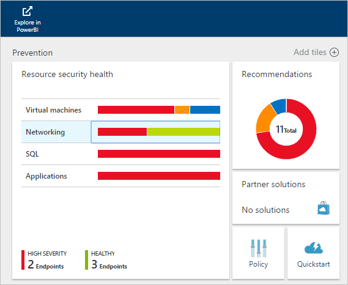

Als in Security Center een beveiligingsprobleem wordt gevonden dat moet worden verholpen, zoals een VM met ontbrekende beveiligingsupdates of een subnet zonder een [netwerkbeveiligingsgroep](../virtual-network/virtual-networks-nsg.md), wordt dat hier vermeld.

###Virtuele machines bewaken
Wanneer u op **Virtuele machines** in de tegel **Beveiligingsstatus van de resource** klikt, wordt de blade **Virtuele machines** geopend met meer informatie over stappen voor onboarding en preventie, evenals een lijst met alle VM's die worden bewaakt door Security Center (zie hieronder).

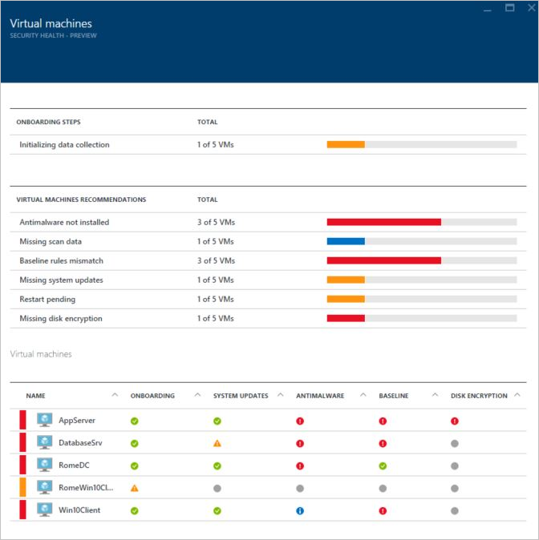

- Stappen voor onboarding
- Aanbevelingen voor virtuele machines
- Virtuele machines

U kunt in elke sectie een afzonderlijke optie selecteren om meer informatie weer te geven over de stap die wordt aanbevolen om het probleem op te lossen. In de volgende secties wordt nader op deze gebieden ingegaan.

####Stappen voor onboarding
In deze sectie wordt het totale aantal VM's weergegeven dat is geïnitialiseerd voor het verzamelen van gegevens en de huidige status. Wanneer voor alle VM's gegevensverzameling is geïnitialiseerd, zijn ze klaar om Security Center-beveiligingsbeleid te ontvangen. Als u op deze vermelding klikt, wordt de blade **Gegevensverzameling initialiseren** geopend en ziet u de namen van de VM's en de huidige status van het verzamelen van gegevens in de kolom **INSTALLATIESTATUS** (zie hieronder).

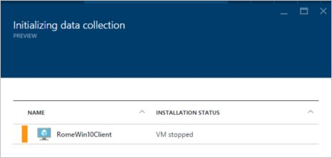

####Aanbevelingen voor virtuele machines
Deze sectie bevat een reeks aanbevelingen voor elke VM die wordt bewaakt door Azure Security Center. In de eerste kolom staat de aanbeveling, de tweede kolom bevat het totale aantal VM's dat wordt beïnvloed door die aanbeveling en in de derde kolom ziet u de ernst van het probleem (zie hieronder).

Elke aanbeveling heeft een set acties die kunnen worden uitgevoerd wanneer u erop klikt. Als u bijvoorbeeld op **Ontbrekende systeemupdates** klikt, wordt de blade **Ontbrekende systeemupdates** geopend. U ziet hier de VM's waarvoor patches ontbreken, en de ernst van de ontbrekende update (zie hieronder).

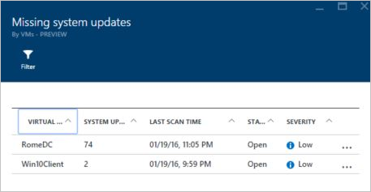

Op de blade **Ontbrekende systeemupdates** wordt een tabel met de volgende informatie weergegeven:

- **VIRTUELE MACHINE**: de naam van de virtuele machine waarvoor updates ontbreken.
- **SYSTEEMUPDATES**: het aantal systeemupdates dat ontbreekt.
- **LAST SCAN TIME** (TIJDSTIP VAN LAATSTE SCAN): het tijdstip waarop de VM voor het laatst door Security Center op updates is gecontroleerd.
- **STATUS**: de huidige status van de aanbeveling:
    - **Open**: de aanbeveling is nog niet opgelost
    - **Wordt uitgevoerd**: de aanbeveling wordt momenteel toegepast op deze resources; u hoeft geen actie te ondernemen
    - **Opgelost**: de aanbeveling is al voltooid (als het probleem is verholpen, wordt de vermelding lichter gekleurd weergegeven).
- **ERNST**: hiermee wordt de ernst van deze bepaalde aanbeveling beschreven:
    - **Hoog**: er bestaat een beveiligingsprobleem voor een belangrijke resource (toepassing, VM, netwerkbeveiligingsgroep) en dit probleem vereist uw aandacht
    - **Gemiddeld**: er zijn niet-kritieke of extra stappen nodig om een proces te voltooien of een beveiligingsprobleem op te lossen
    - **Laag**: een beveiligingsprobleem moet worden opgelost, maar dit vereist niet uw onmiddellijke aandacht. (Aanbevelingen met de ernstaanduiding Laag worden niet standaard weergegeven, maar u kunt hierop filteren als u deze aanbevelingen wilt bekijken.)

Klik op de naam van de VM om meer informatie voor de aanbeveling weer te geven. Er wordt een nieuwe blade voor die VM geopend met de lijst met updates (zie hieronder).

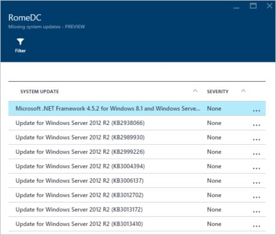

> [AZURE.NOTE] Dit zijn dezelfde beveiligingsaanbevelingen als die op de blade Aanbevelingen. Zie het artikel [Implementing security recommendations in Azure Security Center](security-center-recommendations.md) (Beveiligingsaanbevelingen implementeren in Azure Security Center) voor meer informatie over het toepassen van aanbevelingen. Dit is niet alleen van toepassing voor VM's, maar voor alle resources die beschikbaar zijn in de tegel Resourcestatus.

####Sectie voor virtuele machines
De sectie voor virtuele machines geeft een overzicht van alle VM's en aanbevelingen. Elke kolom vertegenwoordigt een reeks aanbevelingen (zie hieronder):

U kunt met het pictogram dat wordt weergegeven onder elke aanbeveling, snel zien welke VM's aandacht vereisen en wat het type aanbeveling is.

In het bovenstaande voorbeeld heeft één VM een kritieke aanbeveling met betrekking tot antimalwareprogramma's. Klik op de VM om meer informatie over de VM weer te geven. Er wordt een nieuwe blade geopend die deze VM vertegenwoordigt (zie hieronder).

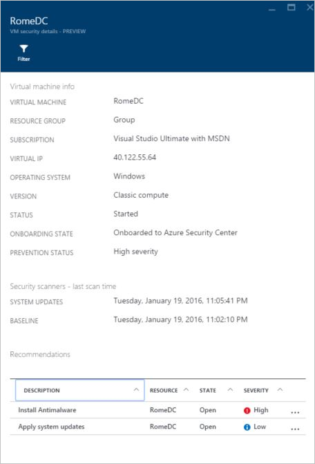

Deze blade bevat de beveiligingsdetails voor de VM. Onder in deze blade ziet u de aanbevolen actie en de ernst van elk probleem.

###Virtuele netwerken bewaken
Wanneer u op **Netwerken** in de tegel **Beveiligingsstatus van de resource** klikt, wordt de blade **Netwerken** geopend met meer details (zie hieronder):

####Aanbevelingen voor netwerken

Net als bij de informatie over de resourcestatus van virtuele machines biedt deze blade bovenin een overzicht van de problemen en onderin een lijst met bewaakte netwerken.

In de sectie met een uitsplitsing van de netwerkstatussen ziet u de mogelijke beveiligingsproblemen en aanbevelingen. Mogelijke aandachtspunten zijn:

- NGFW (Next Generation Firewall) is niet geïnstalleerd
- De netwerkbeveiligingsgroepen (NSG's) op subnetten zijn niet ingeschakeld
- De netwerkbeveiligingsgroepen op VM's zijn niet ingeschakeld
- Externe toegang via openbaar extern eindpunt beperken
- Status van internetgerichte eindpunten in orde

Wanneer u op een van deze aanbevelingen klikt, wordt een nieuwe blade geopend met meer informatie over de aanbeveling (zie onderstaand voorbeeld).

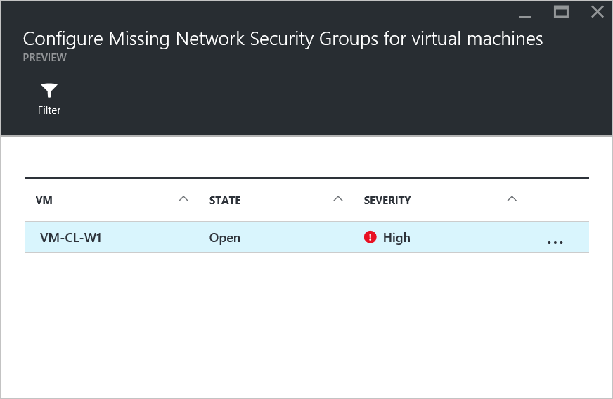

In dit voorbeeld bevat de blade **Ontbrekende netwerkbeveiligingsgroepen voor subnetten configureren** een lijst met subnetten en virtuele machines zonder NSG-beveiliging. Als u op het subnet klikt waarvoor u de NSG wilt toepassen, wordt een andere blade geopend.

Selecteer op de blade **Netwerkbeveiligingsgroep kiezen** de meest geschikte netwerkbeveiligingsgroep voor het subnet of maak een nieuwe netwerkbeveiligingsgroep. 

####Sectie Internetgerichte eindpunten

De sectie **Internetgerichte eindpunten** bevat de VM's die momenteel zijn geconfigureerd met een internetgericht eindpunt en de huidige status.

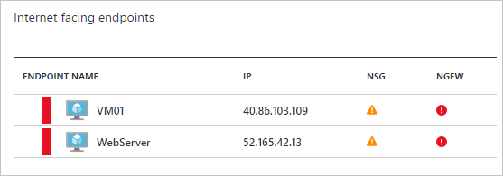

Deze tabel bevat de eindpuntnaam die de VM vertegenwoordigt, het internetgerichte IP-adres en de huidige status van de ernst van de NSG en de NGFW. De tabel is gesorteerd op ernst, zoals hieronder wordt beschreven:
- Rood (bovenaan): hoge prioriteit en moet onmiddellijk worden opgelost 
- Oranje: gemiddelde prioriteit en moet zo snel mogelijk worden opgelost
- Groen (laatste): integriteitsstatus

####Sectie Netwerktopologie

In de sectie **Netwerktopologie** ziet u een hiërarchische weergave van de resources zoals hieronder wordt weergegeven:

Deze tabel is gesorteerd (VM's en subnetten) op ernst, zoals hieronder wordt beschreven:
- Rood (bovenaan): hoge prioriteit en moet onmiddellijk worden opgelost 
- Oranje: gemiddelde prioriteit en moet zo snel mogelijk worden opgelost
- Groen (laatste): integriteitsstatus

In deze topologieweergave bevat het eerste niveau [Virtuele netwerken](../virtual-network/virtual-networks-overview.md), [Virtuele netwerkgateways](../vpn-gateway/vpn-gateway-site-to-site-create.md) en [Virtueel netwerk (klassiek)](../virtual-network/virtual-networks-create-vnet-classic-pportal.md). Het tweede niveau bevat subnetten en het derde niveau bevat de VM's die horen bij deze subnetten. In de rechterkolom wordt de huidige status van de netwerkbeveiligingsgroep (NSG) voor die resources weergegeven. Het volgende voorbeeld is het resultaat van het selecteren van de VM VM-CL-W1:

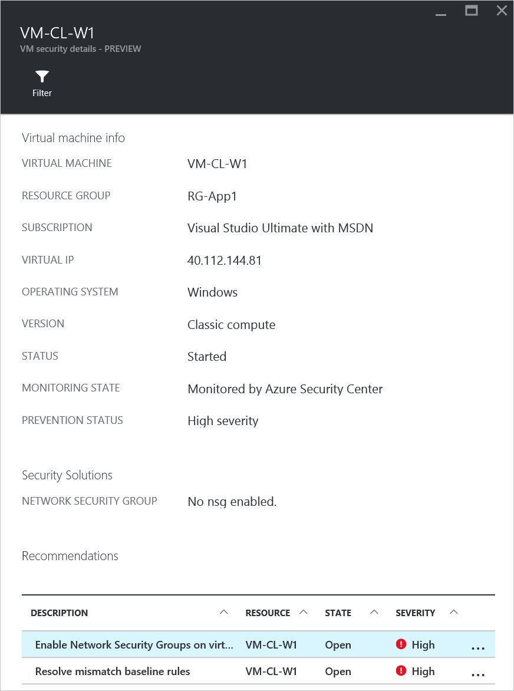

Het onderste gedeelte van deze blade bevat de aanbevelingen voor deze VM, vergelijkbaar met wat hierboven is beschreven. U kunt op een aanbeveling klikken voor meer informatie of om het benodigde beveiligingsbeheer of de benodigde beveiligingsconfiguratie toe te passen.

###SQL-resources bewaken
Wanneer u op **SQL** in de tegel **Beveiligingsstatus van de resource** klikt, wordt de SQL-blade geopend met aanbevelingen voor problemen zoals het niet ingeschakeld zijn van controle en Transparent Data Encryption. Ook bevat de blade aanbevelingen voor de algemene integriteitsstatus van de database.

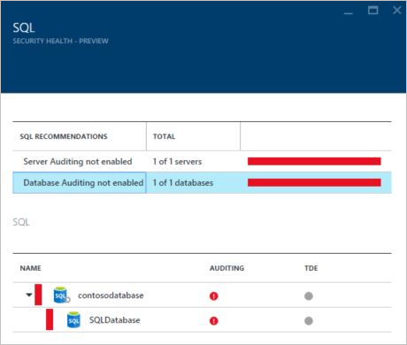

U kunt op al deze aanbevelingen klikken en meer informatie over verdere acties voor het oplossen van problemen weergeven. In het onderstaande voorbeeld is de aanbeveling **Databasecontrole is niet ingeschakeld** uitgevouwen.

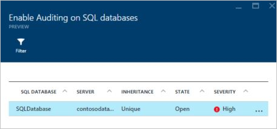

De blade **Controleren voor SQL-databases inschakelen** bevat de volgende informatie:

- Een lijst met SQL-databases
- De server waarop deze zich bevinden
- Informatie over of deze instelling is overgenomen van de server of dat deze uniek is in deze database
- De huidige status
- De ernst van het probleem

Als u op de database klikt om deze aanbeveling op te volgen, wordt de blade **Controle en detectie van bedreigingen** geopend (zie hieronder).

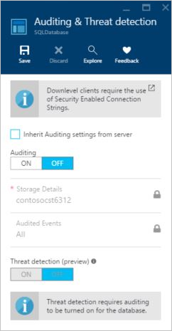

Als u de controle wilt inschakelen, hoeft u alleen maar **ON** onder de optie **Controle** te selecteren en vervolgens op **Opslaan** te klikken.

###Toepassingen bewaken
Als uw Azure-workload toepassingen in [resourcebeheer-VM's](../resource-manager-deployment-model.md) heeft met ontsloten webpoorten (TCP-poorten 80 en 443), kunnen deze in Security Center worden bewaakt om mogelijke beveiligingsproblemen op te sporen en stappen voor herstel aan te bevelen. Wanneer u op de tegel **Toepassingen** klikt, wordt de blade **Toepassingen** geopend met een reeks aanbevelingen in de sectie met preventiestappen. U ziet ook de uitsplitsing van de toepassingen per host/virtueel IP-adres zoals hieronder wordt weergegeven.

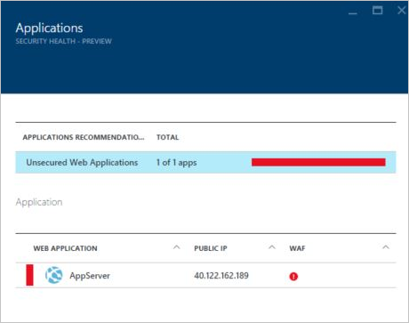

Net als bij de andere aanbevelingen kunt u op een aanbeveling klikken om meer informatie over het probleem en mogelijke oplossingen weer te geven. Het voorbeeld in de onderstaande afbeelding is een toepassing die als onbeveiligde webtoepassing is geïdentificeerd. Wanneer u de toepassing selecteert die als onveilig wordt beschouwd, wordt een andere blade geopend met de volgende optie:

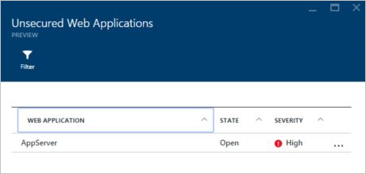

Op de blade **Niet-beveiligde webtoepassingen** wordt een lijst weergegeven van VM's die toepassingen bevatten die als onveilig worden beschouwd. In de lijst ziet u de VM-naam, de huidige status van het probleem en de ernst van het probleem. Als u op deze webtoepassing klikt, wordt de blade **Een Web Application Firewall toevoegen** geopend. Deze blade bevat opties waarmee u een externe WAF (Web Application Firewall) kunt installeren (zie hieronder).

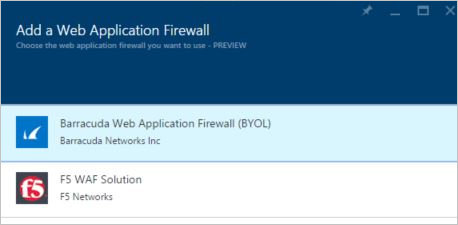

## Volgende stappen
In dit document hebt u kunnen lezen hoe u de bewakingsmogelijkheden in Azure Security Center gebruikt. Zie de volgende onderwerpen voor meer informatie over Azure Security Center:

- [Beveiligingsbeleid instellen in Azure Security Center](security-center-policies.md): leer hoe u beveiligingsinstellingen configureert in Azure Security Center
- [Beveiligingswaarschuwingen beheren en erop reageren in Azure Security Center](security-center-managing-and-responding-alerts.md): leer hoe u beveiligingswaarschuwingen kunt beheren en erop kunt reageren
- [Partneroplossingen bewaken met Azure Security Center](security-center-partner-solutions.md): leer hoe u de integriteitsstatus van uw partneroplossingen kunt bewaken.
- [Azure Security Center FAQ](security-center-faq.md) (Veelgestelde vragen over Azure Security Center): raadpleeg veelgestelde vragen over het gebruik van de service
- [Azure Security Blog](http://blogs.msdn.com/b/azuresecurity/) (Azure-beveiligingsblog): lees blogberichten over de beveiliging en naleving van Azure

<!--HONumber=Jun16_HO2-->

