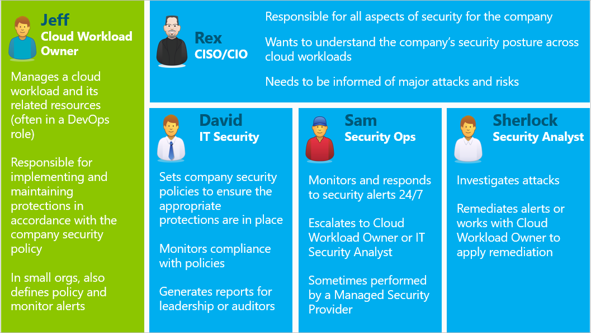
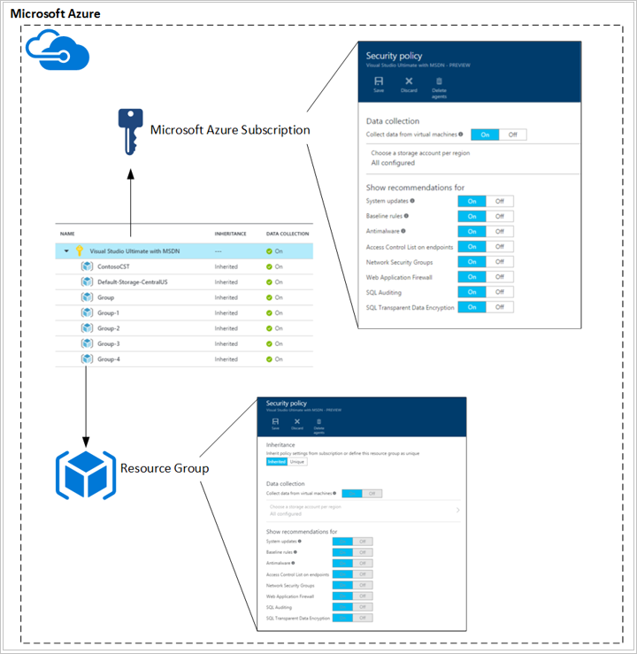
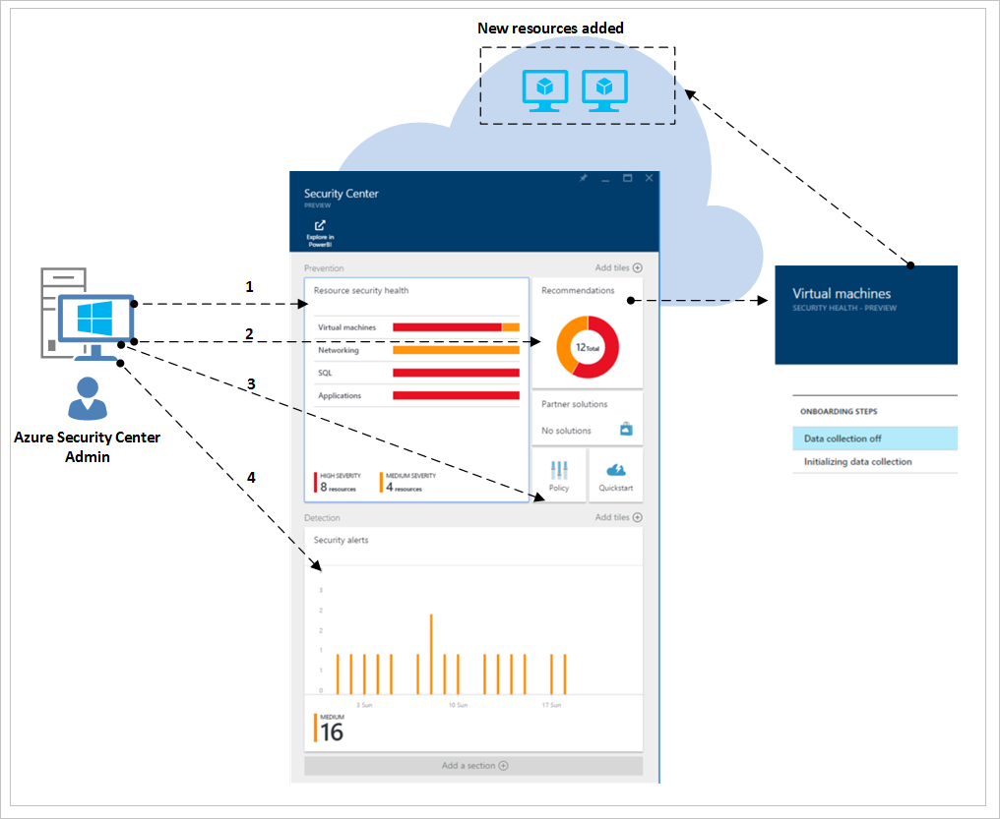
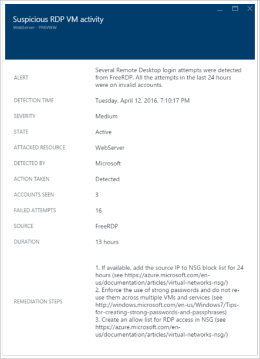

<properties
   pageTitle="Plannings- en bedieningsgids voor het Beveiligingscentrum | Microsoft Azure"
   description="Dit document helpt u met uw planning voordat u overstapt op het Azure Beveiligingscentrum en bevat aandachtspunten voor het dagelijks gebruik."
   services="security-center"
   documentationCenter="na"
   authors="YuriDio"
   manager="swadhwa"
   editor=""/>

<tags
   ms.service="security-center"
   ms.topic="hero-article" 
   ms.devlang="na"
   ms.tgt_pltfrm="na"
   ms.workload="na"
   ms.date="04/25/2016"
   ms.author="yurid"/>
 
# Plannings- en bedieningsgids voor het Azure Beveiligingscentrum
Deze gids is bedoeld voor IT-specialisten, IT-architecten, gegevensbeveiligingsanalisten en cloudbeheerders die willen gaan werken met het Azure Beveiligingscentrum.

> [AZURE.NOTE] De informatie in dit document is van toepassing op de voorbeeldversie van het Azure Beveiligingscentrum.

## Overzicht van het Azure Beveiligingscentrum
Het Azure Beveiligingscentrum helpt u bij het detecteren, voorkomen van en reageren op bedreigingen dankzij een verhoogde zichtbaarheid van en controle over de beveiliging van uw Azure-resources. Het biedt geïntegreerde beveiligingsbewaking en beleidsbeheer voor uw abonnementen, helpt bedreigingen te detecteren die anders onopgemerkt zouden blijven, en werkt met een uitgebreid ecosysteem van beveiligingsoplossingen. 

Raadpleeg de [Azure Security Center frequently asked questions (Veelgestelde vragen over het Azure Beveiligingscentrum)](security-center-faq.md) voor een lijst met veelgestelde vragen die ook nuttig kunnen zijn tijdens de ontwerp- en planningsfase.

## Planningsgids
Deze gids bevat een reeks stappen en taken die u kunt volgen om uw gebruik van het Azure Beveiligingscentrum te optimaliseren op basis van de beveiligingsvereisten en het cloudbeheermodel van uw organisatie. Als u optimaal wilt profiteren van het Azure Beveiligingscentrum, is het belangrijk te begrijpen hoe verschillende personen of teams binnen uw organisatie de service gaan gebruiken om te voldoen aan alle vereisten voor veilige ontwikkeling en gebruik, bewaking, bestuur en reactie op incidenten. De belangrijkste gebieden waarmee u rekening moet houden bij het plannen van het gebruik van het Azure Beveiligingscentrum zijn:

- Beveiligingsrollen en toegangsbeheer
- Beveiligingsbeleid en aanbevelingen
- Gegevensverzameling en -opslag
- Continue beveiligingsbewaking 
- Reageren op incidenten

In de volgende sectie leert u hoe u voor elk van deze gebieden een planning maakt en hoe u deze aanbevelingen toepast op grond van uw vereisten. 

## Beveiligingsrollen en toegangsbeheer 

Afhankelijk van de grootte en de structuur van uw organisatie kunnen meerdere individuen en teams het Beveiligingscentrum gebruiken om verschillende beveiligingstaken uit te voeren. Hieronder vindt u een voorbeeld van fictieve personen en hun respectieve rollen en beveiligingsverantwoordelijkheden:

Met het Azure Beveiligingscentrum kunnen deze personen voldoen aan deze verschillende verantwoordelijkheden. Bijvoorbeeld:

**Jeff (eigenaar van workloads in de cloud)**

- Bekijkt aanbevelingen voor het Beveiligingscentrum in de Azure Portal en voltooit deze 
- Kan ook een ticketingsysteem gebruiken om wijzigingen te volgen (doet aanbevelingen via een API)

**Rex (CISO/CIO)**

- Bekijkt rapporten over het Beveiligingscentrum met Power BI of Excel

**David (IT-beveiliging)**

- Stelt het beveiligingsbeleid in en geeft de beveiligingsstatus weer in de Azure Portal
- Analyseert gegevens en genereert rapporten in Power BI 

**Sam (beveiligingsbewerkingen)**

- Bekijkt waarschuwingen van het Beveiligingscentrum in de Azure Portal en sorteert deze 
- Kan een bestaand dashboard gebruiken (vult waarschuwingen aan met een API)

**Sherlock (beveiligingsanalist)**

- Bekijkt waarschuwingen van het Beveiligingscentrum in de Azure Portal 
- Kan een bestaand dashboard gebruiken (vult waarschuwingen aan met een API)
- Analyseert waarschuwingstrends in Power BI 
- Controleert gebeurtenislogboeken vanuit Storage

Het Azure Beveiligingscentrum gebruikt [op rollen gebaseerd toegangsbeheer (RBAC)](../active-directory/role-based-access-control-configure.md), dat [ingebouwde rollen](../active-directory/role-based-access-built-in-roles.md) biedt die kunnen worden toegewezen aan gebruikers, groepen en services in Azure. Wanneer een gebruiker het Azure Beveiligingscentrum opent, ziet deze alleen informatie over de resources waartoe hij of zij toegang heeft. Dit betekent dat de gebruiker de rol van eigenaar, bijdrager of lezer krijgt voor het abonnement of de resourcegroep waar een resource bij hoort. Met de voorgaande personen zou de volgende RBAC nodig zijn:

**Jeff (eigenaar van workloads in de cloud)**

- Resourcegroepeigenaar/medewerker

**David (IT-beveiliging)**

- Abonnementseigenaar/medewerker

**Sam (beveiligingsbewerkingen)**

- Abonnementslezer voor het bekijken van waarschuwingen
- Abonnementseigenaar/medewerker die nodig is om waarschuwingen te verwijderen

**Sherlock (beveiligingsanalist)**

- Abonnementslezer voor het bekijken van waarschuwingen
- Abonnementseigenaar/medewerker die nodig is om waarschuwingen op te lossen of te verwijderen
- Toegang tot opslag is mogelijk vereist

Andere belangrijke informatie om rekening mee te houden:

- Alleen abonnementseigenaren en bijdragers kunnen een beveiligingsbeleid bewerken
- Alleen abonnements- en resourcegroepeigenaren en bijdragers kunnen beveiligingsaanbevelingen voor een resource toepassen

Bij het plannen van het toegangsbeheer met het RBAC voor het Azure Beveiligingscentrum moet u zeker weten wie in uw organisatie het Azure Beveiligingscentrum gaat gebruiken en welke typen taken zij gaan uitvoeren. Configureer het RBAC vervolgens dienovereenkomstig. 

> [AZURE.NOTE] We raden u aan de rol toe te wijzen die gebruikers minimaal nodig hebben om hun taken uit te voeren. Wijs bijvoorbeeld gebruikers die alleen informatie hoeven te bekijken over de beveiligingstoestand van resources, maar geen maatregelen hoeven te nemen zoals het toepassen van aanbevelingen of het bewerken van beleid, de rol Lezer toe.

## Beveiligingsbeleid en aanbevelingen
Een beveiligingsbeleid bepaalt welke set controles wordt aanbevolen voor resources binnen het opgegeven abonnement of de opgegeven resourcegroep. In het Azure Beveiligingscentrum definieert u de beleidsregels op grond van de beveiligingsvereisten van uw bedrijf en het type toepassingen of de gevoeligheid van de gegevens. 

Beleidsregels die zijn ingeschakeld op het abonnementsniveau, worden automatisch doorgegeven naar alle resourcegroepen binnen het abonnement, zoals weergegeven in het volgende diagram: 

 

Zoals weergegeven in de afbeelding hierboven, kan beveiligingsbeleid voor resourcegroepen worden overgenomen van het abonnementsniveau. 

In sommige scenario's waarin u resources in een resourcegroep hebt die een andere set beleidsregels vereisen, kunt u overname uitschakelen en aangepaste beleidsregels toepassen op een specifieke resourcegroep. 

Als u aangepaste beleidsregels in bepaalde resourcegroepen nodig hebt, moet u overname in de resourcegroep uitschakelen en de beveiligingsbeleidsregels wijzigen. Als u bijvoorbeeld een paar workloads hebt waarvoor het beleid voor SQL Transparent Data Encryption niet nodig is, schakelt u het beleid uit op het abonnementsniveau en schakelt u het alleen in binnen de resourcegroepen waar SQL TDE vereist is.
 
Wanneer u begint met het maken van aangepaste beleidsregels voor verschillende resourcegroepen, moet u uw beleidsimplementatie plannen in de wetenschap dat bij een beleidsconflict (abonnement versus resourcegroep) het resourcegroepbeleid voorrang heeft. 

> [AZURE.NOTE] Als u moet controleren welke beleidsregels zijn gewijzigd, kunt u dat doen met de [Azure controlelogboeken](https://blogs.msdn.microsoft.com/cloud_solution_architect/2015/03/10/audit-logs-for-azure-events/). Beleidswijzigingen worden altijd geregistreerd in Azure controlelogboeken.

### Aanbevelingen voor beveiliging

Voordat u beleidsregels voor veiligheid configureert, moet u elk van de [aanbevelingen voor beveiliging](security-center-recommendations.md) controleren en bepalen of deze geschikt zijn voor uw verschillende abonnementen en resourcegroepen. Het is ook belangrijk te begrijpen welke actie wordt ondernomen om de aanbevelingen voor beveiliging toe te passen.

**Endpoint Protection**: als er op een virtuele machine geen oplossing voor eindpuntbeveiliging is ingeschakeld, wordt in het Azure Beveiligingscentrum aangeraden er een te installeren. Als u de voorkeur geeft aan een oplossing voor eindpuntbeveiliging hebt die u on-premises al hebt doorgevoerd, moet u besluiten of u dezelfde antimalware voor uw Azure VM’s gaat gebruiken . Het Azure Beveiligingscentrum biedt verschillende opties voor eindpuntbeveiliging.  U kunt de gratis Microsoft Antimalware gebruiken of u kunt kiezen uit een lijst met oplossingen voor eindpuntbeveiliging van geïntegreerde partners. Lees voor meer informatie over het implementeren van antimalware met behulp van het Azure Beveiligingscentrum het artikel [Enable antimalware in Azure Security Center](security-center-enable-antimalware.md).

**Systeemupdates**: het Azure Beveiligingscentrum identificeert en vindt virtuele machines waarvoor beveiligings- of kritieke besturingssysteemupdates ontbreken. Bedenk wie verantwoordelijk is voor het toepassen van updates wanneer deze nodig zijn en de manier waarop ze worden toegepast. Veel organisaties gebruiken WSUS, Windows Update of een ander hulpprogramma.

**Basislijnconfiguraties**: als besturingssysteemconfiguraties van virtuele machines niet overeenkomen met de aanbevolen basislijnen, wordt een aanbeveling opgehaald. Controleer de set basislijnen [hier](https://gallery.technet.microsoft.com/Azure-Security-Center-a789e335) en bekijk hoe besturingssysteemconfiguraties worden toegepast. 

**Schijfversleuteling**: als u schijven voor virtuele machines hebt die niet zijn versleuteld, raadt het Azure Beveiligingscentrum u aan om Azure Disk Encryption toe te passen. BitLocker voor Windows en DM-Crypt voor Linux worden dan gebruikt voor volumeversleuteling voor het besturingssysteem en gegevensschijven. Via deze aanbeveling wordt u doorgestuurd naar een [handleiding](security-center-disk-encryption.md) met stap-voor-stap-instructies om deze versleuteling uit te voeren. 

Let op: er zijn verschillende versleutelingsscenario's die u moet toepassen. U moet een planning maken voor de unieke vereisten van elk van deze scenario's:

- Versleuteling van nieuwe Azure Virtual Machines vanaf VHD's die u hebt versleuteld met behulp van uw eigen versleutelingssleutels
- Versleuteling van nieuwe Azure Virtual Machines die zijn gemaakt op basis van de Azure-galerie
- Versleuteling van Azure Virtual Machines die al onder Azure worden uitgevoerd

De planningsvereisten zijn verschillend voor elk van deze scenario's. Raadpleeg het [whitepaper Azure Disk Encryption](https://gallery.technet.microsoft.com/Azure-Disk-Encryption-for-a0018eb0) voor meer informatie over elk van deze scenario's.

**Web Application Firewall**: in het Azure Beveiligingscentrum worden virtuele machines geïdentificeerd waarop webtoepassingen worden uitgevoerd, en wordt aangeraden een Web Application Firewall (WAF) te installeren. Evalueer de beschikbare partneroplossingen om te bepalen welke het meest geschikt is voor uw organisatie en bepaal hoe de oplossing in licentie wordt gegeven (partners ondersteunen mogelijk Bring Your Own License en/of 'pay-as-you-go'-modellen). Lees het artikel [Add a web application firewall in Azure Security Center](security-center-add-web-application-firewall.md) voor meer informatie over het implementeren van een firewall voor een webtoepassing in uw Azure VM's met behulp van het Azure Beveiligingscentrum.

**Virtuele netwerken**: in het Azure Beveiligingscentrum worden de infrastructuur en configuratie van uw [Azure Virtual Network](https://azure.microsoft.com/documentation/services/virtual-network/) beoordeeld om te controleren of [netwerkbeveiligingsgroepen](../virtual-network/virtual-networks-nsg.md) zijn toegepast en correct zijn geconfigureerd met regels voor binnenkomend verkeer. U moet bepalen welke verkeersregels moeten worden gedefinieerd en dit doorgeven aan de personen die de verwante beveiligingsaanbevelingen moeten toepassen.

## Gegevensverzameling en -opslag

We raden nadrukkelijk aan om gegevensverzameling in te schakelen voor elk van uw abonnementen, omdat dit ervoor zorgt dat beveiligingsbewaking beschikbaar is voor alle virtuele machines. Gegevensverzameling wordt ingeschakeld via de Azure Monitoring Agent (ASMAgentLauncher.exe) en de extensie Azure Security Monitoring (ASMMonitoringAgent.exe). 

De extensie Azure Security Monitoring scant op verschillende, voor beveiliging relevante configuraties en verzamelt beveiligingslogboeken vanaf de virtuele machine. Deze gegevens worden verzonden naar een opslagaccount die u opgeeft. De scanmanager (ASMSoftwareScanner.exe) wordt ook geïnstalleerd op de virtuele machine en wordt gebruikt als een patchscanner.

Nadat gegevensverzameling is ingeschakeld in het beveiligingsbeleid, worden de bewakingsagent en extensies automatisch geïnstalleerd op alle bestaande en nieuw ondersteunde virtuele machines die zijn ingericht in Azure.  Het agentproces is niet-invasief en heeft geen invloed op de prestaties van de VM.
 
Als u gegevensverzameling op een bepaald moment wilt uitschakelen, kunt u dat doen in het beveiligingsbeleid. Selecteer de menuoptie Agents verwijderen om eerder geïmplementeerde bewakingsagents te verwijderen.

> [AZURE.NOTE] Lees de [Azure Security Center frequently asked questions (FAQ)](security-center-faq.md) als u een lijst met ondersteunde virtuele machines nodig hebt.

Voor elke regio waarin u virtuele machines uitvoert, kiest u de opslagaccount waarin de gegevens worden opgeslagen die zijn verzameld bij deze virtuele machines. Als u geen opslagaccount voor elke regio kiest, wordt er een voor u gemaakt. U kunt de opslaglocatie per regio kiezen of alle gegevens opslaan op een centrale locatie. Hoewel het beveiligingsbeleid kan worden ingesteld op het niveau van het Azure-abonnement en op dat van de resourcegroep, kan de regio voor uw opslagaccount alleen worden geselecteerd op abonnementsniveau.

Als u een opslagaccount gebruikt die wordt gedeeld tussen verschillende Azure-resources, lees dan het artikel [Azure Storage Scalability and Performance Targets](../storage/storage-scalability-targets.md) voor meer informatie over formaatlimieten en beperkingen. Uw abonnement heeft ook limieten voor de opslagaccount. Bekijk [Limieten, quota’s en beperkingen voor Azure-abonnementen en services](../azure-subscription-service-limits) voor meer informatie over deze limieten.

> [AZURE.NOTE] Kosten voor deze opslag zijn niet inbegrepen bij de prijs van de service voor het Azure Beveiligingscentrum en worden afzonderlijk in rekening gebracht tegen de gebruikelijke [tarieven voor Azure-opslag](https://azure.microsoft.com/pricing/details/storage/). 

Prestatie- en schaalbaarheidsoverwegingen moeten ook worden gepland op grond van de grootte van uw Azure-omgeving en de resources die uw opslagaccount gebruiken. Raadpleeg de [Controlelijst voor prestaties en schaalbaarheid van Microsoft Azure Storage](../storage/storage-performance-checklist.md) voor meer informatie.

## Continue beveiligingsbewaking

Na de eerste configuratie en toepassing van aanbevelingen voor het Azure Beveiligingscentrum, komen in de volgende stap de operationele processen voor Azure Beveiligingscentrum ter sprake. 

Als u vanuit de Azure Portal naar het Azure Beveiligingscentrum wilt gaan, klikt u op **Bladeren** en typt u **Beveiligingscentrum** in het veld **Filter**. De gebruiker ziet de gefilterde resultaten.

Het Azure Beveiligingscentrum heeft geen invloed op uw normale operationele procedures. Het bewaakt uw implementaties passief en doet aanbevelingen op grond van het beveiligingsbeleid dat u hebt ingeschakeld.

Het dashboard van het Azure Beveiligingscentrum bestaat uit twee hoofdonderdelen: 

- Preventie 
- Detectie 

Wanneer u gegevensverzameling in het Azure Beveiligingscentrum voor het eerst inschakelt voor uw huidige Azure-omgeving, moet u alle aanbevelingen doornemen. Dit kunt u doen op de blade **Aanbevelingen** of per resource (**Virtuele Machine**, **Netwerken**, **SQL** en **Toepassing**). 

Zodra u alle aanbevelingen hebt toegepast, wordt de sectie **Preventie** groen voor alle toegepaste resources. Continue bewaking wordt op dit punt eenvoudiger omdat u alleen acties onderneemt op basis van wijzigingen in de resourcebeveiligingsstatus en aanbevelingstegels.

De sectie **Detectie** is meer reactief en betreft waarschuwingen over problemen die nu plaatsvinden of hebben plaatsgevonden in het verleden en zijn gedetecteerd bij controles door het Azure Beveiligingscentrum of door systemen van derden. Met de tegel Beveiligingswaarschuwingen wordt een staafdiagram weergegeven dat het aantal dagelijks geconstateerde waarschuwingen voor gedetecteerde bedreigingen en de verdeling ervan over verschillende ernstigheidscategorieën (laag, gemiddeld, hoog) aangeeft. Lees voor meer informatie over beveiligingswaarschuwingen [Managing and responding to security alerts in Azure Security Center](security-center-managing-and-responding-alerts.md). 

> [AZURE.NOTE] U kunt uw gegevens uit het Azure Beveiligingscentrum ook visualiseren met Microsoft Power BI. Lees [Managing and responding to security alerts in Azure Security Center](security-center-powerbi.md).

### Bewaking voor nieuwe of gewijzigde resources

De meeste Azure-omgevingen zijn dynamisch, met nieuwe resources die regelmatig omhoog en omlaag worden verplaatst, met configuraties of wijzigingen enz. Het Azure Beveiligingscentrum zorgt ervoor dat de beveiligingsstatus van deze nieuwe resources voor u goed zichtbaar is.

Wanneer u nieuwe resources (virtuele machines, SQL Databases) toevoegt aan uw Azure-omgeving, detecteert het Azure Beveiligingscentrum deze resources automatisch en begint het de beveiliging ervan te bewaken. Als gegevensverzameling wordt ingeschakeld in het beveiligingsbeleid, worden er automatisch extra bewakingsmogelijkheden ingeschakeld voor uw virtuele machines. 

 

1.  Ga voor virtuele machines naar de tegel **Resourcebeveiligingsstatus** en klik op **Virtuele Machines**. Problemen bij het inschakelen van gegevensverzameling of verwante aanbevelingen worden zichtbaar in de sectie **Aanbevelingen voor bewaking**.
2.  Geef de **aanbevelingen** weer om te zien welke beveiligingsrisico's mogelijk zijn geïdentificeerd voor de nieuwe resource.
3.  Het is heel gebruikelijk dat wanneer nieuwe virtuele machines worden toegevoegd aan uw omgeving, eerst alleen het besturingssysteem wordt geïnstalleerd. De resource-eigenaar heeft wellicht enige tijd nodig om andere apps te implementeren die door deze VM’s worden gebruikt.  In het ideale geval moet u de uiteindelijke doelstelling van deze workload kennen. Wordt het een toepassingsserver? Op grond van wat deze nieuwe workload gaat worden, kunt u het juiste **beveiligingsbeleid** inschakelen. Dit is de derde stap in deze werkstroom.
4.  Naarmate nieuwe resources worden toegevoegd aan uw Azure-omgeving, kunnen er nieuwe waarschuwingen worden weergegeven in de tegel **Beveiligingswaarschuwingen**. Controleer altijd of er nieuwe waarschuwingen in deze tegel worden weergegeven en neem maatregelen op grond van de aanbevelingen van het Azure Beveiligingscentrum.

U zult ook regelmatig de status van bestaande resources willen controleren om configuratiewijzigingen te identificeren die hebben geleid tot beveiligingsrisico's, afwijking van aanbevolen basislijnen en beveiligingswaarschuwingen. Begin bij het dashboard van het Azure Beveiligingscentrum. Van daaruit hebt u drie belangrijke gebieden die u consequent moet controleren.

 

1.  Het venster **Recourcebeveiligingsstatus** biedt snel toegang tot uw belangrijkste resources. Gebruik deze optie om uw virtuele machines, netwerken, SQL en toepassingen te bewaken. 
2.  In het venster **Aanbevelingen** kunt u de aanbevelingen van het Azure Beveiligingscentrum controleren. Tijdens de continue bewaking merkt u misschien dat u niet dagelijks aanbevelingen krijgt. Dit is normaal omdat u alle aanbevelingen hebt gevolgd bij de eerste configuratie van het Azure Beveiligingscentrum. Daarom bevat deze sectie niet elke dag nieuwe informatie en hoeft u deze alleen te raadplegen wanneer dat nodig is.
3.  Het paneel **Detectie** kan ofwel heel vaak, of zeer incidenteel veranderen. Controleer altijd uw beveiligingswaarschuwingen en neem maatregelen op grond van de aanbevelingen van het Azure Beveiligingscentrum. 

## Reageren op incidenten

Het Azure Beveiligingscentrum detecteert en waarschuwt voor bedreigingen wanneer deze optreden. Organisaties moeten controleren op nieuwe beveiligingswaarschuwingen en zo nodig maatregelen nemen om het probleem verder te onderzoeken of de aanval af te weren.

> [AZURE.NOTE] Dit artikel is niet bedoeld om u te helpen uw eigen reactieplan voor incidenten te maken. U kunt de [Computer Security Incident Handling Guide](http://nvlpubs.nist.gov/nistpubs/SpecialPublications/NIST.SP.800-61r2.pdf) van het National Institute of Standards and Technology (NIST) gebruiken als richtlijn om uw eigen plan te ontwikkelen.

Elke beveiligingswaarschuwing bevat informatie die kan worden gebruikt om beter te begrijpen wat de aard van de aanval is en om mogelijke oplossingen voor te stellen. Sommige waarschuwingen bevatten ook koppelingen naar meer informatie of naar andere informatiebronnen binnen Azure. U kunt de verschafte informatie gebruiken om verder onderzoek te doen en om te beginnen met risicobeperking.

Het volgende voorbeeld betreft een verdachte RDP-activiteit die op dat moment plaatsvindt

Zoals u ziet, bevat deze blade informatie over het tijdstip waarop de aanval plaatsvond, de hostnaam van de bron, de VM die het doelwit was en aanbevolen maatregelen. Onder bepaalde omstandigheden kunnen de brongegevens van de aanval leeg zijn. Lees [Missing Source Information in Azure Security Center Alerts](https://blogs.msdn.microsoft.com/azuresecurity/2016/03/25/missing-source-information-in-azure-security-center-alerts/) voor meer informatie over dit type gedrag.

| **Niveau**        | **Aanvalsdetectie**                     | **Voorgestelde risicobeperking**                                                                       |
|------------------|------------------------------------------|-----------------------------------------------------------------------------------------------|
| Netwerk          | RDP-aanvalsdetectie                | Verklein de aanvalsmogelijkheden door overbodige open eindpunten te verwijderen, configureer ACL's en gebruik sterke wachtwoorden |
| Virtuele machines | SVCHOST uitgevoerd vanuit de verkeerde directory | Verplaats de VM naar een ander (geïsoleerd) subnet, scan deze en maak deze opnieuw,                        |
| Toepassing      | SQL-injectie in Azure-database          | Verhard databaseconfiguraties                                                                |

## Volgende stappen
In dit document hebt u kunnen lezen hoe u het beveiligingsbeleid configureert in het Beveiligingscentrum. Zie de volgende onderwerpen voor meer informatie over het Beveiligingscentrum:

- [Security health monitoring in Azure Security Center](security-center-monitoring.md): ontdek hoe u de status van uw Azure-resources kunt monitoren.
- [Azure Security Center FAQ](security-center-faq.md): raadpleeg veelgestelde vragen over het gebruik van de service.
- [Azure Security Blog](http://blogs.msdn.com/b/azuresecurity/): lees blogposts over de beveiliging en compliance van Azure.

<!--HONumber=Jun16_HO2-->

