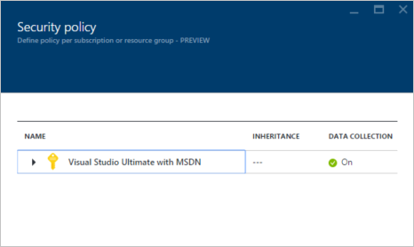
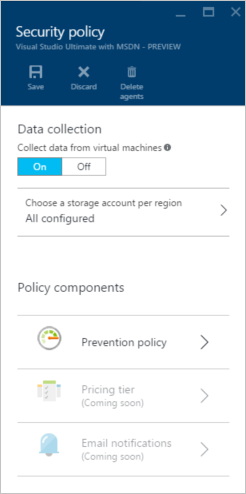
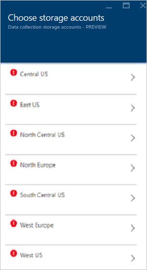
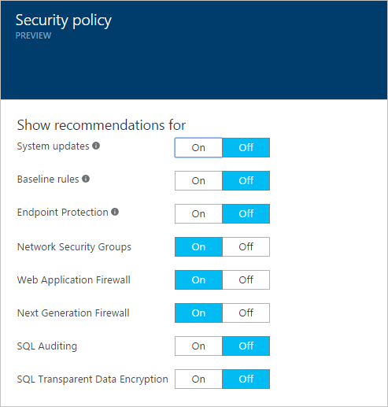
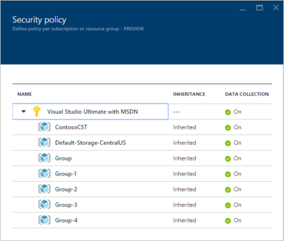
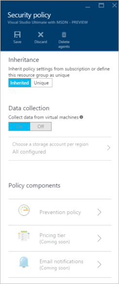

<properties
   pageTitle="Aan de slag met Azure Security Center | Microsoft Azure"
   description="In dit document leest u hoe u beveiligingsbeleid configureert in Azure Security Center."
   services="security-center"
   documentationCenter="na"
   authors="YuriDio"
   manager="swadhwa"
   editor=""/>

<tags
   ms.service="security-center"
   ms.devlang="na"
   ms.topic="hero-article"
   ms.tgt_pltfrm="na"
   ms.workload="na"
   ms.date="06/03/2016"
   ms.author="yurid"/>

# Beveiligingsbeleid instellen in Azure Security Center
Dit document helpt u om beveiligingsbeleid in Azure Security Center te configureren door u te begeleiden bij de stappen die nodig zijn om deze taak uit te voeren.

> [AZURE.NOTE] De informatie in dit document is van toepassing op de preview-versie van Azure Security Center.

## Wat is Azure Security Center?
Azure Security Center helpt u bij het detecteren, voorkomen van en reageren op bedreigingen dankzij een verhoogde zichtbaarheid van en controle over de beveiliging van uw Azure-resources. Het biedt geïntegreerde beveiligingsbewaking en beleidsbeheer voor uw abonnementen, helpt bedreigingen te detecteren die anders onopgemerkt zouden blijven, en werkt met een uitgebreid ecosysteem van beveiligingsoplossingen.

## Wat is beveiligingsbeleid?
Een beveiligingsbeleid bepaalt welke set besturingselementen wordt aanbevolen voor resources binnen het opgegeven abonnement of de opgegeven resourcegroep. In Azure Security Center definieert u beleid voor uw Azure-abonnementen of -resourcegroep overeenkomstig de behoeften van uw bedrijf en het type toepassingen of de vertrouwelijkheid van de gegevens in elk abonnement.

Zo kunnen er voor resources die worden gebruikt voor ontwikkeling of tests andere beveiligingsvereisten zijn dan voor resources die worden gebruikt voor productietoepassingen. Ook kan voor toepassingen met gereglementeerde gegevens, zoals PII (Personally Identifiable Information), een hoger beveiligingsniveau vereist zijn. Het beveiligingsbeleid dat in Azure Security Center is ingeschakeld, bepaalt de beveiligingsaanbevelingen en bewaking om u te helpen mogelijke beveiligingsproblemen te identificeren en bedreigingen te verhelpen.

## Beveiligingsbeleid instellen voor abonnementen

U kunt voor elk abonnement en elke resourcegroep een beveiligingsbeleid configureren. Het beveiligingsbeleid kan alleen worden gewijzigd door een eigenaar of bijdrager van het abonnement. Volg de onderstaande stappen om een beveiligingsbeleid in Azure Security Center te configureren:

1. Klik op de tegel **Beveiligingsbeleid** in het Azure Security Center-dashboard.

2. Selecteer in de blade **Beveiligingsbeleid - Het beleid per abonnement of resourcegroep definiëren** die aan de rechterkant wordt weergegeven, het abonnement waarvoor u het beveiligingsbeleid wilt inschakelen. Als u een beveiligingsbeleid voor een resourcegroep wilt inschakelen in plaats van voor het hele abonnement, bladert u omlaag naar de volgende sectie waar het instellen van beveiligingsbeleid voor resourcegroepen wordt besproken.

    

3. De blade **Beveiligingsbeleid** voor dat abonnement wordt geopend met een reeks opties die vergelijkbaar zijn met de opties die hieronder worden weergegeven:

    

4. Zorg ervoor dat de optie **Gegevens van virtuele machines verzamelen** is ingesteld op **Aan**. Met deze optie worden er automatisch logboekgegevens verzameld voor bestaande en nieuwe resources. 

    >[AZURE.NOTE] U kunt het beste gegevensverzameling inschakelen voor al uw abonnementen, omdat dit ervoor zorgt dat beveiligingsbewaking beschikbaar is voor alle bestaande en nieuwe VM's. Bij het inschakelen van gegevensverzameling wordt de bewakingsagent geïnstalleerd. Als u het verzamelen van gegevens nu niet vanaf deze locatie wilt inschakelen, kunt u dit later doen vanuit de weergaven voor de status en aanbevelingen. U kunt het verzamelen van gegevens ook alleen voor het abonnement of bepaalde VM's inschakelen. Zie [Azure Security Center FAQ](security-center-faq.md) (Veelgestelde vragen over Azure Security Center) voor meer informatie over de ondersteunde VM's.

5. Als uw opslagaccount nog niet is geconfigureerd, wordt er mogelijk een waarschuwing weergegeven zoals in de onderstaande afbeelding als u **Beveiligingsbeleid** opent:

    

6. Als deze waarschuwing wordt weergegeven, klikt u op deze optie en selecteert u de regio (zie onderstaande afbeelding):

    

7. Voor elke regio waarin u virtuele machines uitvoert, kiest u het opslagaccount waarin de gegevens worden opgeslagen die worden verzameld bij deze virtuele machines. Hierdoor kunt u eenvoudig gegevens in hetzelfde geografische gebied bewaren met het oog op privacy en ten behoeve van de onafhankelijkheid van de gegevens. Selecteer de regio die u wilt gebruiken en selecteer vervolgens het opslagaccount.

8. Klik in de blade **Opslagaccounts kiezen** op **OK**.

    > [AZURE.NOTE] U kunt de gegevens van virtuele machines in verschillende regio's desgewenst samenvoegen in één centraal opslagaccount. Zie [Azure Security Center FAQ](security-center-faq.md) (Veelgestelde vragen over Azure Security Center) voor meer informatie.

9. Klik in de blade **Beveiligingsbeleid** op **Aan** om de beveiligingsaanbevelingen in te schakelen die u wilt gebruiken voor dit abonnement. Klik op de optie **Preventiebeleid**. De blade **Beveiligingsbeleid** wordt geopend, zoals hieronder wordt weergegeven. 

    

Gebruik de onderstaande tabel als referentie om te begrijpen wat elke optie doet:

| Beleid | Wanneer Status is ingesteld op Aan |
|----- |-----|
| Systeemupdates | Hiermee wordt dagelijks een lijst met beschikbare beveiligingsupdates en essentiële updates opgehaald van Windows Update of WSUS, afhankelijk van welke service is geconfigureerd voor de betreffende virtuele machine en wordt aanbevolen dat de ontbrekende updates worden toegepast. |
| Basislijnregels | Hiermee worden dagelijks de besturingssysteemconfiguraties geanalyseerd die de virtuele machine kwetsbaarder kunnen maken voor aanvallen en worden er configuratiewijzigingen aanbevolen om deze beveiligingsproblemen te verhelpen. Zie de [lijst met aanbevolen basislijnen](https://gallery.technet.microsoft.com/Azure-Security-Center-a789e335) voor meer informatie over de specifieke configuraties die worden bewaakt. |
| Eindpuntbeveiliging | Hiermee wordt aanbevolen dat voor alle virtuele machines in Windows eindpuntbeveiliging wordt ingericht om virussen, spyware en andere schadelijke software op te sporen en te verwijderen. 
| Netwerkbeveiligingsgroepen | Hiermee wordt de configuratie van [netwerkbeveiligingsgroepen](../virtual-network/virtual-networks-nsg.md) (NSG's) aanbevolen om binnenkomend en uitgaand verkeer naar subnetten en netwerkinterfaces te beheren. NSG's die worden geconfigureerd voor een subnet, worden overgenomen door alle netwerkinterfaces van virtuele machines, tenzij anders is aangegeven. Behalve dat wordt gecontroleerd of een NSG is geconfigureerd, worden met deze optie ook de beveiligingsregels voor binnenkomend verkeer beoordeeld als er regels zijn die binnenkomend verkeer toestaan. |
| Web Application Firewall | Hiermee wordt aanbevolen Web Application Firewall op virtuele machines in te richten wanneer [ILPIP](../virtual-network/virtual-networks-instance-level-public-ip.md) (Instance Level Public IP) wordt gebruikt en de gekoppelde NSG-regels voor binnenkomende beveiliging zijn geconfigureerd voor toegang tot poort 80/443. Er wordt gebruikgemaakt van Load Balanced IP (VIP) en de gekoppelde taakverdelings- en binnenkomende NAT-regels zijn geconfigureerd voor toegang tot poort 80/443 (zie [Azure Resource Manager Support for Load Balancer](../load-balancer/load-balancer-arm.md) (Azure Resource Manager-ondersteuning voor load balancer) voor meer informatie) |
| Next Generation Firewall | Hiermee wordt meer netwerkbeveiliging toegevoegd dan met de netwerkbeveiligingsgroepen die in Azure zijn ingebouwd. Security Center detecteert implementaties waarvoor Next Generation Firewall wordt aanbevolen en biedt u de mogelijkheid een virtuele toepassing in te richten. |
| Controleren voor SQL | Hiermee wordt aanbevolen dat de controle van toegang tot Azure SQL-servers en -databases wordt ingeschakeld voor naleving, geavanceerde detectie en onderzoek. |
| Transparent Data Encryption voor SQL | Hiermee wordt aanbevolen dat versleuteling-at-rest wordt ingeschakeld voor uw Azure SQL-databases, gekoppelde back-ups en transactielogboekbestanden zodat uw gegevens zelfs bij een inbreuk niet kunnen worden gelezen. |

11. Wanneer u klaar bent met het configureren van alle opties, klikt u op **OK** in de blade **Beveiligingsbeleid** met de aanbevelingen en klikt u op **Opslaan** in de blade **Beveiligingsbeleid** met de oorspronkelijke instellingen.

## Beveiligingsbeleid instellen voor resourcegroepen

Als u liever per resourcegroep een beveiligingsbeleid configureert, zijn de stappen ongeveer gelijk aan de stappen die u hebt gebruikt voor het instellen van beveiligingsbeleid voor abonnementen. Het belangrijkste verschil is dat u de naam van het abonnement moet uitvouwen en de resourcegroep moet selecteren waarvoor u het unieke beveiligingsbeleid wilt configureren:

Nadat u de resourcegroep hebt geselecteerd, wordt de blade **Beveiligingsbeleid** geopend. De optie **Overname** is ingeschakeld, wat betekent dat alle beveiligingsbeleid voor deze resourcegroep wordt overgenomen van het abonnementsniveau. U kunt deze configuratie wijzigen als u een aangepast beveiligingsbeleid per resourcegroep wilt. Als dat het geval is, moet u **Uniek** selecteren en de wijzigingen onder de optie **Preventiebeleid** aanbrengen.

> [AZURE.NOTE] Als er een conflict tussen het beleid op abonnementsniveau en het beleid op het niveau van de resourcegroep is, heeft het beleid op het niveau van de resourcegroep voorrang.

## Volgende stappen

In dit document hebt u kunnen lezen hoe u het beveiligingsbeleid configureert in Azure Security Center. Zie de volgende onderwerpen voor meer informatie over Azure Security Center:

- [Plannings- en bedieningsgids voor het Azure Beveiligingscentrum](security-center-planning-and-operations-guide.md): leer de ontwerpoverwegingen kennen en plan hiervoor bij de overstap naar Azure Security Center.
- [Beveiligingsstatus bewaken in Azure Security Center](security-center-monitoring.md): leer hoe u de status van uw Azure-resources bewaakt
- [Beveiligingswaarschuwingen beheren en erop reageren in Azure Security Center](security-center-managing-and-responding-alerts.md): leer hoe u beveiligingswaarschuwingen kunt beheren en erop kunt reageren
- [Partneroplossingen bewaken met Azure Security Center](security-center-partner-solutions.md): leer hoe u de integriteitsstatus van uw partneroplossingen kunt bewaken.
- [Azure Security Center FAQ](security-center-faq.md) (Veelgestelde vragen over Azure Security Center): raadpleeg veelgestelde vragen over het gebruik van de service
- [Azure Security Blog](http://blogs.msdn.com/b/azuresecurity/) (Azure-beveiligingsblog): lees blogberichten over de beveiliging en naleving van Azure

<!--HONumber=Jun16_HO2-->

