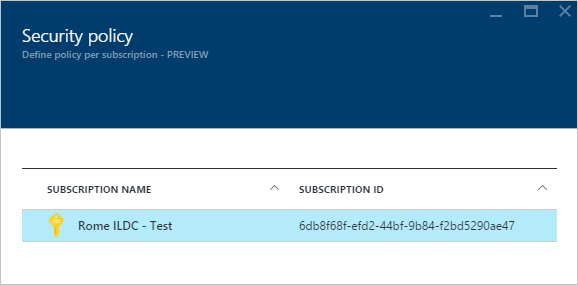
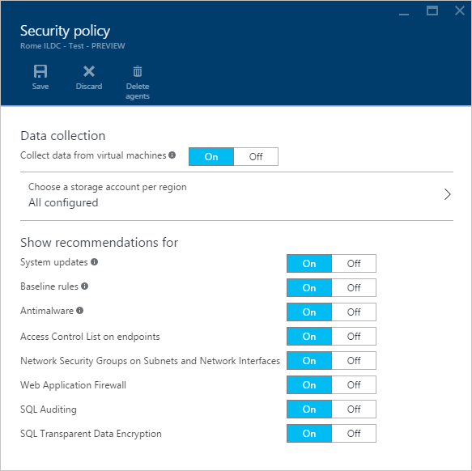

<properties
   pageTitle="Getting started with Azure Security Center | Microsoft Azure"
   description="This document helps you to configure security policies in Azure Security Center."
   services="security-center"
   documentationCenter="na"
   authors="YuriDio"
   manager="swadhwa"
   editor=""/>

<tags
   ms.service="security-center"
   ms.devlang="na"
   ms.topic="article"
   ms.tgt_pltfrm="na"
   ms.workload="na"
   ms.date="12/16/2015"
   ms.author="yurid"/>

#Setting security policies in Azure Security Center
This document helps you to configure security policies in Azure Security Center by guiding you through the necessary steps to perform this task.

> [AZURE.NOTE] The information in this document applies to the preview release of Azure Security Center.

## What is Azure Security Center?
Azure Security Center helps you prevent, detect, and respond to threats with increased visibility into and control over the security of your Azure resources. It provides integrated security monitoring and policy management across your subscriptions, helps detect threats that might otherwise go unnoticed, and works with a broad ecosystem of security solutions.

##What are security policies?
A security policy defines the set of controls which are recommended for resources within the specified subscription. In Azure Security Center, you define policies for your Azure subscriptions according to your company security needs and the type of applications or sensitivity of the data in each subscription.
 
For example, resources used for development or test may have different security requirements than those used for production applications. Likewise, applications with regulated data like PII (Personally Identifiable Information) may require a higher level of security. The security policies enabled in Azure Security Center will drive security recommendations and monitoring to help you identify potential vulnerabilities and mitigate threats.

##Setting security policies

Security policies are configured for each subscription. To modify a security policy, you must be an Owner or Contributor of that subscription. Follow the steps below to configure security polices in Azure Security Center:

1. Click on the **Security Policy** tile in the Azure Security Center dashboard.
 
2. In the **Security Policy - Define policy per subscription** blade that opens up on the right side, select the subscription that you want to enable the security policy.

    

3. The **Security policy**  blade for that subscription will open with a set of options similar to the one shown below:

    

    
4. Make sure **Collect data from virtual machines** options is **On**. This option enables automatic log collection for existing and new resources. 

5. If your storage account is not configured yet, you may see a similar warning showed in the figure below when you open the **Security Policy**:

     

6. If you see this warning, click this option and select the region as shown in the figure below:

     

7. For each region in which you have virtual machines running, choose the storage account where data collected from those virtual machines is stored. This makes it easy for you to keep data in the same geographic area for privacy and data sovereignty purposes. Once you decide which region you will use, select the region and then select the storage account.

8. In the **Choose storage accounts** blade click **OK**.

    > [AZURE.NOTE] If you prefer, you can aggregate data from virtual machines in various regions in one central storage account. Refer to the [Azure Security Center FAQ](security-center-faq.md) for more information

9. In the **Security Policy** blade click **On** to enable the security recommendations that you want to use on this subscription. Use the table below as a reference to understand what each option will do:  

    | Policy | State On |
|----- |-----|
| System Updates | Retrieves a list of available updates from Windows Update or WSUS, depending on which service is configured for that virtual machine, every 12 hours and recommends missing updates be installed on your Windows virtual machines. |
| Baseline Rules | Analyzes all supported virtual machines every 12 hours to identify any OS configurations that could make the virtual machine more vulnerable to attack and recommends configuration changes to address these vulnerabilities. See the [list of recommended baselines](https://gallery.technet.microsoft.com/Azure-Security-Center-a789e335) for more information on the specific configurations being monitored. |
| Antimalware | Recommends antimalware be provisioned for all Windows virtual machines to help identify and remove viruses, spyware, and other malicious software. |
| Access Control List on endpoints | Recommends that an [Access Controls List](virtual-machines-set-up-endpoints.md) (ACL) be configured to limit access to a Classic virtual machine endpoints. This would typically be used to ensure that only users who are connected to the corporate network can access the virtual machines. |
| Network security groups on Subnets and Network Interface | Recommends that [Network Security Groups](virtual-networks-nsg.md) (NSGs) be configured to control inbound and outbound traffic to subnets and network interfaces for Resource Manager virtual machines. NSGs configured for a subnet will be inherited by all virtual machine network interfaces unless otherwise specified. In addition to checking that an NSG has been configured, Inbound Security Rules are assessed to identify rules that allow Any incoming traffic. |
| Web Application Firewall | Recommends a Web Application Firewall be provisioned on Resource Manager virtual machines when: [Instance Level Public IP](virtual-networks-instance-level-public-ip.md) (ILPIP) is used and the associated NSG Inbound Security Rules are configured to allow access to port 80/443. Load Balanced IP (VIP) is used and the associated load balancing and inbound NAT rules are configured to allow access to port 80/443 (for more information, see [Azure Resource Manager Support for Load Balancer](load-balancer-arm.md)) |
| SQL Auditing | Recommends that auditing of access to Azure SQL Servers and Databases be enabled for compliance, advanced detection and investigation purposes. |
| SQL Transparent Data Encryption | Recommends that encryption at rest be enabled for your Azure SQL databases, associated backups and transaction log files so that even if your data is breached, it will not be readable. |

10. Once you finish configuring all options, click **Save** to commit those changes.

> [AZURE.NOTE] Enabling data collection installs the monitoring agent. If you don't want to turn on data collection now from this location, you can do it later from the health and recommendations views. You can also enable it for the subscription or just for a select VM. Refer to the [Azure Security Center FAQ](security-center-faq.md) to know more about the supported VMs. 

## Next steps
In this document, you learned how to configure security policies in Azure Security Center. To learn more about Azure Security Center, see the following:

- [Security health monitoring in Azure Security Center](security-center-monitoring.md) – Learn how to monitor the health of your Azure resources
- [Managing and responding to security alerts in Azure Security Center](security-center-managing-and-responding-alerts.md) - Learn how to manage and respond to security alerts
- [Azure Security Center FAQ](security-center-faq.md) – Find frequently asked questions about using the service
- [Azure Security Blog](http://blogs.msdn.com/b/azuresecurity/) – Find blog posts about Azure security and compliance

