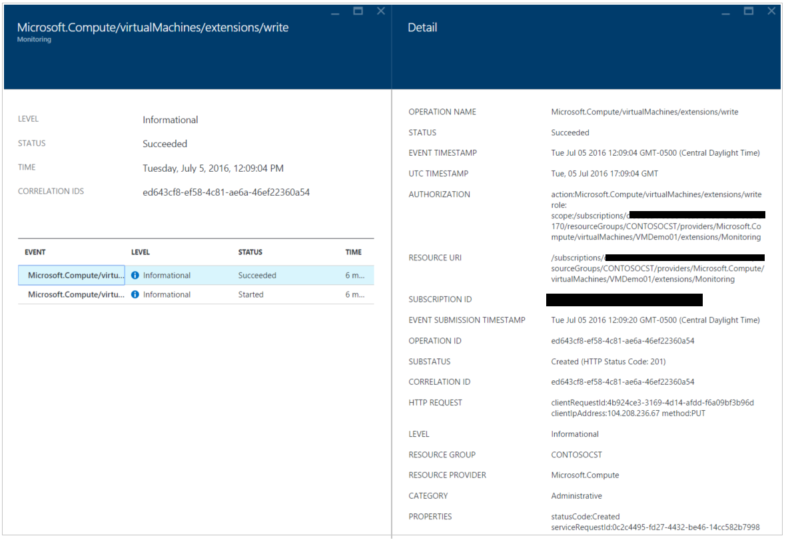
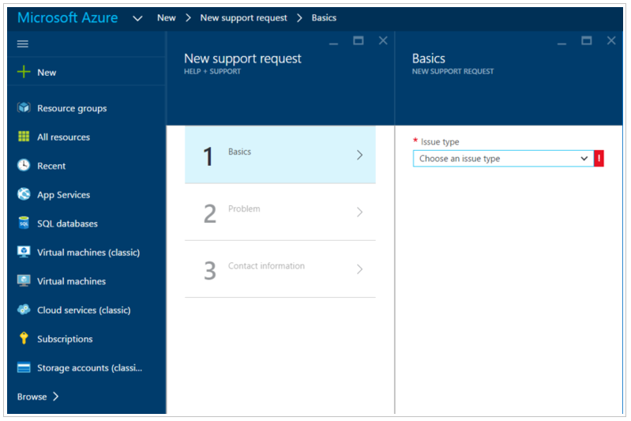

<properties
   pageTitle="Handleiding voor het oplossen van problemen met Azure Security Center | Microsoft Azure"
   description="Dit document helpt bij het oplossen van problemen in Azure Security Center."
   services="security-center"
   documentationCenter="na"
   authors="YuriDio"
   manager="swadhwa"
   editor=""/>

<tags
   ms.service="security-center"
   ms.devlang="na"
   ms.topic="hero-article"
   ms.tgt_pltfrm="na"
   ms.workload="na"
   ms.date="07/21/2016"
   ms.author="yurid"/>

# Handleiding voor het oplossen van problemen met Azure Security Center
Deze handleiding is bedoeld voor IT-specialisten, informatiebeveiligingsanalisten en cloudbeheerders waarvan hun organisaties Azure Security Center gebruiken en die problemen moeten oplossen die betrekking hebben op Security Center.

## Handleiding voor het oplossen van problemen
In deze handleiding wordt uitgelegd hoe u problemen oplost die betrekking hebben op Security Center. In de meeste gevallen vindt probleemoplossing in Security Center plaats door eerst de records in het [Controlelogboek](https://azure.microsoft.com/updates/audit-logs-in-azure-preview-portal/) van het onderdeel met de fout te raadplegen. Met controlelogboeken kunt u het volgende bepalen:

- Welke bewerkingen er hebben plaatsgevonden
- Wie de bewerking heeft gestart
- Wanneer de bewerking is uitgevoerd
- De status van de bewerking
- De waarden van andere eigenschappen die u kunnen helpen bij het onderzoeken van het probleem

In het controlelogboek staan alle schrijfbewerkingen (PUT, POST, DELETE) die op uw resources zijn uitgevoerd, maar er staan geen leesbewerkingen (GET) in.

## Problemen oplossen met de installatie van de controleagent in Windows

De controleagent van Security Center wordt gebruikt om gegevens te verzamelen. Nadat het verzamelen van gegevens is ingeschakeld en de agent juist is geïnstalleerd op de doelcomputer, worden als het goed is deze processen uitgevoerd:

- ASMAgentLauncher.exe - Azure Monitoring Agent 
- ASMMonitoringAgent.exe - Azure Security Monitoring-uitbreiding
- ASMSoftwareScanner.exe – Azure Scan Manager

De extensie Azure Security Monitoring scant op verschillende, voor beveiliging relevante configuraties en verzamelt beveiligingslogboeken vanaf de virtuele machine. De scanbeheerder wordt gebruikt als patch-scanner.

Als de installatie succesvol is uitgevoerd, ziet u een vermelding die vergelijkbaar is met die in de controlelogboeken voor het doel-VM:

U kunt ook meer informatie over het installatieproces krijgen door de logboekbestanden van de agenten te lezen, die zich bevinden op *%systemdrive%\windowsazure\logs* (bijvoorbeeld: C:\WindowsAzure\Logs).

> [AZURE.NOTE] Als de Azure Security Center-agent zich niet goed gedraagt, dient u het doel-VM opnieuw op te starten omdat er geen opdracht is om de agent te stoppen en te starten.

## Problemen oplossen met de installatie van de controleagent in Linux
Bij het oplossen van problemen met de installatie van VM-agent op een Linux-systeem, moet u controleren of de uitbreiding is gedownload naar/var/lib/waagent/. U kunt de onderstaande opdracht uitvoeren om te controleren of deze is geïnstalleerd:

`cat /var/log/waagent.log` 

De andere logboekbestanden die u kunt bekijken voor het oplossen van problemen zijn: 

- /var/log/mdsd.err
- /var/log/azure/

In een werkend systeem ziet u een verbinding met het mdsd-proces op TCP 29130. Dit is de communicatie tussen syslog en het mdsd-proces. U kunt dit gedrag controleren door de onderstaande opdracht uit te voeren:

`netstat -plantu | grep 29130`

## Contact opnemen met Microsoft-ondersteuning

Bepaalde problemen kunnen worden geïdentificeerd aan de hand van de richtlijnen in dit artikel. Andere problemen vindt u ook beschreven in het openbare [Forum](https://social.msdn.microsoft.com/Forums/en-US/home?forum=AzureSecurityCenter) van Security Center. Als u echter meer problemen wilt oplossen, kunt u als volgt een nieuwe ondersteuningaanvraag openen in de Azure-portal: 

## Zie ook

In dit document hebt u kunnen lezen hoe u het beveiligingsbeleid configureert in Azure Security Center. Zie de volgende onderwerpen voor meer informatie over Azure Security Center:

- [Azure Security Center Planning and Operations Guide](security-center-planning-and-operations-guide.md) (Gids voor de planning en werking van Azure Security Center): leer de ontwerpoverwegingen kennen en leer hiervoor te plannen voor de overstap naar Azure Security Center.
- [Security health monitoring in Azure Security Center](security-center-monitoring.md) (Beveiligingsstatus controleren in Azure Security Center): meer informatie over het controleren van de status van uw Azure-resources
- [Beveiligingswaarschuwingen beheren en erop reageren in Azure Security Center](security-center-managing-and-responding-alerts.md): leer hoe u beveiligingswaarschuwingen kunt beheren en erop kunt reageren
- [Partneroplossingen controleren met Azure Security Center](security-center-partner-solutions.md): leer hoe u de integriteitsstatus van uw partneroplossingen kunt controleren.
- [Veelgestelde vragen over Azure Security Center](security-center-faq.md): raadpleeg veelgestelde vragen over het gebruik van de service
- [Azure-beveiligingsblog](http://blogs.msdn.com/b/azuresecurity/): lees blogberichten over de beveiliging en naleving van Azure

<!--HONumber=Sep16_HO3-->

