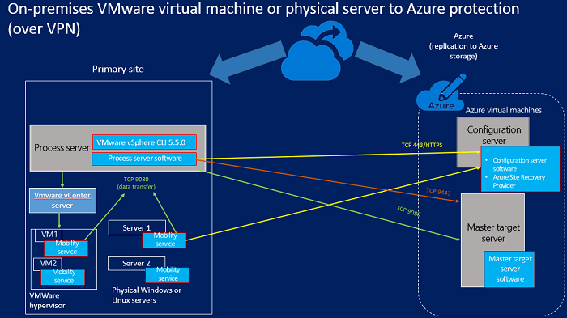

<properties
	pageTitle="Site Recovery 元件" 
	description="這篇文章提供 Site Recovery 元件的概觀及其管理方式" 
	services="site-recovery"
	documentationCenter=""
	authors="rayne-wiselman"
	manager="jwhit"
	editor=""/>

<tags
	ms.service="site-recovery"
	ms.workload="backup-recovery"
	ms.tgt_pltfrm="na"
	ms.devlang="na"
	ms.topic="article"
	ms.date="07/09/2015"
	ms.author="raynew"/>

# Site Recovery 元件

Azure Site Recovery 可藉由協調虛擬機器與實體伺服器的複寫、容錯移轉及復原，為您的商務持續性與災害復原做出貢獻。機器可以複寫至 Azure，或次要的內部部署資料中心。[閱讀概觀](site-recovery-overview.md)。

本文摘要並描述伺服器和虛擬機器上安裝的 Site Recovery 元件。

您可以將任何關於這篇文章的問題張貼在 [Azure 復原服務論壇](https://social.msdn.microsoft.com/forums/azure/home?forum=hypervrecovmgr)。

## 概觀

Site Recovery 元件會隨保護案例稍微改變。

### 使用 VMM 的兩個資料中心之間的保護

**案例** | **說明** | **必要的元件** | **詳細資料**
--- | --- | --- | ---
您可以部署 Azure Site Recovery，在兩個資料中心之間複寫虛擬機器。 | 
每個資料中心有一部 VMM 伺服器

每部 VMM 伺服器有一個私人雲端，其中包含您想要保護的虛擬機器的一或多個 Hyper-V 主機伺服器
 | 將在兩部 VMM 伺服器上安裝 Azure Site Recovery 提供者 | 
沒有任何元件安裝在 Hyper-V 主機伺服器或受保護的虛擬機器上

VMM 伺服器上的 Azure Site Recovery 提供者透過 HTTPS 443，與 Site Recovery 服務一起協調保護工作

主要和次要 Hyper-V 主機伺服器使用連接埠 8083 和 8084 上的 Kerberos 和憑證驗證，透過網際網路在其間進行複寫。

### 使用 VMM 的資料中心與 Azure 之間的保護

**案例** | **說明** | **必要的元件** | **詳細資料**
--- | --- | --- | ---
您可以部署 Azure Site Recovery，在資料中心與 Azure 之間複寫虛擬機器 | 
內部部署資料中心有一部包含私人雲端的 VMM 伺服器，其中包含您想要保護的虛擬機器的一或多個 Hyper-V 主機伺服器
 | 
將在 VMM 伺服器上安裝 Azure Site Recovery 提供者

將在來源 Hyper-V 主機伺服器上安裝 Microsoft 復原服務代理程式
 | 
在受保護的虛擬機器上未安裝任何元件

VMM 伺服器上的 Azure Site Recovery 提供者透過 HTTPS 443，與 Site Recovery 服務一起協調保護工作

來源 Hyper-V 主機伺服器和 Azure 上執行的 Microsoft 復原服務代理程式，透過 HTTPS 443 在其間進行複寫。

###  Hyper-V 網站與 Azure 之間的保護

**案例** | **說明** | **必要的元件** | **詳細資料**
--- | --- | --- | ---
您可以部署 Azure Site Recovery，在資料中心與 Azure 之間複寫虛擬機器 | 
內部部署資料中心有一或多個 Hyper-V 主機伺服器，包含您想要保護的虛擬機器

在設定期間，您會定義包含其中一或多個 Hyper-V 主機伺服器的 Hyper-V 網站
 | 
執行單一元件安裝，在 Hyper-V 主機伺服器上安裝 Azure Site Recovery 提供者和 Microsoft 復原服務代理程式
 | 
部署中沒有 VMM 伺服器

在受保護的虛擬機器上未安裝任何元件

Hyper-V 主機伺服器上的 Azure Site Recovery 提供者透過 HTTPS 443，與 Site Recovery 服務一起協調保護工作

Hyper-V 主機伺服器和 Azure 上執行的 Microsoft 復原服務代理程式，透過 HTTPS 443 在其間進行複寫。

### 在內部部署實體伺服器或 VMware 虛擬機器和 Azure 之間的保護 

在這個案例中，複寫可能會以兩種方式發生：

- 透過 VPN 連線 (使用 Azure ExpressRoute 或站對站 VPN)
- 在網際網路上透過安全連線

#### 透過 VPN 站對站連線 (或 ExpressRoute)

會將內部部署伺服器的通訊，導向至設定和主要的目標虛擬機器所連接的 Azure 虛擬網路上的內部連接埠。

#### 透過網際網路

會將內部部署伺服器的所有通訊，導向至設定伺服器虛擬機器和主要目標伺服器虛擬機器的 Azure 雲端服務上的對應公用端點。部署虛擬機器時會動態建立端點。

#### 連接埠

**元件** | **連接埠** | **詳細資料** 
--- | --- | --- | ---
**處理序伺服器** |9080 | 受保護的機器會透過 TCP 9080，傳送複寫資料給處理序伺服器。
**設定伺服器** | HTTPS/443 | 受保護機器上執行的行動服務會將複寫中繼資料，傳送到連接埠 443 上的設定伺服器。
 | HTTPS/443 | 設定伺服器會協調機器保護。處理序伺服器會與 443 上的設定伺服器通訊，或對應的公用端點通訊，以接收管理和控制資訊。 
 | 9443 | 在容錯回復指向中，vContinuum 工具在連接埠 9443 上要求設定伺服器的控制項和中繼資料 (未顯示在圖表上)
 | 5986 | 搭配使用連接埠 5986 與 PowerShell 進行遠端管理 (未顯示在圖表上)
 | 3389 | 使用 3389 以 RDP 連線到設定伺服器 (未顯示在圖表上)
**主要目標伺服器** | 80 | 處理序網台會透過 9080，將複寫流量的相關通訊傳送給主要目標伺服器
 | HTTP/443 | 處理序伺服器會透過 HTTP 或 443 (VPN)，將資料複寫到主要目標伺服器
 | HTTP/443 | 處理序伺服器會透過 HTTP 或 443 (VPN)，將資料複寫到主要目標伺服器
**防火牆規則** | | 
要正確運作行動服務的推入安裝，受保護機器上的防火牆應該允許檔案及印表機共用和 Windows Management Instrumentation。

您想要保護的機器上的防火牆規則，應該允許這些機器連線到設定伺服器。

為了在容錯移轉後透過網際網路連接到 Azure 虛擬機器，機器上的防火牆規則應允許透過網際網路的遠端桌面連線。要在 Azure 中連線到容錯移轉的 Linux 機器，應該在系統上將安全殼層服務設定為自動啟動，且防火牆規則應允許 ssh 連線。

## Site Recovery 元件

**元件** | **詳細資料** | **安裝** | **部署案例**
--- | --- | --- | ---
**VMM 的 Azure Site Recovery 提供者** | 處理 VMM 伺服器與 Site Recovery 服務之間的通訊。 | 在 VMM 伺服器上安裝 | 適用於設定 VMM 網站之間的保護，或 VMM 網站與 Azure 之間的保護
**Hyper-V 的 Azure Site Recovery 提供者** | 當 VMM 未部署時，處理 Hyper-V 主機與 Site Recovery 服務之間的通訊。 | 在 Hyper-V 主機伺服器上安裝 | 適用於設定 Hyper-V 網站與 Azure 之間的保護。   
**Microsoft 復原服務代理程式** | 處理 Hyper-V 主機伺服器與 Site Recovery 服務之間的通訊 | 在 Hyper-V 主機伺服器上安裝 | 
適用於設定 Hyper-V 網站與 Azure 之間的保護。

您下載包含 Hyper-V 和 Microsoft 復原服務代理程式的 Azure Site Recovery 提供者的單一提供者。

**處理序伺服器/容錯回復處理序伺服器** | 
先最佳化受保護的 VMware 機器或 Windows/Linux 實體伺服器中的資料，再將資料傳送到 Azure 中的主要目標伺服器

是否在 VMware 虛擬機器或實體伺服器上推入安裝行動服務

執行 VMware 虛擬機器的自動探索。
 
容錯回復處理序伺服器：只有先最佳化資料，複寫才適用於容錯回復處理序伺服器
 | 
安裝於至少執行 Windows Server 2012 R2 的內部部署伺服器

容錯回復處理序伺服器：在標準 A4 大小的 Azure 虛擬機器上執行
 | 
適用於設定內部部署實體伺服器或 VMware 虛擬機器與 Azure 之間的保護。

容錯回復處理序伺服器：用來從 Azure 容錯回復到內部部署

**行動服務** | 擷取受保護機器上的變更，並與內部部署處理序伺服器溝通變更以複寫至 Azure。 | 在內部部署 VMware 虛擬機器上，或在您想要保護的實體伺服器上安裝| 適用於設定內部部署實體伺服器或 VMware 虛擬機器和 Azure 之間的保護。
**主要目標伺服器/容錯回復主要目標伺服器** | 
使用在您的 Azure 儲存體帳戶之 Blob 儲存體上所建立的附加 VHD，從您的受保護機器保留複寫的資料。

容錯回復主要目標伺服器：從 Azure 中的容錯移轉虛擬機器保存複寫的資料。為容錯回復啟用反轉複寫時，會將資料保存在選取的資料存放區中建立的 VMDKs 上。
 | 
您可將其安裝為 Azure 虛擬機器，做為以 Windows Server 2012 R2 資源庫映像為基礎的 Windows 伺服器 (以保護 Windows 機器)，或做為以 OpenLogic CentOS 6.6 組件庫映像為基礎的 Linux 伺服器 (以保護 Linux 機器)。

有兩個調整大小選項可用 – 標準 A3 及標準 D14

容錯回復主要目標伺服器：在 VMware 虛擬機器上執行。會在將容錯回復機器的相同主機上佈建它。
| 
適用於設定內部部署實體伺服器或 VMware 虛擬機器與 Azure 之間的保護。

容錯回復主要目標伺服器：用來將容錯移轉的虛擬機器，從 Azure 容錯回復到內部部署。

**設定伺服器** | 
可在 Azure 中的受保護機器、處理序伺服器與主要目標伺服器之間協調通訊

設定當發生容錯移轉時，Azure 中的複寫和協調復原
 | 在與 Site Recovery 相同的 Azure 訂用帳戶中，安裝於 Azure 標準 A3 虛擬機器。 | 適用於設定內部部署實體伺服器或 VMware 虛擬機器和 Azure 之間的保護。

## 元件部署規劃

### Azure Site Recovery 提供者

提供者會在您的 VMM 伺服器、Hyper-V 主機伺服器 (如果您的部署中沒有 VMM 伺服器)，或在設定伺服器上執行。它會使用加密的 HTTPS 連線，透過網際網路連接至 Site Recovery 服務。請注意：

- 您不需要新增特定的防火牆例外，就能將提供者連接到 Site Recovery。
- 如果您想要使用 Proxy 伺服器，將執行提供者的伺服器連接到網際網路，可以使用現有的 Proxy 設定或指定自訂的 Proxy。
- Proxy 必須允許這些位址通過防火牆：

	-  *.accesscontrol.windows.net -  .backup.windowsazure.com
	-  *.blob.core.windows.net -  *.store.core.windows.net 	
- 如果防火牆上有 IP 位址架構規則，請確定它們允許設定伺服器至 [Azure 資料中心 IP 範圍](https://www.microsoft.com/download/details.aspx?id=41653) (英文) 所述的 IP 位址通訊，並適用於HTTPS (443)。您必須列名於計劃使用的 Azure 區域和美國西部的白名單 IP 位址範圍。
- 如果您要部署含 VMM 的 Site Recovery，且您使用自訂 Proxy，則會使用您在 Site Recovery 入口網站的自訂 Proxy 設定中指定的 Proxy 認證，自動建立 VMM RunAs 帳戶 (DRAProxyAccount)。您必須設定 Proxy 伺服器，才能成功驗證此帳戶。
- 如果您使用 Proxy，則必須透過 HTTP 傳送 Hyper-V 主機伺服器上安裝的提供者，至 Proxy 的流量。

### Microsoft 復原服務代理程式

代理程式會使用加密的 HTTPS 連線，透過網際網路連接至 Site Recovery 服務。不需要指定防火牆例外狀況。

### VMware 或實體伺服器保護的元件

#### 主要目標伺服器

- 主要目標伺服器可為 Azure 標準 A4 或 D14 虛擬機器。
- 利用標準 A4 主要目標，您可以將 16 個資料磁碟 (每個資料磁碟最多包含 1023 GB) 加入至每部虛擬機器。
- 利用標準 D14 主要目標，您可以將 32 個資料磁碟 (每個資料磁碟最多包含 1023 GB) 加入至每部虛擬機器。
- 只有當您想要保護的伺服器已連接至標準 A4 大小的主要目標伺服器，且前者有超過 15 個磁碟時，才需要標準 D14 大小的主要目標伺服器；對有所有其他設定，您可以部署標準 A4 大小的主要目標伺服器。
- 請注意，附加至主要目標伺服器的其中一個磁碟將保留做為保留磁碟機。Azure Site Recovery 可讓您定義保留視窗，並且在該視窗內將受保護機器復原到某個復原點。保留磁碟機會在視窗的存在期間持續記錄磁碟變更。這會減少在 A4 上複寫到 15，及在 D14 上複寫到 31 的可用磁碟上限。

#### 處理序伺服器 

- 處理序伺服器使用磁碟快取。確保快取有足夠的可用空間 C:/。您所保護之機器的資料變更率會影響快取大小。一般建議之中等大小部署的快取目錄大小為 600 GB。
- 如果受保護機器的資料變更率超過現有處理序伺服器的容量，您應該部署額外的處理序伺服器。
- 若要調整部署，您可以加入多個處理序伺服器和主要目標伺服器。如果您現有的主要目標伺服器上沒有足夠的可用磁碟，您應該部署第二個主要目標伺服器。
-  請注意，處理序伺服器與主要目標伺服器不需要一對一對應。您可以同時部署第一個處理序伺服器與第二個主要目標伺服器，並以此類推。

#### 設定伺服器

- 設定伺服器是標準 A3 虛擬機器，會在您的訂用帳戶中，為設定伺服器建立以 Azure Site Recovery Windows Server 2012 R2 資源庫映像為基礎的該機器。這個虛擬機器的建立，可在附帶保留公用 IP 位址的新雲端服務中做為第一個執行個體。
- 安裝路徑只有英文字元。

#### 行動服務

在 VMware 虛擬機器或實體伺服器上安裝。機器和伺服器必須符合下列需求：

- **Windows 伺服器**：
	-  64 位元作業系統： Windows Server 2012 R2、Windows Server 2012，或 Windows Server 2008 R2 (至少為 SP1)。
	-  主機名稱、掛接點、裝置名稱、Windows 系統路徑 (例如：C:\\Windows)，僅限英文。
	-  C:\\ 磁碟機上的作業系統。
	-  僅支援基本磁碟。不支援動態磁碟。

- **Linux 伺服器**：
	- 支援的 64 位元作業系統：Centos 6.4、6.5、6.6；Oracle Enterprise Linux 6.4、6.5，執行 Red Hat 相容核心或 Unbreakable Enterprise Kernel 第 3 版 (UEK3)、SUSE Linux Enterprise Server 11 SP3。
	- 受保護機器上的 /etc/hosts 檔案應該包含將本機主機名稱對應到所有 NIC 相關聯之 IP 位址的項目。
	- 主機名稱、掛接點、裝置名稱和 Linux 系統路徑和檔案名稱 (例如 /etc/、/usr) 僅可使用英文。
	-  支援下列儲存體：檔案系統：EXT3、ETX4、ReiserFS、XFS/多重路徑軟體裝置對應工具 (多重路徑)/磁碟區管理員：LVM2。不支援使用 HP CCISS 控制站儲存體的實體伺服器。

如需這些元件的詳細規劃資訊，請閱讀[這篇文章](site-recovery-vmware-to-azure.md)的＜容量規劃＞一節。

## 掌握最新元件

**元件** | **如何更新** 
--- | --- 

**VMM 的 Azure Site Recovery 提供者**

**Azure 復原服務代理程式**
 | 

**首次安裝**：從 [快速入門] 頁面下載最新版

**進行中**：您可以從 Site Recovery 的儀表板下載最新 (和前一個) 版本。此外，如果您選擇 Microsoft Updates，會自動在伺服器上安裝最新版的提供者和代理程式。

**處理序伺服器**

**設定伺服器**

**主要目標伺服器**
 | 在 Site Recovery 儀表板上檢查更新。 
**行動服務** | 
確定想要保護的每部機器上都有最新的行動服務更新：

可以下載最新的更新：

[Windows](http://download.microsoft.com/download/7/C/7/7C70CA53-2D8E-4FE0-BD85-8F7A7A8FA163/Microsoft-ASR_UA_8.3.0.0_Windows_GA_03Jul2015_release.exe)

[RHELP6-64](http://download.microsoft.com/download/B/4/5/B45D1C8A-C287-4339-B60A-70F2C7EB6CFE/Microsoft-ASR_UA_8.3.0.0_RHEL6-64_GA_03Jul2015_release.tar.gz)

[OL6-64](http://download.microsoft.com/download/9/4/8/948A2D75-FC47-4DED-B2D7-DA4E28B9E339/Microsoft-ASR_UA_8.3.0.0_OL6-64_GA_03Jul2015_release.tar.gz)

[SLES11-SP3-64](http://download.microsoft.com/download/6/A/2/6A22BFCD-E978-41C5-957E-DACEBD43B353/Microsoft-ASR_UA_8.3.0.0_SLES11-SP3-64_GA_03Jul2015_release.tar.gz)

此外，在確保有最新的處理序伺服器後，您可以從處理序伺服器的 C:\\pushinstallsvc\\repository 資料夾下載最新版的行動服務
  

## 後續步驟

開始設定您的部署案例的元件。[深入了解](site-recovery-overview.md)。

<!---HONumber=July15_HO2-->