<properties
    pageTitle="Hyper-V virtuele machines in VMM-clouds repliceren naar Azure | Microsoft Azure"
    description="In dit artikel wordt beschreven hoe u Hyper-V virtuele machines op Hyper-V-hosts in System Center VMM-clouds naar Azure repliceert."
    services="site-recovery"
    documentationCenter=""
    authors="rayne-wiselman"
    manager="jwhit"
    editor=""/>

<tags
    ms.service="site-recovery"
    ms.workload="backup-recovery"
    ms.tgt_pltfrm="na"
    ms.devlang="na"
    ms.topic="hero-article"
    ms.date="05/06/2016"
    ms.author="raynew"/>

#  Hyper-V virtuele machines in VMM-clouds repliceren naar Azure

> [AZURE.SELECTOR]
- [Azure-portal](site-recovery-vmm-to-azure.md)
- [PowerShell - ARM](site-recovery-vmm-to-azure-powershell-resource-manager.md)
- [Klassieke portal](site-recovery-vmm-to-azure-classic.md)
- [PowerShell - Klassiek](site-recovery-deploy-with-powershell.md)

De Azure Site Recovery-service draagt bij aan de bedrijfscontinuïteit en de strategie voor herstel na noodgevallen (BCDR) door de replicatie, failover en het herstel van virtuele machines en fysieke servers in te delen. Machines kunnen worden gerepliceerd naar Azure of een secundaire on-premises datacentrum. Lees voor een snel overzicht [Wat is Azure Site Recovery?](site-recovery-overview.md).

## Overzicht

In dit artikel wordt beschreven hoe u Site Recovery implementeert om Hyper-V virtuele machines op Hyper-V-hostservers in VMM-privéclouds naar Azure repliceren.

Het artikel bevat vereisten voor het scenario en laat u zien hoe u een Site Recovery-kluis instelt, Azure Site Recovery Provider op de bron-VMM-server installeert, de server in de kluis registreert, een Azure Storage-account toevoegt, de Azure Recovery Services-agent op Hyper-V-hostservers installeert, beveiligingsinstellingen voor VMM-clouds configureert die worden toegepast op alle beveiligde virtuele machines en vervolgens beveiliging voor die virtuele machines inschakelt. Test tenslotte de failover om te controleren of alles naar verwachting werkt.

U kunt onder aan dit artikel of op het [Azure Recovery Services-forum](https://social.msdn.microsoft.com/forums/azure/home?forum=hypervrecovmgr) opmerkingen of vragen plaatsen.

## Architectuur

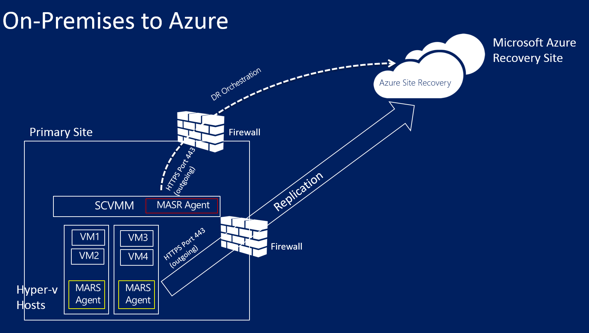

- Azure Site Recovery Provider wordt op de VMM geïnstalleerd tijdens de implementatie van Site Recovery en de VMM-server wordt in de Site Recovery-kluis geregistreerd. Provider communiceert met Site Recovery om de replicatie-indeling af te handelen.
- De Azure Recovery Services-agent wordt tijdens de implementatie van Site Recovery op Hyper-V-hostservers geïnstalleerd. De agent verwerkt de gegevensreplicatie naar Azure Storage.

## Vereisten voor Azure

In Azure hebt u het volgende nodig.

**Vereiste** | **Details**
--- | ---
**Azure-account**| U hebt een [Microsoft Azure](https://azure.microsoft.com/)-account nodig. U kunt beginnen met een [gratis proefversie](https://azure.microsoft.com/pricing/free-trial/). [Meer informatie](https://azure.microsoft.com/pricing/details/site-recovery/) over prijzen voor Site Recovery.
**Azure-opslag** | U hebt een Azure Storage-account nodig om gerepliceerde gegevens op te slaan. Gerepliceerde gegevens worden opgeslagen in Azure Storage en Azure VM's worden bij een failover ingezet.   U hebt een [standaard geografisch redundant opslagaccount](../storage/storage-redundancy.md#geo-redundant-storage) nodig. Het account moet zich in dezelfde regio bevinden als de Site Recovery-service en moet zijn gekoppeld aan hetzelfde abonnement. Houd er rekening mee dat replicatie naar Premium Storage-accounts momenteel niet wordt ondersteund en dus niet moet worden gebruikt.  [Meer informatie over](../storage/storage-introduction.md) Azure Storage.
**Azure-netwerk** | U hebt een virtueel Azure-netwerk nodig waarmee Azure VM's verbinding maken wanneer failover plaatsvindt. Het virtuele Azure-netwerk moet zich in dezelfde regio bevinden als de Site Recovery-kluis.

## Vereisten voor on-premises

Dit is wat u on-premises nodig hebt.

**Vereiste** | **Details**
--- | ---
**VMM** | U moet ten minste één VMM-server hebben die als fysieke of virtuele zelfstandige server of als virtueel cluster is geïmplementeerd.   Op de VMM-server moet System Center 2012 R2 met de meest recente cumulatieve updates worden uitgevoerd.  Er moet ten minste één cloud zijn geconfigureerd op de VMM-server.  De broncloud die u wilt beveiligen, moet een of meer VMM-hostgroepen bevatten.  Meer informatie over het instellen van VMM-clouds in [Walkthrough: Creating private clouds with System Center 2012 SP1 VMM](http://blogs.technet.com/b/keithmayer/archive/2013/04/18/walkthrough-creating-private-clouds-with-system-center-2012-sp1-virtual-machine-manager-build-your-private-cloud-in-a-month.aspx) (Overzicht: privéclouds maken met System Center 2012 SP1 VMM) in het blog van Keith Mayer.
**Hyper-V** | U hebt een of meer Hyper-V-hostservers of -clusters in de VMM-cloud nodig. De hostserver moet een of meer VM's hebben.   Op de Hyper-V-server moet ten minste Windows Server 2012 R2 met de Hyper-V-rol worden uitgevoerd en bovendien moeten de meest recente updates zijn geïnstalleerd.  Alle Hyper-V-servers met VM's die u wilt beveiligen, moeten zich in een VMM-cloud bevinden.  Als u Hyper-V in een cluster uitvoert, wordt die clusterbroker niet automatisch gemaakt als u een cluster op basis van een statisch IP-adres hebt. U moet de clusterbroker handmatig configureren. [Meer informatie](https://www.petri.com/use-hyper-v-replica-broker-prepare-host-clusters) in het blog van Aidan Finn.
**Beveiligde machines** | VM's die u wilt beveiligen, moeten voldoen aan de [Azure-vereisten](site-recovery-best-practices.md#azure-virtual-machine-requirements).

## Vereisten voor netwerktoewijzing
Wanneer u virtuele machines in Azure beveiligt, zorgen de koppelingen van netwerktoewijzingen tussen VM-netwerken op de bron-VMM-server en doel-Azure-netwerken voor het volgende:

- Alle machines met failover in hetzelfde netwerk kunnen met worden verbonden, ongeacht van welk herstelplan ze deel uitmaken.
- Als een netwerkgateway is ingesteld in het doel-Azure-netwerk, kunnen virtuele machines worden verbonden met andere on-premises virtuele machines.
- Als u geen netwerktoewijzing configureert, kunnen alleen virtuele machines met failover in hetzelfde herstelplan met elkaar worden verbonden na failover naar Azure.

Als u netwerktoewijzing wilt implementeren, hebt u het volgende nodig:

- De virtuele machines die u wilt beveiligen op de bron-VMM-server, moeten zijn verbonden met een VM-netwerk. Dit netwerk moet zijn gekoppeld aan een logisch netwerk dat is gekoppeld aan de cloud.
- Een Azure-netwerk waarmee gerepliceerde virtuele machines verbinding kunnen maken na failover. U selecteert dit netwerk op het moment van failover. Het netwerk moet zich in dezelfde regio bevinden als uw Azure Site Recovery-abonnement.

Tref als volgt voorbereidingen voor netwerktoewijzing:

1. [Meer informatie over](site-recovery-network-mapping.md) vereisten voor netwerktoewijzing.
2. Bereid VM-netwerken in VMM voor:

    - [Stel logische netwerken in](https://technet.microsoft.com/library/jj721568.aspx).
    - [Stel VM-netwerken in](https://technet.microsoft.com/library/jj721575.aspx).

## Stap 1: Een Site Recovery-kluis maken

1. Meld u aan bij de [beheerportal](https://portal.azure.com) vanuit de VMM-server die u wilt registreren.
2. Klik op **Data Services** > **Recovery Services** > **Site Recovery-kluis**.
3. Klik op **Nieuw maken** > **Snelle invoer**.
4. Voer in **Naam** een beschrijvende naam in om de kluis aan te duiden.
5. Selecteer in **Regio** de geografische regio voor de kluis. Zie Geographic Availability (Geografische beschikbaarheid) in [Azure Site Recovery Pricing Details](https://azure.microsoft.com/pricing/details/site-recovery/) (Prijsinformatie voor Azure Site Recovery) om na te gaan welke regio's worden ondersteund.
6. Klik op **Kluis maken**.

    

Controleer de statusbalk om te bevestigen dat de kluis is gemaakt. De kluis wordt als **Actief** weergegeven op de hoofdpagina van Recovery Services.

## Stap 2: Een kluisregistratiesleutel genereren

Genereer een registratiesleutel in de kluis. Nadat u Azure Site Recovery Provider hebt gedownload en op de VMM-server hebt geïnstalleerd, gebruikt u deze sleutel om de VMM-server in de kluis te registreren.

1. Klik op de pagina **Recovery Services** op de kluis om de pagina Snel starten te openen. Snel starten kan ook op elk gewenst moment worden geopend met het pictogram.

    

2. Selecteer in de vervolgkeuzelijst **Tussen een on-premises VMM-site en Microsoft Azure**.
3. Klik in **VMM-servers voorbereiden** op het **Registratiesleutel genereren**-bestand. Het sleutelbestand wordt automatisch gegenereerd en is geldig tot 5 dagen nadat het is gegenereerd. Als u geen toegang tot Azure-portal hebt vanaf de VMM-server, moet u dit bestand naar de server kopiëren.

    

## Stap 3: Azure Site Recovery Provider installeren

1. Klik in **Snel starten** > **VMM-servers voorbereiden** op **Microsoft Azure Site Recovery Provider downloaden voor installatie op VMM-servers** om de meest recente versie van het Provider-installatiebestand op te halen.
2. Voer dit bestand op de bron-VMM-server uit.

    >[AZURE.NOTE] Als VMM in een cluster is geïmplementeerd en u Provider voor de eerste keer installeert, installeert u deze op een actief knooppunt en voltooit u de installatie om de VMM-server in de kluis te registreren. Installeer Provider vervolgens op de andere knooppunten. Houd er rekening mee dat als u Provider bijwerkt, alle knooppunten moeten worden bijgewerkt, omdat op alle knooppunten dezelfde versie van Provider moet worden uitgevoerd.
    
3. Het installatieprogramma controleert of aan de vereisten wordt voldaan en vraagt toestemming om de VMM-service te stoppen om de Provider-installatie te starten. De VMM-service wordt automatisch opnieuw gestart wanneer de installatie is voltooid. Als u op een VMM-cluster installeert, wordt u gevraagd om de clusterrol te stoppen.

4. U kunt zich in **Microsoft Update** aanmelden voor updates. Als deze instelling is ingeschakeld, worden Provider-updates geïnstalleerd volgens uw beleid voor Microsoft Update.

    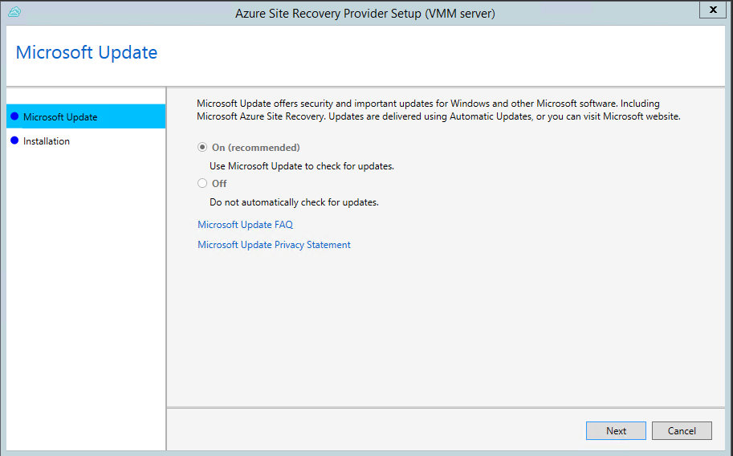

5.  De installatielocatie voor Provider is ingesteld op **<SystemDrive>\Program Files\Microsoft System Center 2012 R2\Virtual Machine Manager\bin**. Klik op **Installeren**.

    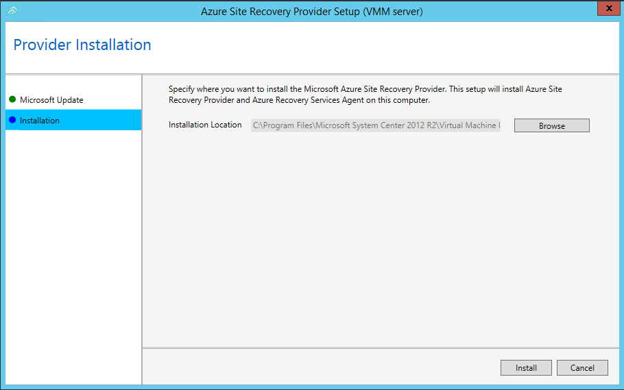

6. Nadat Provider is geïnstalleerd, klikt u op **Registreren** om de server in de kluis te registreren.

    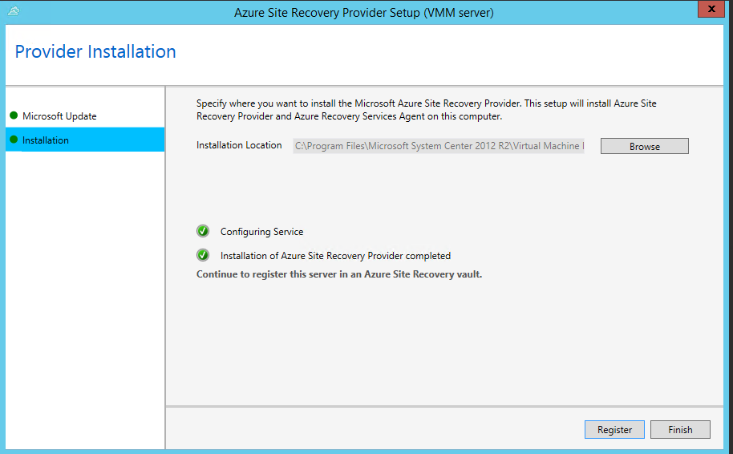

9. Controleer in **Kluisnaam** de naam van de kluis waarin de server wordt geregistreerd. Klik op *Volgende*.

    

7. Geef in **Internetverbinding** op hoe Provider die wordt uitgevoerd op de VMM-server, verbinding maakt met internet. Selecteer **Connect with existing proxy settings** (Verbinden met bestaande proxyinstellingen) om de standaardinstellingen voor de internetverbinding te gebruiken die op de server zijn geconfigureerd.

    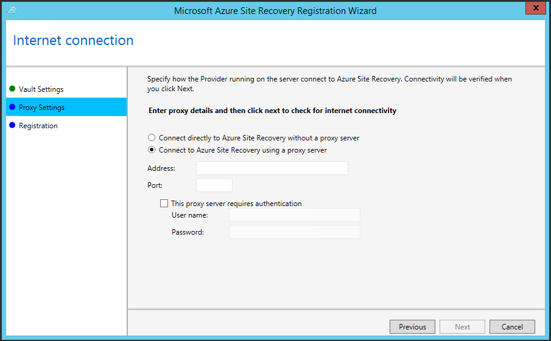

    - Als u een aangepaste proxy wilt gebruiken, moet u deze instellen voordat u Provider installeert. Als u aangepaste proxyinstellingen configureert, wordt een test uitgevoerd om de proxyverbinding te controleren.
    - Als u een aangepaste proxy gebruikt of als uw standaardproxy verificatie vereist, moet u de proxygegevens invoeren, inclusief het proxyadres en de poort.
    - De volgende URL's moeten toegankelijk zijn vanuit de VMM-server en de Hyper-v-hosts
        - *.hypervrecoverymanager.windowsazure.com
        - *.accesscontrol.windows.net
        - *.backup.windowsazure.com
        - *.blob.core.windows.net
        - *.store.core.windows.net
    - Sta de IP-adressen toe die worden beschreven in [Azure Datacenter IP Ranges](https://www.microsoft.com/download/confirmation.aspx?id=41653) (IP-bereiken van Azure Datacenter) en het HTTPS-protocol (443). U moet ook de IP-bereiken van de Azure-regio die u wilt gebruiken en de IP-bereiken van Nederland in de lijst met toegestane IP-bereiken opnemen.
    - Als u een aangepaste proxy gebruikt, wordt er automatisch een VMM RunAs-account (DRAProxyAccount) gemaakt met de opgegeven proxyreferenties. Configureer de proxyserver zodanig dat dit account kan worden geverifieerd. De VMM RunAs-accountinstellingen kunnen worden gewijzigd in de VMM-console. U doet dit als volgt: open de werkruimte **Instellingen**, vouw **Beveiliging** uit, klik op **Uitvoeren als-accounts** en pas het wachtwoord voor DRAProxyAccount aan. U moet de VMM-service opnieuw starten om de instelling door te voeren.

8. Selecteer in **Registratiesleutel** de sleutel die u vanuit Azure Site Recovery hebt gedownload en naar de VMM-server hebt gekopieerd.

10.  De versleutelingsinstelling wordt alleen gebruikt wanneer u Hyper-V virtuele machines in VMM-clouds naar Azure repliceert. Als u naar een secundaire site repliceren, wordt de instelling niet gebruikt.

11.  Geef in **Servernaam** een beschrijvende naam op om de VMM-server in de kluis te identificeren. Geef in een clusterconfiguratie de VMM-clusterrolnaam op.
12.  Geef bij **Cloudmetagegevens synchroniseren** aan of u metagegevens voor alle clouds op de VMM-server met de kluis wilt synchroniseren. Deze actie hoeft op elke server slechts één keer te worden uitgevoerd. Als u niet alle clouds wilt synchroniseren, laat u deze instelling uitgeschakeld en synchroniseert u elke cloud afzonderlijk in de cloudeigenschappen in de VMM-console.

13.  Klik op **Volgende** om het proces te voltooien. Na de registratie worden door Azure Site Recovery metagegevens van de VMM-server opgehaald. De server wordt weergegeven op het tabblad **VMM-servers** op de pagina **Servers** in de kluis.
    
    

Na de registratie worden door Azure Site Recovery metagegevens van de VMM-server opgehaald. De server wordt weergegeven op het tabblad **VMM-servers** op de pagina **Servers** in de kluis.

### Installatie vanaf de opdrachtregel

Azure Site Recovery Provider kan ook worden geïnstalleerd met de volgende opdrachtregel. Deze methode kan worden gebruikt om Provider in Server Core voor Windows Server 2012 R2 te installeren.

1. Download het Provider-installatiebestand en de registratiesleutel naar een map. Bijvoorbeeld: C:\ASR.
2. De System Center Virtual Machine Manager-service stoppen
3. Pak het Provider-installatieprogramma vanaf een opdrachtprompt met verhoogde bevoegdheden uit met de volgende opdrachten:

        C:\Windows\System32> CD C:\ASR
        C:\ASR> AzureSiteRecoveryProvider.exe /x:. /q

4. Installeer Provider als volgt:

        C:\ASR> setupdr.exe /i

5. Registreer Provider als volgt:

        CD C:\Program Files\Microsoft System Center 2012 R2\Virtual Machine Manager\bin
        C:\Program Files\Microsoft System Center 2012 R2\Virtual Machine Manager\bin\> DRConfigurator.exe /r  /Friendlyname <friendly name of the server> /Credentials <path of the credentials file> /EncryptionEnabled <full file name to save the encryption certificate>       

Gebruik daarbij de volgende parameters:

 - **/Credentials** : een verplichte parameter waarmee de locatie wordt opgegeven waarop het registratiesleutelbestand zich bevindt  
 - **/FriendlyName** : een verplichte parameter voor de naam van de Hyper-V-hostserver die wordt weergegeven in de Azure Site Recovery-portal.
 - **/ EncryptionEnabled** : een optionele parameter om op te geven of u de virtuele machines in Azure wilt versleutelen (versleuteling bij rust). De bestandsnaam moet de extensie **PFX** hebben.
 - **/proxyAddress** : een optionele parameter waarmee het adres van de proxyserver wordt opgegeven.
 - **/proxyport** : een optionele parameter waarmee de poort van de proxyserver wordt opgegeven.
 - **/proxyUsername** : een optionele parameter waarmee de proxygebruikersnaam wordt opgegeven.
 - **/proxyPassword** : een optionele parameter waarmee het proxywachtwoord wordt opgegeven.  

## Stap 4: Een Azure Storage-account maken

1. Als u geen Azure Storage-account hebt, klikt u op **Een Azure Storage-account toevoegen** om een account te maken.
2. Maak een account waarvoor geo-replicatie is ingeschakeld. Het account moet zich in dezelfde regio bevinden als de Azure Site Recovery-service en moet zijn gekoppeld aan hetzelfde abonnement.

    

> [AZURE.NOTE] [Migratie van opslagaccounts](../resource-group-move-resources.md) in resourcegroepen binnen hetzelfde abonnement of tussen abonnementen wordt niet ondersteund voor opslagaccounts die worden gebruikt voor het implementeren van Site Recovery.

## Stap 5: De Azure Recovery Services-agent installeren

Installeer de Azure Recovery Services-agent op elke Hyper-V-hostserver in de VMM-cloud.

1. Klik op **Snel starten** > **Azure Site Recovery Services-agent downloaden en op hosts installeren** om de meest recente versie van het agentinstallatiebestand op te halen.

    

2. Voer het installatiebestand op elke Hyper-V-hostserver uit.
3. Klik op de pagina **Controle van vereisten** op **Volgende**. Ontbrekende vereiste onderdelen worden automatisch geïnstalleerd.

    

4. Geef op de pagina **Installatie-instellingen** op waar u de agent wilt installeren en selecteer de cachelocatie waar back-upmetagegevens moeten worden geïnstalleerd. Klik vervolgens op **Installeren**.
5. Nadat de installatie is voltooid, klikt u op **Sluiten** om de wizard te voltooien.

    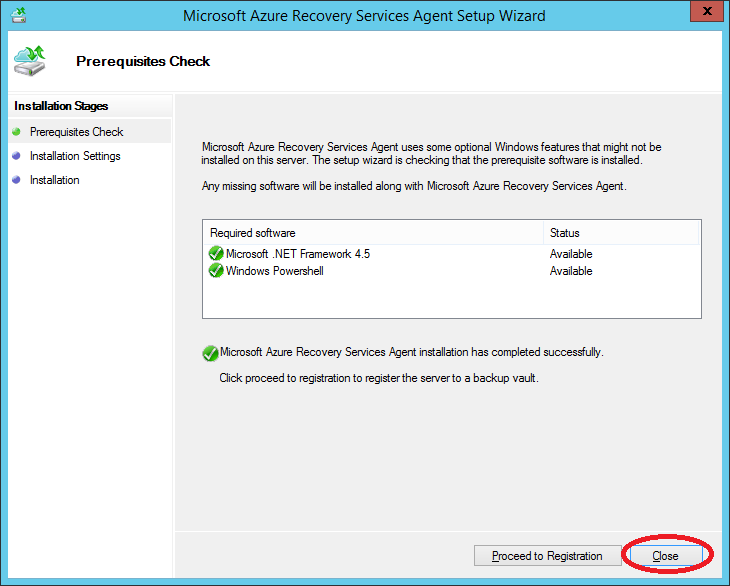

### Installatie vanaf de opdrachtregel

U kunt de Microsoft Azure Recovery Services-agent ook installeren vanaf de opdrachtregel met de volgende opdracht:

    marsagentinstaller.exe /q /nu

## Stap 6: Cloudbeveiligingsinstellingen configureren

Nadat de VMM-server is geregistreerd, kunt u cloudbeveiligingsinstellingen configureren. U hebt de optie **Cloudgegevens synchroniseren met de kluis** ingeschakeld toen u Provider installeerde, zodat alle clouds op de VMM-server worden weergegeven op het tabblad <b>Beveiligde items</b> in de kluis.

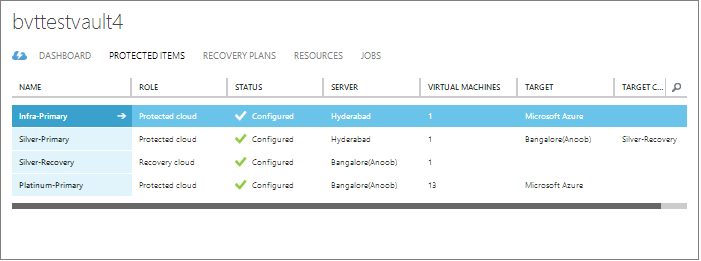

1. Klik op de pagina Snel starten op **Beveiliging instellen voor VMM-clouds**.
2. Klik op het tabblad **Beveiligde items** op de cloud die u wilt configureren, en ga naar het tabblad **Configuratie**.
3. Selecteer in **Doel** de optie **Azure**.
4. Selecteer in **Opslagaccount** het Azure Storage-account dat u voor replicatie gebruikt.
5. Stel **Opgeslagen gegevens versleutelen** in op **Uit**. Met deze instelling wordt opgegeven dat gegevens versleuteld moeten worden gerepliceerd tussen de on-premises site en Azure.
6. Laat in **Kopieerfrequentie** de standaardinstelling ongewijzigd. Met deze waarde wordt bepaald hoe vaak gegevens moeten worden gesynchroniseerd tussen de bron- en doellocatie.
7. Laat in **Herstelpunten behouden voor** de standaardinstelling ongewijzigd. Bij de standaardwaarde nul wordt alleen het meest recente herstelpunt voor een primaire virtuele machine opgeslagen op een replicahostserver.
8. Laat in **Frequentie van toepassingsconsistente momentopnamen** de standaardinstelling ongewijzigd. Met deze waarde wordt bepaald hoe vaak momentopnamen worden gemaakt. Momentopnamen gebruiken Volume Shadow Copy Service (VSS) om ervoor te zorgen dat toepassingen een consistente status hebben wanneer er een momentopname wordt gemaakt.  Als u wel een waarde instelt, moet u ervoor zorgen dat dit minder is dan het aantal aanvullende herstelpunten dat u configureert.
9. Geef in **Starttijd van de replicatie** op wanneer de eerste replicatie van gegevens naar Azure moet worden gestart. De tijdzone op de Hyper-V-hostserver wordt gebruikt. U wordt aangeraden de eerste replicatie tijdens daluren te plannen.

    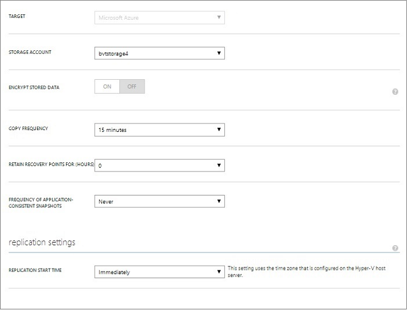

Nadat u de instellingen hebt opgeslagen, wordt een taak gemaakt. De taak kan worden gecontroleerd op het tabblad **Taken**. Alle Hyper-V-hostservers in de VMM-broncloud worden voor replicatie geconfigureerd.

Cloudinstellingen kunnen nadat ze zijn opgeslagen worden gewijzigd op het tabblad **Configureren**. Als u de doellocatie of het doelopslagaccount wilt wijzigen, moet u de cloudconfiguratie verwijderen en de cloud vervolgens opnieuw configureren. Houd er rekening mee dat als u het opslagaccount wijzigt, de wijziging alleen geldt voor virtuele machines die zijn ingeschakeld voor beveiliging nadat het opslagaccount is gewijzigd. Bestaande virtuele machines worden niet gemigreerd naar het nieuwe opslagaccount.

## Stap 7: Netwerktoewijzing configureren
Controleer voordat u met de netwerktoewijzing begint of de virtuele machines op de bron-VMM-server zijn verbonden met een VM-netwerk. Maak ook een of meer virtuele Azure-netwerken. Er kunnen meerdere VM-netwerken worden toegewezen aan één Azure-netwerk.

1. Klik op de pagina Snel starten op **Netwerken toewijzen**.
2. Selecteer op het tabblad **Netwerken** in **Bronlocatie** de bron-VMM-server. Selecteer in **Doellocatie** de optie Azure.
3. In **Bron**netwerken wordt een lijst met VM-netwerken weergegeven die zijn gekoppeld aan de VMM-server. In **Doel**netwerken worden de Azure-netwerken weergegeven die zijn gekoppeld aan het abonnement.
4. Selecteer het bron-VM-netwerk en klik op **Toewijzen**.
5. Selecteer op de pagina **Een doelnetwerk selecteren** het doel-Azure-netwerk dat u wilt gebruiken.
6. Klik op het vinkje om het toewijzingsproces te voltooien.

    

Nadat u de instellingen hebt opgeslagen, wordt een taak gestart om de voortgang van de toewijzing te volgen. U kunt deze taak controleren op het tabblad Taken. Alle bestaande gerepliceerde virtuele machines die bij het bron-VM-netwerk horen, worden verbonden met de doel-Azure-netwerken. Nieuwe virtuele machines die zijn verbonden met het bron-VM-netwerk, worden na de replicatie verbonden met het toegewezen Azure-netwerk. Als u een bestaande toewijzing wijzigt met een nieuw netwerk, worden gerepliceerde virtuele machines verbonden met de nieuwe instellingen.

Als het doelnetwerk meerdere subnetten heeft en een van deze subnetten dezelfde naam heeft als het subnet waarin de virtuele bronmachine zich bevindt, wordt de gerepliceerde virtuele machine na een failover verbonden met dat doelsubnet. Als er geen doelsubnet met een overeenkomende naam bestaat, wordt de virtuele machine verbonden met het eerste subnet in het netwerk.

> [AZURE.NOTE] [Migratie van netwerken](../resource-group-move-resources.md) in resourcegroepen binnen hetzelfde abonnement of tussen abonnementen wordt niet ondersteund voor netwerken die worden gebruikt voor het implementeren van Site Recovery.

## Stap 8: Beveiliging voor virtuele machines inschakelen

Wanneer de servers, clouds en netwerken correct zijn geconfigureerd, kunt u beveiliging voor virtuele machines in de cloud inschakelen. Houd rekening met het volgende:

- Virtuele machines moeten voldoen aan [Azure-vereisten](site-recovery-best-practices.md#azure-virtual-machine-requirements).
- Als u beveiliging wilt inschakelen, moeten het besturingssysteem en de schijfeigenschappen van het besturingssysteem zijn ingesteld voor de virtuele machine. Wanneer u een virtuele machine in VMM maakt met een sjabloon voor een virtuele machine, kunt u de eigenschap instellen. U kunt deze eigenschappen ook voor bestaande virtuele machines instellen op de tabbladen **Algemeen** en **Hardwareconfiguratie** van de eigenschappen van de virtuele machines. Als u deze eigenschappen niet in VMM instelt, kunt u ze configureren in de Azure Site Recovery-portal.

    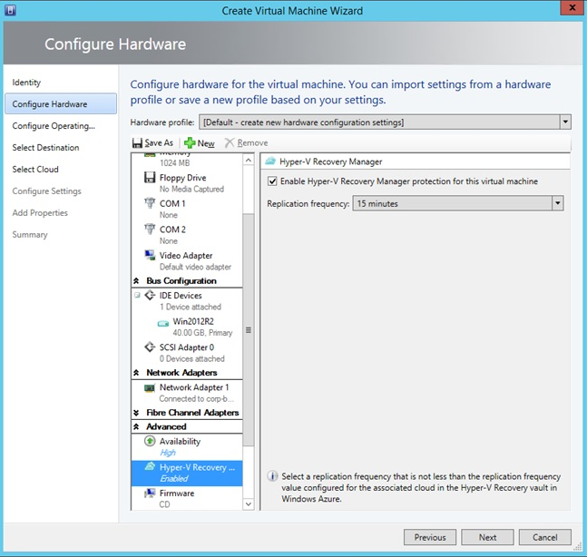

    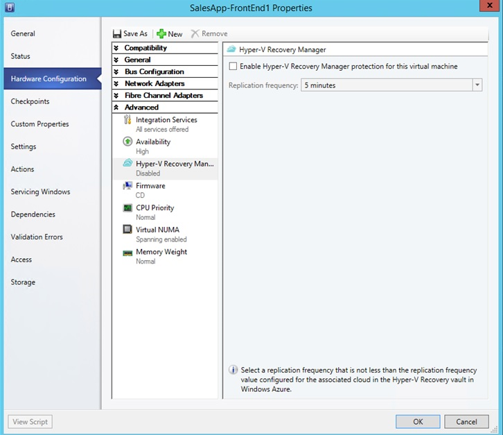

1. U schakelt als volgt beveiliging in: klik op het tabblad **Virtuele machines** in de cloud waarin de virtuele machine zich bevindt, op **Beveiliging inschakelen** > **Virtuele machines toevoegen**.
2. Selecteer in de lijst met virtuele machines in de cloud de virtuele machine die u wilt beveiligen.

    

    Volg de voortgang van de actie **Beveiliging inschakelen** op het tabblad **Taken**, met inbegrip van de eerste replicatie. Nadat de taak **Beveiliging voltooien** is uitgevoerd, is de virtuele machine klaar voor failover. Nadat de beveiliging is ingeschakeld en virtuele machines zijn gerepliceerd, worden ze in Azure weergegeven.

    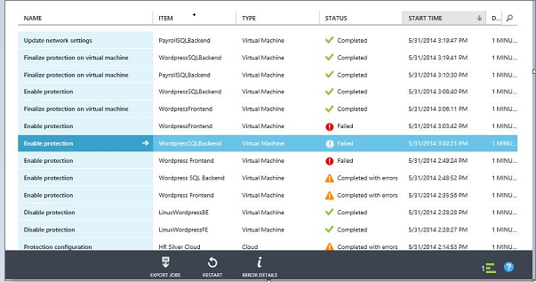

3. Controleer de eigenschappen van de virtuele machines en wijzig deze zo nodig.

    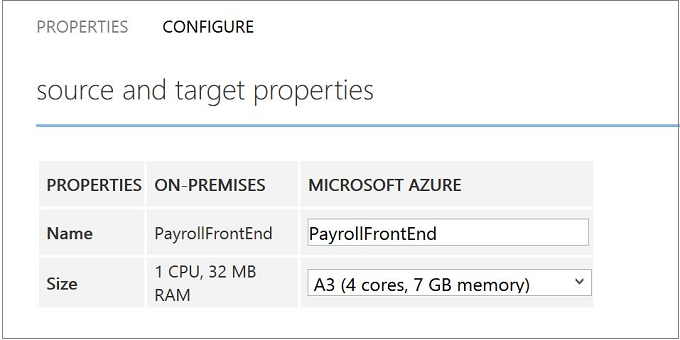

4. Op het tabblad **Configureren** van de eigenschappen van de virtuele machines kunnen de volgende netwerkeigenschappen worden gewijzigd.

- **Aantal netwerkadapters op de virtuele doelmachine**: het aantal netwerkadapters wordt bepaald door de grootte die u voor de virtuele doelmachine opgeeft. Raadpleeg [de specificaties voor de grootte van virtuele machines](../virtual-machines/virtual-machines-linux-sizes.md#size-tables) voor het aantal ondersteunde adapters voor de verschillende grootten van een virtuele machine. Wanneer u de grootte voor een virtuele machine wijzigt en de instellingen opslaat, wordt het aantal netwerkadapters gewijzigd wanneer u de pagina **Configureren** opnieuw opent. Het aantal netwerkadapters van de virtuele doelmachines is het minimum aantal netwerkadapters op de virtuele bronmachine en het maximum aantal netwerkadapters dat wordt ondersteund door de grootte van de gekozen virtuele machine, waarbij het volgende geldt:

    - Als het aantal netwerkadapters op de bronmachine kleiner is dan of gelijk is aan het aantal adapters dat is toegestaan voor de grootte van de doelmachine, heeft het doel hetzelfde aantal adapters als de bron.
    - Als het aantal adapters voor de virtuele bronmachine meer is dan is toegestaan voor de doelgrootte, wordt het maximum voor de doelgrootte gebruikt.
    - Als een bronmachine bijvoorbeeld twee netwerkadapters heeft en met de grootte van de doelmachine vier netwerkadapters worden ondersteund, heeft de doelcomputer twee adapters. Als de bronmachine twee adapters heeft, maar met de ondersteunde doelgrootte slechts één wordt ondersteund, heeft de doelcomputer slechts één adapter.    

- **Netwerk van de virtuele doelmachine**: het netwerk waarmee de virtuele machine verbinding maakt, wordt bepaald door de netwerktoewijzing van het netwerk van de virtuele bronmachine. Als de virtuele bronmachine meer dan een netwerkadapter heeft en er bronnetwerken worden toegewezen aan verschillende doelnetwerken, moet u tussen een van de doelnetwerken kiezen.
- **Subnet van elke netwerkadapter**: voor elke netwerkadapter kunt u het subnet selecteren waarmee de virtuele machine bij failover moet worden verbonden.
- **Doel-IP-adres**: als de netwerkadapter van de virtuele bronmachine is geconfigureerd voor gebruik van een statisch IP-adres, kunt u het IP-adres voor de virtuele doelmachine opgeven. Gebruik deze functie om het IP-adres van een virtuele bronmachine te behouden na een failover. Als er geen IP-adres is opgegeven, wordt er een willekeurig beschikbaar IP-adres aan de netwerkadapter gegeven op het moment van failover. Als het doel-IP-adres is opgegeven, maar het adres al door een andere virtuele machine in Azure wordt gebruikt, mislukt de failover.  

    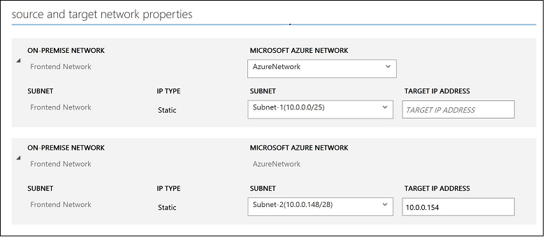

>[AZURE.NOTE] Virtuele Linux-machines met een statisch IP-adres worden niet ondersteund.

## De implementatie testen

Als u uw implementatie wilt testen, kunt u een testfailover voor één virtuele machine uitvoeren of een herstelplan maken dat bestaat uit meerdere virtuele machines en een testfailover voor het plan uitvoeren.  

Met een testfailover wordt uw failover- en herstelmechanisme in een geïsoleerd netwerk gesimuleerd. Houd rekening met het volgende:

- Als u na de failover verbinding wilt maken met de virtuele machine in Azure met Extern bureaublad, schakelt u Verbinding met extern bureaublad in op de virtuele machine voordat u de testfailover uitvoert.
- Na de failover gebruikt u een openbaar IP-adres om met Extern bureaublad verbinding te maken met de virtuele machine in Azure. Als u dit wilt doen, zorgt u ervoor dat u geen domeinbeleid hebt waarmee het verbinden met een virtuele machine via een openbaar adres wordt verhinderd.

>[AZURE.NOTE] Voor de beste prestaties bij een failover naar Azure moet de Azure-agent op de beveiligde machine zijn geïnstalleerd. Dit helpt bij het sneller opstarten en helpt ook bij de diagnose in geval van problemen. De Linux-agent is [hier](https://github.com/Azure/WALinuxAgent) en de Windows-agent [hier](http://go.microsoft.com/fwlink/?LinkID=394789) beschikbaar.

### Een herstelplan maken

1. Voeg op het tabblad **Herstelplannen** een nieuw plan toe. Geef een naam op, geef **VMM** op bij **Brontype** en geef in **Bron** de bron-VMM-server op. Azure is het doel.

    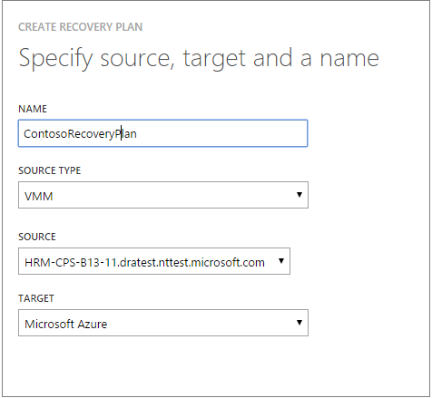

2. Selecteer op de pagina **Virtuele machines selecteren** de virtuele machines die u aan het herstelplan wilt toevoegen. Deze virtuele machines worden toegevoegd aan de standaardgroep voor het herstelplan: groep 1. Er zijn maximaal 100 virtuele machines in één herstelplan getest.

- Als u de eigenschappen van de virtuele machines wilt controleren voordat u ze aan het plan toevoegt, klikt u op de virtuele machine op de eigenschappenpagina van de cloud waarin deze zich bevindt. U kunt de eigenschappen van virtuele machines ook configureren in de VMM-console.
- Alle virtuele machines die worden weergegeven, zijn voor beveiliging ingeschakeld. De lijst bevat zowel virtuele machines die zijn ingeschakeld voor beveiliging en waarvoor de eerste replicatie is voltooid, als virtuele machines die zijn ingeschakeld voor beveiliging en waarvoor de eerste replicatie in behandeling is. Alleen voor virtuele machines waarvoor de eerste replicatie is voltooid, kan een failover als onderdeel van een herstelplan worden uitgevoerd.

    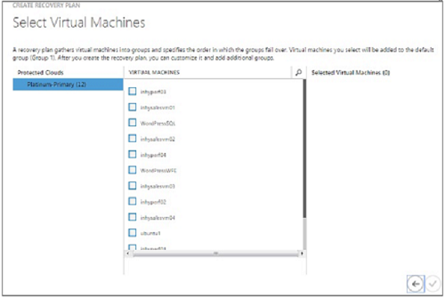

Nadat een herstelplan is gemaakt, wordt het weergegeven op het tabblad **Herstelplannen**. U kunt ook [Azure Automation-runbooks](site-recovery-runbook-automation.md) aan het herstelplan toevoegen om acties tijdens de failover te automatiseren.

### Een testfailover uitvoeren

Er zijn twee manieren om een testfailover naar Azure uit te voeren.

- **Testfailover zonder een Azure-netwerk**: bij dit type testfailover wordt gecontroleerd of de virtuele machine correct in Azure wordt ingesteld. De virtuele machine wordt niet verbonden met een Azure-netwerk na een failover.
- **Testfailover met een Azure-netwerk**: bij dit type failover wordt gecontroleerd of de volledige replicatieomgeving naar verwachting wordt ingesteld en of de virtuele machines na failover worden verbonden met het opgegeven doel-Azure-netwerk. Wat betreft de afhandeling van het subnet wordt het subnet van de virtuele testmachine voor de testfailover gekozen op basis van het subnet van de gerepliceerde virtuele machine. Dit is anders dan bij de normale replicatie wanneer het subnet van een gerepliceerde virtuele machine wordt gebaseerd op het subnet van de virtuele bronmachine.

Als u voor een virtuele machine die is ingeschakeld voor beveiliging, een testfailover naar Azure wilt uitvoeren zonder een Azure-doelnetwerk op te geven, hoeft u niets voor te bereiden. Als u een testfailover wilt uitvoeren met een Azure-doelnetwerk, moet u een nieuw Azure-netwerk maken dat is geïsoleerd van uw Azure productienetwerk (standaardwerking wanneer u een nieuw netwerk in Azure maakt). Zie [Een testfailover uitvoeren](site-recovery-failover.md#run-a-test-failover) voor meer informatie.

U moet ook de infrastructuur zo instellen dat de gerepliceerde virtuele machine naar verwachting werkt. Een virtuele machine met Domain Controller en DNS bijvoorbeeld kan worden gerepliceerd naar Azure met Azure Site Recovery en kan met Testfailover in het testnetwerk worden gemaakt. Zie [Testfailover-overwegingen voor Active Directory](site-recovery-active-directory.md#considerations-for-test-failover) voor meer informatie.

Ga als volgt te werk om een testfailover uit te voeren:

1. Selecteer op het tabblad **Herstelplannen** het plan en klik op **Testfailover**.
2. Selecteer op de pagina **Testfailover bevestigen** de optie **Geen** of een specifiek Azure-netwerk.  Als u Geen hebt geselecteerd, wordt bij de testfailover gecontroleerd of de virtuele machine correct naar Azure is gerepliceerd maar wordt de configuratie van het replicatienetwerk niet gecontroleerd.

    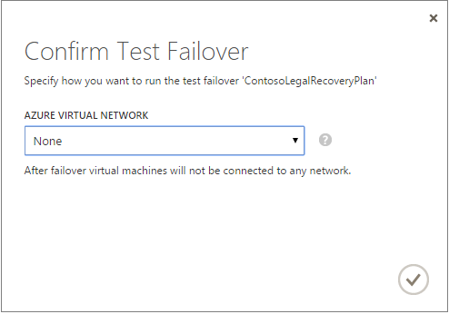

3. Als voor de cloud gegevensversleuteling is ingeschakeld, selecteert u in **Versleutelingssleutel** het certificaat dat is uitgegeven tijdens de installatie van Provider op de VMM-server als u de optie voor het inschakelen van gegevensversleuteling voor een cloud hebt ingeschakeld.
4. Op het tabblad **Taken** kunt u de voortgang van de failover volgen. U moet ook de testreplica van de virtuele machine in de Azure-portal kunnen zien. Als u klaar bent om toegang tot virtuele machines te krijgen vanaf uw on-premises netwerk, kunt u een Extern bureaublad-verbinding naar de virtuele machine starten.
5. Wanneer de fase **Testen voltooien** van de failover is bereikt, klikt u op **Test voltooien** om de testfailover te voltooien. U kunt inzoomen op het tabblad **Taak** om de voortgang en status van de failover bij te houden en de benodigde acties uit te voeren.
6. Na de failover wordt de testreplica van de virtuele machine in de Azure-portal weergegeven. Als u vanuit uw on-premises netwerk toegang hebt tot virtuele machines, kunt u ook een Extern bureaublad-verbinding naar de virtuele machine starten. Ga als volgt te werk:

    1. Controleer of de virtuele machines zijn gestart.
    2. Als u na de failover verbinding wilt maken met de virtuele machine in Azure met Extern bureaublad, schakelt u Verbinding met extern bureaublad in op de virtuele machine voordat u de testfailover uitvoert. U moet ook een RDP-eindpunt op de virtuele machine toevoegen. U kunt hiervoor een [Azure Automation-runbook](site-recovery-runbook-automation.md) gebruiken.
    3. Als u na de failover een openbaar IP-adres gebruikt om met Extern bureaublad verbinding te maken met de virtuele machine in Azure, zorgt u ervoor dat u geen domeinbeleid hebt waarmee het verbinden met een virtuele machine via een openbaar adres wordt verhinderd.

7.  Nadat de test is voltooid, gaat u als volgt te werk:
    - Klik op **De testfailover is voltooid**. Schoon de testomgeving op om automatisch uit te schakelen en de virtuele testmachines te verwijderen.
    - Klik op **Notities** om eventuele opmerkingen over de testfailover vast te leggen en op te slaan.

>

## Volgende stappen

Meer informatie over [herstelplannen maken](site-recovery-create-recovery-plans.md) en [failover](site-recovery-failover.md).

<!--HONumber=ago16_HO5-->

