<properties
    pageTitle="Virtuele Hyper-V-machines in VMM-clouds repliceren naar Azure met Site Recovery en de Azure Portal | Microsoft Azure"
    description="In dit artikel wordt beschreven hoe u Azure Site Recovery implementeert om replicatie, failovers en herstel van virtuele Hyper-V-machines in VMM-clouds naar Azure te beheren met de Azure-portal."
    services="site-recovery"
    documentationCenter=""
    authors="rayne-wiselman"
    manager="jwhit"
    editor="tysonn"/>

<tags
    ms.service="site-recovery"
    ms.workload="backup-recovery"
    ms.tgt_pltfrm="na"
    ms.devlang="na"
    ms.topic="hero-article"
    ms.date="09/16/2016"
    ms.author="raynew"/>

# Virtuele Hyper-V-machines in VMM-clouds repliceren naar Azure met Azure Site Recovery en de Azure-portal | Microsoft Azure

> [AZURE.SELECTOR]
- [Azure Portal](site-recovery-vmm-to-azure.md)
- [Klassieke Azure-portal](site-recovery-vmm-to-azure-classic.md)
- [PowerShell Resource Manager](site-recovery-vmm-to-azure-powershell-resource-manager.md)
- [PowerShell klassiek](site-recovery-deploy-with-powershell.md)

Welkom bij Azure Site Recovery! Gebruik dit artikel als u met behulp van Azure Site Recovery in de Azure Portal on-premises virtuele Hyper-V-machines naar Azure wilt repliceren die in System Center Virtual Machine Manager-clouds (VMM) worden beheerd.

> [AZURE.NOTE] Azure heeft twee verschillende [implementatiemodellen](../resource-manager-deployment-model
> ) voor het maken van en werken met resources: Azure Resource Manager en het klassieke model. Azure heeft bovendien twee portals: de klassieke de Azure-portal, die ondersteuning biedt voor het klassieke implementatiemodel, en de Azure-portal, die ondersteuning biedt voor beide implementatiemodellen.

Azure Site Recovery in de Azure Portal biedt verschillende nieuwe functies:

- De Azure Backup-service en de Azure Site Recovery-service zijn in de Azure Portal gecombineerd tot één Recovery Services-kluis, zodat u vanaf één locatie zakelijke continuïteit en herstel na noodgevallen (BCDR) kunt beheren. Via het uniforme dashboard kunt u de bewerkingen op uw on-premises sites en in de openbare Azure-cloud bewaken en beheren.
- Gebruikers met Azure-abonnementen die het Cloud Solution Provider-programma (CSP) bevatten, kunnen nu Site Recovery-bewerkingen beheren in de Azure-portal.
- Met Site Recovery in de Azure Portal kunnen machines naar Azure Resource Manager-opslagaccounts worden gerepliceerd. Bij het uitvoeren van een failover maakt Site Recovery virtuele Resource Manager-machines aan in Azure.
- Site Recovery blijft ondersteuning bieden voor replicatie naar klassieke opslagaccounts. Bij een failover maakt Site Recovery virtuele machines aan op basis van het klassieke model.

Na het lezen van dit artikel kunt u eventuele opmerkingen kwijt in het Disqus-reactiegedeelte onder aan het artikel. Technische vragen kunt u stellen op het [Azure Recovery Services-forum](https://social.msdn.microsoft.com/forums/azure/home?forum=hypervrecovmgr).

## Overzicht

Organisaties hebben een BCDR-strategie nodig die bepaalt op welke wijze toepassingen, workloads en gegevens beschikbaar blijven tijdens geplande en ongeplande uitval, en ervoor zorgt dat deze zo snel mogelijk worden hersteld naar een normale manier van functioneren. In uw BCDR-strategie moeten bedrijfsgegevens veilig en herstelbaar blijven. Ook moet ervoor worden gezorgd dat workloads continu beschikbaar blijven wanneer zich een noodsituatie voordoet.

Site Recovery is een Azure-service die bijdraagt aan uw BCDR-strategie door replicatie van fysieke on-premises servers en virtuele machines in de cloud (Azure) of naar een secundair datacenter te organiseren. Als er uitval optreedt op uw primaire locatie, schakelt u over naar de secundaire locatie om toepassingen en workloads beschikbaar te houden. U schakelt terug naar de primaire locatie wanneer deze weer normaal functioneert. Zie [Wat is Azure Site Recovery?](site-recovery-overview.md) voor meer informatie

Dit artikel bevat alle informatie die u nodig hebt om on-premises virtuele Hyper-V-machines in VMM-clouds naar Azure te repliceren. Het bevat een architectuuroverzicht, planningsinformatie en implementatiestappen voor het configureren van Azure, on-premises servers, replicatie-instellingen en capaciteitsplanning. Nadat u de infrastructuur hebt ingesteld, kunt u replicatie inschakelen op de machines die u wilt beveiligen. Controleer vervolgens of het uitvoeren van failovers werkt.

## Zakelijke voordelen

- Site Recovery biedt externe beveiliging voor zakelijke workloads en toepassingen die op virtuele Hyper-V-machines worden uitgevoerd.
- De Recovery Services-portal biedt één locatie voor het instellen, beheren en bewaken van replicatie, failovers en herstel.
- U kunt eenvoudig failovers uitvoeren vanuit uw on-premises infrastructuur naar Azure. Bovendien kunt u een failback (herstel) van Azure uitvoeren naar Hyper-V-hostservers op uw on-premises site.
- U kunt herstelplannen met meerdere machines configureren, zodat er voor gelaagde toepassingsworkloads gelijktijdig een failover wordt uitgevoerd.

## Scenario-architectuur

Dit zijn de scenario-onderdelen:

- **VMM-server**: een on-premises VMM-server met één of meer clouds.
- **Hyper-V-host of -cluster**: Hyper-V-hostservers of -clusters die in VMM-clouds worden beheerd.
- **Azure Site Recovery-provider en de Recovery Services-agent**: tijdens de implementatie installeert u de Azure Site Recovery-provider op de VMM-server en de Microsoft Azure Recovery Services-agent op de Hyper-V-hostservers. De provider op de VMM-server communiceert via HTTPS 443 met Site Recovery om replicatie mogelijk te maken. De agent op de Hyper-V-hostserver repliceert standaard gegevens naar Azure Storage via HTTPS 443.
- **Azure**: u moet beschikken over een Azure-abonnement, over een Azure-opslagaccount (om gerepliceerde gegevens op te slaan) en over een virtueel Azure-netwerk, zodat de virtuele Azure-machines na een failover worden verbonden met een netwerk.

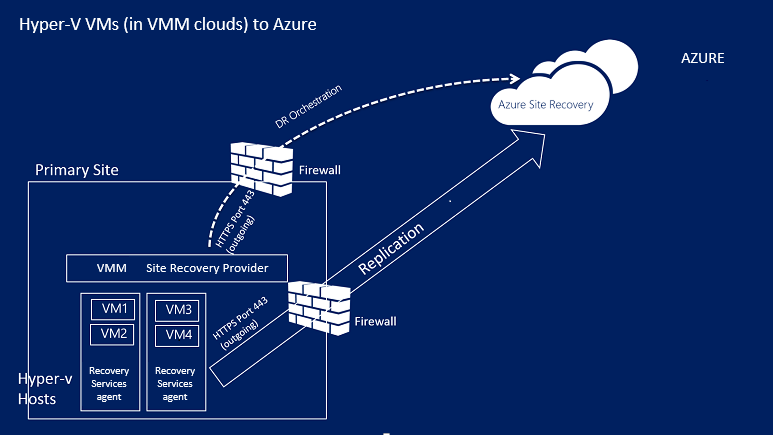

## Vereisten voor Azure

Dit is wat u in Azure nodig hebt om dit scenario te implementeren.

**Vereiste** | **Details**
--- | ---
**Azure-account**| U hebt een [Microsoft Azure](http://azure.microsoft.com/)-account nodig. U kunt beginnen met een [gratis proefversie](https://azure.microsoft.com/pricing/free-trial/). [Meer informatie](https://azure.microsoft.com/pricing/details/site-recovery/) over prijzen voor Site Recovery.
**Azure-opslag** | U hebt een standaard-Azure-opslagaccount nodig om gerepliceerde gegevens op te slaan. U kunt een LRS- of GRS-opslagaccount gebruiken. GRS wordt aanbevolen, omdat de gegevens dan flexibel zijn te gebruiken als er sprake is van regionale uitval of als de primaire regio niet kan worden hersteld. [Meer informatie](../storage/storage-redundancy.md). Het account moet zich in dezelfde regio bevinden als de Recovery Services-kluis.  Premium-opslag wordt niet ondersteund.   Gerepliceerde gegevens worden opgeslagen in Azure-opslag en bij een failover worden virtuele Azure-machines ingezet.    [Meer informatie](../storage/storage-introduction.md) over Azure-opslag.
**Azure-netwerk** | U hebt een virtueel Azure-netwerk nodig waarmee virtuele Azure-machines verbinding maken wanneer er een failover plaatsvindt. Het netwerk moet zich in dezelfde regio bevinden als de Recovery Services-kluis.

## Vereisten voor on-premises

On-premises hebt u het volgende nodig

**Vereiste** | **Details**
--- | ---
**VMM**| Een of meer VMM-servers met System Center 2012 R2. Voor elke VMM-server moeten een of meer clouds zijn geconfigureerd. Een cloud moet de volgende zaken bevatten:   Een of meer VMM-hostgroepen.   Een of meer Hyper-V-hostservers of -clusters in elke hostgroep.  [Meer informatie](http://www.server-log.com/blog/2011/8/26/vmm-2012-and-the-clouds.html) over het instellen van VMM-clouds.
**Hyper-V** | Op Hyper-V-hostservers moet ten minste Windows Server 2012 R2 met de Hyper-V-rol worden uitgevoerd. Bovendien moeten de meest recente updates zijn geïnstalleerd.   Een Hyper-V-server moet een of meer virtuele machines bevatten.   Een Hyper-V-hostserver of -cluster met virtuele machines die u wilt repliceren, moet worden beheerd in een VMM-cloud.  Hyper-V-servers moeten zijn verbonden met internet, rechtstreeks of via een proxyserver.  Hyper-V-servers moeten beschikken over de oplossingen die zijn vermeld in artikel [2961977](https://support.microsoft.com/kb/2961977).  Hyper-V-hostservers moeten toegang hebben tot internet voor gegevensreplicatie in Azure.
**Provider en agent** | Tijdens de implementatie van Azure Site Recovery installeert u de Azure Site Recovery-provider op de VMM-server en de Recovery Services-agent op de Hyper-V-hosts. De provider en de agent moeten via internet met Azure worden verbonden, hetzij rechtstreeks, hetzij via een proxy. Op HTTPS gebaseerde proxy’s worden niet ondersteund. De proxyserver op de VMM-server en de Hyper-V-hosts moeten toegang toestaan tot:    *.hypervrecoverymanager.windowsazure.com    *.accesscontrol.windows.net    *.backup.windowsazure.com    *.blob.core.windows.net    *.store.core.windows.net  Als u op de VMM-server op IP-adressen gebaseerde firewallregels gebruikt, controleert u of de regels communicatie met Azure toestaan. Sta de IP-adresbereiken toe die worden beschreven in [Azure Datacenter IP Ranges](https://www.microsoft.com/download/confirmation.aspx?id=41653) (Azure Datacenter IP-bereiken), evenals het protocol HTTPS (433).  Sta de IP-adresbereiken voor de Azure-regio van uw abonnement en die voor de regio VS - west toe.  Daarnaast heeft de proxyserver van de VMM-server toegang nodig tot https://www.msftncsi.com/ncsi.txt

## Vereisten voor beveiligde machines

**Vereiste** | **Details**
--- | ---
**Beveiligde virtuele machines** | Voordat u een failover uitvoert voor een virtuele machine, moet u ervoor zorgen dat de naam die aan de virtuele Azure-machine wordt toegewezen, voldoet aan de [Azure-vereisten](site-recovery-best-practices.md#azure-virtual-machine-requirements). U kunt de naam wijzigen nadat u replicatie voor de virtuele machine hebt ingeschakeld.    Op beveiligde machines mag de capaciteit per schijf niet meer dan 1023 GB bedragen. Een virtuele machine mag maximaal 64 schijven hebben (maximaal 64 TB).   Gastclusters met gedeelde schijven worden niet ondersteund.   Opstarten op basis van Unified Extensible Firmware Interface (UEFI) / Extensible Firmware Interface(EFI) wordt niet ondersteund.   Als de virtuele bronmachine is voorzien van een NIC-koppeling, wordt er na de failover naar Azure slechts één NIC gebruikt.  Het beveiligen van virtuele machines waarop Linux wordt uitgevoerd met een statisch IP-adres, wordt niet ondersteund.

## Implementatie voorbereiden

U moet het volgende doen om de implementatie voor te bereiden:

1. [Een Azure-netwerk instellen](#set-up-an-azure-network) waarin de virtuele Azure-machines worden opgeslagen na de failover.
2. [Een Azure-opslagaccount instellen](#set-up-an-azure-storage-account) voor gerepliceerde gegevens.
4. [De VMM-server voorbereiden](#prepare-the-vmm-server) op de implementatie van Site Recovery.
5. [Voorbereiden op netwerktoewijzing](#prepare-for-network-mapping). Stel netwerken zodanig in dat u tijdens de implementatie van Site Recovery netwerktoewijzing kunt configureren.

### Een Azure-netwerk instellen

U hebt een Azure-netwerk nodig waarmee de virtuele Azure-machines die na een failover worden gemaakt, kunnen worden verbonden.

- Het netwerk moet zich in dezelfde regio bevinden als het netwerk waarin u de Recovery Services-kluis implementeert.
- Afhankelijk van het resourcemodel dat u wilt gebruiken voor virtuele Azure-machines waarvoor een failover is uitgevoerd, moet u het Azure-netwerk instellen in de [Resource Manager-modus](../virtual-network/virtual-networks-create-vnet-arm-pportal.md) of de [klassieke modus](../virtual-network/virtual-networks-create-vnet-classic-pportal.md).
- U doet er verstandig aan een netwerk in te stellen voordat u begint. Anders moet u dit doen tijdens de implementatie van Site Recovery.

> [AZURE.NOTE] [Migratie van netwerken](../resource-group-move-resources.md) in resourcegroepen binnen hetzelfde abonnement of tussen abonnementen wordt niet ondersteund voor netwerken die worden gebruikt voor het implementeren van Site Recovery.

### Een Azure-opslagaccount instellen

- U hebt een standaard-Azure-opslagaccount nodig om gerepliceerde gegevens op te slaan in Azure. Het account moet zich in dezelfde regio bevinden als de Recovery Services-kluis.
- Afhankelijk van het resourcemodel dat u wilt gebruiken voor virtuele Azure-machines waarvoor een failover is uitgevoerd, moet u een account instellen in de [Resource Manager-modus](../storage/storage-create-storage-account.md) of de [klassieke modus](../storage/storage-create-storage-account-classic-portal.md).
- U doet er verstandig aan een account in te stellen voordat u begint. Anders moet u dit doen tijdens de implementatie van Site Recovery.

> [AZURE.NOTE] [Migratie van opslagaccounts](../resource-group-move-resources.md) in resourcegroepen binnen hetzelfde abonnement of tussen abonnementen wordt niet ondersteund voor opslagaccounts die worden gebruikt voor het implementeren van Site Recovery.

### De VMM-server voorbereiden

- Zorg ervoor dat de VMM-server voldoet aan de [vereisten](#on-premises-prerequisites).
- Tijdens de implementatie van Site Recovery kunt u opgeven dat alle clouds op een VMM-server beschikbaar moeten zijn in de Azure Portal. Als u wilt dat alleen bepaalde clouds in de portal worden weergegeven, kunt u die instelling in de cloud inschakelen via de VMM-beheerconsole.

### Voorbereiden op netwerktoewijzing

Tijdens de implementatie van Site Recovery moet u netwerktoewijzing instellen. Bij netwerktoewijzing worden VMM-bronnetwerken met virtuele machines toegewezen aan doelnetwerken in Azure om het volgende mogelijk te maken:

- Machines waarvoor een failover naar hetzelfde netwerk wordt uitgevoerd, kunnen met elkaar worden verbonden, zelfs als de failover niet op dezelfde manier of volgens hetzelfde herstelplan wordt uitgevoerd.
- Als er in het doelnetwerk in Azure een netwerkgateway is ingesteld, kunnen virtuele Azure-machines worden verbonden met on-premises virtuele machines.
- U moet het volgende voorbereiden om netwerktoewijzing in te stellen:

    - Zorg ervoor dat de virtuele machines op de Hyper-V-bronhostserver zijn verbonden met een VMM-netwerk met virtuele machines. Dit netwerk moet zijn gekoppeld aan een logisch netwerk dat is verbonden met de cloud.
    - Een Azure-netwerk zoals [hierboven](#set-up-an-azure-network) wordt beschreven

- [Meer informatie](site-recovery-network-mapping.md) over hoe netwerktoewijzing werkt.

## Een Recovery Services-kluis maken

1. Meld u aan bij de [Azure-portal](https://portal.azure.com).
2. Klik op **Nieuw** > **Beheer** > **Recovery Services**. U kunt ook klikken op **Bladeren** > **Recovery Services**-kluizen > **Toevoegen**.

    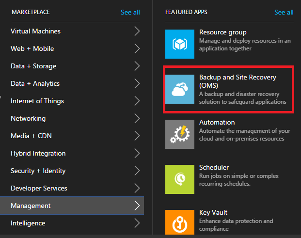

3. Geef in **Naam** een beschrijvende naam op om de kluis mee aan te duiden. Als u meer dan één abonnement hebt, selecteert u een van uw abonnementen.
4. [Maak een resourcegroep](../resource-group-template-deploy-portal.md) of selecteer een bestaande resourcegroep. Geef een Azure-regio op. Machines worden naar deze regio gerepliceerd. Zie Geografische beschikbaarheid in [Prijsinformatie voor Azure Site Recovery](https://azure.microsoft.com/pricing/details/site-recovery/) om na te gaan welke regio's er worden ondersteund
4. Als u de kluis snel wilt openen via het dashboard, klikt u op **Vastmaken aan dashboard** > **Kluis maken**.

    

De nieuwe kluis wordt weergegeven op het **Dashboard** > **Alle resources** en op de hoofdblade **Recovery Services-kluizen**.

## Aan de slag

Site Recovery biedt een speciaal Aan de slag-proces. Dit stelt u in staat de implementatie zo snel mogelijk uit te voeren. In het Aan de slag-proces wordt gecontroleerd of er aan de vereisten is voldaan en doorloopt u de Site Recovery-implementatiestappen in de juiste volgorde.

In het Aan de slag-proces selecteert u welk type machines u wilt repliceren en waar u naar wilt repliceren. U stelt on-premises servers in, evenals Azure-opslagaccounts en netwerken. U maakt beleidsregels voor replicatie en u maakt een capaciteitsplanning. Nadat u de infrastructuur hebt ingesteld, schakelt u replicatie voor virtuele machines in. U kunt failovers uitvoeren voor specifieke machines, maar ook herstelplannen maken voor het uitvoeren van een failover voor meerdere machines.

U begint met het Aan de slag-proces door te kiezen hoe u Site Recovery wilt implementeren. Afhankelijk van uw vereisten voor replicatie vertoont het Aan de slag-proces lichte verschillen.

## Stap 1: uw beveiligingsdoelstellingen kiezen

Selecteer wat u wilt repliceren en waar u naar wilt repliceren.

1. Selecteer uw kluis op de blade **Recovery Services-kluizen** en klik op **Instellingen**.
2. Klik in **Aan de slag** op **Site Recovery** > **Stap 1: infrastructuur voorbereiden** > **Beveiligingsdoel**.

    

3. Selecteer in **Beveiligingsdoel** de optie **Naar Azure**. Selecteer vervolgens **Ja, met Hyper-V**. Selecteer **Ja** om te bevestigen dat u VMM gebruikt voor het beheren van Hyper-V-hosts en de herstelsite. Klik vervolgens op **OK**.

    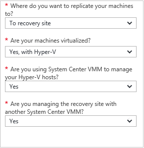

## Stap 2: de bronomgeving instellen

Installeer de Azure Site Recovery-provider op de VMM-server en registreer de server in de kluis. Installeer de Azure Recovery Services-agent op de Hyper-V-hosts.

1. Klik op **Stap 2: infrastructuur voorbereiden** > **Bron**.

    

2. Klik in **Bron voorbereiden** op **+ VMM** om een VMM-server toe te voegen.

    

3. Controleer op de blade **Server toevoegen** of **System Center VMM-server** wordt weergegeven in **Servertype** en of de VMM-server voldoet aan de [algemene vereisten en de URL-vereisten](#on-premises-prerequisites).
4. Download het installatieprogramma voor de Azure Site Recovery-provider.
5. Download de registratiesleutel. U hebt deze nodig wanneer u de installatie uitvoert. De sleutel blijft vijf dagen na het genereren ervan geldig.

    

6. Installeer de Azure Site Recovery-provider op de VMM-server.

### De Azure Site Recovery-provider installeren

1.  Voer het providerinstallatiebestand uit.
2. In **Microsoft Update** kunt u updates inschakelen, zodat de providerupdates volgens uw Microsoft Update-beleid worden geïnstalleerd.
3. Accepteer of wijzig in **Installatie** de standaardinstallatielocatie van de provider en klik op **Installeren**.

    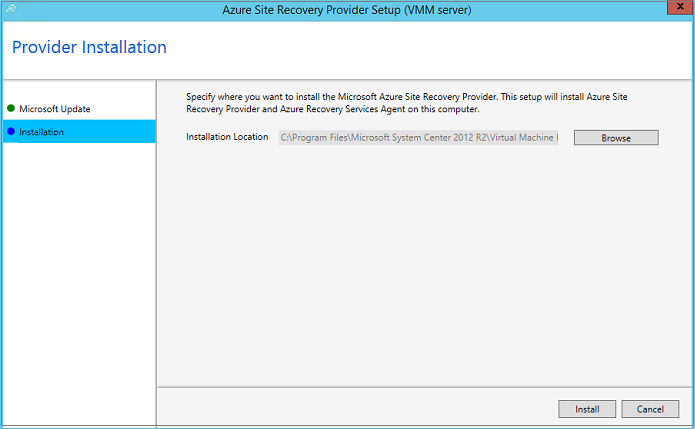

4. Wanneer de installatie is voltooid, klikt u op **Registreren** om de VMM-server in de kluis te registreren.
5. Klik op de pagina **Kluisinstellingen** op **Bladeren** om het kluissleutelbestand te selecteren. Geef het Azure Site Recovery-abonnement en de kluisnaam op.

    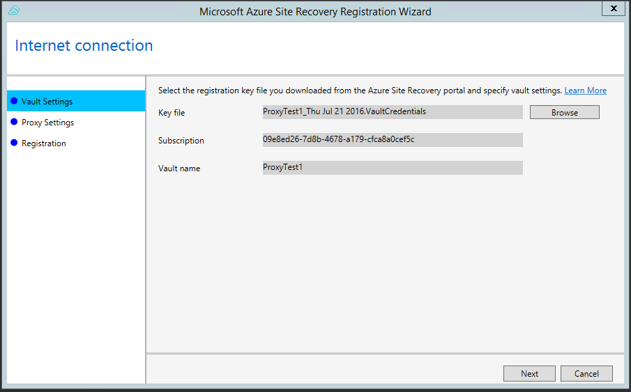

6. Geef in **Internetverbinding** op hoe de provider die op de VMM-server wordt uitgevoerd, via internet verbinding moet maken met Site Recovery.

    - Als u wilt dat de provider rechtstreeks verbinding maakt, selecteert u **Rechtstreeks verbinding maken met Azure Site Recovery zonder proxyserver**.
    - Als voor uw bestaande proxy verificatie is vereist of als u een aangepaste proxy wilt gebruiken, selecteert u **Verbinding maken met Azure Site Recovery met een proxyserver**.
    - Als u een aangepaste proxy gebruikt, moet u het adres, de poort en referenties opgeven.
    - Als u een proxy gebruikt, hebt u, als het goed is, de URL’s die worden beschreven in [Vereisten](#on-premises-prerequisites), al toegestaan.
    - Als u een aangepaste proxy gebruikt, wordt er automatisch een VMM RunAs-account (DRAProxyAccount) gemaakt met de opgegeven proxyreferenties. Configureer de proxyserver zodanig dat dit account kan worden geverifieerd. De VMM RunAs-accountinstellingen kunnen worden gewijzigd in de VMM-console. Open **Instellingen**, vouw **Beveiliging** > **Run As-accounts** uit en wijzig vervolgens het wachtwoord voor DRAProxyAccount. U moet de VMM-service opnieuw starten om de instelling door te voeren.

    

7. Accepteer of wijzig de locatie van het SSL-certificaat dat automatisch is gegenereerd voor gegevensversleuteling. Dit certificaat wordt gebruikt als u gegevensversleuteling inschakelt voor een cloud die door Azure wordt beveiligd in de Azure Site Recovery-portal. Bewaar dit certificaat op een veilige plaats. Als gegevensversleuteling is ingeschakeld, moet u de gegevens eerst ontsleutelen wanneer u een failover naar Azure uitvoert.

8. Geef in **Servernaam** een beschrijvende naam op om de VMM-server in de kluis te identificeren. Geef in een clusterconfiguratie de VMM-clusterrolnaam op.
9. Geef in **Cloudmetagegevens synchroniseren** aan of u metagegevens wilt synchroniseren voor alle clouds op de VMM-server met de kluis. Deze actie hoeft op elke server slechts één keer te worden uitgevoerd. Als u niet alle clouds wilt synchroniseren, laat u deze instelling uitgeschakeld en synchroniseert u elke cloud afzonderlijk in de cloudeigenschappen in de VMM-console. Klik op **Registreren** om het proces te voltooien.

    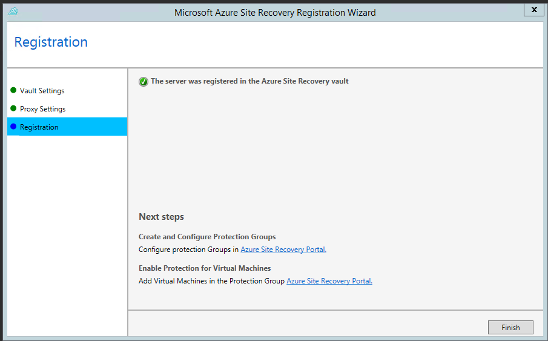

10. De registratie begint. Na voltooiing van de registratie wordt de server weergegeven op de blade **Instellingen** > **Servers** in de kluis.

#### Installatie vanaf de opdrachtregel voor de Azure Site Recovery-provider

De Azure Site Recovery-provider kan worden geïnstalleerd vanaf de opdrachtregel. Deze methode kan worden gebruikt om de provider in Server Core voor Windows Server 2012 R2 te installeren.

1. Download het providerinstallatiebestand en de registratiesleutel naar een map. Bijvoorbeeld: C:\ASR.
2. Pak het providerinstallatieprogramma vanaf een opdrachtprompt met verhoogde bevoegdheden uit met de volgende opdrachten:

            C:\Windows\System32> CD C:\ASR
            C:\ASR> AzureSiteRecoveryProvider.exe /x:. /q
3. Voer deze opdracht uit om de onderdelen te installeren:

            C:\ASR> setupdr.exe /i

4. Voer vervolgens deze opdrachten uit om de server in de kluis te registreren:

        CD C:\Program Files\Microsoft System Center 2012 R2\Virtual Machine Manager\bin
        C:\Program Files\Microsoft System Center 2012 R2\Virtual Machine Manager\bin\> DRConfigurator.exe /r  /Friendlyname <friendly name of the server> /Credentials <path of the credentials file> /EncryptionEnabled <full file name to save the encryption certificate>       

Waar:

- **/Credentials**: een verplichte parameter waarmee de locatie wordt opgegeven waarop het registratiesleutelbestand zich bevindt.  
- **/FriendlyName**: een verplichte parameter voor de naam van de Hyper-V-hostserver die wordt weergegeven in de Azure Site Recovery-portal.
- - **/EncryptionEnabled**: een optionele parameter voor wanneer u virtuele Hyper-V-machines in VMM-clouds repliceert naar Azure. Geef op of u virtuele machines in Azure wilt versleutelen (versleuteling voor data-at-rest). Controleer of de naam van het bestand de extensie **.pfx** heeft. Versleuteling is standaard uitgeschakeld.
- **/proxyAddress**: een optionele parameter waarmee het adres van de proxyserver wordt opgegeven.
- **/proxyport**: een optionele parameter waarmee de poort van de proxyserver wordt opgegeven.
- **/proxyUsername**: een optionele parameter waarmee de proxygebruikersnaam wordt opgegeven (als er voor de proxyserver verificatie is vereist).
- **/proxyPassword**: een optionele parameter waarmee het wachtwoord wordt opgegeven voor verificatie bij de proxyserver (als er voor de proxyserver verificatie is vereist).

### De Azure Recovery Services-agent installeren op Hyper-V-hosts

1. Nadat u de provider hebt ingesteld, moet u het installatiebestand voor de Azure Recovery Services-agent downloaden. Voer de installatie uit op elke Hyper-V-server in de VMM-cloud.

    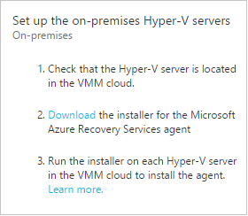

2. Klik op de pagina **Controle van vereisten** op **Volgende**. Ontbrekende vereiste onderdelen worden automatisch geïnstalleerd.

    

3. Accepteer of wijzig op de pagina **Installatie-instellingen** de installatielocatie en de cachelocatie. U kunt de cache configureren op een station met ten minste 5 GB aan opslagruimte, maar wij raden u aan een cachestation te gebruiken met 600 GB of meer aan vrije ruimte. Klik vervolgens op **Installeren**.
4. Nadat de installatie is voltooid, klikt u op **Sluiten**.

    

#### Installatie vanaf de opdrachtregel voor de Azure Site Recovery Services-agent

U kunt de Microsoft Azure Recovery Services-agent installeren vanaf de opdrachtregel met de volgende opdracht:

     marsagentinstaller.exe /q /nu

#### Internetproxytoegang tot Site Recovery vanaf Hyper-V-hosts instellen

Als de Recovery Services-agent wordt uitgevoerd op Hyper-V-hosts, moet Azure via internet toegankelijk zijn voor het repliceren van virtuele machines. Als u internet gebruikt via een proxy, doet u het volgende:

1. Open de Microsoft Azure Backup MMC-module op de Hyper-V-host. Standaard is er een snelkoppeling naar Microsoft Azure Backup beschikbaar op het bureaublad of in C:\Program Files\Microsoft Azure Recovery Services Agent\bin\wabadmin.
2. Klik in de module op **Eigenschappen wijzigen**.
3. Geef op het tabblad **Proxyconfiguratie** de proxyservergegevens op.

    

4. Zorg ervoor dat de agent de URL's kan bereiken die worden beschreven in [Vereisten](#on-premises-prerequisites).

## Stap 3: de doelomgeving instellen

Geef op welk Azure-opslagaccount moet worden gebruikt voor replicatie en met welk Azure-netwerk de virtuele Azure-machines verbinding moeten maken na het uitvoeren van een failover.

1.  Klik op **Infrastructuur voorbereiden** > **Doel** en selecteer het Azure-abonnement dat u wilt gebruiken.
2.  Geef aan welk implementatiemodel u wilt gebruiken voor virtuele machines na het uitvoeren van een failover.
3.  Site Recovery controleert of u een of meer compatibele Azure-opslagaccounts en -netwerken hebt.

    

4.  Als u nog geen opslagaccount hebt gemaakt en u er een wilt maken met Resource Manager, klikt u op **+Opslagaccount** om dat inline te doen.  Geef op de blade **Opslagaccount maken** een accountnaam, het type, het abonnement en de locatie op. Het account moet zich op dezelfde locatie bevinden als de Recovery Services-kluis.

    

    Opmerking:

    - Als u een opslagaccount wilt maken op basis van het klassieke model, doet u dat in de Azure Portal. [Meer informatie](../storage/storage-create-storage-account-classic-portal.md)
    - Als u een Premium-opslagaccount gebruikt voor gerepliceerde gegevens, moet u een extra Standard-opslagaccount instellen om de replicatielogboeken op te slaan waarin de doorlopende wijzigingen aan uw on-premises gegevens worden vastgelegd.

4.  Als u nog geen Azure-netwerk hebt gemaakt en u er een wilt maken met Resource Manager, klikt u op **+Netwerk** om dat inline te doen. Geef op de blade **Virtueel netwerk maken** een netwerknaam, het adresbereik, de subnetgegevens, het abonnement en de locatie op. Het netwerk moet zich op dezelfde locatie bevinden als de Recovery Services-kluis.

    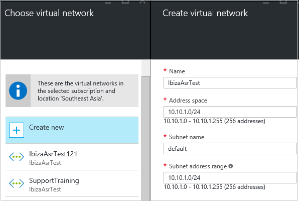

    Als u een netwerk wilt maken op basis van het klassieke model, doet u dat in de Azure-portal. [Meer informatie](../virtual-network/virtual-networks-create-vnet-classic-pportal.md).

### Netwerktoewijzing configureren

- [Lees](#prepare-for-network-mapping) een kort overzicht van wat netwerktoewijzing inhoudt. [Lees dit artikel](site-recovery-network-mapping.md) voor gedetailleerdere uitleg.
- Controleer of de virtuele machines op de VMM-server verbonden zijn met een netwerk met virtuele machines en of u ten minste één virtueel Azure-netwerk hebt gemaakt. Aan één Azure-netwerk kunnen meerdere netwerken met virtuele machines worden toegewezen.

Configureer het toewijzen als volgt:

1. Klik in **Instellingen** > **Site Recovery-infrastructuur** > **Netwerktoewijzingen** > **Netwerktoewijzing** op het pictogram **+Netwerktoewijzing**.

    

2. Selecteer in **Netwerktoewijzing toevoegen** de bron-VMM-server en selecteer **Azure** als doel.
3. Controleer na het uitvoeren van een failover het abonnement en het implementatiemodel.
4. Selecteer in **Bronnetwerk** in de lijst die is gekoppeld aan de VMM-server, het on-premises bronnetwerk met virtuele machines dat u wilt toewijzen.
5. Selecteer in **Doelnetwerk** het Azure-netwerk waarin de replica’s (virtuele Azure-machines) moeten worden geplaatst nadat ze zijn gemaakt. Klik vervolgens op **OK**.

    

Dit is wat er gebeurt wanneer er netwerktoewijzing wordt uitgevoerd:

- Bestaande virtuele machines in het VM-bronnetwerk zijn verbonden met het netwerk wanneer de toewijzing begint. Nieuwe virtuele machines die zijn verbonden met het bron-VM-netwerk, worden verbonden met het toegewezen Azure-netwerk wanneer replicatie plaatsvindt.
- Als u een bestaande netwerktoewijzing wijzigt, worden gerepliceerde virtuele machines verbonden op basis van de nieuwe instellingen.
- Als het doelnetwerk meerdere subnetten bevat en een van deze subnetten dezelfde naam heeft als het subnet waarin de virtuele bronmachine zich bevindt, wordt de gerepliceerde virtuele machine na een failover verbonden met dat doelsubnet.
- Als er geen doelsubnet met een overeenkomende naam bestaat, wordt de virtuele machine verbonden met het eerste subnet in het netwerk.

## Stap 4: replicatie-instellingen instellen

1. Als u nieuw replicatiebeleid wilt maken, klikt u op **Infrastructuur voorbereiden** > **Replicatie-instellingen** > **+Maken en koppelen**.

    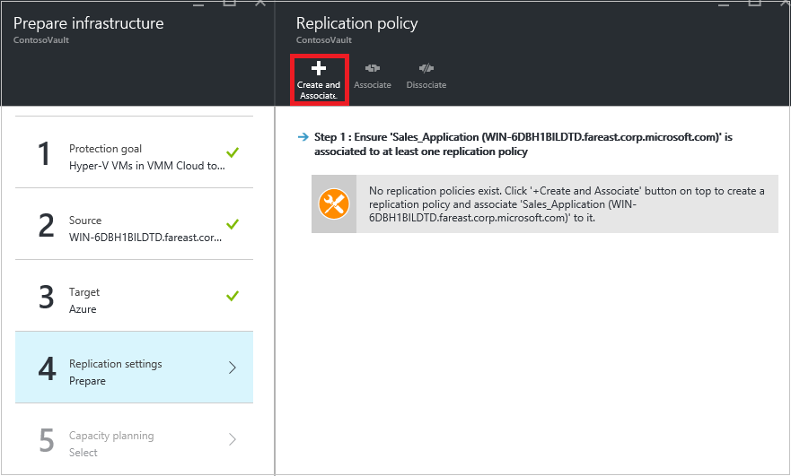

2. Geef in **Beleid maken en koppelen** een beleidsnaam op.
3. Geef in **Kopieerfrequentie** op hoe vaak u na de eerste replicatie de verschillen wilt repliceren (elke 30 seconden of elke 5 of 15 minuten).
4. Geef in **Bewaarperiode van het herstelpunt** op hoeveel uur elk herstelpunt moet worden bewaard. Beveiligde machines kunnen te allen tijde worden hersteld naar een willekeurig punt (binnen een bepaald tijdsvenster).
6. Geef in **Frequentie van de app-consistente momentopname** op hoe vaak (elke 1-12 uur) er herstelpunten moeten worden gemaakt met toepassingsconsistente momentopnamen. Hyper-V maakt gebruik van twee soorten momentopnamen: standaardmomentopnamen waarmee steeds incrementele momentopnamen van de volledige virtuele machine worden gemaakt, en toepassingsconsistente momentopnamen waarmee een tijdsgebonden momentopname wordt gemaakt van de toepassingsgegevens in de virtuele machine. Toepassingsconsistente momentopnamen gebruiken Volume Shadow Copy Service (VSS) om ervoor te zorgen dat toepassingen een consistente status hebben wanneer er een momentopname wordt gemaakt. Als u toepassingsconsistente momentopnamen inschakelt, is dit van invloed op de prestaties van de toepassingen die via de virtuele bronmachines worden uitgevoerd. Zorg ervoor dat de waarde die u instelt, kleiner is dan het aantal aanvullende herstelpunten dat u configureert.
3. Geef in **Begintijd initiële replicatie** aan wanneer de initiële replicatie moet worden gestart. De replicatie maakt gebruik van uw internetbandbreedte. Daarom is het een goed idee om de replicatie buiten de drukste tijden in te plannen.
5. Geef in **Gegevens versleutelen die zijn opgeslagen in Azure** op of u at-rest-gegevens in de Azure-opslag wilt versleutelen. Klik vervolgens op **OK**.

    

6. Wanneer u nieuw beleid maakt, wordt dit automatisch gekoppeld aan de VMM-cloud. Klik op **OK**. U kunt aanvullende VMM-clouds (en de virtuele machines erin) koppelen aan dit replicatiebeleid. Dit doet u via **Instellingen** > **Replicatie** > beleidsnaam > **VMM-cloud koppelen**.

    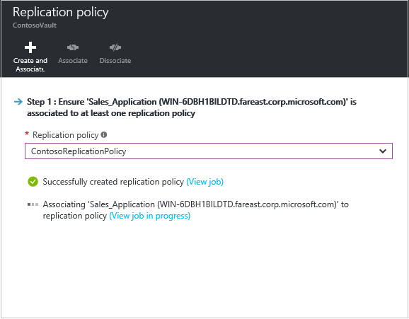

## Stap 5: capaciteitsplanning

Nu u de basisinfrastructuur hebt ingesteld, kunt u gaan nadenken over de capaciteitsplanning en nagaan of u aanvullende resources nodig hebt.

Site Recovery biedt een Capacity Planner waarmee u de juiste resources kunt toewijzen aan uw bronomgeving, de Site Recovery-onderdelen, het netwerk en de opslag. U kunt de planner in de snelle modus uitvoeren voor schattingen op basis van het gemiddelde aantal virtuele machines, schijven en opslag. U kunt ook de gedetailleerde modus gebruiken; daarin voert u op workloadniveau gegevens in. Voordat u begint, moet u:

- Informatie verzamelen over uw replicatieomgeving, waaronder informatie over de virtuele machines, het aantal schijven per virtuele machine en de opslag per schijf.
- Een schatting maken van de dagelijkse wijzigingssnelheid (verloop) voor gerepliceerde gegevens. U kunt hiervoor de [Capacity Planner voor Hyper-V Replica](https://www.microsoft.com/download/details.aspx?id=39057) gebruiken.

1.  Klik op **Downloaden** om dit hulpprogramma te downloaden. Voer het vervolgens uit. [Lees het artikel](site-recovery-capacity-planner.md) dat samen met het hulpprogramma wordt gedownload.
2.  Wanneer u klaar bent, selecteert u **Ja** in **Hebt u de Capacity Planner uitgevoerd**?

    

### Overwegingen voor netwerkbandbreedte

U kunt het hulpprogramma Capacity Planner gebruiken om de bandbreedte te berekenen die u nodig hebt voor replicatie (initiële replicatie en deltareplicaties). U hebt een aantal opties voor het beheren van de hoeveelheid bandbreedte die voor replicatie wordt gebruikt:

- **Bandbreedte beperken**: Hyper-V-verkeer dat wordt gerepliceerd naar een secundaire site, verloopt via een specifieke Hyper-V-host. U kunt de bandbreedte op de hostserver beperken.
- **Bandbreedte aanpassen**: u kunt zelf bepalen hoeveel bandbreedte er voor replicatie moet worden gebruikt; dit doet u via diverse registersleutels.

#### Bandbreedte beperken

1. Open de Microsoft Azure Backup MMC-module op de Hyper-V-hostserver. Standaard is er een snelkoppeling naar Microsoft Azure Backup beschikbaar op het bureaublad of in C:\Program Files\Microsoft Azure Recovery Services Agent\bin\wabadmin.
2. Klik in de module op **Eigenschappen wijzigen**.
3. Selecteer op het tabblad **Beperken** de optie **Internetbandbreedtebeperking inschakelen voor back-upbewerkingen** en stel de limieten in voor werktijden en voor tijden waarop niet wordt gewerkt. Het geldige bereik ligt tussen 512 Kbps en 102 Mbps.

    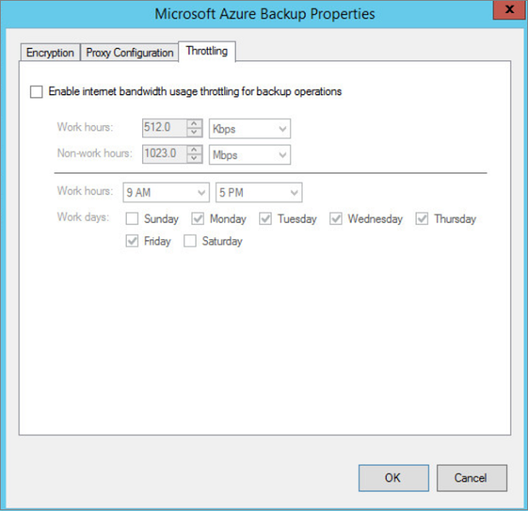

U kunt ook de cmdlet [Set-OBMachineSetting](https://technet.microsoft.com/library/hh770409.aspx) gebruiken om een beperking in te stellen. Hier volgt een voorbeeld:

    $mon = [System.DayOfWeek]::Monday
    $tue = [System.DayOfWeek]::Tuesday
    Set-OBMachineSetting -WorkDay $mon, $tue -StartWorkHour "9:00:00" -EndWorkHour "18:00:00" -WorkHourBandwidth  (512*1024) -NonWorkHourBandwidth (2048*1024)

**Set-OBMachineSetting -NoThrottle** geeft aan dat er geen beperking is vereist.

#### Netwerkbandbreedte beïnvloeden

Met de registerwaarde **UploadThreadsPerVM** wordt aangegeven hoeveel threads er moeten worden gebruikt voor gegevensoverdracht (initiële replicatie of deltareplicatie) van een schijf. Hoe hoger de waarde, hoe meer netwerkbandbreedte er voor replicatie wordt gebruikt. Met de registerwaarde **DownloadThreadsPerVM** geeft u aan hoeveel threads er worden gebruikt voor gegevensoverdracht tijdens het uitvoeren van een failback.

1. Navigeer in het register naar **HKEY_LOCAL_MACHINE\SOFTWARE\Microsoft\Windows Azure Backup\Replication**.

    - Wijzig de waarde **UploadThreadsPerVM** (of maak de sleutel aan als deze niet bestaat) om aan te geven hoeveel threads er voor schijfreplicatie moeten worden gebruikt.
    - Wijzig de waarde **DownloadThreadsPerVM** (of maak de sleutel aan als deze niet bestaat) om aan te geven hoeveel threads er voor failbackverkeer vanuit Azure moeten worden gebruikt.
2. De standaardwaarde is 4. In netwerken met overprovisioning moeten deze registersleutels zodanig worden gewijzigd dat niet de standaardwaarden worden gebruikt. Het maximum is 32. Houd het verkeer in de gaten om de waarde te optimaliseren.

## Stap 6: replicatie inschakelen

Schakel nu als volgt replicatie in:

1. Klik op **Stap 2: toepassing repliceren** > **Bron**. Wanneer u replicatie voor het eerst inschakelt, klikt u in de kluis op **+Repliceren** om replicatie in te schakelen voor aanvullende machines.

    

2. Selecteer op de blade **Bron** de VMM-server en de cloud waarin de Hyper-V-hosts zich bevinden. Klik vervolgens op **OK**.

    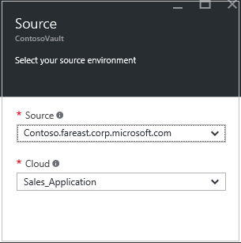

3. Selecteer in **Doel** het abonnement, het implementatiemodel voor gebruik na een failover, en het opslagaccount dat u voor gerepliceerde gegevens gebruikt.

    

4. Selecteer het opslagaccount dat u wilt gebruiken. Als u een ander opslagaccount wilt gebruiken dan de accounts die u al hebt, kunt u er [een maken](#set-up-an-azure-storage-account). Als u een opslagaccount wilt maken op basis van het Resource Manager-model, klikt u op **Nieuw**. Als u een opslagaccount wilt maken op basis van het klassieke model, doet u dat [in de Azure Portal](../storage/storage-create-storage-account-classic-portal.md). Klik vervolgens op **OK**.
5. Selecteer het Azure-netwerk en -subnet waarmee virtuele Azure-machines verbinding maken wanneer ze na een failover worden geactiveerd. Selecteer **Nu configureren voor geselecteerde machines** om de netwerkinstelling toe te passen op alle machines die u voor beveiliging selecteert. Selecteer **Later configureren** om per machine een Azure-netwerk te selecteren. Als u een ander netwerk wilt gebruiken dan de netwerken die u al hebt, kunt u er [een maken](#set-up-an-azure-network). Als u een netwerk wilt maken op basis van het Resource Manager-model, klikt u op **Nieuw**. Als u een netwerk wilt maken op basis van het klassieke model, doet u dat [in de Azure Portal](../virtual-network/virtual-networks-create-vnet-classic-pportal.md). Selecteer indien van toepassing een subnet. Klik vervolgens op **OK**.
6. Selecteer in **Virtuele machines** > **Virtuele machines selecteren** alle machines die u wilt repliceren. U kunt alleen machines selecteren waarvoor replicatie kan worden ingeschakeld. Klik vervolgens op **OK**.

    

5. Selecteer in **Eigenschappen** > **Eigenschappen configureren** het besturingssysteem voor de geselecteerde virtuele machines, evenals de schijf met het besturingssysteem. Klik vervolgens op **OK**. Later kunt u eventueel extra eigenschappen instellen.

    

12. Selecteer in **Replicatie-instellingen** > **Replicatie-instellingen configureren** het replicatiebeleid dat u op de beveiligde virtuele machines wilt toepassen. Klik vervolgens op **OK**. U kunt het replicatiebeleid wijzigen via **Instellingen** > **Replicatiebeleid** > beleidsnaam > **Instellingen bewerken**. De wijzigingen die u toepast, worden zowel gebruikt voor machines die al worden gerepliceerd, als voor nieuwe machines.

    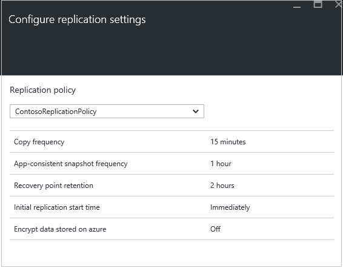

U kunt de voortgang van de taak **Beveiliging inschakelen** volgen via **Instellingen** > **Taken** > **Site Recovery-taken**. Nadat de taak **Beveiliging voltooien** is uitgevoerd, is de machine klaar voor een mogelijke failover.

### Eigenschappen van virtuele machines weergeven en beheren

Het is raadzaam om de eigenschappen van de bronmachine te controleren. Houd er rekening mee dat de naam van de virtuele Azure-machine moet voldoen aan de [vereisten voor virtuele machines van Azure](site-recovery-best-practices.md#azure-virtual-machine-requirements).

1. Klik op **Instellingen** > **Beveiligde items** > **Gerepliceerde items** en selecteer een machine om de details ervan te bekijken.

    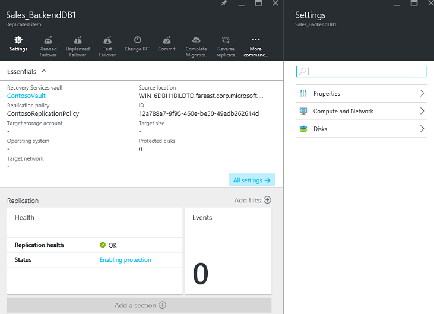

2. In **Eigenschappen** kunt u de replicatie- en failoverinformatie van de virtuele machine weergeven.

    

3. In **Berekening en netwerk** > **Eigenschappen berekenen** kunt u de naam van de virtuele Azure-machine opgeven, evenals de doelgrootte. Wijzig indien nodig de naam om te voldoen aan de [Azure-vereisten](site-recovery-best-practices.md#azure-virtual-machine-requirements). U kunt ook informatie bekijken en bewerken over het doelnetwerk, het subnet en het IP-adres dat aan de virtuele Azure-machine wordt toegewezen. Houd rekening met het volgende:

    - U kunt het doel-IP-adres instellen. Als u geen adres opgeeft, maakt de machine waarvoor een failover is uitgevoerd, gebruik van DHCP. Als u een adres instelt dat tijdens het uitvoeren van de failover niet beschikbaar is, mislukt de failover. Hetzelfde doel-IP-adres kan worden gebruikt voor een testfailover als het adres beschikbaar is in het testfailovernetwerk.
    - Het aantal netwerkadapters wordt bepaald door de grootte die u voor de virtuele doelmachine opgeeft. Dat werkt als volgt:

        - Als het aantal netwerkadapters op de bronmachine kleiner is dan of gelijk is aan het aantal adapters dat is toegestaan voor de grootte van de doelmachine, heeft het doel hetzelfde aantal adapters als de bron.
        - Als het aantal adapters op de virtuele bronmachine groter is dan voor de doelgrootte is toegestaan, wordt het maximum voor de doelgrootte gebruikt.
        - Als de bronmachine bijvoorbeeld twee netwerkadapters heeft en de grootte van de doelmachine vier netwerkadapters ondersteunt, heeft de doelmachine twee adapters. Als de bronmachine twee adapters heeft, maar de grootte van de doelmachine slechts één adapter ondersteunt, heeft de doelmachine één adapter.     
        - Als de virtuele machine meerdere netwerkadapters heeft, worden deze allemaal verbonden met hetzelfde netwerk.

    

5.  In **Schijven** ziet u het besturingssysteem en de gegevensschijven van de virtuele machine die wordt gerepliceerd.

## Stap 7: uw implementatie testen

Als u de implementatie wilt testen, kunt u een testfailover uitvoeren voor één virtuele machine, maar ook een herstelplan uitvoeren dat een of meer virtuele machines bevat.

### Voorbereiden op een failover

- Als u een testfailover wilt uitvoeren, is het raadzaam om een nieuw Azure-netwerk te maken dat is geïsoleerd van uw Azure productienetwerk (dit is een standaardprocedure voor het maken van een nieuw netwerk in Azure). [Meer informatie](site-recovery-failover.md#run-a-test-failover) over het uitvoeren van testfailovers.
- Voor optimale prestaties bij het uitvoeren van een failover naar Azure installeert u de Azure-agent op de beveiligde machine. Dit zorgt voor sneller opstarten en maakt het oplossen van problemen eenvoudiger. Installeer de agent voor [Linux](https://github.com/Azure/WALinuxAgent) of [Windows](http://go.microsoft.com/fwlink/?LinkID=394789).
- Als u uw implementatie volledig wilt testen, is het van belang dat de infrastructuur voor de gerepliceerde machine naar behoren werkt. Als u Active Directory en DNS wilt testen, kunt u een virtuele machine maken als domeincontroller met DNS en deze naar Azure repliceren met Azure Site Recovery. Zie [Test failover considerations for Active Directory](site-recovery-active-directory.md#considerations-for-test-failover) (Overwegingen bij testfailovers voor Active Directory) voor meer informatie.
- Als u in plaats van een testfailover een ongeplande failover wilt uitvoeren, let u op het volgende:

    - Schakel primaire machines zo mogelijk uit voordat u een ongeplande failover uitvoert. Zo zorgt u ervoor dat niet tegelijkertijd zowel de bronmachines als de gerepliceerde machines worden uitgevoerd.
    - Wanneer u een niet-geplande failover uitvoert, worden er geen gegevens meer gerepliceerd van primaire machines. Gegevensverschillen worden dus pas overgedragen nadat met de niet-geplande failover is gestart. Als u een niet-geplande failover uitvoert op basis van een herstelplan, wordt deze uitgevoerd totdat het proces is voltooid, zelfs als er een fout optreedt.

### Voorbereiden op het verbinden met virtuele Azure-machines na een failover

Als u na een failover met RDP verbinding wilt maken met virtuele Azure-machines, doet u het volgende:

**Op de on-premises machine vóór de failover**:

- Voor toegang via internet schakelt u RDP in, voegt u TCP- en UDP-regels toe voor **Doelgroep**, en zorgt u ervoor dat RDP in **Windows Firewall** -> **Toegestane apps en functies** is toegestaan voor alle profielen.
- Voor toegang via een site-to-siteverbinding schakelt u RDP in op de machine en zorgt u ervoor dat RDP in **Windows Firewall** -> **Toegestane apps en functies** is toegestaan voor **Domein** en voor netwerken van het type **Privé**.
- Installeer de [Azure VM-agent](http://go.microsoft.com/fwlink/?LinkID=394789&clcid=0x409) op de on-premises machine.
- Zorg ervoor dat het SAN-beleid van het besturingssysteem is ingesteld op OnlineAll. [Meer informatie]( https://support.microsoft.com/kb/3031135)
- Schakel de IPSec-service uit voordat u de failover uitvoert.

**Op de virtuele Azure-machine na de failover**:

- Voeg een openbaar eindpunt toe voor het RDP-protocol (poort 3389) en geef aanmeldingsreferenties op.
- Zorg ervoor dat u geen domeinbeleid hebt geïmplementeerd waarin het niet is toegestaan verbinding te maken met een virtuele machine via een openbaar adres.
- Probeer verbinding te maken. Als u geen verbinding kunt maken, controleert u of de virtuele machine wordt uitgevoerd. Voor meer tips voor probleemoplossing leest u dit [artikel](http://social.technet.microsoft.com/wiki/contents/articles/31666.troubleshooting-remote-desktop-connection-after-failover-using-asr.aspx).

Als u na een failover via een Secure Shell-client (SSH) toegang wilt krijgen tot een virtuele Azure-machine waarop Linux wordt uitgevoerd, doet u het volgende:

**Op de on-premises machine vóór de failover**:

- Zorg ervoor dat de Secure Shell-service op de virtuele Azure-machine zodanig is ingesteld dat deze automatisch wordt gestart bij het opstarten van het systeem.
- Controleer of er in de firewallregels is ingesteld dat SSH-verbindingen zijn toegestaan.

**Op de virtuele Azure-machine na de failover**:

- In de regels voor de netwerkbeveiligingsgroep voor de virtuele machine waarvoor een failover is uitgevoerd en voor het Azure-subnet waarmee deze is verbonden, moeten binnenkomende verbindingen via de SSH-poort worden toegestaan.
- Er moet een openbaar eindpunt worden gemaakt om inkomende verbindingen met de SSH-poort toe te staan (standaard is dit TCP-poort 22).
- Als de virtuele machine wordt geopend via een VPN-verbinding (Express Route of site-to-site-VPN), kan de client worden gebruikt om rechtstreeks verbinding te maken met de virtuele machine via SSH.

### Een testfailover uitvoeren

Ga als volgt te werk om een testfailover uit te voeren:

1. Als u een failover wilt uitvoeren voor één virtuele machine, gaat u naar **Instellingen** > **Gerepliceerde items**. Klik vervolgens op de virtuele machine > **+Testfailover**.
2. Als u een failover wilt uitvoeren op basis van een herstelplan, klikt u in **Instellingen** > **Herstelplannen** met de rechtermuisknop op het plan > **Testfailover**. Volg [deze instructies](site-recovery-create-recovery-plans.md) om een herstelplan te maken.

3. Selecteer in **Testfailover** het Azure-netwerk waarmee de virtuele Azure-machines moeten worden verbonden nadat er een failover is uitgevoerd.
4. Klik op **OK** om te beginnen met de failover. U kunt de voortgang volgen door op de virtuele machine te klikken en de eigenschappen te openen, of door in **Instellingen** > **Site Recovery-taken** op de taak **Testfailover** te klikken.
5. Wanneer voor de failover de fase **Testen voltooien** is bereikt, doet u het volgende:

    1. Bekijk de gerepliceerde virtuele machine in de Azure-portal. Controleer of de virtuele machine correct wordt opgestart.
    2. Als u vanuit uw on-premises netwerk toegang hebt tot virtuele machines, kunt u ook een Extern bureaublad-verbinding naar de virtuele machine starten.
    3. Klik op **Test voltooien** om de test te voltooien.
    4. Klik op **Notities** om eventuele opmerkingen over de testfailover vast te leggen en op te slaan.
    5. Klik op **De testfailover is voltooid**. Schoon de testomgeving zodanig op dat de virtuele testmachine automatisch wordt uitgeschakeld en verwijderd.
    6. In dit stadium worden alle elementen of virtuele machines verwijderd die tijdens de testfailover automatisch door Site Recovery zijn gemaakt. Eventuele extra elementen die u voor de testfailover hebt gemaakt, worden niet verwijderd.

    > [AZURE.NOTE] Als een testfailover langer dan twee weken duurt, wordt deze geforceerd beëindigd.

6. Wanneer de failover is voltooid, moet u de gerepliceerde Azure-machine ook kunnen zien in de Azure-portal > **Virtuele machines**. Controleer of de virtuele machine de juiste grootte heeft, of deze is verbonden met het juiste netwerk en of deze actief is.
7. Als u zich hebt [voorbereid op verbindingen na een failover](#prepare-to-connect-to-Azure-VMs-after-failover), kunt u verbinding maken met het virtuele Azure-netwerk.

## Uw implementatie bewaken

Ga als volgt te werk om de configuratie-instellingen en de status van uw Site Recovery-implementatie te bewaken:

1. Klik op de kluisnaam om het dashboard **Essentials** te openen. Op dit dashboard ziet u een overzicht van de Site Recovery-taken, de replicatiestatus, de herstelplannen, de serverstatus en de gebeurtenissen.  U kunt Essentials zo aanpassen dat de tegels en indelingen worden weergegeven die voor u het belangrijkst zijn. Dit heeft ook betrekking op de status van andere Site Recovery- en Backup-kluizen.

    

2. Op de tegel **Status** kunt u siteservers (VMM- of configuratieservers) bewaken waarop zich problemen voordoen. Bovendien kunt u hier zien welke gebeurtenissen er de afgelopen 24 uur door Site Recovery zijn gemeld.
3. U kunt replicatie beheren en bewaken via de tegels **Gerepliceerde items**, **Herstelplannen** en **Site Recovery-taken**. U kunt inzoomen op taken via **Instellingen** -> **Taken** -> **Site Recovery-taken**.

## Volgende stappen

Wanneer uw implementatie actief is, kunt u [hier](site-recovery-failover.md) meer lezen over de verschillende soorten failovers.

<!--HONumber=Sep16_HO3-->

