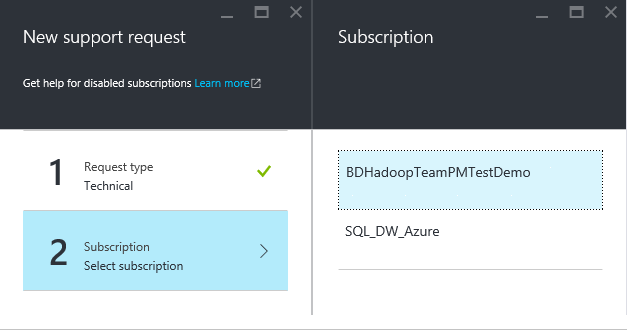
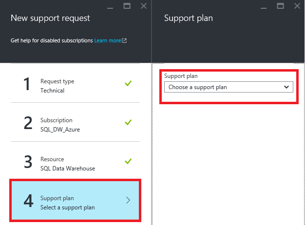
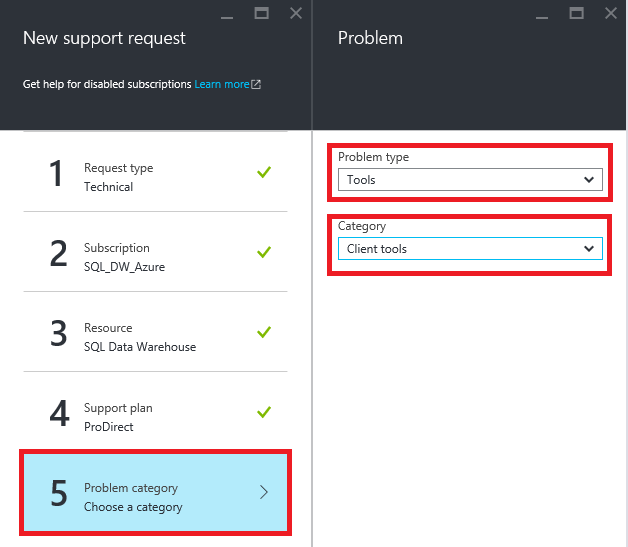
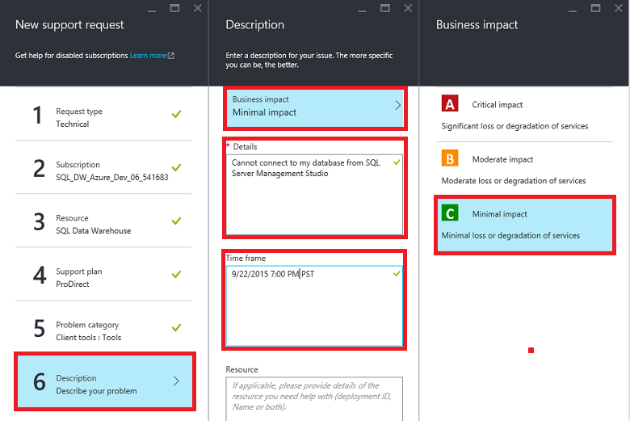
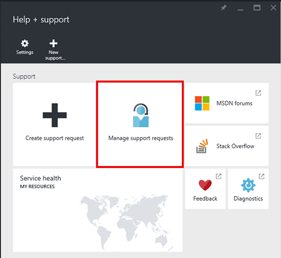

<properties
   pageTitle="Een ondersteuningsticket maken voor SQL Data Warehouse | Microsoft Azure"
   description="Maak een ondersteuningsticket in Azure SQL Data Warehouse."
   services="sql-data-warehouse"
   documentationCenter="NA"
   authors="sonyam"
   manager="barbkess"
   editor=""/>

<tags
   ms.service="sql-data-warehouse"
   ms.devlang="NA"
   ms.topic="get-started-article"
   ms.tgt_pltfrm="NA"
   ms.workload="data-services"
   ms.date="07/18/2016"
   ms.author="sonyam;barbkess;sonyama"/>

# Een ondersteuningsticket maken voor SQL Data Warehouse
 
Als u problemen ondervindt met SQL Data Warehouse, kunt u een ondersteuningsticket maken zodat ons technisch team u kan helpen.

## Een ondersteuningsticket maken

1. Open de [Azure-portal][].

2. Klik in het beginscherm op de tegel **Help en ondersteuning**.

    

3. Klik in de blade Help en ondersteuning op **Een ondersteuningsverzoek maken**.

    
    
     

4. Selecteer het **Soort aanvraag**.

    
    
    >[AZURE.NOTE]  Elke SQL-server (bijvoorbeeld myserver.database.windows.net) heeft standaard een **DTU-quotum** van 45.000. Dit quotum is gewoon een veiligheidsbeperking. U kunt uw quotum verhogen door een ondersteuningsticket te maken en *Quotum* als het aanvraagtype te selecteren. Voor het berekenen van uw DTU-behoeften, moet u weten dat elke 100 [DWU][] aan SQL Warehouse in totaal 750 DTU verbruikt. Daarom kunt u met de quotumlimiet van 45.000 maximaal DW6000 (45.000 / 750) of verschillende kleinere databases met minder DWU maken. Als u bijvoorbeeld twee DW6000’s op één SQL server wilt hosten, moet u een DTU-quotum van 90.000 aanvragen.  U kunt uw huidige DTU-verbruik zien in de blade voor de SQL-server in de portal. Zowel onderbroken als niet-onderbroken databases tellen mee voor het DTU-quotum. 

5. Selecteer het **abonnement** waaronder de database valt met het probleem dat u wilt melden.

    

6. Selecteer **SQL Data Warehouse** als de resource.

    

7. Selecteer uw [Azure-ondersteuningsplan][].

    - Ondersteuning voor het **beheren van facturering, quota en abonnementen** is op alle ondersteuningsniveaus beschikbaar.
    - **Probleemoplossing** wordt ondersteund op de ondersteuningsniveaus [Developer][], [Standard][], [Professional Direct][] en [Premier][]. Het gaat hierbij om problemen die klanten ondervinden tijdens het gebruik van Azure waarbij er een redelijke verwachting is dat het probleem is veroorzaakt door Microsoft.
    - **Begeleiding van ontwikkelaars** en **adviesdiensten** zijn beschikbaar op de ondersteuningsniveaus [Professional Direct][] en [Premier][]. 
    
    Als u een Premier-ondersteuningsplan hebt, kunt u ook problemen met betrekking tot SQL Data Warehouse rapporteren in de [Microsoft Premier Online-portal][].  Zie [Azure-ondersteuningsplannen][Azure-ondersteuningsplan] voor meer informatie over de verschillende ondersteuningsplannen, waaronder bereik, reactietijden, prijzen enzovoort.  Zie [Veelgestelde vragen over ondersteuning van Azure][] voor veelgestelde vragen over de ondersteuning van Azure.  

    

8. Selecteer het **Probleemtype** en de **Categorie**.

    

9. Beschrijf het probleem en kies de impact die het probleem heeft op de bedrijfsactiviteiten.

    

10. Uw **contactgegevens** voor dit ondersteuningsticket worden vooraf ingevuld. U kunt deze indien nodig bijwerken.

    

11. Klik op **Maken** om het ondersteuningsverzoek in te dienen.

## Een ondersteuningsticket bewaken

Nadat u de ondersteuningsaanvraag hebt ingediend, zal het ondersteuningsteam van Azure contact met u opnemen. Als u de aanvraagstatus en -details wilt controleren, klikt u op het dashboard op **Ondersteuningsaanvragen beheren**.

## Meer informatie

Daarnaast kunt u verbinding maken met de SQL Data Warehouse-community op [Stack Overflow][] of op het [MSDN-forum Azure SQL Data Warehouse][].

<!--Image references--> 

<!--Article references--> 
[DWU]: ./sql-data-warehouse-overview-what-is.md#data-warehouse-units

<!--MSDN references--> 

<!--Other web references--> 
[Azure-portal]: https://portal.azure.com/
[Azure-ondersteuningsplan]: https://azure.microsoft.com/support/plans/?WT.mc_id=Support_Plan_510979/  
[Developer]: https://azure.microsoft.com/support/plans/developer/  
[Standard]: https://azure.microsoft.com/support/plans/standard/  
[Professional Direct]: https://azure.microsoft.com/support/plans/prodirect/  
[Premier]: https://azure.microsoft.com/support/plans/premier/  
[Veelgestelde vragen over ondersteuning van Azure]: https://azure.microsoft.com/support/faq/
[Microsoft Premier Online-portal]: https://premier.microsoft.com/
[Stack Overflow]: https://stackoverflow.com/questions/tagged/azure-sqldw/
[MSDN-forum Azure SQL Data Warehouse]: https://social.msdn.microsoft.com/Forums/home?forum=AzureSQLDataWarehouse/

<!--HONumber=ago16_HO4-->

