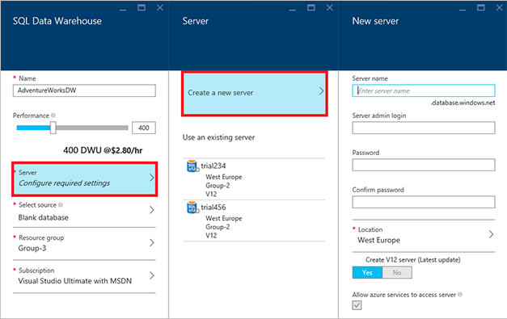

<properties
   pageTitle="Een SQL Data Warehouse-database maken in de Azure Portal| Microsoft Azure"
   description="Meer informatie over het maken van een Azure SQL Data Warehouse in de Azure Portal"
   services="sql-data-warehouse"
   documentationCenter="NA"
   authors="barbkess"
   manager="jhubbard"
   editor=""
   tags="azure-sql-data-warehouse"/>

<tags
   ms.service="sql-data-warehouse"
   ms.devlang="NA"
   ms.topic="get-started-article"
   ms.tgt_pltfrm="NA"
   ms.workload="data-services"
   ms.date="05/03/2016"
   ms.author="lodipalm;"/>

# Een nieuwe logische server maken

In SQL Database en SQL Data Warehouse wordt elke database toegewezen aan een server, en wordt elke server toegewezen aan een geografische locatie. De server wordt een logische SQL-server genoemd.

> [AZURE.NOTE] Een logische SQL-server:
  >
  > + biedt een consistente manier om meerdere databases binnen dezelfde geografische locatie te configureren.
  > + is geen fysieke hardware zoals een on-premises server. maakt deel uit van de software van de service. wordt om die reden een *logische server* genoemd.
  > + kan meerdere databases hosten zonder dat dit invloed heeft op de prestaties.
  > + heeft een kleine letter *s* in de naam. SQL-**s**erver is een logische Azure-server, terwijl SQL **S**erver een on-premises product van Microsoft is.

1. Klik op **Server** > **Een nieuwe server maken**. Er zijn geen kosten voor de server. Als u al een logische V12 SQL-server hebt die u wilt gebruiken, kiest u de bestaande server en gaat u naar de volgende stap.

    

2. Vul de informatie bij **Nieuwe server** in.

    - **Servernaam**: voer een naam in voor de logische server. Deze is uniek voor elke geografische locatie.
    - **Naam serverbeheerder**: voer een gebruikersnaam in voor het beheerdersaccount van de server.
    - **Wachtwoord**: voer het wachtwoord in van de serverbeheerder.
    - **Locatie**: kies een geografische locatie voor de server. Voor optimale gegevensoverdrachttijden plaatst u de server het best zo dicht mogelijk bij andere gegevensbronnen die door deze database worden gebruikt.
    - **V12-server maken**: Ja is de enige optie voor SQL Data Warehouse.
    - **Toegang van Azure-services tot server toestaan**: deze optie is altijd ingeschakeld voor SQL Data Warehouse.

    >[AZURE.NOTE] Zorg dat u de servernaam, de naam van de serverbeheerder en het wachtwoord ergens opslaat.  U hebt deze informatie nodig om u aan te melden bij de server.

3. Klik op **OK** om de configuratie-instellingen van de logische SQL-server op te slaan en terug te keren naar de blade SQL Data Warehouse.

    

<!--HONumber=Jun16_HO2-->

