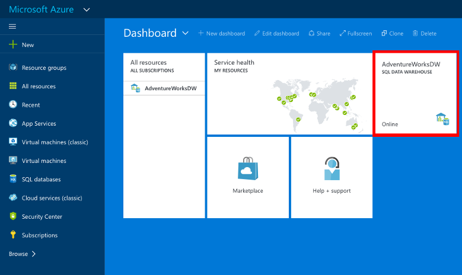

<properties
   pageTitle="Een SQL Data Warehouse maken in de Azure Portal| Microsoft Azure"
   description="Meer informatie over het maken van een Azure SQL Data Warehouse in de Azure Portal"
   services="sql-data-warehouse"
   documentationCenter="NA"
   authors="barbkess"
   manager="jhubbard"
   editor=""
   tags="azure-sql-data-warehouse"/>

<tags
   ms.service="sql-data-warehouse"
   ms.devlang="NA"
   ms.topic="get-started-article"
   ms.tgt_pltfrm="NA"
   ms.workload="data-services"
   ms.date="05/05/2016"
   ms.author="lodipalm;barbkess;sonyama"/>

# Een Azure SQL Data Warehouse maken

> [AZURE.SELECTOR]
- [Azure Portal](sql-data-warehouse-get-started-provision.md)
- [TSQL](sql-data-warehouse-get-started-create-database-tsql.md)
- [PowerShell](sql-data-warehouse-get-started-provision-powershell.md)

In deze zelfstudie gebruikt u de Azure Portal om een SQL Data Warehouse te maken die de voorbeelddatabase AdventureWorksDW bevat.

[AZURE.INCLUDE [free-trial-note](../../includes/free-trial-note.md)]

1. Meld u aan bij de [Azure Portal](https://portal.azure.com).

2. Klik op **+ Nieuw** > **Gegevens en opslag** > **SQL Data Warehouse**.

    

3. Vul in de blade **SQL Data Warehouse** de benodigde informatie in en druk op Maken.

    

    - **Server**: we raden u aan om eerst de server te selecteren.  U kunt een bestaande server selecteren of [een nieuwe maken](./sql-data-warehouse-get-started-new-server.md). 

    - **Databasenaam**: de naam die wordt gebruikt om naar de SQL Data Warehouse te verwijzen.  De waarde moet uniek zijn op de server.
    
    - **Prestaties**: we raden u aan om te beginnen met 400 DWU's. U kunt de schuifregelaar naar links of rechts bewegen om de prestaties van uw datawarehouse aan te passen, of u kunt later omhoog of omlaag schalen.  Meer informatie over DWU's vindt u in onze documentatie over [schalen](./sql-data-warehouse-manage-compute-overview.md) of op onze [pagina met prijzen](https://azure.microsoft.com/en-us/pricing/details/sql-data-warehouse/). 

    - **Abonnement**: selecteer het abonnement waaronder deze SQL Data Warehouse wordt gefactureerd.

    - **Resourcegroep**: resourcegroepen zijn containers die speciaal zijn ontworpen om u te helpen bij het beheren van een verzameling Azure-resources. Lees meer over [resourcegroepen](../azure-portal/resource-group-portal.md).

    - **Bron selecteren**: klik op **Bron selecteren** > **Voorbeeld**. Omdat er op dit moment maar één voorbeelddatabase beschikbaar is, wordt de optie **Voorbeeld selecteren** automatisch gevuld met AdventureWorksDW wanneer u Azure-voorbeeld selecteert.

4. Klik op **Maken** om uw SQL Data Warehouse te maken.

5. Na enkele minuten is uw SQL Data Warehouse gereed. U keert automatisch terug naar de [Azure Portal](https://portal.azure.com). U vindt de SQL Data Warehouse op het dashboard onder de SQL-databases, of in de resourcegroep die u hebt gebruikt om deze te maken. 

    

[AZURE.INCLUDE [SQL DataBase create server](../../includes/sql-database-create-new-server-firewall-portal.md)] 

## Volgende stappen

Nu u een SQL Data Warehouse hebt gemaakt, kunt u [verbinding maken](./sql-data-warehouse-get-started-connect.md) en query's gaan uitvoeren.

Zie [Loading overview](./sql-data-warehouse-overview-load.md) (Laden: overzicht) als u gegevens in SQL Data Warehouse wilt laden.

Als u een bestaande database probeert te migreren naar SQL Data Warehouse, raadpleeg dan [Migration overview](./sql-data-warehouse-overview-migrate.md) (Migreren: overzicht) of gebruik het [Migratieprogramma](./sql-data-warehouse-migrate-migration-utility.md).

<!--HONumber=Jun16_HO2-->

