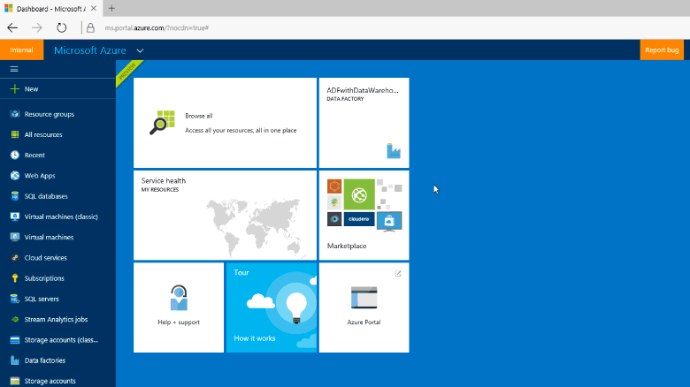

<properties
   pageTitle="Een SQL Data Warehouse maken in de Azure-portal | Microsoft Azure"
   description="Leer hoe u een Azure SQL Data Warehouse maakt in de Azure-portal"
   services="sql-data-warehouse"
   documentationCenter="NA"
   authors="barbkess"
   manager="jhubbard"
   editor=""
   tags="azure-sql-data-warehouse"/>

<tags
   ms.service="sql-data-warehouse"
   ms.devlang="NA"
   ms.topic="get-started-article"
   ms.tgt_pltfrm="NA"
   ms.workload="data-services"
   ms.date="08/25/2016"
   ms.author="barbkess;lodipalm;sonyama"/>

# Een Azure SQL Data Warehouse maken

> [AZURE.SELECTOR]
- [Azure-portal](sql-data-warehouse-get-started-provision.md)
- [TSQL](sql-data-warehouse-get-started-create-database-tsql.md)
- [PowerShell](sql-data-warehouse-get-started-provision-powershell.md)

In deze zelfstudie gebruikt u de Azure-portal om een SQL Data Warehouse te maken die een AdventureWorksDW-voorbeelddatabase bevat.

## Vereisten

Om aan de slag te gaan, hebt u het volgende nodig:

- **Azure-account**: ga naar [Gratis proefversie van Azure][] of [Azure-tegoed met MSDN][] om een account te maken.
- **Azure SQL Server**: zie [Een logische Azure SQL-databaseserver met de Azure-portal][] voor meer informatie.

> [AZURE.NOTE] Het maken van een SQL Data Warehouse kan een nieuwe factureerbare service tot gevolg hebben.  Zie [Prijzen van SQL Data Warehouse][] voor meer informatie.

## Een SQL Data Warehouse maken

1. Meld u aan bij de [Azure-portal](https://portal.azure.com).

2. Klik op **+ Nieuw** > **Gegevens en opslag** > **SQL Data Warehouse**.

    

3. Vul in de blade **SQL Data Warehouse** de benodigde informatie in en druk op Maken.

    

    - **Server**: we raden u aan om eerst de server te selecteren.  

    - **Databasenaam**: de naam die wordt gebruikt om naar de SQL Data Warehouse te verwijzen.  De waarde moet uniek zijn op de server.
    
    - **Prestaties**: we raden u aan om te beginnen met 400 [DWU’s][DWU]. U kunt de schuifregelaar naar links of rechts bewegen om de prestaties van uw datawarehouse aan te passen, of u kunt later omhoog of omlaag schalen.  Voor meer informatie over DWU’s, verwijzen wij u naar onze documentatie over [vergroten/verkleinen](./sql-data-warehouse-manage-compute-overview.md) of onze [pagina met prijzen][Prijzen van SQL Data Warehouse]. 

    - **Abonnement**: selecteer het [abonnement] waaronder deze SQL Data Warehouse wordt gefactureerd.

    - **Resourcegroep**: [Resourcegroepen][Resourcegroep] zijn containers die speciaal zijn ontworpen om u te helpen bij het beheren van een verzameling Azure-resources. Meer informatie over [resourcegroepen](../resource-group-overview.md).

    - **Bron selecteren**: klik op **Bron selecteren** > **Voorbeeld**. Azure vult de optie **Select sample** (Selecteer voorbeeld) automatisch in met AdventureWorksDW.

> [AZURE.NOTE] De standaardsortering voor een SQL Data Warehouse is SQL_Latin1_General_CP1_CI_AS. Als er een andere sortering vereist is, kan met [T-SQL][] een andere sortering voor de database worden gemaakt.

4. Klik op **Maken** om uw SQL Data Warehouse te maken.

5. Wacht enkele minuten. Wanneer uw datawarehouse klaar is, keert u terug naar de [Azure-portal](https://portal.azure.com). U vindt de SQL Data Warehouse op het dashboard onder de SQL-databases, of in de resourcegroep die u hebt gebruikt om deze te maken. 

    

[AZURE.INCLUDE [SQL Database create server](../../includes/sql-database-create-new-server-firewall-portal.md)] 

## Volgende stappen

Nu u een SQL Data Warehouse hebt gemaakt, kunt u [verbinding maken](./sql-data-warehouse-connect-overview.md) en query's gaan uitvoeren.

Zie [Loading overview](./sql-data-warehouse-overview-load.md) (Laden: overzicht) als u gegevens in SQL Data Warehouse wilt laden.

Als u een bestaande database probeert te migreren naar SQL Data Warehouse, raadpleeg dan [Migration overview](./sql-data-warehouse-overview-migrate.md) (Migreren: overzicht) of gebruik het [Migratieprogramma](./sql-data-warehouse-migrate-migration-utility.md).

Firewallregels kunnen ook worden geconfigureerd met behulp van Transact-SQL. Zie [sp_set_firewall_rule][] en [sp_set_database_firewall_rule][] voor meer informatie.

Het is ook een goed idee om te kijken naar de [Aanbevolen procedures][].

<!--Article references-->
[Een logische Azure SQL-databaseserver met de Azure-portal]: ../sql-database/sql-database-get-started.md#create-an-azure-sql-database-logical-server
[Een logische Azure SQL-databaseserver maken met PowerShell]: ../sql-database/sql-database-get-started-powershell.md#database-setup-create-a-resource-group-server-and-firewall-rule
[Resourcegroepen]: ../resource-group-template-deploy-portal.md
[Aanbevolen procedures]: sql-data-warehouse-best-practices.md
[DWU]: sql-data-warehouse-overview-what-is.md#data-warehouse-units
[abonnement]: ../azure-glossary-cloud-terminology.md#subscription
[resourcegroep]: ../azure-glossary-cloud-terminology.md#resource-group
[T-SQL]: ./sql-data-warehouse-get-started-create-database-tsql.md
 
<!--MSDN references-->
[sp_set_firewall_rule]: https://msdn.microsoft.com/library/dn270017.aspx
[sp_set_database_firewall_rule]: https://msdn.microsoft.com/library/dn270010.aspx

<!--Other Web references-->
[Prijzen van SQL Data Warehouse]: https://azure.microsoft.com/pricing/details/sql-data-warehouse/
[Gratis proefversie van Azure]: https://azure.microsoft.com/pricing/free-trial/?WT.mc_id=A261C142F
[Azure-tegoed met MSDN]: https://azure.microsoft.com/pricing/member-offers/msdn-benefits-details/?WT.mc_id=A261C142F

<!--HONumber=ago16_HO5-->

