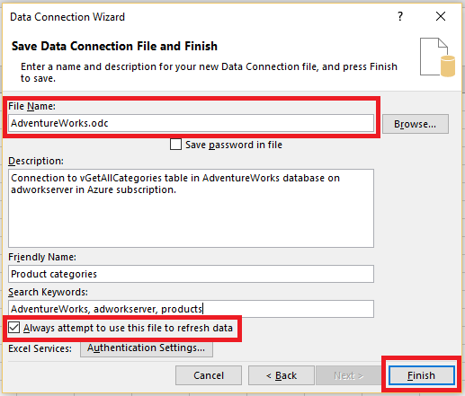
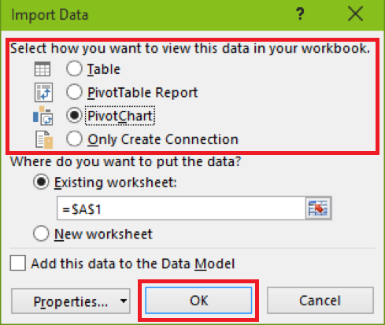

<properties
    pageTitle="Excel verbinden met de SQL Database | Microsoft Azure"
    description="Leer hoe u Microsoft Excel verbindt met Azure SQL Database in de cloud. Gegevens importeren in Excel voor rapportage en gegevens verkenning."
    services="sql-database"
    keywords="connect excel to sql, import data to excel"
    documentationCenter=""
    authors="joseidz"
    manager="jhubbard"
    editor=""/>

<tags
    ms.service="sql-database"
    ms.workload="data-management"
    ms.tgt_pltfrm="na"
    ms.devlang="na"
    ms.topic="get-started-article"
    ms.date="03/25/2016"
    ms.author="joseidz"/>

# Zelfstudie SQL Database: Excel verbinden met een Azure SQL Database en een rapport creëren

> [AZURE.SELECTOR]
- [Visual Studio](sql-database-connect-query.md)
- [SSMS](sql-database-connect-query-ssms.md)
- [Excel](sql-database-connect-excel.md)

Leer hoe u Excel verbindt met een SQL Database in de cloud zodat u  gegevens kunt importeren en tabellen en grafieken kunt maken op basis van waarden in de database. In deze zelfstudie stelt u de verbinding tussen Excel en een databasetabel in, slaat u het bestand met de gegevens en de verbindingsinformatie voor Excel op en maakt u vervolgens een draaigrafiek uit de databasewaarden.

Voordat u begint hebt u een SQL Database in Azure nodig. Als u deze niet hebt, raadpleegt u [Uw eerste SQL Database maken](sql-database-get-started.md) om een database met voorbeeldgegevens binnen enkele minuten in te stellen. In dit artikel, zult u voorbeeldgegevens importeren in Excel van dat artikel, maar u kunt dezelfde stappen volgen voor uw eigen gegevens.

U hebt ook een kopie van Excel nodig. Dit artikel gebruikt [Microsoft Excel 2016](https://products.office.com/en-US/).

## Excel verbinden met een SQL Database en een odc-bestand maken

1.  Open Excel om het programme te verbinden met SQL Database, en maak een nieuwe werkmap of open een bestaande Excel-werkmap.

2.  Klik in de menubalk bovenaan de pagina  op**Gegevens**, klik op **Van andere bronnen**, en klik vervolgens op **Van SQL Server**.

    

    De wizard Gegevensverbinding wordt geopend.

3.  In het dialoogvenster **Verbinding maken met databaseserver** typt u de **servernaam** van de SQL Database die u wilt verbinden in het formulier <*servername*>**. database.windows.net**. Bijvoorbeeld: **adworkserver.database.windows.net**.

4.  Klik onder **aanmeldingsreferenties** op **Gebruik de volgende gebruikersnaam en wachtwoord**, typ de **gebruikersnaam** en het **wachtwoord** dat u hebt ingesteld voor de SQL Databaseserver en klik vervolgens op **Volgende**.

    

    > [AZURE.TIP] Afhankelijk van uw netwerkomgeving kunt u mogelijk geen verbinding maken of kan de verbinding verbroken worden als de server van de SQL Database geen verkeer van het IP-adres van de client toestaat. Ga naar de [Azure Portal](https://portal.azure.com/), klik op SQL-servers, klik op uw server, klik op firewall onder instellingen en voeg uw client-IP-adres toe. Zie [Firewallinstellingen configureren](sql-database-configure-firewall-settings.md) voor meer informatie.

5. In het dialoogvenster **Database en tabel selecteren**, selecteert u de database waarmee u wilt werken uit de lijst en klik vervolgens op de tabellen of weergaven waarmee u wilt werken (we hebben **vGetAllCategories** gekozen), en klik vervolgens op **Volgende**.

    

    Het dialoogvenster **Bestand opslaan en voltooien** wordt geopend. Hier geeft u informatie over het Office database connection (*.odc) bestand dat Excel gebruikt. U kunt de standaardinstellingen laten staan of uw selecties aanpassen.

6. U kunt de standaardinstellingen laten staan, maar let in het bijzonder op de **bestandsnaam**. Een **beschrijving**, een **beschrijvende naam** en **zoekwoorden** helpen u en andere gebruikers te onthouden wat u koppelt en de koppeling te vinden. Klik op **Altijd proberen dit bestand te gebruiken om gegevens te vernieuwen** als u wilt dat verbindingsgegevens worden opgeslagen in het odc-bestand, zodat deze bijgewerkt kan worden wanneer u verbinding maakt en klik vervolgens op **Voltooien**.

    

    Het dialoogvenster **Importeren van gegevens** wordt weergegeven.

## Importeer de gegevens in Excel en maak een draaigrafiek.
Nu de verbinding tot stand is gebracht en het bestand met gegevens en de koppelingsinformatie is gemaakt, leest u om de gegevens te importeren.

1. In het dialoogvenster **Gegevens importeren** , klikt u op de optie die u wilt gebruiken om uw gegevens weer te geven in het werkblad en klik vervolgens op **OK**. We hebben **draaigrafiek** gekozen. U kunt ook kiezen voor **Nieuw werkblad** of **Deze gegevens toevoegen aan een gegevensmodel**. Zie voor meer informatie over gegevensmodellen [Een gegevensmodel maken in Excel](https://support.office.com/article/Create-a-Data-Model-in-Excel-87E7A54C-87DC-488E-9410-5C75DBCB0F7B). Klik op **eigenschappen** om informatie over het odc-bestand dat u in de vorige stap hebt gemaakt te bekijken en om opties te kiezen voor het vernieuwen van de gegevens.

    

    Het werkblad heeft nu een lege draaitabel en grafiek.

8. Onder **PivotTable-velden**, selecteert u alle selectievakjes voor de velden die u wilt weergeven.

    

> [AZURE.TIP] Als u andere Excel-werkmappen en -werkbladen wilt verbinden met de database, klikt u op **Gegevens**, **Verbindingen** en **Toevoegen** en kiest u de koppeling die u hebt gemaakt in de lijst en klik vervolgens op **Openen**.
> 

## Volgende stappen

- Leer hoe u [SQL Database koppelt met SQL Server Management Studio](sql-database-connect-query-ssms.md) voor geavanceerd uitvoeren van query's en analyses.
- Meer informatie over de voordelen van [elastische pools](sql-database-elastic-pool.md).
- Leer hoe u [ een webtoepassing maakt die verbinding maakt met SQL Database op de back-end](../app-service-web/web-sites-dotnet-deploy-aspnet-mvc-app-membership-oauth-sql-database.md).

<!--HONumber=Jun16_HO2-->

