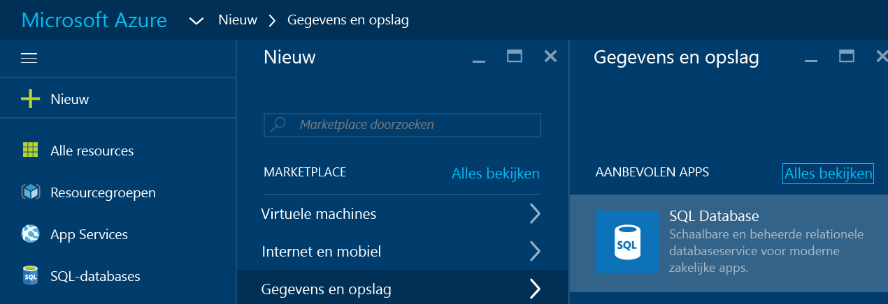
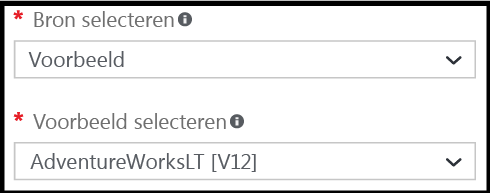
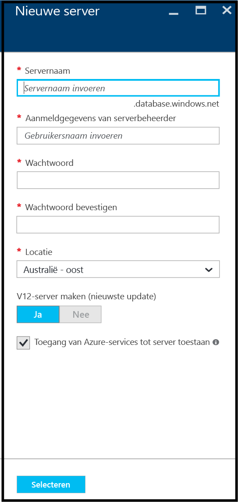
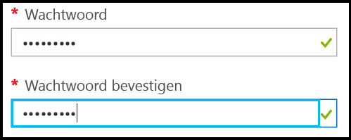
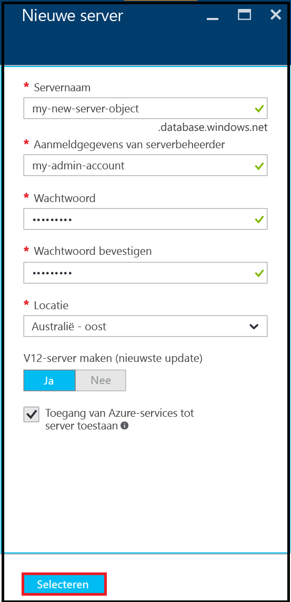
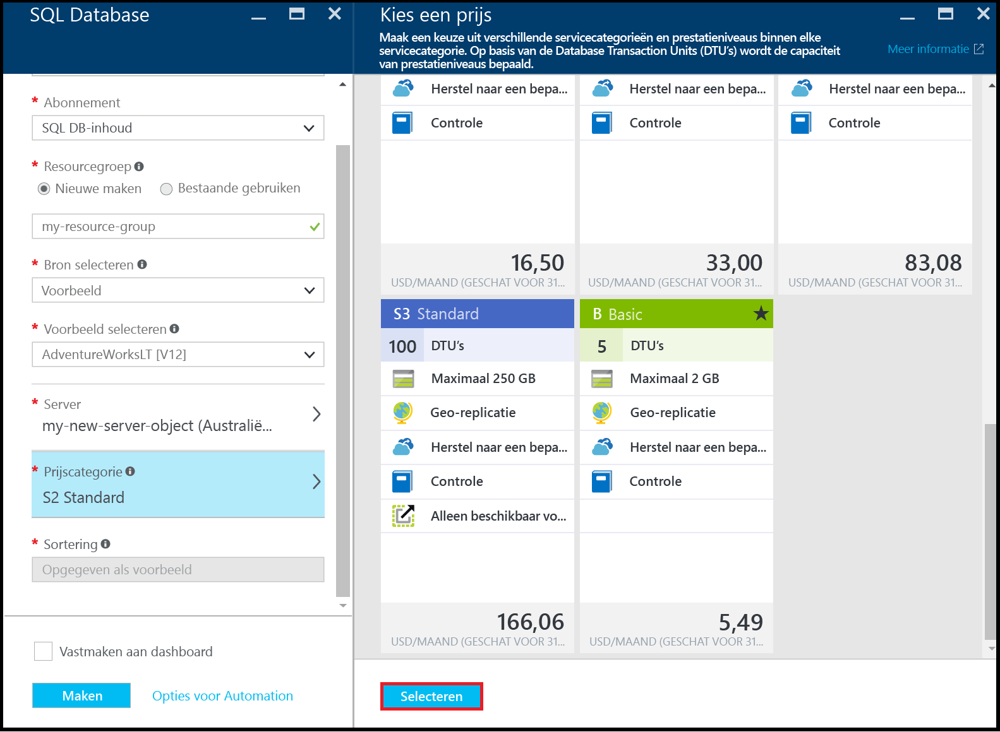
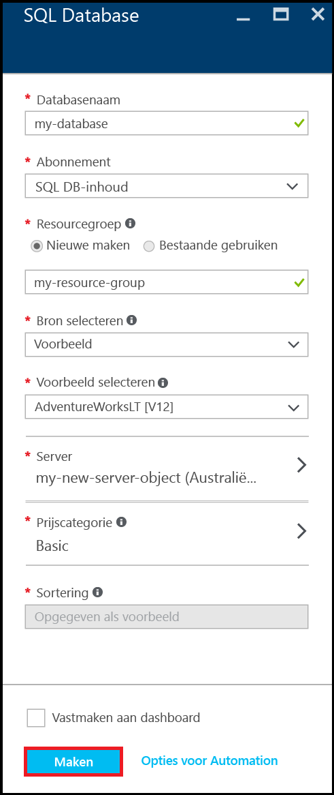

<properties
    pageTitle="SQL Database tutorial: een SQL database maken | Microsoft Azure"
    description="Informatie over het instellen van een logische SQL Database-server, een serverfirewallregel, een SQL Database en voorbeeldgegevens. Lees ook hoe u verbinding met clienthulpprogramma's maakt, gebruikers configureert en een databasefirewallregel instelt."
    keywords="zelfstudie over sql-database, een sql-database maken"
    services="sql-database"
    documentationCenter=""
    authors="CarlRabeler"
    manager="jhubbard"
    editor=""/>

<tags
    ms.service="sql-database"
    ms.workload="data-management"
    ms.tgt_pltfrm="na"
    ms.devlang="na"
    ms.topic="hero-article"
    ms.date="09/07/2016"
    ms.author="carlrab"/>

# SQL Database tutorial: maak in slechts enkele minuten een SQL Database met behulp van Azure Portal

> [AZURE.SELECTOR]
- [Azure Portal](sql-database-get-started.md)
- [C#](sql-database-get-started-csharp.md)
- [PowerShell](sql-database-get-started-powershell.md)

In deze zelfstudie leert u hoe u de Azure-portal kunt gebruiken om:

- Een Azure SQL Database te maken met voorbeeldgegevens.
- Een firewallregel op serverniveau kunt maken voor een individueel IP-adres of voor een aantal IP-adressen.

U kunt dezelfde taken uitvoeren met [C#](sql-database-get-started-csharp.md) of [PowerShell](sql-database-get-started-powershell.md).

[AZURE.INCLUDE [Login](../../includes/azure-getting-started-portal-login.md)]

## Uw eerste Azure SQL-database maken 

1. Als u momenteel niet bent verbonden, maakt u eerst verbinding met [Azure Portal](http://portal.azure.com).
2. Klik op **Nieuw**, klik op **Gegevens en opslag** en ga naar **SQL Database**.

    

3. Klik op **SQL Database** om de blade SQL Database te openen. De inhoud op deze blade is afhankelijk van het aantal abonnementen dat u hebt en van uw bestaande objecten (zoals bestaande servers).

    

4. Geef in het tekstvak **Databasenaam** een naam op voor uw eerste database, bijvoorbeeld 'mijn-database'. Een groen vinkje geeft aan dat u een geldige naam hebt opgegeven.

    

5. Selecteer een abonnement als u meerdere abonnementen hebt.
6. Klik onder **Resourcegroep** op **Nieuwe maken** en geef een naam op voor uw eerste resourcegroep, bijvoorbeeld 'mijn-resourcegroep'. Een groen vinkje geeft aan dat u een geldige naam hebt opgegeven.

    

7. Klik onder **Bron selecteren** op **Voorbeeld** en klik vervolgens onder **Voorbeeld selecteren** op **AdventureWorksLT [V12]**.

    

8. Klik onder **Server** op **Vereiste instellingen configureren**.

    

9. Klik op de blade Server **Een nieuwe server maken**. Er wordt een Azure SQL-database gemaakt binnen een serverobject. Dit kan een nieuwe of een bestaande server zijn.

    

10. Controleer de blade **Nieuwe server** voor inzicht in de informatie die u voor de nieuwe server moet opgeven.

    

11. Geef in het tekstvak **Servernaam** een naam op voor uw eerste server, bijvoorbeeld 'mijn-nieuwe-serverobject'. Een groen vinkje geeft aan dat u een geldige naam hebt opgegeven.

    
 
12. Geef onder **Aanmeldgegevens van de serverbeheerder** een gebruikersnaam op voor de admin-aanmelding voor deze server, bijvoorbeeld 'mijn-admin-account'. Deze aanmelding wordt de principal-aanmelding op serverniveau genoemd. Een groen vinkje geeft aan dat u een geldige naam hebt opgegeven.

    

13. Geef onder **Wachtwoord** en **Wachtwoord bevestigen** een wachtwoord op voor het principal-aanmeldingsaccount van de server, bijvoorbeeld 'p@ssw0rd1'. Een groen vinkje geeft aan dat u een geldig wachtwoord hebt opgegeven.

    
 
14. Selecteer onder **Locatie** een geschikt datacentrum voor uw locatie, bijvoorbeeld 'Australië - oost'.

    

15. Onder **V12-server maken (laatste update) ziet u dat u alleen een actuele versie van Azure SQL-server kunt maken.

    

16. Het selectievakje voor **Toegang van Azure-services tot server toestaan** is standaard ingeschakeld. Het kan hier niet worden gewijzigd. Dit is een geavanceerde optie. U kunt deze instelling in de firewallinstellingen van de server voor dit serverobject kunt wijzigen, hoewel dit voor de meeste scenario's niet nodig is.

    

17. Controleer uw selecties op de blade Nieuwe server en klik op **Selecteren** om deze nieuwe server voor de nieuwe database te selecteren.

    

18. Op de blade SQL Database klikt u onder **Prijscategorie** op **S2 Standard** en vervolgens op **Basis** om de minst dure prijscategorie voor uw eerste database te kiezen. U kunt de prijscategorie later altijd nog wijzigen.

    

19. Controleer uw selecties op de blade SQL Database en klik op **Maken** om uw eerste server en database te maken. De waarden die u hebt opgegeven, worden gevalideerd en de implementatie start.

    

20. Klik op de werkbalk van de portal op de items bij **Meldingen** om de status van uw implementatie te controleren.

    

>[AZURE.IMPORTANT]Wanneer de implementatie is voltooid, zijn uw nieuwe Azure SQL-server en -database gemaakt in Azure. U kunt pas met behulp van SQL Server-hulpprogramma's verbinding maken met uw nieuwe server of database wanneer u een firewallregel voor de server hebt gemaakt die de SQL Database-firewall opent voor verbindingen van buiten Azure.

[AZURE.INCLUDE [Create server firewall rule](../../includes/sql-database-create-new-server-firewall-portal.md)]

## Volgende stappen
Nu u deze SQL Database-tutorial hebt afgerond en een database hebt gemaakt met wat voorbeeldgegevens, bent u klaar om verder te gaan met uw favoriete tools.

- Als u bekend bent met Transact-SQL en SQL Server Management Studio (SSMS), ontdek dan hoe u [verbinding kunt maken met een SQL Database en een query op de database kunt uitvoeren met SSMS](sql-database-connect-query-ssms.md).

- Bent u bekend met Excel? Ontdek dan hoe u [verbinding kunt maken met een SQL Database in Azure via Excel](sql-database-connect-excel.md).

- Als u wilt gaan coderen, kiest u uw programmeertaal in [Verbindingsbibliotheken voor SQL Database en SQL Server](sql-database-libraries.md).

- Als u uw on-premises SQL Server-database wilt verplaatsen naar Azure, raadpleegt u [Een database migreren naar SQL Database](sql-database-cloud-migrate.md) voor meer informatie.

- Als u met het opdrachtregelprogramma BCP enkele gegevens vanuit een csv-bestand in een nieuwe tabel wilt laden, leest u [Met BCP gegevens vanuit een csv-bestand in SQL Database laden](sql-database-load-from-csv-with-bcp.md).

- Zie [Getting started with security](sql-database-get-started-security.md) (Aan de slag met beveiliging) voor meer informatie over de beveiliging van Azure SQL Database

## Aanvullende resources

[Wat is SQL Database?](sql-database-technical-overview.md)

<!--HONumber=Sep16_HO3-->

