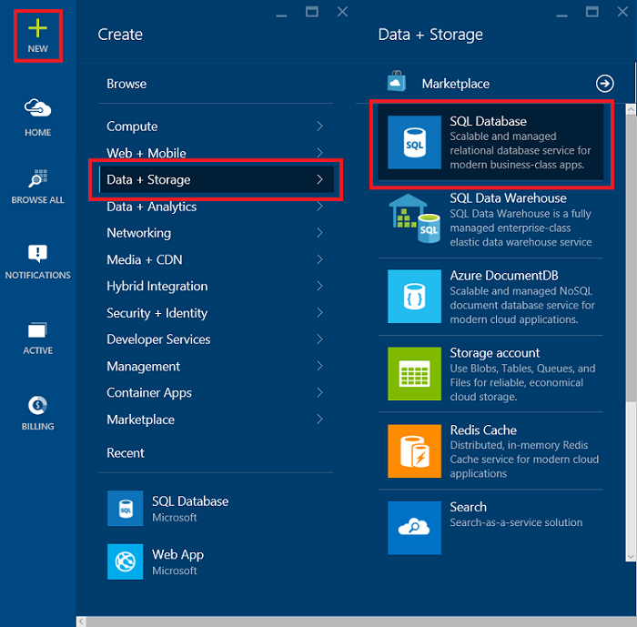
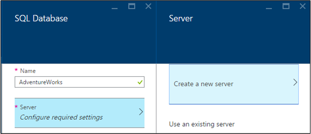
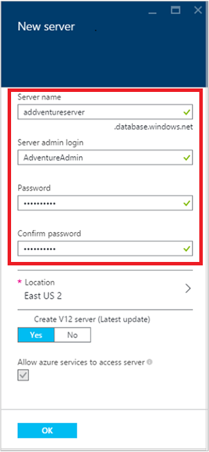
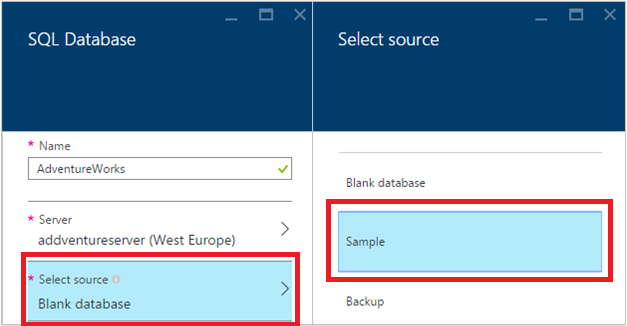
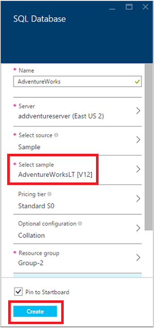
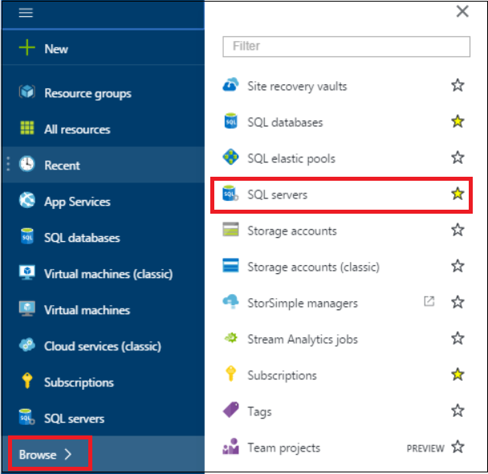
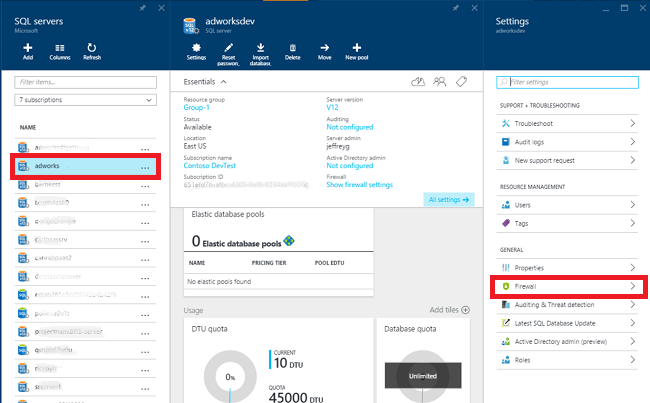
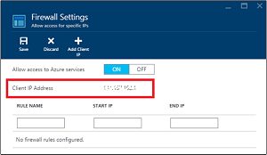

<properties
	pageTitle="SQL Database tutorial: Create a SQL database | Microsoft Azure"
	description="Create a first SQL database in minutes in the Azure portal with sample data and using Microsoft's relational database management system (RDBMS)."
	keywords="sql database tutorial,create a sql database"	
	services="sql-database"
	documentationCenter=""
	authors="jeffgoll"
	manager="jeffreyg"
	editor="cgronlun"/>

<tags
	ms.service="sql-database"
	ms.workload="data-management"
	ms.tgt_pltfrm="na"
	ms.devlang="na"
	ms.topic="hero-article"
	ms.date="12/01/2015"
	ms.author="jeffreyg"/>

# SQL Database tutorial: Create a SQL database in minutes using sample data and the Azure portal

**Single database**

> [AZURE.SELECTOR]
- [Azure portal](sql-database-get-started.md)
- [C#](sql-database-get-started-csharp.md)
- [PowerShell](sql-database-get-started-powershell.md)

This SQL Database tutorial shows you how to create a first SQL database in just a few minutes with sample data in the Azure portal. You'll learn how to:

- Create a server to host the database you create, and then set up a firewall rule for it.
- Create a SQL database from an AdventureWorks sample, which has data that you can play with.

You'll need an Azure account and subscription before you start. If you don't have one, sign up for a [free trial](http://azure.microsoft.com/pricing/free-trial/).

> [AZURE.NOTE] This SQL Database tutorial covers setting up a database using Microsoft's relational database management service in the cloud, Azure SQL Database. Another option is to run SQL Server on an Azure Virtual Machine. See [Understanding Azure SQL Database and SQL Server in Azure VMs](data-management-azure-sql-database-and-sql-server-iaas.md) for a quick comparison, or you can see [Provision a SQL server virtual machine](virtual-machines-provision-sql-server.md) to get started with a virtual machine.

## Step 1: sign in and start SQL database setup
1. Sign in to the [Azure portal](http://portal.azure.com/).
2. Click **New** > **Data + Storage** > **SQL Database**.

	
	
	The **SQL Database** settings blade that appears is where you'll set up the server and database details.

	

## Step 2: choose server settings
A SQL database in Azure lives on a database server. A server can host multiple databases. As you set up a database, you can also create and set up the server that will host it, or you can use one that was created earlier. We'll set up a new one.

1. Type a **Name** for your database (we use **AdventureWorks**). We'll come back to cover other database settings later.
2. Under **Server** click **Configure required settings**, and then click **Create a new server**.

	

3. In the **New server** blade, type a **Server Name** that's unique throughout Azure and easy to remember. You'll need this name later when you connect and work with your database.
4. Type a **Server admin login** that's easy to remember (we use **AdventureAdmin**). Then type a secure **Password** and type it again in **Confirm password**.

	

	 Leave **Create V12 Server (latest update)** set to **Yes** to use the latest features. The **Location** determines the data center region where your server is created.

	>[AZURE.TIP] Create database servers in a location close to  the applications that will use the database. If you want to change the location, just click **Location**, pick a different one, and then click **OK**.

5. Click **OK** to go back to **SQL Database** blade. 

The database and server aren't created yet. This happens after the next step, where you choose to create the database from the AdventureWorks sample and confirm settings.

## Step 3: set up and create a SQL database
1. In the **SQL Database** blade, click **Select source** and then click **Sample**. 

	

2. You go back to the **SQL Database** blade, where **Select sample** now shows **AdventureWorks LT [V12]**. Click **Create** to kick off creation of the server and database.

	

	>[AZURE.NOTE] For this quick how-to, we didn't change the settings for **Pricing tier**, **Collation**, and **Resource group**. You can change the pricing tier of a database and scale up and down at any time, with no downtime. See [SQL Database Pricing](http://azure.microsoft.com/pricing/details/sql-database/) and [SQL database pricing tiers](sql-database-service-tiers.md) to learn more. The collation of a database can't be changed once you set it up here. See [Collation and Unicode Support](https://msdn.microsoft.com/library/ms143726.aspx) for details about collation. See [Azure Resource Manager Overview](resource-group-overview.md) for details about Azure resource groups.

You jump back to the Azure Startboard, where a tile shows progress until the database is created and it's online. You can also click **Browse all** and then click **SQL Databases** to confirm the database is online.
	
Congratulations! You now have a SQL database running in the cloud. You're almost finished. There's one key step left. You need to create a rule on the database server so you can connect to the database.

## Step 4: configure the firewall

You need to set up a firewall rule on the server that allows connections from your client computer's IP address so you can work with the database. This not only helps make sure you can connect, it's a great way to see the area where you can get other details about your SQL servers in Azure. 

1. Click **Browse all**, scroll down and then click **SQL servers**, and then click the name of the server you created earlier from the list of **SQL servers**.

	

	
3. In the database properties blade that appears to the right, click **Settings** and then click **Firewall** from the list.

	

	The **Firewall settings** show your current **Client IP address**. 

	

4. Click **Add Client IP** to have Azure create a rule for that IP address, and then click **Save**.

	

	>[AZURE.IMPORTANT] Your Client IP address is likely to change from time to time, and you may not be able to access your server until you create a new firewall rule. You can check your IP address using [Bing](http://www.bing.com/search?q=my%20ip%20address), and then add a single IP address or a range of IP addresses. See [How to configure firewall settings](sql-database-configure-firewall-settings.md) for details.

## Next steps
Now that you've completed this SQL Database tutorial and created a database with some sample data, you're ready to explore using your favorite tools.

- If you're familiar with Transact-SQL and SQL Server Management Studio, learn how to [Connect and query a SQL database with SSMS](sql-database-connect-query-ssms.md).

- If you know Excel, learn how to [Connect to SQL database with Excel](sql-database-connect-excel.md).

- If you're ready to start coding, see [Connect and query your SQL database with C#](sql-database-connect-query.md) and [Using SQL database from .NET (C#)](sql-database-develop-dotnet-simple.md). See the [Quick start code samples to SQL Database](sql-database-develop-quick-start-client-code-samples.md) for Node.js, Python, Ruby, Java, PHP and C++ samples and how-to's in addition to C#.

- If you want to move your on-premises SQL Server databases to Azure, see [Migrating a database to Azure SQL Database](sql-database-cloud-migrate.md) to learn more.

