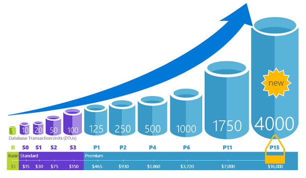

<properties
    pageTitle="SQL Database: wat is een DTU? | Microsoft Azure"
    description="Inzicht in wat een Azure SQL Database-transactie-eenheid is."
    keywords="databaseopties, prestaties van de database"
    services="sql-database"
    documentationCenter=""
    authors="CarlRabeler"
    manager="jhubbard"
    editor="CarlRabeler"/>

<tags
    ms.service="sql-database"
    ms.devlang="na"
    ms.topic="get-started-article"
    ms.tgt_pltfrm="na"
    ms.workload="NA"
    ms.date="09/06/2016"
    ms.author="carlrab"/>

# Over DTU's (Database Transaction Units) en eDTU's (elastische Database Transaction Units)

In dit artikel wordt uitgelegd wat DTU's (Database Transaction Units) en eDTU's (elastische Database Transaction Units) zijn en wat er gebeurt als u het maximale aantal DTU's of eDTU's hebt bereikt.  

## Wat zijn DTU's (Database Transaction Units)?

Een DTU is een maateenheid voor de resources waarover een zelfstandige Azure SQL-database op een bepaald prestatieniveau binnen een [servicelaag](sql-database-service-tiers.md#standalone-database-service-tiers-and-performance-levels) gegarandeerd kan beschikken. Een DTU is een combinatie van CPU, geheugen en gegevens-I/O en transactielogboek-I/O in een verhouding die is bepaald door een OLTP-benchmarkworkload die een goede representatie zou moeten zijn van realistische OLTP-workloads. Een verdubbeling van het aantal DTU's door het prestatieniveau van een database te verhogen, is gelijk aan een verdubbeling van het aantal resources waarover die database kan beschikken. Zo biedt een Premium P11-database met 1750 DTU's 350 keer meer DTU aan rekenvermogen dan een Basic-database met 5 DTU's. Raadpleeg [SQL Database benchmark overview](sql-database-benchmark-overview.md) (Overzicht van SQL Database-benchmarks) voor meer informatie over de methodologie achter de OLTP-benchmarkworkload waarmee de DTU-combinatie wordt bepaald.

U kunt steeds de [servicelagen wijzigen](sql-database-scale-up.md) met een minimale downtime voor uw toepassing (doorgaans minder dan vier seconden). Voor veel bedrijven en apps is het kunnen maken van databases en het naar wens omhoog of omlaag schalen van de prestaties van één database al voldoende, vooral als de gebruikspatronen redelijk voorspelbaar zijn. Bij onvoorspelbare gebruikspatronen kan het echter lastig zijn uw kosten en bedrijfsmodel effectief te beheren. Voor dit scenario gebruikt u een elastische pool met een bepaald aantal eDTU's.

## Wat zijn eDTU's (elastische Database Transaction Units)?

Een eDTU is een maateenheid voor de reeks resources (DTU's) die kunnen worden gedeeld tussen een reeks databases op een Azure SQL-server. Deze reeks resources wordt een [elastische pool](sql-database-elastic-pool.png) genoemd. Elastische pools zijn een eenvoudige en voordelige oplossing om prestatiedoelen te beheren voor databases met breed uiteenlopende en onvoorspelbare gebruikspatronen. Zie [Elastische pools en servicelagen](sql-database-service-tiers.md#elastic-pool-service-tiers-and-performance-in-edtus) voor meer informatie.

Een pool krijgt een bepaald aantal eDTU's voor een vaste prijs. Binnen de pool hebben afzonderlijke databases de flexibiliteit om de schaal automatisch aan te passen binnen ingestelde parameters. Bij zware belasting kan een database meer eDTU's verbruiken om aan de vraag te voldoen. Databases verbruiken minder bij lichte belasting en verbruiken geen eDTU's als er geen belasting is. De inrichting van resources voor de hele pool in plaats van afzonderlijke databases vereenvoudigt uw beheertaken. Bovendien hebt u een voorspelbaar budget voor de pool.

Er kunnen extra eDTU's aan een bestaande pool worden toegevoegd zonder uitvaltijd en zonder gevolgen voor de databases in de elastische pool. En als de extra eDTU's niet meer nodig zijn, kunnen ze op elk moment uit een bestaande pool worden verwijderd. U kunt databases aan de pool toevoegen of uit de pool verwijderen. Als een database naar verwachting minder resources nodig heeft, kunt u deze verwijderen.

## Hoe bepaal ik hoeveel DTU's ik met mijn workload nodig heb?

Als u een bestaande workload voor virtuele on-premises of SQL Server-machines wilt migreren naar Azure SQL Database, kunt u de [DTU-rekenmachine](http://dtucalculator.azurewebsites.net/) gebruiken om een schatting te maken van het aantal benodigde DTU's. Voor een bestaande Azure SQL Database-workload raadpleegt u [SQL Database Query Performance Insight](sql-database-query-performance.md) voor meer informatie over het verbruik van databaseresources (DTU's) om inzicht te krijgen in hoe u uw workload kunt optimaliseren. U kunt ook de DMV [sys.dm_db_ resource_stats](https://msdn.microsoft.com/library/dn800981.aspx) gebruiken om de gegevens over het resourceverbruik van het afgelopen uur te verkrijgen. En in de catalogusweergave [sys.resource_stats](http://msdn.microsoft.com/library/dn269979.aspx) kunt u dezelfde gegevens opvragen voor de afgelopen veertien dagen, al hebben deze een iets lagere betrouwbaarheid van gemiddeld vijf minuten.

## Hoe weet ik of een elastische pool met resources voor mij voordeliger is?

Pools zijn geschikt voor een groot aantal databases met specifieke gebruikspatronen. Voor een bepaalde database wordt dit patroon gekenmerkt door een laag gemiddeld gebruik met relatief incidentele gebruikspieken. SQL Database evalueert automatisch het historisch resourcegebruik van databases in een bestaande SQL Database-server en op basis daarvan wordt de juiste poolconfiguratie in de Azure-portal aanbevolen. Zie [When should an elastic database pool be used?](sql-database-elastic-pool-guidance.md) (Wanneer moet een pool voor Elastic Database worden gebruikt?) voor meer informatie.

## Wat gebeurt er wanneer ik het maximumaantal DTU's heb bereikt

Prestatieniveaus worden gekalibreerd en worden bestuurd om de resources te verstrekken die nodig zijn om de databaseworkload uit te voeren tot de maximumlimiet die is toegestaan voor uw geselecteerde servicelaag of het geselecteerde prestatieniveau. Als uw workload de limiet bereikt op het gebied van CPU/gegevens-I/O/logboekI/O, blijft u resources ontvangen op het maximaal toegestane niveau, maar u zult dan waarschijnlijk merken dat uw query's langer duren. Deze limieten resulteren niet in fouten, maar wel in een vertraging van de workload, tenzij de vertraging zo ernstig wordt dat query's een time-out geven. Als u de limiet hebt bereikt van het maximaal toegestane aantal gelijktijdige sessies/gebruikersaanvragen (werkthreads), treden expliciete fouten op. Zie [Azure SQL Database resource limits](sql-database-resource-limits.md) (Resourcelimieten voor Azure SQL Database) voor informatie over andere resources dan CPU, geheugen, gegevens-I/O en transactielogboek-I/O.

## Volgende stappen

- Zie [Servicelagen](sql-database-service-tiers.md) voor informatie over het aantal DTU's en eDTU's dat beschikbaar is voor zelfstandige databases en voor elastische pools.
- Zie [Azure SQL Database resource limits](sql-database-resource-limits.md) (Resourcelimieten voor Azure SQL Database) voor informatie over andere resources dan CPU, geheugen, gegevens-I/O en transactielogboek-I/O.
- Zie [SQL Database Query Performance Insight](sql-database-query-performance.md) als u meer wilt weten over uw verbruik (DTU's).
- Zie [SQL Database benchmark overview](sql-database-benchmark-overview.md) (Overzicht van SQL Database-benchmarks) voor meer informatie over de methodologie achter de OLTP-benchmarkworkload waarmee de DTU-combinatie wordt bepaald.

<!--HONumber=Sep16_HO3-->

