<properties
    pageTitle="Aan de slag met Azure Stream Analytics om gegevens te verwerken van IoT-apparaten | Stream Analytics"
    description="IoT-sensortags en -gegevensstromen met Stream Analytics en realtime-gegevensverwerking"
    services="stream-analytics"
    documentationCenter=""
    authors="jeffstokes72"
    manager="paulettm"
    editor="cgronlun"
/>

<tags 
    ms.service="stream-analytics" 
    ms.devlang="na" 
    ms.topic="hero-article" 
    ms.tgt_pltfrm="na" 
    ms.workload="data-services" 
    ms.date="05/03/2016"
    ms.author="jeffstok"
/>

# Aan de slag met Azure Stream Analytics om gegevens te verwerken van IoT-apparaten

In deze zelfstudie leert u hoe u stroomverwerkingslogica schrijft om gegevens te verzamelen van IoT-apparaten (Internet der dingen). We gebruiken hier een echte IoT-gebruikstoepassing (Internet der dingen) om aan te tonen hoe u snel en economisch een oplossing maakt.

## Vereisten

-   [Azure-abonnement](https://azure.microsoft.com/pricing/free-trial/)
-   Voorbeeldquery en gegevensbestanden die u kunt downloaden van [GitHub](https://github.com/Azure/azure-stream-analytics/tree/master/Samples/GettingStarted)

## Scenario

Contoso is een productiebedrijf op het gebied van industriële automatisering dat hun fabricageproces volledig heeft geautomatiseerd. De machines in dit bedrijf hebben sensoren die in realtime-gegevensstromen genereren. In dit scenario wil een werkvloerbeheerder realtime-inzichten op basis van de sensorgegevens om naar patronen te zoeken en hierop te reageren. We passen de SAQL (Stream Analytics Query Language) op de sensorgegevens toe om interessante patronen te vinden in de stroom inkomende gegevens.

Hier worden gegevens gegenereerd met een Texas Instrument Sensor Tag-apparaat.

De nuttige last van de gegevens heeft de JSON-indeling en ziet er ongeveer als volgt uit:

    
    {
        "time": "2016-01-26T20:47:53.0000000",  
        "dspl": "sensorE",  
        "temp": 123,  
        "hmdt": 34  
    }  
    
In een werkelijk scenario hebt u honderden van dit soort sensoren die gebeurtenissen als een stroom genereren. In het ideale geval is er een gateway-apparaat waarop bepaalde code wordt uitgevoerd die deze gebeurtenissen pusht naar [Azure Event Hubs](https://azure.microsoft.com/services/event-hubs/). De Stream Analytics-taak ontvangt deze gebeurtenissen van Event Hubs en voert in de vorm van query's realtime-analysen uit. De resultaten worden naar de gewenste uitvoer verzonden.

Voor deze introductiehandleiding hebben we een bestand gemaakt met voorbeeldgegevens die zijn vastgelegd met echte SensorTag-apparaten. Hiermee kunt u verschillende query's uitvoeren en de resultaten ervan bekijken. In volgende zelfstudies leert u hoe u een taak verbindt met in- en uitvoer, en deze implementeert in de Azure-service.

## Stream Analytics-taak maken

Ga naar [Azure Portal](http://manage.windowsazure.com), open Stream Analytics en klik linksonder op de pagina op **Nieuw** om een nieuwe analysetaak te maken.

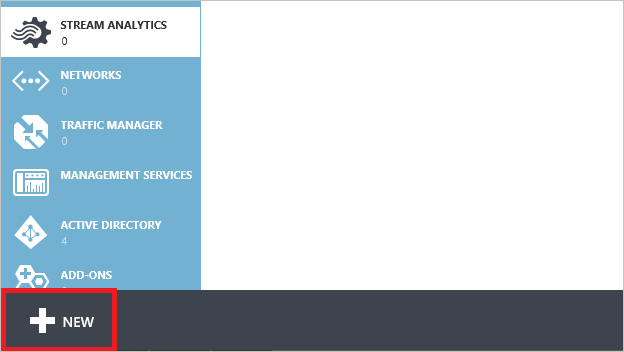

Klik op **Snelle invoer**.

Selecteer voor **Opslagaccount regionale controle** de optie **Nieuw opslagaccount maken** en geef het een unieke naam. Dit account wordt in Azure Stream Analytics gebruikt om de controlegegevens voor alle toekomstige taken op te slaan.

> [AZURE.NOTE] U hoeft dit opslagaccount slechts eenmaal per regio te maken. Het wordt gedeeld met alle Stream Analytics-taken die in deze regio worden gemaakt.

Klik onder aan de pagina op **Stream Analytics-taak maken**.

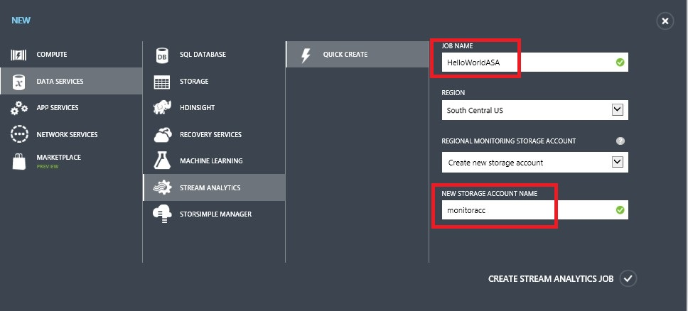

## Azure Stream Analytics-query

Klik op het tabblad Query om naar de Queryeditor te gaan. Het tabblad Query bevat een SQL-query die de transformatie van de binnenkomende gegevens uitvoert.

## De onbewerkte gegevens archiveren

De meest eenvoudige vorm van een query is het doorgeven van gegevens waarmee alle invoergegevens worden gearchiveerd op de aangewezen uitvoer.

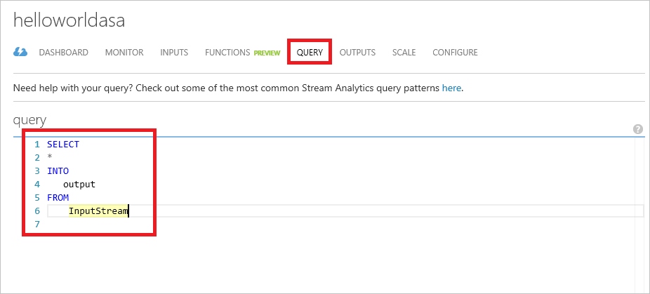

Download nu het voorbeeldgegevensbestand van [GitHub](https://github.com/Azure/azure-stream-analytics/tree/master/Samples/GettingStarted) naar een locatie op uw computer. Kopieer en plak de query uit het bestand **PassThrough.txt**. Klik op de onderstaande knop Testen en selecteer het gegevensbestand met de naam **HalloWereldASA InputStream.json** van uw downloadlocatie.

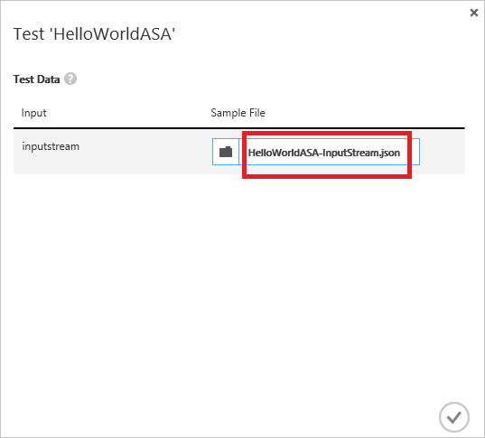

U kunt de resultaten van de query in de onderstaande browser zien.

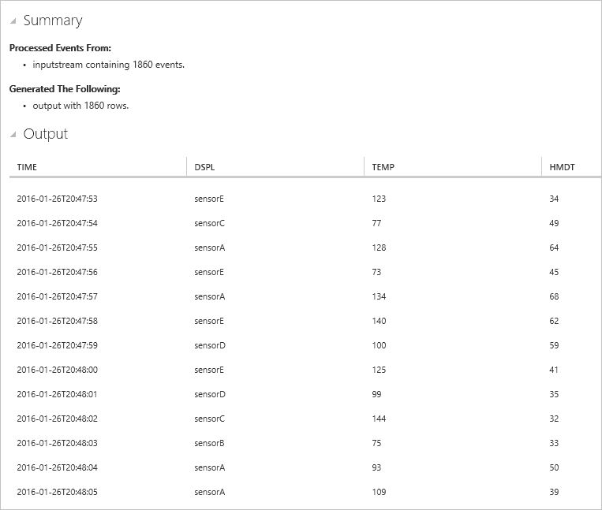

## Gegevens voorwaardelijk opschonen

We gaan de resultaten filteren op basis van een voorwaarde. Wij willen graag alleen de resultaten van SensorA weergeven. U vindt de query in bestand **Filtering.txt**.

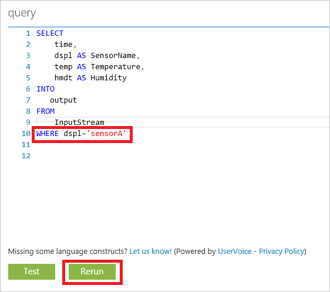

Let wel: we vergelijken hier een hoofdlettergevoelige tekenreekswaarde. Klik op de knop **Opnieuw uitvoeren** om de query uit te voeren. De query zou nu slechts 389 rijen van de 1860 gebeurtenissen moeten retourneren.

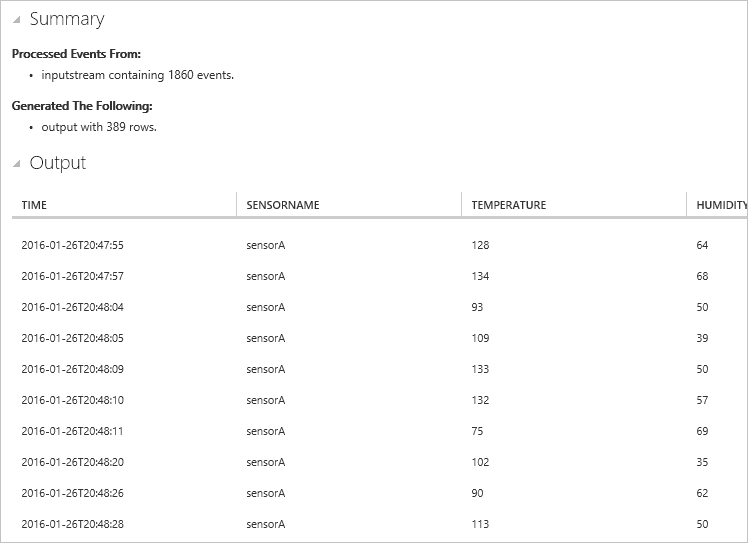

## Waarschuwingen om zakelijke werkstromen te activeren

Nu gaan we de query iets interessanter maken. Als u voor elk type sensor de gemiddelde temperatuur per tijdvenster van 30 seconden wilt controleren en alleen resultaten wilt weergeven als de gemiddelde temperatuur hoger is dan 100 graden, schrijft u onderstaande query en klikt u op Opnieuw uitvoeren om de resultaten weer te geven. U vindt de query in bestand **ThresholdAlerting.txt**.

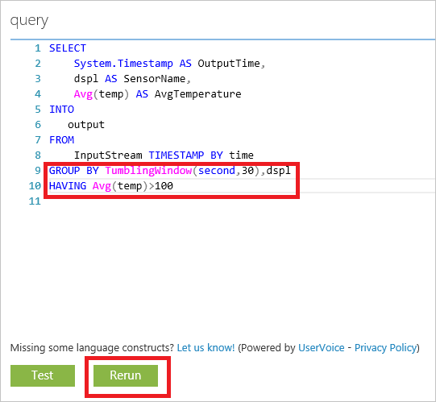

Nu bevatten de resultaten nog maar 245 rijen, voor sensoren die een gemiddelde temperatuur aangeven die hoger is dan 100 graden. In deze query hebben we de stroom gebeurtenissen gegroepeerd op dspl, de sensornaam, en voor een **tumblingvenster** van 30 seconden. Bij dergelijke tijdelijke query's is het essentieel om aan te geven hoe we tijd willen voortzetten. Met de **TIMESTAMP BY**-clausule hebben we de kolom Tijd gebruikt als een manier om tijd voort te zetten voor alle tijdelijke berekeningen. Voor gedetailleerde informatie leest u de MSDN-onderwerpen over [Time Management](https://msdn.microsoft.com/library/azure/mt582045.aspx) en [Windowing](https://msdn.microsoft.com/library/azure/dn835019.aspx).

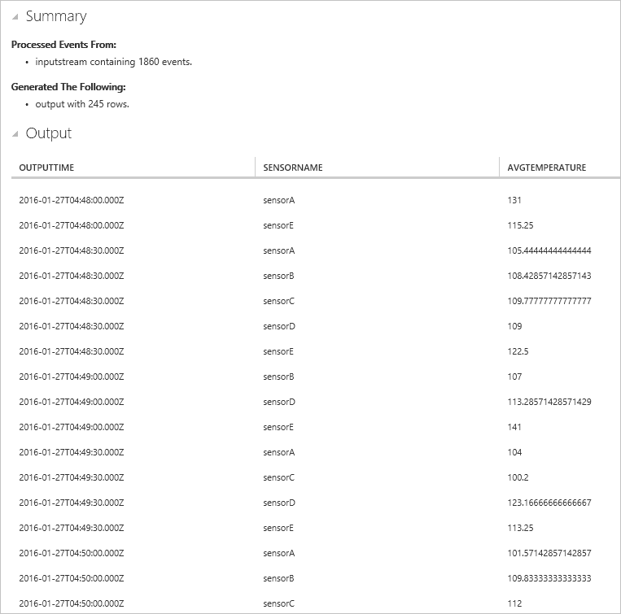

## Het ontbreken van patronen zoeken

Hoe schrijf ik een query om een gebrek aan patronen te zoeken? Stel, we willen weten wanneer een sensor het laatst gegevens heeft verstuurd en daarna een minuut lang geen gegevens meer heeft verstuurd. U vindt de query in bestand **AbsenseOfEvent.txt**.

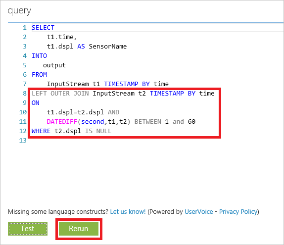

We gebruiken hier **LEFT OUTER JOIN** voor dezelfde gegevensstroom (self-join). Voor een inner join wordt alleen een resultaat geretourneerd wanneer een overeenkomst is gevonden.  Maar als in geval van een **LEFT OUTER**-join geen overeenkomst wordt gevonden met een gebeurtenis vanaf de linkerkant van de join, wordt een rij met NULL voor alle kolommen in de rechterrij geretourneerd. Deze techniek is heel nuttig om de afwezigheid van gebeurtenissen op te sporen. Raadpleeg onze MSDN-documentatie voor meer informatie over [JOIN](https://msdn.microsoft.com/library/azure/dn835026.aspx).

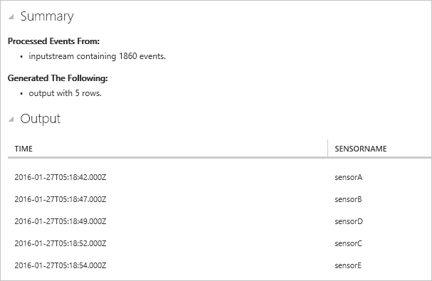

## Conclusie

Deze zelfstudie helpt u op weg met het schrijven van verschillende SAQL-query's en het weergeven van resultaten in de browser voor verschillende patronen in de gegevens. Maar dit slechts een begin. Met Stream Analytics hebt u nog veel meer mogelijkheden. Hierna leert u hoe u de Stream Analytics-taak verbindt met in- en uitvoer en deze implementeert in Azure. Als u meer wilt leren over Stream Analytics raadpleegt u het [leeroverzicht](https://azure.microsoft.com/documentation/learning-paths/stream-analytics/), en voor meer informatie over het schrijven van query's raadpleegt u het artikel over [veelvoorkomende querypatronen](./stream-analytics-stream-analytics-query-patterns.md#query-example-detect-the-absence-of-events).

<!--HONumber=Jun16_HO2-->

