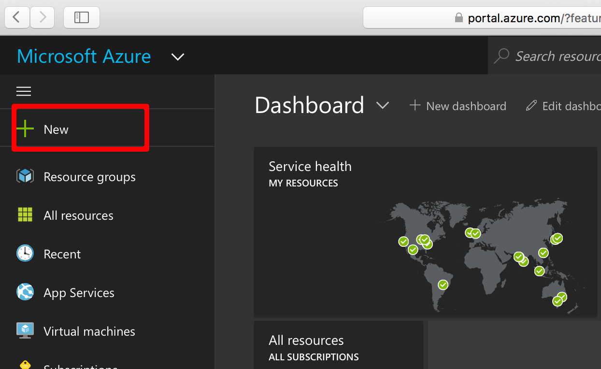
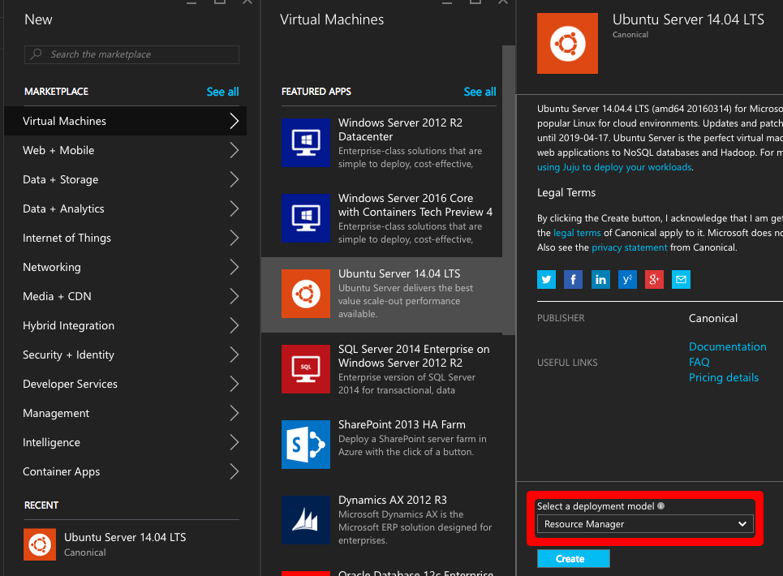
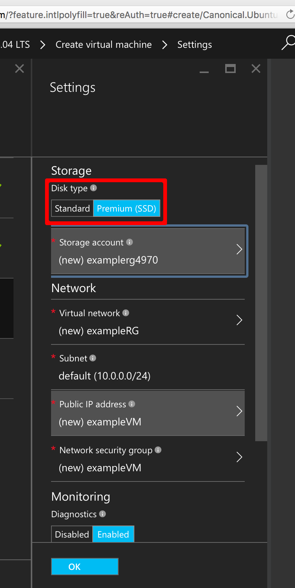
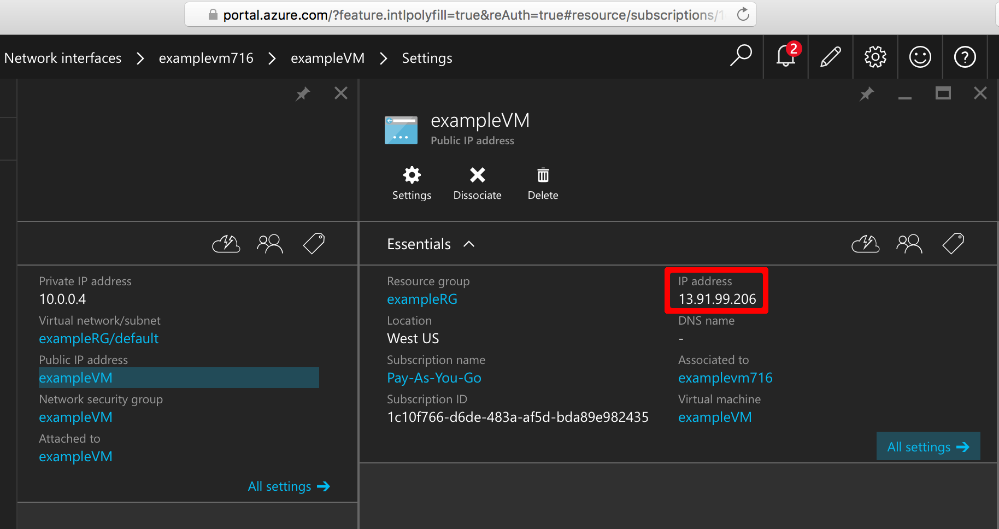

<properties
    pageTitle="Een virtuele Linux-machine maken met behulp van de Azure-portal | Microsoft Azure"
    description="Een virtuele Linux-machine maken met behulp van de Azure-portal."
    services="virtual-machines-linux"
    documentationCenter=""
    authors="vlivech"
    manager="timlt"
    editor=""
    tags="azure-resource-manager"
/>

<tags
    ms.service="virtual-machines-linux"
    ms.workload="infrastructure-services"
    ms.tgt_pltfrm="vm-linux"
    ms.devlang="na"
    ms.topic="hero-article"
    ms.date="08/18/2016"
    ms.author="v-livech"
/>

# Een virtuele Linux-machine in Azure maken met behulp van de portal

> [AZURE.NOTE] Als u een ogenblik de tijd hebt, kunt u ons helpen bij het verbeteren van de documentatie over de virtuele Linux-machine van Azure door deel te nemen aan een [korte enquête](https://aka.ms/linuxdocsurvey) over uw ervaringen. Met elk antwoord helpt u ons op weg om u beter van dienst te zijn bij de uitvoering van uw werk.

In dit artikel wordt beschreven hoe u met [Azure Portal](https://portal.azure.com/) snel een virtuele Linux-machine maakt. De enige vereisten zijn [een Azure-account](https://azure.microsoft.com/pricing/free-trial/) en [openbare en persoonlijke SSH-sleutelbestanden](virtual-machines-linux-mac-create-ssh-keys.md).


1. Meld u bij Azure Portal aan met uw Azure-account en klik in de linkerbovenhoek op **+ Nieuw**:

    

2. Klik in de **Marketplace** op **Virtual Machines** en vervolgens op **Ubuntu Server 14.04 TNS** in de installatiekopielijst **Aanbevolen apps**.  Controleer onderin of het implementatiemodel `Resource Manager` is en klik vervolgens op **Maken**.

    

3. Voer op de pagina **Grondbeginselen** het volgende in:
    - de gewenste naam voor de virtuele machine
    - de gebruikersnaam van de beoogde beheerder
    - het verificatietype (dit moet zijn ingesteld op **Openbare SSH-sleutel**)
    - uw openbare SSH-sleutel als tekenreeks (uit uw `~/.ssh/`-map)
    - een resourcegroep of selecteer een bestaande resourcegroep

    Klik vervolgens op **OK** om door te gaan en de grootte van uw virtuele machine te kiezen. Dit ziet er ongeveer als volgt uit:

    

4. Kies de **DS1**-grootte, waarmee Ubuntu wordt geïnstalleerd op een Premium-SSD, en klik op **Selecteren** om de instellingen te configureren.

    

5. Laat bij **Instellingen** de standaardwaarden voor Opslag en Netwerk onveranderd en klik op **OK** om het overzicht weer te geven.  U ziet dat door uw keuze voor DS1 het schijftype is ingesteld op Premium-SSD (de **S** staat voor SSD).

    

6. Bevestig de instellingen voor uw nieuwe virtuele Ubuntu-machine en klik op **OK**.

    

7. Open het dashboard van de portal en kies in **Netwerkinterfaces** uw NIC.

    

8. Open onder de NIC-instellingen het menu Openbare IP-adressen.

    

9. Voeg SSH toe aan het openbare IP-adres met behulp van uw openbare SSH-sleutel

```
ssh -i ~/.ssh/azure_id_rsa ubuntu@13.91.99.206
```

## Volgende stappen

U hebt nu snel een virtuele Linux-machine gemaakt die u kunt gebruiken voor test- of demonstratiedoeleinden. Als u een virtuele Linux-machine wilt maken die is afgestemd op uw infrastructuur, volgt u de instructies in een van de volgende artikelen.

- [Een virtuele Linux-machine in Azure maken met behulp van sjablonen](virtual-machines-linux-cli-deploy-templates.md)
- [Een met SSH beveiligde virtuele Linux-machine in Azure maken met behulp van sjablonen](virtual-machines-linux-create-ssh-secured-vm-from-template.md)
- [Een virtuele Linux-machine maken met behulp van de Azure CLI](virtual-machines-linux-create-cli-complete.md)


<!--HONumber=ago16_HO5-->


