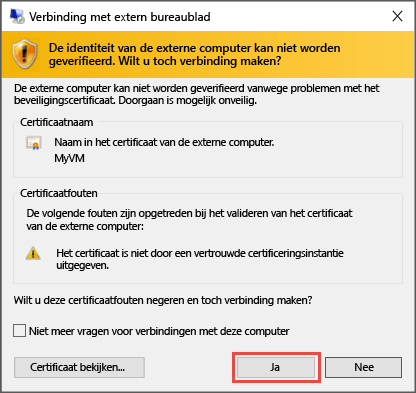
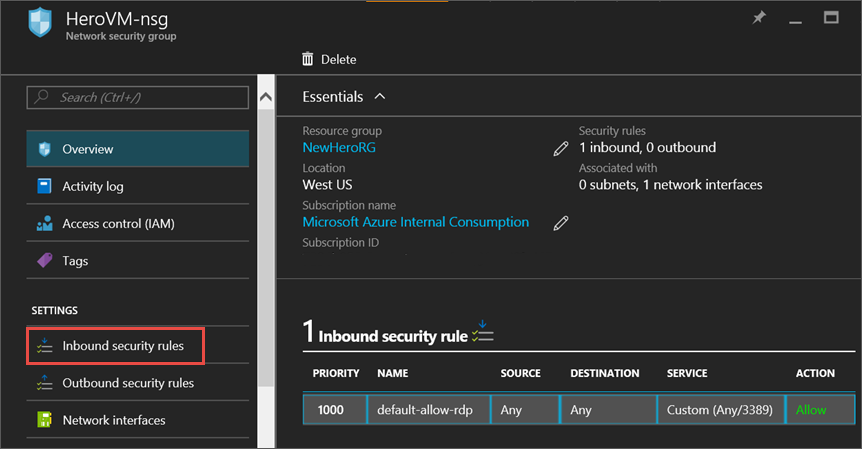

<properties
    pageTitle="Uw eerste virtuele Windows-machine maken | Microsoft Azure"
    description="Informatie over het maken van uw eerste virtuele Windows-machine met behulp van de Azure-portal."
    keywords="Virtuele Windows-machine,een virtuele machine maken,virtuele computer,een virtuele machine instellen"
    services="virtual-machines-windows"
    documentationCenter=""
    authors="cynthn"
    manager="timlt"
    editor=""
    tags="azure-resource-manager"/>
<tags
    ms.service="virtual-machines-windows"
    ms.workload="infrastructure-services"
    ms.tgt_pltfrm="vm-windows"
    ms.devlang="na"
    ms.topic="hero-article"
    ms.date="08/29/2016"
    ms.author="cynthn"/>

# Uw eerste virtuele Windows-machine maken met behulp van Azure-portal

Deze zelfstudie leert u hoe eenvoudig het is om in enkele minuten een virtuele Windows-machine te maken met behulp van de Azure-portal.  

Als u geen Azure-abonnement hebt, kunt u binnen een paar minuten een [gratis account](https://azure.microsoft.com/free/) maken.

Hier volgt een [video-overzicht](https://channel9.msdn.com/Blogs/Azure-Documentation-Shorts/Create-A-Virtual-Machine-Running-Windows-In-The-Azure-Preview-Portal) van deze zelfstudie. 

## Een installatiekopie voor de virtuele machine kiezen in de marketplace

Als voorbeeld gebruiken we een installatiekopie voor Windows Server 2012 R2 Datacenter, maar dat is slechts een van de vele installatiekopieën die Azure biedt. Uw opties voor installatiekopieën zijn afhankelijk van uw abonnement. Bureaubladinstallatiekopieën zijn bijvoorbeeld mogelijk beschikbaar voor [MSDN-abonnees](https://azure.microsoft.com/pricing/member-offers/msdn-benefits-details/?WT.mc_id=A261C142F).

1. Meld u aan bij de [Azure-portal](https://portal.azure.com).

2. Klik in het menu Hub op **Nieuw** > **Virtuele machines** > **Windows Server 2012 R2 Datacenter**.

    

3. Controleer op de blade **Windows Server 2012 R2 Datacenter** onder **Een implementatiemodel selecteren** of **Resource Manager** is geselecteerd. Klik op **Create**.

    

## De virtuele Windows-machine maken

Nadat u de installatiekopie hebt geselecteerd, kunt u voor het grootste deel van de configuratie de standaardinstellingen van Azure gebruiken en snel de virtuele machine maken.

1. Voer op de blade **Grondbeginselen** een **Naam** in voor de virtuele machine. De naam moet 1-15 tekens lang zijn en mag geen speciale tekens bevatten.

2. Voer een **Gebruikersnaam** en een sterk **Wachtwoord** in om te gebruiken voor het maken van een lokaal account op de virtuele machine. Het lokale account wordt gebruikt voor aanmelding bij en beheer van de virtuele machine. 

    Het wachtwoord moet tussen 8 en 123 tekens lang zijn en aan drie van de vier volgende complexiteitsvereisten voldoen: ten minste één kleine letter, één hoofdletter, één cijfer en één speciaal teken. Zie meer informatie over [vereisten voor gebruikersnaam en wachtwoord](virtual-machines-windows-faq.md#what-are-the-username-requirements-when-creating-a-vm).

3. Selecteer een bestaande [Resourcegroep](../resource-group-overview.md#resource-groups) of typ de gewenste naam voor een nieuwe resourcegroep. Typ een Azure-datacenter**locatie**, zoals **VS - west**. 

4. Wanneer u klaar bent, klikt u op **OK** om door te gaan naar de volgende sectie. 

    

    
5. Kies een [grootte](virtual-machines-windows-sizes.md) voor de virtuele machine en klik vervolgens op **Selecteren** om door te gaan. 

    

6. Op de blade **Instellingen** kunt u de opslag- en netwerkopties wijzigen. Accepteer voor deze zelfstudie de standaardinstellingen. Als u voor uw virtuele machine een grootte hebt geselecteerd die hierdoor wordt ondersteund, kunt u Premium Storage uitproberen. Selecteer hiervoor onder **Schijftype** de optie **Premium SSD**. Wanneer u alle wijzigingen hebt aangebracht, klikt u op **OK**.

    

7. Klik op **Samenvatting** om uw keuzes te bekijken. Als u het bericht **Validatie geslaagd** ziet, klikt u op **OK**.

    

8. Terwijl Azure de virtuele machine maakt, kunt u de voortgang volgen onder **Virtuele machines** in het menu Hub. 

## Verbinding maken met de virtuele machine en aanmelden

1.  Klik in het menu Hub op **Virtuele machines**.

2.  Selecteer de virtuele machine in de lijst.

3. Klik op de blade voor de virtuele machine op **Verbinden**. Er wordt nu een Remote Desktop Protocol-bestand (RDP-bestand) gemaakt en gedownload. Een RDP-bestand is een soort snelkoppeling om verbinding te maken met uw computer. Uit oogpunt van gemak is het mogelijk een goed idee om het bestand op uw bureaublad op te slaan. **Open** dit bestand om verbinding te maken met de virtuele machine.

    

4. U ontvangt een waarschuwing dat het RDP-bestand van een onbekende uitgever is. Dit is normaal. Klik in het venster Extern bureaublad op **Verbinden** om door te gaan.

    

5. Typ in het venster Windows-beveiliging de gebruikersnaam en het wachtwoord voor het lokale account dat u hebt gemaakt tijdens het maken van de virtuele machine. U voert de gebruikersnaam in als *naam_van_virtuele_machine*&#92;*gebruikersnaam*. Klik vervolgens op **OK**.

    
    
6.  U ontvangt een waarschuwing dat het certificaat niet kan worden geverifieerd. Dit is normaal. Klik op **Ja** om de identiteit van de virtuele machine te controleren en het aanmelden te voltooien.

    

Als u problemen ondervindt wanneer u verbinding probeert te maken, raadpleegt u [Problemen oplossen met Extern bureaublad-verbindingen met een virtuele Windows-machine in Azure](virtual-machines-windows-troubleshoot-rdp-connection.md).

U kunt de virtuele machine nu net zo gebruiken als elke andere server.

## IIS installeren op de virtuele machine

Nu u bent aangemeld bij de virtuele machine gaan we een serverfunctie installeren zodat u meer kunt experimenteren.

1. Open **Serverbeheer** als dit nog niet is geopend. Klik op het menu **Start** en klik vervolgens op **Serverbeheer**.
2. Selecteer in **Serverbeheer** de optie **Lokale server** in het linkerdeelvenster. 
3. Selecteer in het menu **Beheren** > **Functies en onderdelen toevoegen**.
4. Kies in de Wizard Functies en onderdelen toevoegen op de pagina **Installatietype** de optie **Installatie die op de functie of het onderdeel is gebaseerd** en klik vervolgens op **Volgende**.

    

5. Selecteer de virtuele machine in de serverpool en klik op **Volgende**.
6. Selecteer op de pagina **Serverfuncties** de optie **Webserver (IIS)**.

    

7. Controleer of in het pop-upvenster over het toevoegen van functies die nodig zijn voor IIS dat **Beheerprogramma's opnemen (indien van toepassing)** is geselecteerd en klik vervolgens op **Onderdelen toevoegen**. Als het pop-upvenster wordt gesloten, klikt u in de wizard op **Volgende**.

    

8. Klik op de pagina met onderdelen op **Volgende**.
9. Klik op de pagina **Webserverfunctie (IIS)** op **Volgende**. 
10. Klik op de pagina **Functieservices** op **Volgende**. 
11. Klik op de pagina **Bevestiging** op **Installeren**. 
12. Klik nadat de installatie is voltooid op **Sluiten** in de wizard.

## Poort 80 openen 

Als u wilt dat uw virtuele machine binnenkomend verkeer accepteert via poort 80, moet u een regel voor binnenkomend verkeer toevoegen aan de netwerkbeveiligingsgroep. 

1. Open de [Azure Portal](https://portal.azure.com).
2. Selecteer onder **Virtuele machines** de virtuele machine die u hebt gemaakt.
3. Selecteer onder de instellingen voor virtuele machines **Netwerkinterfaces** en selecteer vervolgens de bestaande netwerkinterface.

    

4. Klik in **Essentials** voor de netwerkinterface op de **netwerkbeveiligingsgroep**.

    

5. Op de blade **Essentials** voor de netwerkbeveiligingsgroep moet u één bestaande regel voor binnenkomend verkeer hebben voor **default-allow-rdp** waarmee u zich kunt aanmelden bij de virtuele machine. U moet een andere regel voor binnenkomend verkeer toevoegen voor IIS-verkeer. Klik op **Binnenkomende beveiligingsregel**.

    

6. Klik in **Binnenkomende beveiligingsregels** op **Toevoegen**.

    

7. Klik in **Binnenkomende beveiligingsregels** op **Toevoegen**. Type **80** in het poortbereik en zorg ervoor dat **Toestaan** is geselecteerd. Klik als u klaar bent op **OK**.

    
 
Zie [Externe toegang tot de virtuele machine toestaan met behulp van de Azure Portal](virtual-machines-windows-nsg-quickstart-portal.md) voor meer informatie over netwerkbeveiligingsgroepen en regels voor binnenkomend en uitgaand verkeer.
 
## Verbinding maken met de standaardwebsite van IIS

1. Klik in de Azure Portal op **Virtuele machines** en selecteer de virtuele machine.
2. Kopieer op de blade **Essentials** uw **Openbare IP-adres**.

    

2. Open een browser en typ uw openbare IP-adres als volgt in de adresbalk: http://<publicIPaddress> en klik op **Enter** om naar dat adres te gaan.
3. Uw browser moet naar de standaardwebpagina van IIS gaan. De pagina ziet er ongeveer als volgt uit:

    

## De virtuele machine stoppen

Het is een goed idee om de virtuele machine te stoppen als u deze niet gebruikt. Zo voorkomt u dat de kosten oplopen. U stopt de virtuele machine door op de knop **Stoppen** te klikken en vervolgens op **Ja**.

    
Als u de virtuele machine opnieuw wilt opstarten of weer in gebruik wilt nemen, klikt u op de knop **Starten**.

## Volgende stappen

* U kunt ook experimenteren met het [koppelen van een gegevensschijf](virtual-machines-windows-attach-disk-portal.md) aan de virtuele machine. Gegevensschijven bieden meer opslagruimte voor uw virtuele machine.

* U kunt ook [een virtuele Windows-machine maken met behulp van Powershell](virtual-machines-windows-ps-create.md) of [ een virtuele Linux-machine maken](virtual-machines-linux-quick-create-cli.md) met behulp van de Azure CLI.

* Bekijk het artikel [Een virtuele Windows-machine maken met behulp van een Resource Manager-sjabloon](virtual-machines-windows-ps-template.md) als u belangstelling hebt voor het automatiseren van implementaties.

<!--HONumber=ago16_HO5-->

