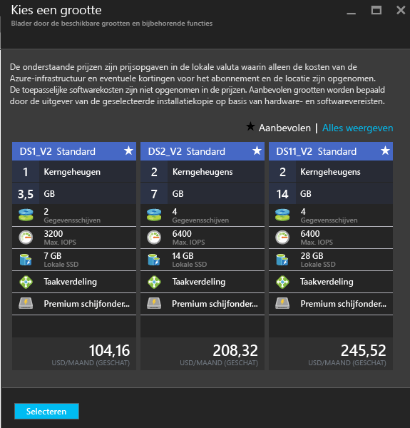
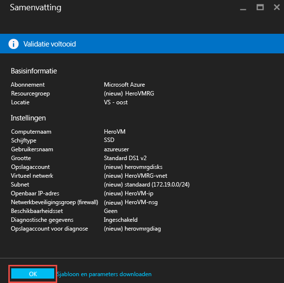

<properties
    pageTitle="Uw eerste virtuele Windows-machine maken | Microsoft Azure"
    description="Informatie over het maken van uw eerste virtuele Windows-machine met behulp van de Azure Portal."
    keywords="Virtuele Windows-machine,een virtuele machine maken,virtuele computer,een virtuele machine instellen"
    services="virtual-machines-windows"
    documentationCenter=""
    authors="cynthn"
    manager="timlt"
    editor=""
    tags="azure-resource-manager"/>
<tags
    ms.service="virtual-machines-windows"
    ms.workload="infrastructure-services"
    ms.tgt_pltfrm="vm-windows"
    ms.devlang="na"
    ms.topic="hero-article"
    ms.date="09/06/2016"
    ms.author="cynthn"/>

# Uw eerste virtuele Windows-machine maken met behulp van Azure-portal

Deze zelfstudie leert u hoe eenvoudig het is om in enkele minuten een virtuele Windows-machine (VM) te maken met behulp van de Azure Portal.  

Als u nog geen abonnement op Azure hebt, maak dan een [gratis account](https://azure.microsoft.com/free/) aan voordat u begint.

## Een installatiekopie voor de virtuele machine kiezen in de marketplace

Als voorbeeld gebruiken we een installatiekopie voor Windows Server 2012 R2 Datacenter, maar dat is slechts een van de vele installatiekopieën die Azure biedt. Uw opties voor installatiekopieën zijn afhankelijk van uw abonnement. Sommige bureaubladinstallatiekopieën zijn beschikbaar voor [MSDN-abonnees](https://azure.microsoft.com/pricing/member-offers/msdn-benefits-details/?WT.mc_id=A261C142F).

1. Meld u aan bij de [Azure-portal](https://portal.azure.com).

2. Klik in het menu Hub op **Nieuw** > **Virtuele machines** > **Windows Server 2012 R2 Datacenter**.

    

3. Controleer op de blade **Windows Server 2012 R2 Datacenter** in **Een implementatiemodel selecteren** of **Resource Manager** is geselecteerd. Klik op **Create**.

    

## De virtuele Windows-machine maken

Nadat u de installatiekopie hebt geselecteerd, kunt u de standaardinstellingen gebruiken en snel de virtuele machine maken.

1. Voer op de blade **Grondbeginselen** een **Naam** in voor de virtuele machine. De naam moet 1-15 tekens lang zijn en mag geen speciale tekens bevatten.

2. Voer een **Gebruikersnaam** en een sterk **Wachtwoord** in om te gebruiken voor het maken van een lokaal account op de virtuele machine. Het lokale account wordt gebruikt voor aanmelding bij en beheer van de VM. 

    Het wachtwoord moet 8 tot 123 tekens lang zijn en aan drie van de vier volgende complexiteitsvereisten voldoen: ten minste één kleine letter, één hoofdletter, één cijfer en één speciaal teken. Zie meer informatie over [vereisten voor gebruikersnaam en wachtwoord](virtual-machines-windows-faq.md#what-are-the-username-requirements-when-creating-a-vm).

3. Selecteer een bestaande [Resourcegroep](../resource-group-overview.md#resource-groups) of typ de gewenste naam voor een nieuwe resourcegroep. Typ een Azure-datacenter**locatie**, zoals **VS - west**. 

4. Wanneer u klaar bent, klikt u op **OK** om door te gaan naar de volgende sectie. 

    

    
5. Kies een [grootte](virtual-machines-windows-sizes.md) voor de VM en klik vervolgens op **Selecteren** om door te gaan. 

    

6. Op de blade **Instellingen** kunt u de opslag- en netwerkopties wijzigen. Accepteer voor deze zelfstudie de standaardinstellingen. Als u voor uw virtuele machine een grootte hebt geselecteerd die hierdoor wordt ondersteund, kunt u Azure Premium Storage uitproberen. Selecteer hiervoor in **Schijftype** de optie **Premium SSD**. Wanneer u alle wijzigingen hebt aangebracht, klikt u op **OK**.

    

7. Klik op **Samenvatting** om uw keuzes te bekijken. Als u het bericht **Validatie geslaagd** ziet, klikt u op **OK**.

    

8. Terwijl Azure de virtuele machine maakt, kunt u de voortgang volgen in **Virtuele machines** in het menu Hub. 

## Verbinding maken met de virtuele machine en aanmelden

1.  Klik in het menu Hub op **Virtuele machines**.

2.  Selecteer de virtuele machine in de lijst.

3. Klik op de blade voor de virtuele machine op **Verbinden**. Er wordt nu een Remote Desktop Protocol-bestand (RDP-bestand) gemaakt en gedownload. Een RDP-bestand is een soort snelkoppeling om verbinding te maken met uw computer. Uit oogpunt van gemak is het mogelijk een goed idee om het bestand op uw bureaublad op te slaan. **Open** dit bestand om verbinding te maken met de virtuele machine.

    

4. U ontvangt een waarschuwing dat het RDP-bestand van een onbekende uitgever is. Dit is normaal. Klik in het venster Extern bureaublad op **Verbinden** om door te gaan.

    

5. Typ in het venster Windows-beveiliging de gebruikersnaam en het wachtwoord voor het lokale account dat u hebt gemaakt tijdens het maken van de virtuele machine. U voert de gebruikersnaam in als *naam_van_virtuele_machine*&#92;*gebruikersnaam*. Klik vervolgens op **OK**.

    
    
6.  U ontvangt een waarschuwing dat het certificaat niet kan worden geverifieerd. Dit is normaal. Klik op **Ja** om de identiteit van de virtuele machine te controleren en het aanmelden te voltooien.

    

Als u problemen ondervindt wanneer u verbinding probeert te maken, raadpleegt u [Problemen oplossen met Extern bureaublad-verbindingen met een virtuele Windows-machine in Azure](virtual-machines-windows-troubleshoot-rdp-connection.md).

U kunt de virtuele machine nu net zo gebruiken als elke andere server.

## Optioneel: de VM stoppen

Het is een goed idee om de virtuele machine te stoppen als u deze niet gebruikt. Zo voorkomt u dat de kosten oplopen. Klik op **Stoppen** en klik vervolgens op **Ja**.

    
Als u de VM opnieuw wilt opstarten of weer in gebruik wilt nemen, klikt u op de knop **Starten**.

## Volgende stappen

- U kunt experimenteren met de nieuwe VM door [IIS te installeren](virtual-machines-windows-hero-role.md). In deze zelfstudie leert u ook hoe u poort 80 opent voor inkomend webverkeer met behulp van een netwerkbeveiligingsgroep (NSG). 

- U kunt ook [een Windows-VM maken met behulp van PowerShell](virtual-machines-windows-ps-create.md) of [ een virtuele Linux-machine maken](virtual-machines-linux-quick-create-cli.md) met behulp van de Azure CLI.

- Bekijk het artikel [Een virtuele Windows-machine maken met behulp van een Resource Manager-sjabloon](virtual-machines-windows-ps-template.md) als u belangstelling hebt voor het automatiseren van implementaties.

<!--HONumber=Sep16_HO3-->

