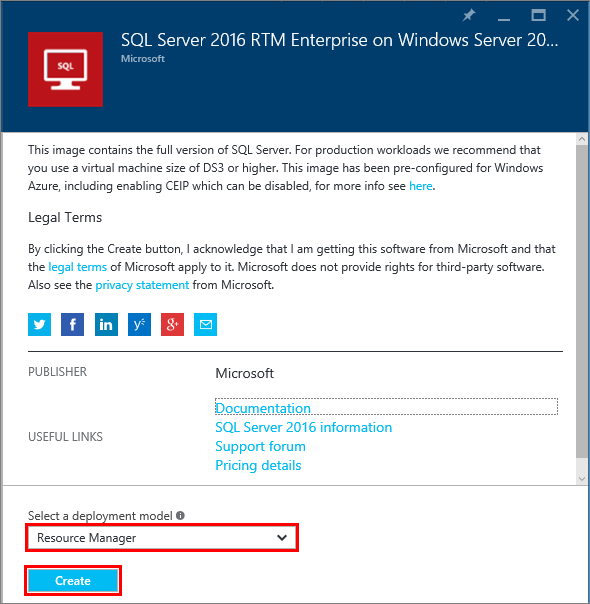
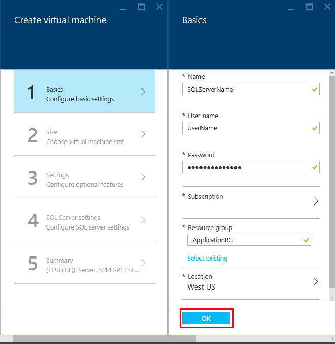
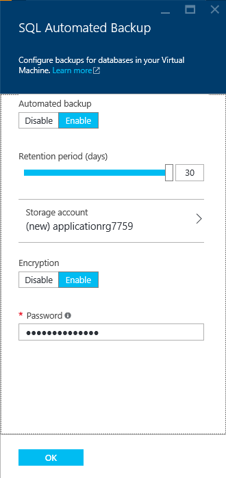
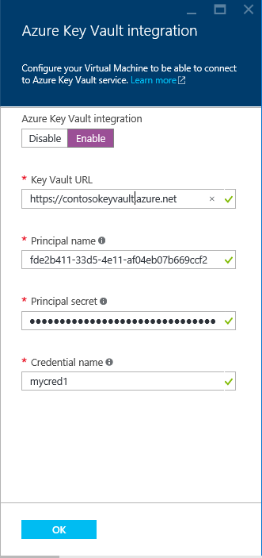

<properties
    pageTitle="Een virtuele SQL Server-machine inrichten | Microsoft Azure"
    description="Richt in Azure een virtuele SQL Server-machine in en maak hier verbinding mee via de portal. In deze zelfstudie wordt de Resource Manager-modus gebruikt."
    services="virtual-machines-windows"
    documentationCenter="na"
    authors="rothja"
    editor=""
    manager="jhubbard"
    tags="azure-resource-manager" />
<tags
    ms.service="virtual-machines-windows"
    ms.devlang="na"
    ms.topic="hero-article"
    ms.tgt_pltfrm="vm-windows-sql-server"
    ms.workload="infrastructure-services"
    ms.date="09/20/2016"
    ms.author="jroth" />

# Een virtuele SQL Server-machine inrichten in de Azure Portal

> [AZURE.SELECTOR]
- [Portal](virtual-machines-windows-portal-sql-server-provision.md)
- [PowerShell](virtual-machines-windows-ps-sql-create.md)

In deze end-to-end zelfstudie wordt getoond hoe u de Azure Portal kunt gebruiken voor het inrichten van een virtuele machine waarop SQL Server wordt uitgevoerd.

De galerie met virtuele machines van Azure bevat diverse installatiekopieën met Microsoft SQL Server. Met een paar klikken kunt u in de galerie een van de installatiekopieën voor een virtuele SQL-machine selecteren en inrichten in uw Azure-omgeving.

In deze zelfstudie leert u het volgende:

- [Een installatiekopie voor een virtuele SQL-machine in de galerie selecteren](#select-a-sql-vm-image-from-the-gallery)
- [De virtuele machine configureren en maken](#configure-the-vm)
- [De virtuele machine openen via Extern bureaublad](#open-the-vm-with-remote-desktop)
- [Op afstand verbinding maken met SQL Server](#connect-to-sql-server-remotely)

## Een installatiekopie voor een virtuele SQL-machine in de galerie selecteren

1. Meld u met uw account aan bij de [Azure Portal](https://portal.azure.com).

    >[AZURE.NOTE] Als u geen Azure-account hebt, gaat u naar [Azure, gratis proefversie](https://azure.microsoft.com/pricing/free-trial/).

1. Klik in de Azure Portal op **Nieuw**. In de portal wordt de blade **Nieuw** geopend. De resources voor virtuele SQL Server-machines bevinden zich in de groep **Virtual Machines** van de Marketplace.

1. Klik op de blade **Nieuw** op de optie **Virtuele machines**.

1. Klik voor een overzicht van de beschikbare installatiekopieën op **Alle weergeven** op de blade **Virtuele machines**.

    

1. Klik onder **Databaseservers** op **SQL Server**. Mogelijk moet u verder omlaag schuiven om **Databaseservers** te vinden. Bekijk de beschikbare SQL Server-sjablonen.

    

1. Elke sjabloon correspondeert met een bepaalde SQL Server-versie en een bepaald besturingssysteem. Selecteer een van de installatiekopieën in de lijst. Bekijk vervolgens de blade met details. Hierop vindt u een beschrijving van de installatiekopie voor de virtuele machine.

    >[AZURE.NOTE] SQL VM-installatiekopieën bevatten de licentiekosten voor SQL Server als prijzen per minuut van de virtuele machine die u maakt. Er is nog een andere mogelijkheid en dat is BYOL (bring-your-own-license). U betaalt dan alleen voor de virtuele machine. De namen van de installatiekopieën worden voorafgegaan door {BYOL}. Zie [Aan de slag met SQL Server in Azure Virtual Machines](virtual-machines-windows-sql-server-iaas-overview.md) voor meer informatie over deze optie.

1. Controleer onder **Een implementatiemodel selecteren** of **Resource Manager** is geselecteerd. Resource Manager is het aanbevolen implementatiemodel voor nieuwe virtuele machines. Klik op **Create**.

    

## De virtuele machine configureren
Er zijn vijf blades voor het configureren van een virtuele SQL Server-machine.

| Stap               | Beschrijving                          |
|---------------------|-------------------------------|
| **Basisbeginselen**              | [Basisinstellingen configureren](#1-configure-basic-settings)      |
| **Grootte**                | [De grootte van de virtuele machine kiezen](#2-choose-virtual-machine-size)   |
| **Instellingen**            | [Optionele kenmerken configureren](#3-configure-optional-features)   |
| **SQL Server-instellingen** | [SQL Server-instellingen configureren](#4-configure-sql-server-settings) |
| **Samenvatting**             | [De samenvatting bekijken](#5-review-the-summary)            |

## 1. Basisinstellingen configureren
Op de blade **Basisbeginselen** geeft u de volgende gegevens op:

* Voer een unieke **naam** in voor de virtuele machine.
* Geef een **gebruikersnaam** op voor het lokale beheerdersaccount op de virtuele machine. Dit account wordt ook toegevoegd aan de vaste serverrol **sysadmin** van de SQL Server.
* Geef een sterk **wachtwoord** op.
* Als u meerdere abonnementen hebt, controleert u of het juiste abonnement is gekoppeld aan de nieuwe virtuele machine.
* Typ in het vak **Resourcegroep** een naam voor een nieuwe resourcegroep. U kunt ook een bestaande resourcegroep gebruiken door op **Bestaande selecteren** te klikken. Een resourcegroep is een verzameling verwante resources in Azure (virtuele machines, opslagaccounts, virtuele netwerken enz.).

    >[AZURE.NOTE] Het is een goed idee om een nieuwe resourcegroep te maken als u het gebruik van SQL Server in Azure alleen wilt testen of hier meer over te weten wilt komen. Als u klaar bent met testen, verwijdert u gewoon de resourcegroep. De virtuele machine en alle resources die aan de resourcegroep zijn gekoppeld, worden dan automatisch verwijderd. Zie voor meer informatie over resourcegroepen [Overzicht van Azure Resource Manager](../resource-group-overview.md).

* Selecteer een **locatie** voor uw implementatie.
* Klik op **OK** om de instellingen op te slaan.

    

## 2. De grootte van de virtuele machine kiezen
Bij de stap **Grootte** kiest u de grootte van uw virtuele machine. Dit doet u op de blade **Een grootte kiezen**. De blade geeft in eerste instantie aanbevolen grootten voor de machine weer op basis van de geselecteerde sjabloon. Er wordt ook een schatting gegeven van de maandelijkse kosten voor het uitvoeren van de virtuele machine.

Voor productieworkloads raden we u aan voor de virtuele machine een grootte te selecteren die ondersteuning biedt voor [Premium Storage](../storage/storage-premium-storage.md). Als u dat prestatieniveau niet nodig hebt, klikt u op de knop **Alle weergeven** om alle opties voor machinegrootte weer te geven. Voor een ontwikkelings- of testomgeving kunt u bijvoorbeeld een kleinere machinegrootte gebruiken.

>[AZURE.NOTE] Zie voor meer informatie over grootten voor virtuele machines [Grootten voor virtuele machines](virtual-machines-windows-sizes.md). Zie voor overwegingen met betrekking tot de grootte van een virtuele SQL Server-machine [Aanbevolen procedures voor prestaties voor SQL Server in Azure Virtual Machines](virtual-machines-windows-sql-performance.md).

Kies de grootte van uw machine en klik vervolgens op **Selecteren**.

## 3. Optionele kenmerken configureren
Op de blade **Instellingen** configureert u de Azure-opslag, -netwerken en -bewaking voor de virtuele machine.

- Geef onder **Opslag** het **Schijftype** op (Standard of Premium (SSD)). Voor productieworkloads wordt Premium Storage aanbevolen.

>[AZURE.NOTE] Als u Premium (SSD) selecteert voor een machinegrootte die geen ondersteuning biedt voor Premium Storage, wordt de grootte van uw machine automatisch gewijzigd.  

- Onder **Opslagaccount** kunt u de automatisch ingerichte opslagaccountnaam accepteren. U kunt ook op **Opslagaccount** klikken om een bestaand account te kiezen en het opslagtype voor het account te configureren. Azure maakt standaard een nieuw opslagaccount met lokaal redundante opslag. Zie voor meer informatie over opslagopties [Azure Storage-replicatie](../storage/storage-redundancy.md).

- Onder **Netwerk** kunt u de automatisch ingevulde waarden accepteren. U kunt ook op elke functie klikken om het **Virtuele netwerk**, het **Subnet**, het **Openbaar IP-adres** en de **Netwerkbeveiligingsgroep** handmatig te configureren. Houd voor deze zelfstudie de standaardwaarden aan.

- In Azure wordt **Bewaking** standaard ingeschakeld met hetzelfde opslagaccount als dat van de virtuele machine. U kunt deze instellingen hier wijzigen.

- Geef onder **Beschikbaarheidsset** een beschikbaarheidsset op. Voor deze zelfstudie kunt u **geen** selecteren. Als u van plan bent de SQL AlwaysOn-beschikbaarheidsgroepen in te stellen, moet u de beschikbaarheid configureren om te voorkomen dat de virtuele machine opnieuw wordt gemaakt.  Zie voor meer informatie [De beschikbaarheid van virtuele machines beheren](virtual-machines-windows-manage-availability.md).

Klik op **OK** wanneer u klaar bent met het configureren van deze instellingen.

## 4. SQL Server-instellingen configureren
Op de blade **SQL Server-instellingen** configureert u specifieke instellingen en optimalisaties voor SQL Server. U kunt onder meer de volgende instellingen voor SQL Server configureren:

| Instelling               |
|---------------------|
| [Connectiviteit](#connectivity)              |
| [Authentication](#authentication)                |
| [Opslagconfiguratie](#storage-configuration)            |
| [Automatisch patchen](#automated-patching) |
| [Automatische back-up](#automated-backup)             |
| [Integratie van Azure Sleutelkluis](#azure-key-vault-integration)             |
| [R Services](#r-services) |

### Connectiviteit
Geef onder **SQL-connectiviteit** het gewenste type toegang tot het SQL Server-exemplaar op deze virtuele machine op. Voor deze zelfstudie selecteert u **Openbaar (internet)** om machines of services op internet toe te staan verbinding te maken met SQL Server. Als deze optie is geselecteerd, configureert Azure automatisch de firewall en de netwerkbeveiligingsgroep voor verkeer op poort 1433.  

Voor verbinding met SQL Server via internet moet u ook SQL Server-verificatie inschakelen. Dit wordt beschreven in het volgende gedeelte.

>[AZURE.NOTE] Het is mogelijk om meer beperkingen in te stellen voor netwerkcommunicatie met uw virtuele SQL Server-machine. U kunt dit doen door de netwerkbeveiligingsgroep te bewerken nadat de virtuele machine is gemaakt. Zie voor meer informatie [Wat is een netwerkbeveiligingsgroep (NSG)?](../virtual-network/virtual-networks-nsg.md)

Als u de mogelijkheid om via internet verbinding te maken met de database-engine liever niet inschakelt, kiest u een van de volgende opties:

- **Lokaal (alleen binnen VM)** om alleen verbindingen met SQL Server vanuit de virtuele machine toe te staan.
- **Privé (binnen virtueel netwerk)** om verbindingen met SQL Server toe te staan vanaf machines of services in hetzelfde virtuele netwerk.

In het algemeen kunt u de beveiliging verbeteren door te kiezen voor de meest beperkende connectiviteit die voor uw scenario mogelijk is. Alle opties kunnen echter worden beveiligd via regels van de netwerkbeveiligingsgroep en SQL/Windows-verificatie.

>[AZURE.NOTE] Met installatiekopieën van virtuele machines voor edities van SQL Server Express of voor ontwikkelaars wordt niet automatisch het TCP/IP-protocol ingeschakeld. Dit voorkomt externe connectiviteit, zelfs als u in de portal de optie Openbaar of Privé hebt geselecteerd. Voor Express- en ontwikkelaarsedities moet u SQL Server Configuration Manager gebruiken om [het TCP/IP-protocol](virtual-machines-windows-sql-connect.md#configure-sql-server-to-listen-on-the-tcp-protocol) handmatig in te schakelen nadat de virtuele machine is gemaakt.

**Poort** is standaard ingesteld op 1433. U kunt een ander poortnummer opgeven.
Zie voor meer informatie [Verbinden met een SQL Server-VM (Resource Manager) | Microsoft Azure](virtual-machines-windows-sql-connect.md).

### Verificatie
Als u SQL Server-verificatie vereist, klikt u onder **SQL-verificatie** op **Inschakelen**.

>[AZURE.NOTE] Als u van plan bent via internet toegang te verkrijgen tot SQL Server (d.w.z. via een openbare verbinding), moet u hier SQL-verificatie inschakelen. Voor openbare toegang tot de SQL Server is het gebruik van SQL-verificatie vereist.

Als u SQL Server-verificatie inschakelt, geeft u een **Aanmeldingsnaam** en een **Wachtwoord** op. Deze gebruikersnaam is geconfigureerd als aanmeldingsnaam voor SQL Server-verificatie en lid van de vaste serverrol **sysadmin**. Zie [Een verificatiemodus kiezen](http://msdn.microsoft.com/library/ms144284.aspx) voor meer informatie over de verificatiemodi.

Als u SQL Server-verificatie niet inschakelt, kunt u het lokale beheerdersaccount op de virtuele machine gebruiken om verbinding te maken met het SQL Server-exemplaar.

### Opslagconfiguratie
Klik op **Opslagconfiguratie** om de opslagvereisten op te geven.

>[AZURE.NOTE] Als u Standaardopslag selecteert, is deze optie niet beschikbaar. Automatische opslagoptimalisatie is alleen beschikbaar voor Premium Storage.

U kunt vereisten opgeven als i/o-bewerkingen per seconde (IOP's), als doorvoer in MB/s en als totale grootte van de opslagruimte. Configureer deze waarden met behulp van de schuifregelaar. De portal berekent automatisch het aantal schijven op basis van deze vereisten.

Standaard wordt de opslag in Azure geoptimaliseerd voor 5000 IOP's, 200 MB en 1 TB opslagruimte. U kunt deze opslaginstellingen wijzigen op basis van de workload. Selecteer onder **Opslag geoptimaliseerd voor** een van de volgende opties:

- **Algemeen** is de standaardinstelling en ondersteunt de meeste workloads.
- Met **Transactionele** verwerking wordt de opslag voor OLTP-workloads van traditionele databases geoptimaliseerd.
- **Gegevensopslag** optimaliseert de opslag voor analyse- en rapportageworkloads.

>[AZURE.NOTE] De bovenste limieten op de schuifregelaars variëren afhankelijk van de grootte van de geselecteerde virtuele machine.

### Automatisch patchen
**Automatisch patchen** is standaard ingeschakeld. Met automatisch patchen kan Azure automatisch een patch uitvoeren voor SQL Server en het besturingssysteem. Geef een dag van de week, een tijd en een periode op voor een onderhoudssessie. Azure voert de patch uit tijdens deze onderhoudssessie. Het onderhoudsschema maakt voor de tijd gebruik van de landinstellingen van de virtuele machine. Als u niet wilt dat Azure een automatische patch uitvoert voor SQL Server en het besturingssysteem, klikt u op **Uitschakelen**.  

Zie voor meer informatie [Automatisch patchen voor SQL Server in Azure Virtual Machines](virtual-machines-windows-sql-automated-patching.md).

### Automatische back-up
Schakel automatische databaseback-ups in voor alle databases onder **Automatische back-up**. Automatische back-up is standaard uitgeschakeld.

Als u automatische back-up van SQL inschakelt, kunt u het volgende configureren:

- De retentieperiode (dagen) voor back-ups
- Het opslagaccount dat voor back-ups moet worden gebruikt
- Versleutelingsoptie en wachtwoord voor back-ups

Voor het versleutelen van de back-up klikt u op **Inschakelen**. Geef het **Wachtwoord** op. Azure maakt een certificaat voor het versleutelen van de back-ups en gebruikt het opgegeven wachtwoord om dit certificaat te beschermen.

 Zie voor meer informatie [Automatische back-up voor SQL Server in Azure Virtual Machines](virtual-machines-windows-sql-automated-backup.md).

### Integratie van Azure Sleutelkluis
Voor het opslaan van beveiligingsgeheimen in Azure voor versleuteling klikt u op **Integratie van Azure Sleutelkluis**. Klik vervolgens op **Inschakelen**.

De volgende tabel bevat de vereiste parameters voor het configureren van de Azure Sleutelkluis-integratie.

|PARAMETER|BESCHRIJVING|VOORBEELD|
|----------|----------|-------|
|**Sleutelkluis-URL** |De locatie van de sleutelkluis.|https://contosokeyvault.vault.azure.net/ |
|**Principal-naam** |Principal-naam voor de Azure Active Directory-service. Deze naam wordt ook wel aangeduid als de Client-ID.  |fde2b411-33d5-4e11-af04eb07b669ccf2|
| **Principal-geheim**|Principal-geheim voor de Azure Active Directory-service. Dit geheim wordt ook wel aangeduid als het Clientgeheim. | 9VTJSQwzlFepD8XODnzy8n2V01Jd8dAjwm/azF1XDKM=|
|**Referentienaam**|**Referentienaam**: de Azure Sleutelkluis-integratie maakt een referentie in SQL Server, zodat de virtuele machine toegang heeft tot de sleutelkluis. Kies een naam voor deze referentie.| mycred1|

Zie voor meer informatie [Integratie van Azure Sleutelkluis configureren voor SQL Server op Azure-VM's](virtual-machines-windows-ps-sql-keyvault.md).

Wanneer u klaar bent met het configureren van de SQL Server-instellingen, klikt u op **OK**.

### R services
Voor de SQL Server 2016 Enterprise-editie kunt u gebruikmaken van de optie om [SQL Server R Services](https://msdn.microsoft.com/library/mt604845.aspx) in te schakelen. Op deze manier kunt u geavanceerde analyses gebruiken met SQL Server 2016. Klik op **Inschakelen** op de blade **SQL Server-instellingen**.

>[AZURE.NOTE] Voor SQL Server-installatiekopieën die geen 2016 Enterprise-editie zijn, is de optie om R Services in te schakelen uitgeschakeld.

## 5. De samenvatting bekijken
Op de blade **Samenvatting** controleert u de samenvatting en klikt u op **OK** om de SQL Server, de resourcegroep en de resources te maken die zijn opgegeven voor deze virtuele machine.

U kunt de implementatie bewaken vanuit de Azure Portal. Met de knop **Meldingen** boven aan het scherm kunt u de algemene status van de implementatie weergeven.

>[AZURE.NOTE] Om u een idee te geven van de implementatietijden, heb ik een virtuele SQL-machine voor de regio VS - oost geïmplementeerd met standaardinstellingen. Deze testimplementatie nam in totaal 26 minuten in beslag. Afhankelijk van uw regio en de geselecteerde instellingen bent u mogelijk meer of minder tijd kwijt aan de implementatie.

## De virtuele machine openen via Extern bureaublad

Doorloop de volgende stappen om via Extern bureaublad verbinding te maken met de virtuele machine:

1. Nadat u de virtuele Azure-machine hebt gemaakt, wordt het pictogram van de virtuele machine weergegeven op uw Azure-dashboard. U kunt de virtuele machine ook vinden door te bladeren door uw bestaande virtuele machines. Klik op de nieuwe virtuele SQL-machine. De blade **Virtuele machine** wordt weergegeven. Hierop ziet u de details van uw virtuele machine.
1. Klik boven aan de blade **Virtuele machine** op **Verbinden**.
1. De browser downloadt een RDP-bestand voor de virtuele machine. Open het RDP-bestand.
    
1. Verbinding met extern bureaublad meldt dat de uitgever van deze externe verbinding niet kan worden geïdentificeerd. Klik op **Verbinden** om door te gaan.
1. Klik in het dialoogvenster **Windows-beveiliging** op **Een ander account gebruiken**.
1. Voor **Gebruikersnaam** typt u **\<gebruikersnaam>**, waarbij <user name> de gebruikersnaam is die u hebt opgegeven bij het instellen van de virtuele machine. U moet vóór de naam een backslash toevoegen.
1. Typ het **Wachtwoord** dat u eerder hebt geconfigureerd voor deze virtuele machine. Klik vervolgens op **OK** om verbinding te maken.
1. Als u in een ander dialoogvenster **Verbinding met extern bureaublad** wordt gevraagd of u verbinding wilt maken, klikt u op **Ja**.

Nadat u verbinding hebt gemaakt met de virtuele SQL Server-machine, kunt u SQL Server Management Studio starten en verbinding maken met Windows-verificatie met behulp van de lokale beheerdersreferenties. Als u SQL Server-verificatie inschakelt, kunt u ook verbinding maken met SQL-verificatie. Dit kan met behulp van de SQL-aanmeldingsnaam en het wachtwoord die u hebt geconfigureerd tijdens het inrichten.

Met toegang tot de machine kunt u rechtstreeks de instellingen voor de machine en de SQL Server wijzigen op basis van uw vereisten. U kunt bijvoorbeeld de firewallinstellingen configureren of de SQL Server-configuratie-instellingen wijzigen.

## Op afstand verbinding maken met SQL Server

In deze zelfstudie hebben we **Openbare** toegang voor de virtuele machine en **SQL Server-verificatie** geselecteerd. Door deze instellingen is de virtuele machine automatisch geconfigureerd voor het toestaan van SQL Server-verbindingen vanaf elke client via internet (ervan uitgaande dat deze beschikken over de juiste SQL-aanmeldgegevens).

>[AZURE.NOTE] Als u tijdens het inrichten niet Openbaar hebt geselecteerd, zijn er extra stappen vereist voor toegang via internet tot uw SQL Server-exemplaar. Zie voor meer informatie [Verbinden met een SQL Server-VM](virtual-machines-windows-sql-connect.md).

In de volgende secties ziet u hoe u vanaf een andere computer via internet verbinding maakt met uw SQL Server-exemplaar op de virtuele machine.

> [AZURE.INCLUDE [Connect to SQL Server in a VM Resource Manager](../../includes/virtual-machines-sql-server-connection-steps-resource-manager.md)]

## Volgende stappen
Zie voor meer informatie over het gebruik van SQL Server in Azure [SQL Server in Azure Virtual Machines](virtual-machines-windows-sql-server-iaas-overview.md) en de [Veelgestelde vragen](virtual-machines-windows-sql-server-iaas-faq.md).

Bekijk voor een video-overzicht van SQL Server in Azure Virtual Machines [Azure VM is het beste platform voor SQL Server 2016](https://channel9.msdn.com/Events/DataDriven/SQLServer2016/Azure-VM-is-the-best-platform-for-SQL-Server-2016).

[Bekijk het leertraject](https://azure.microsoft.com/documentation/learning-paths/sql-azure-vm/) voor virtuele SQL Server-machines in Azure.

<!--HONumber=Sep16_HO3-->

