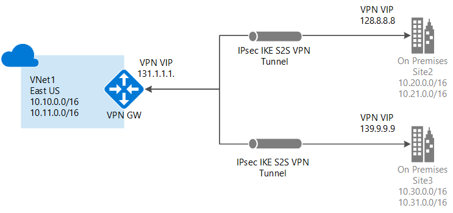

<properties 
   pageTitle="Topologieën voor VPN-gatewayverbindingen | Microsoft Azure"
   description="Bekijk de topologieën voor VPN-gatewayverbindingen en de beschikbare configuratiehulpmiddelen en implementatiemodellen."
   services="vpn-gateway"
   documentationCenter="na"
   authors="cherylmc"
   manager="carmonm"
   editor=""
   tags="azure-resource-manager,azure-service-management"/>
<tags 
   ms.service="vpn-gateway"
   ms.devlang="na"
   ms.topic="get-started-article"
   ms.tgt_pltfrm="na"
   ms.workload="infrastructure-services"
   ms.date="07/19/2016"
   ms.author="cherylmc" />

# Azure VPN-gatewayverbindingen

In dit artikel worden de topologieën voor eenvoudige VPN-gatewayverbindingen beschreven. U kunt de afbeeldingen en beschrijvingen gebruiken als hulp bij het selecteren van de juiste configuratietopologie voor uw vereisten. Hoewel dit een artikel is over de belangrijkste basistopologieën, is het mogelijk om met de diagrammen als richtlijn complexere topologieën te bouwen.

Elke topologie bevat een tabel met het implementatiemodel waarvoor de topologie beschikbaar is, de implementatiehulpmiddelen die u kunt gebruiken om elke topologie te configureren en een koppeling naar een artikel, indien van toepassing. De tabellen worden regelmatig bijgewerkt als er nieuwe artikelen en implementatiehulpmiddelen beschikbaar komen.

Nadat u hebt gekozen welke verbinding u wilt maken, zijn de instructies die u volgt om uw VPN-gateway te maken afhankelijk van het implementatiemodel waarmee u uw virtuele netwerk hebt gemaakt. Als u bijvoorbeeld uw VNet hebt gemaakt met het klassieke implementatiemodel, gebruikt u de richtlijnen en instructies voor het klassieke implementatiemodel om uw VPN-gateway te maken en te configureren. Het is niet mogelijk om een Resource Manager-VPN-gateway te maken voor een virtueel netwerk van een klassiek implementatiemodel. Zie [Understanding Resource Manager and classic deployment models](../resource-manager-deployment-model.md) (Het Resource Manager-implementatie en klassieke implementatie begrijpen) voor meer informatie over de implementatiemodellen.

## Site-naar-site en multi-site

Een site-naar-site-verbinding is een verbinding via een VPN-tunnel met IPsec/IKE (IKEv1 of IKEv2). Dit type verbinding vereist een VPN-apparaat of Windows Server RRAS on-premises. Site-naar-site-verbindingen kunnen worden gebruikt voor cross-premises en hybride configuraties.   

**S2S-diagram**

Als u op route gebaseerde Azure-VPN's gebruikt, kunt u in uw on-premises netwerken meerdere S2S-VPN-verbindingen maken en configureren. Dit type configuratie wordt vaak een multi-site-verbinding genoemd.
 

**Multi-site-diagram**

**Beschikbare implementatiemodellen en -methoden**

[AZURE.INCLUDE [vpn-gateway-table-site-to-site](../../includes/vpn-gateway-table-site-to-site-include.md)] 

## VNet-naar-VNet

Het verbinden van een virtueel netwerk met een ander virtueel netwerk (VNet-naar-VNet) lijkt veel op het verbinden van een VNet met een on-premises locatie. Voor beide connectiviteitstypen wordt een Azure VPN-gateway gebruikt om een beveiligde tunnel met IPsec/IKE te bieden. De VNets die u verbindt, kunnen zich bevinden in verschillende regio's of tot verschillende abonnementen behoren. U kunt zelfs VNet-naar-VNet-communicatie met multi-site-configuraties combineren. Zo kunt u netwerktopologieën maken waarin cross-premises connectiviteit is gecombineerd met connectiviteit tussen virtuele netwerken.

Azure heeft momenteel twee implementatiemodellen: Azure Service Management (klassiek) en Azure Resource Manager. Als u al enige tijd met Azure werkt, worden uw Azure VM's en rolinstanties waarschijnlijk uitgevoerd op een klassiek VNet en werken uw nieuwere VM's en rolinstanties misschien op een VNet dat in ARM is gemaakt. U kunt virtuele netwerken met elkaar verbinden, zelfs als ze zich bevinden in verschillende implementatiemodellen.

**VNet2VNet-diagram**

**Beschikbare implementatiemodellen en -methoden**

[AZURE.INCLUDE [vpn-gateway-table-vnet-to-vnet](../../includes/vpn-gateway-table-vnet-to-vnet-include.md)] 

## Punt-naar-site

Met een punt-naar-site-configuratie kunt u vanaf elke clientcomputer afzonderlijk een beveiligde verbinding met het virtuele netwerk maken. Er wordt een VPN-verbinding tot stand gebracht door de verbinding te starten vanaf de clientcomputer. Dit is een uitstekende oplossing als u uw VNet vanaf een externe locatie, zoals vanaf thuis of een conferentie, wilt verbinden, of wanneer u slechts enkele clients hebt die verbinding moeten maken met een virtueel netwerk. 

Een punt-naar-site-verbinding is een VPN-verbinding via SSTP (Secure Socket Tunneling Protocol). Voor punt-naar-site-verbindingen hebt u geen VPN-apparaat of openbaar IP-adres nodig. 

**P2S-diagram**

**Beschikbare implementatiemodellen en -methoden**

[AZURE.INCLUDE [vpn-gateway-table-point-to-site](../../includes/vpn-gateway-table-point-to-site-include.md)] 

##ExpressRoute

[AZURE.INCLUDE [expressroute-intro](../../includes/expressroute-intro-include.md)]

Zie [Technical Overview](../expressroute/expressroute-introduction.md) (Technisch overzicht) voor meer informatie over ExpressRoute.

## Site-naar-site- en ExpressRoute-verbindingen naast elkaar

ExpressRoute is een directe, exclusieve verbinding van uw WAN met Microsoft-Services, waaronder Azure. Deze loopt niet via het openbare internet. Site-naar-site-VPN-verkeer verplaatst zich versleuteld via het openbare internet. De mogelijkheid om site-naar-site-VPN- en ExpressRoute-verbindingen voor hetzelfde virtuele netwerk te configureren, heeft verschillende voordelen. U kunt site-naar-site-VPN configureren als een beveiligd failoverpad voor ExpressRoute of site-naar-site-VPN’s gebruiken om verbinding te maken met sites die geen deel uitmaken van uw netwerk, maar zijn verbonden via ExpressRoute. 

**Diagram van naast elkaar bestaande verbindingen**

**Beschikbare implementatiemodellen en -methoden**

[AZURE.INCLUDE [vpn-gateway-table-coexist](../../includes/vpn-gateway-table-coexist-include.md)] 

## Volgende stappen

Voor een beter inzicht in de instellingen voor de VPN-gateway, raden wij u aan meer vertrouwd raken met de informatie in de artikelen [About VPN Gateways](vpn-gateway-about-vpngateways.md) (Over VPN-gateways) en [VPN Gateway FAQ](vpn-gateway-vpn-faq.md) (Veelgestelde vragen over de VPN-gateway).

 

<!--HONumber=ago16_HO4-->

