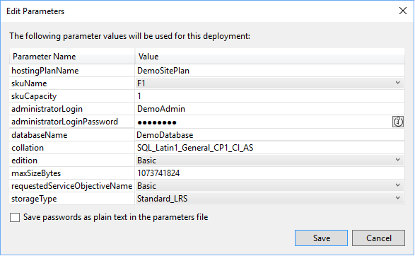
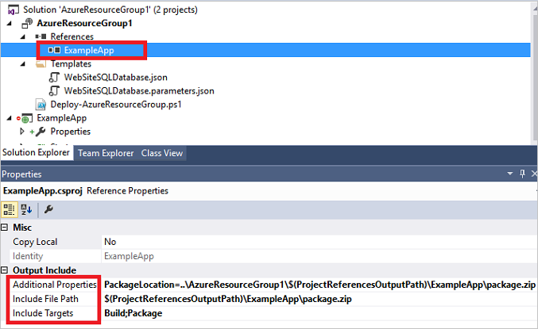

<properties
   pageTitle="Visual Studio-projecten voor Azure-resourcegroepen | Microsoft Azure"
   description="Gebruik Visual Studio om een Azure-resourcegroepproject te maken en de resources in Azure te implementeren."
   services="azure-resource-manager"
   documentationCenter="na"
   authors="tfitzmac"
   manager="timlt"
   editor="tysonn" />
<tags
   ms.service="azure-resource-manager"
   ms.devlang="multiple"
   ms.topic="get-started-article"
   ms.tgt_pltfrm="na"
   ms.workload="na"
   ms.date="08/03/2016"
   ms.author="tomfitz" />

# Azure-resourcegroepen maken en implementeren met Visual Studio

Met Visual Studio en de [Azure SDK](https://azure.microsoft.com/downloads/) kunt u een project maken waarmee uw infrastructuur en code in Azure worden geïmplementeerd. U kunt bijvoorbeeld de webhost, website en database voor uw app opgeven en die infrastructuur samen met de code implementeren. U kunt ook een virtuele machine, een virtueel netwerk en een opslagaccount opgeven en die infrastructuur implementeren in combinatie met een script dat wordt uitgevoerd op de virtuele machine. Met het implementatieproject voor de **Azure-resourcegroep** kunt u alle vereiste resources met één herhaalbare bewerking implementeren. Zie voor meer informatie over het implementeren en beheren van uw resources [Overzicht van Azure Resource Manager](resource-group-overview.md).

Azure-resourcegroepprojecten bevatten Azure Resource Manager JSON-sjablonen, die de resources definiëren die u implementeert in Azure. Zie [Azure Resource Manager-sjablonen samenstellen](resource-group-authoring-templates.md) voor meer informatie over de onderdelen van een Resource Manager-sjabloon. Met Visual Studio kunt u deze sjablonen bewerken. Visual Studio voorziet ook in hulpprogramma's die het eenvoudiger maken om met sjablonen te werken.

In dit onderwerp implementeert u een web-app en SQL database. De stappen zijn echter bijna hetzelfde zijn voor elk type resource. U kunt net zo eenvoudig een Virtuele Machine en de bijbehorende resources implementeren. Visual Studio biedt veel verschillende startsjablonen om te implementeren in algemene scenario's.

Dit artikel toont Visual Studio 2015 Update 2 en Microsoft Azure SDK voor .NET 2.9. Als u Visual Studio 2013 met Azure SDK 2.9 gebruikt, is uw ervaring grotendeels hetzelfde. U kunt Azure SDK versie 2.6 en hoger gebruiken, maar dan is uw ervaring mogelijk anders dan beschreven in dit artikel. Het is raadzaam om de nieuwste versie van de [Azure SDK](https://azure.microsoft.com/downloads/) te installeren voordat u met de stappen begint. 

## Een Azure-resourcegroepproject maken

In deze procedure maakt u een Azure Resource Group-project met het sjabloon **Web app + SQL**.

1. Ga in Visual Studio naar **Bestand**, **Nieuw project**. Kies vervolgens **C#** of **Visual Basic**. Kies vervolgens **Cloud** en het **Azure-resourcegroep**-project.

    

1. Kies het sjabloon dat u wilt implementeren in Azure Resource Manager. Er zijn diverse opties beschikbaar op basis van het type project dat u wilt implementeren. Voor dit onderwerp kiest u het sjabloon **Web-app + SQL**.

    

    Het sjabloon dat u kiest is slechts een beginpunt; u kunt resources toevoegen en verwijderen op basis van uw scenario.

    >[AZURE.NOTE] Visual Studio haalt een lijst met beschikbare sjablonen online op. De lijst kan worden gewijzigd.

    Visual Studio maakt een project voor resourcegroepimplementatie voor de webtoepassing en SQL Database.

1. Vouw de knooppunten in het implementatieproject uit om te zien wat u hebt gemaakt.

    

    Omdat er voor dit voorbeeld is gekozen voor het sjabloon Webtoepassing + SQL, krijgt u de volgende bestanden te zien. 

  	|Bestandsnaam|Beschrijving|
  	|---|---|
  	|Deploy-AzureResourceGroup.ps1|Een PowerShell-script waarmee PowerShell-opdrachten worden aangeroepen om te worden geïmplementeerd in Azure Resource Manager. **Opmerking** Visual Studio gebruikt dit PowerShell-script voor het implementeren van uw sjabloon. Eventuele wijzigingen die u aanbrengt in dit script beïnvloeden de implementatie in Visual Studio, dus wees voorzichtig.|
  	|WebSiteSQLDatabase.json|Het Resource Manager-sjabloon dat de infrastructuur definieert die u in Azure wilt implementeren en de parameters die u kunt opgeven tijdens de implementatie. Hiermee worden ook de afhankelijkheden tussen resources gedefinieerd zodat deze in de juiste volgorde worden geïmplementeerd.|
  	|WebSiteSQLDatabase.parameters.json|Een parameterbestand dat de waarden bevat die nodig zijn voor het sjabloon. U geeft parameterwaarden door om elke implementatie aan te passen.|

    Alle resourcegroepimplementatieprojecten bevatten deze algemene bestanden. Andere projecten bevatten mogelijk extra bestanden ter ondersteuning van andere functies.

## Het Resource Manager-sjabloon aanpassen

U kunt een implementatieproject aanpassen door de JSON-sjablonen te wijzigen waarin wordt beschreven welke resources u wilt implementeren. JSON staat voor JavaScript Object Notation en is een geserialiseerde gegevensindeling waarmee eenvoudig te werken is. Voor JSON-bestanden wordt een schema gebruikt waarnaar u aan de bovenkant van elk bestand naar verwijst. U kunt het schema downloaden en het analyseren als u er meer inzicht in wilt krijgen. In het schema wordt gedefinieerd welke elementen zijn toegestaan, welke soorten en indelingen voor velden er zijn, wat de mogelijke opsommingswaarden zijn, enzovoort. Zie [Azure Resource Manager-sjablonen samenstellen](resource-group-authoring-templates.md) voor meer informatie over de onderdelen van een Resource Manager-sjabloon.

Als u aan dit sjabloon wilt werken, opent u **WebSiteSQLDatabase.json**.

De Visual Studio-editor biedt hulpprogramma's voor het bewerken van het Resource Manager-sjabloon. In het scherm **JSON-overzicht** ziet u eenvoudig welke elementen zijn gedefinieerd in het sjabloon.

Wanneer u een element in het overzicht selecteert, gaat u naar dat deel van het sjabloon en wordt de bijbehorende JSON gemarkeerd.

U kunt een nieuwe resource toevoegen aan een sjabloon door op de knop **Resource toevoegen** te klikken boven aan het venster JSON Outline of door met de rechtermuisknop op **Resources** te klikken en **Nieuwe resource toevoegen** te selecteren.

Voor deze zelfstudie selecteert u **Opslagaccount** en geeft u het een naam. De naam van een opslagaccount mag alleen cijfers en kleine letters bevatten en moet uit minder dan 24 tekens bestaan. In het project wordt een unieke tekenreeks van 13 tekens aan de naam toegevoegd die u opgeeft. Zorg er dus voor dat uw naam niet uit meer dan 11 tekens bestaat.

U ziet dat niet alleen de resource is toegevoegd, maar ook een parameter voor het type opslagaccount en een variabele voor de naam van het opslagaccount.

De parameter **storageType** wordt vooraf gedefinieerd met de toegestane typen en een standaardtype. U kunt deze waarden laten staan of ze bewerken voor uw scenario. Als u niet iedereen wilt toestaan om een **Premium_LRS**-opslagaccount te implementeren via dit sjabloon, verwijdert u het uit de toegestane typen. 

    "storageType": {
      "type": "string",
      "defaultValue": "Standard_LRS",
      "allowedValues": [
        "Standard_LRS",
        "Standard_ZRS",
        "Standard_GRS",
        "Standard_RAGRS"
      ]
    }

Visual Studio biedt ook IntelliSense om u inzicht te geven in welke eigenschappen beschikbaar zijn bij het bewerken van het sjabloon. Als u bijvoorbeeld de eigenschappen bewerkt van uw App Service-plan, navigeert u naar de resource **HostingPlan** en voegt u een nieuwe waarde toe voor de **eigenschappen**. IntelliSense geeft de beschikbare waarden weer en biedt een beschrijving van die waarden.

U kunt **numberOfWorkers** instellen op 1.

    "properties": {
      "name": "[parameters('hostingPlanName')]",
      "numberOfWorkers": 1
    }

## Het resourcegroepproject implementeren in Azure

U bent nu klaar om uw project te implementeren. Wanneer u een Azure-resourcegroepsproject implementeert, implementeert u het in een Azure-resourcegroep. De resourcegroep is een logische groepering van resources die een gemeenschappelijke lifecycle delen.

1. Kies in het snelmenu van het implementatieprojectknooppunt **Implementeren** > **Nieuwe implementatie**.

    

    Het dialoogvenster **Implementeren in resourcegroep** wordt weergegeven.

    

1. In de vervolgkeuzelijst **Resourcegroep** kiest u een bestaande resourcegroep of maakt u een nieuwe. Als u een nieuwe resourcegroep wilt maken, opent u de vervolgkeuzelijst **Resourcegroep** en selecteert u **Nieuwe maken**.

    

    Het dialoogvenster **Resourcegroep maken** wordt weergegeven. Geef uw groep een naam en locatie en selecteer de knop **Maken**.

    
   
1. U kunt de parameters voor de implementatie bewerken door op **Parameters bewerken** te klikken. Geef waarden op voor de parameters en selecteer **Opslaan**.

    
    
    De optie **Wachtwoorden opslaan als tekst zonder opmaak in het parameterbestand** is niet beveiligd.

1. Klik op **Implementeren** om het project in Azure te implementeren. U kunt de voortgang van de implementatie bekijken in het venster **Uitvoer**. Het implementeren kan enkele minuten duren, afhankelijk van uw configuratie. Voer het beheerderswachtwoord voor de database in de PowerShell-console in wanneer om het wachtwoord wordt gevraagd. Als er geen vooruitgang meer is bij uw implementatie, kan dat zijn omdat u in de PowerShell-console uw wachtwoord nog moet invoeren.

    >[AZURE.NOTE] Visual Studio vraagt u mogelijk om de Azure PowerShell-cmdlets te installeren. U hebt de Azure PowerShell-cmdlets nodig om resourcegroepen te kunnen implementeren. Installeer ze als dit gevraagd wordt.
    
1. Wanneer de implementatie is voltooid, ziet u een bericht in het venster **Uitvoer** dat er als volgt uitziet:

        ...
        15:19:19 - DeploymentName     : websitesqldatabase-0212-2318
        15:19:19 - CorrelationId      : 6cb43be5-86b4-478f-9e2c-7e7ce86b26a2
        15:19:19 - ResourceGroupName  : DemoSiteGroup
        15:19:19 - ProvisioningState  : Succeeded
        ...

1. Open in een browser de [Azure Portal](https://portal.azure.com/) en meld u aan bij uw account. Als u de resourcegroep wilt bekijken, selecteert u **Resourcegroepen** en vervolgens de resourcegroep waarin u hebt geïmplementeerd.

    

1. U ziet alle geïmplementeerde resources.

    

1. Als u wijzigingen aanbrengt en u het project opnieuw wilt implementeren, selecteert u de bestaande resourcegroep direct vanuit het snelmenu van het Azure-resourcegroepproject. In het snelmenu selecteert u **Implementeren** en vervolgens selecteert u de resourcegroep waarin u hebt geïmplementeerd.

    

## Code implementeren in uw infrastructuur

U hebt nu de infrastructuur geïmplementeerd voor uw app, maar er is nog geen code geïmplementeerd in uw project. In dit onderwerp staat hoe u webtoepassingen en SQL Database-tabellen implementeert tijdens de implementatie. Als u een virtuele machine implementeert in plaats van een webtoepassing, moet u als onderdeel van de implementatie code uitvoeren op de machine. De processen voor het implementeren van code voor een webtoepassing en voor het instellen van een virtuele machine zijn bijna hetzelfde.

1. In uw Visual Studio-oplossing voegt u een **ASP.NET-webtoepassing** toe. 

    
    
1. Selecteer **MVC** en wis het veld voor **Hosten in de cloud**, omdat de taak wordt uitgevoerd via het resourcegroepproject.

    
    
1. Wanneer Visual Studio uw web-app maakt, voegt u in het resourcegroepproject een referentie toe aan het web-approject.

    
    
    Wanneer u een verwijzing toevoegt, koppelt u het webtoepassingsproject aan het resourcegroepproject en worden automatisch drie sleuteleigenschappen ingesteld.  
    
    - **Extra eigenschappen** bevat de faseringslocatie van het webimplementatiepakket dat naar Azure Storage wordt gepusht. 
    - **Bestandspad toevoegen** bevat het pad waar het pakket wordt gemaakt. **Doelen toevoegen** bevat de opdracht die tijdens de implementatie wordt uitgevoerd. 
    - Met de standaardwaarde van **Build;Package** kan tijdens de implementatie een webtoepassingspakket worden gebouwd en gemaakt (pakket.zip).  
    
    Er is geen publicatieprofiel nodig omdat tijdens de implementatie de benodigde informatie voor het maken van het pakket wordt verkregen uit de eigenschappen.
    
      
      
1. Voeg een nieuwe resource toe aan het sjabloon en selecteer deze keer **Webimplementatie voor Web Apps**. 

    
    
1. Implementeer uw resourcegroepproject opnieuw in de resourcegroep. Deze keer zijn er enkele nieuwe parameters. U hoeft geen waarden op te geven voor **_artifactsLocation** en **_artifactsLocationSasToken** omdat Visual Studio deze automatisch gegenereert. Stel de map- en bestandsnaam in op het pad dat het implementatiepakket bevat.

    
    
    Voor het **opslagaccountartefact** kunt u het account gebruiken dat is geïmplementeerd met deze resourcegroep.
    
Nadat de implementatie is voltooid, kunt u naar de site bladeren. U ziet daar dat de standaard ASP.NET-app is geïmplementeerd.

## Volgende stappen

- Voor meer informatie over het beheren van resources via de portal ziet u [De Azure Portal gebruiken om uw Azure-resources te beheren](./azure-portal/resource-group-portal.md).
- Zie [Azure Resource Manager-sjablonen samenstellen](resource-group-authoring-templates.md) voor meer informatie over sjablonen.

<!--HONumber=ago16_HO4-->

