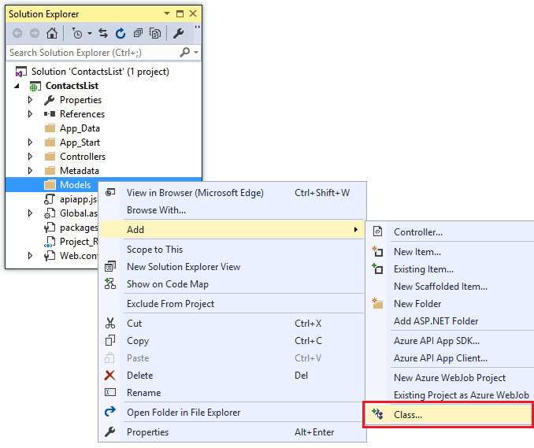
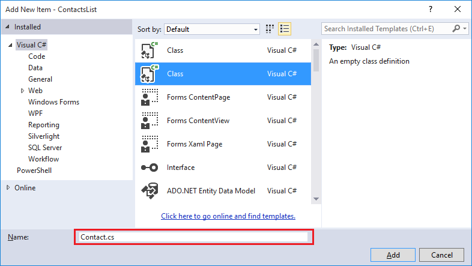
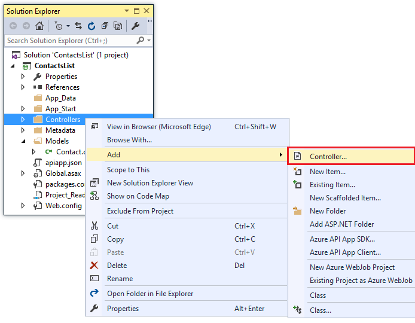
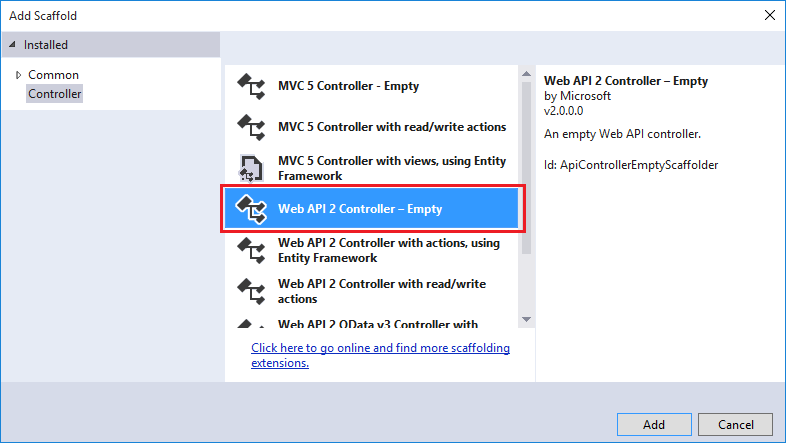

## 新增 Web API 程式碼

在下列步驟中，您為簡單 HTTP Get 方法新增程式碼，以傳回寫在程式碼的連絡人清單。

1. 在 [方案總管] 中，以滑鼠右鍵按一下 [**模型**] 資料夾，然後選取 [**新增 > 類別**]。 

	

2. 將新檔案命名為 *Contact.cs*。

	

3. 按一下 [新增]。

4. 一旦建立了 *Contact.cs* 檔案，即會將檔案的整個內容取代為下列程式碼。

		namespace ContactsList.Models
		{
			public class Contact
			{
				public int Id { get; set; }
				public string Name { get; set; }
				public string EmailAddress { get; set; }
			}
		}

5. 以滑鼠右鍵按一下 [**控制器**] 資料夾，然後選取 [**新增 > 控制器**]。

	

6. 在 [**新增 Scaffold**] 對話方塊中，選取 [**Web API 2 控制器 - 空的**] 選項，然後按一下 [**新增**]。

	

7. 將控制器命名為 **ContactsController**，然後按一下 [**新增**]。

	

8. 一旦建立了 ContactsController.cs 檔案，即會將檔案的整個內容取代為下列程式碼。

		using ContactsList.Models;
		using System;
		using System.Collections.Generic;
		using System.Linq;
		using System.Net;
		using System.Net.Http;
		using System.Threading.Tasks;
		using System.Web.Http;
		
		namespace ContactsList.Controllers
		{
		    public class ContactsController : ApiController
		    {
		        [HttpGet]
		        public IEnumerable<Contact> Get()
		        {
		            return new Contact[]{
						new Contact { Id = 1, EmailAddress = "barney@contoso.com", Name = "Barney Poland"},
						new Contact { Id = 2, EmailAddress = "lacy@contoso.com", Name = "Lacy Barrera"},
	                	new Contact { Id = 3, EmailAddress = "lora@microsoft.com", Name = "Lora Riggs"}
		            };
		        }
		    }
		}

## 啟用 Swagger UI

依預設，會啟用 API 應用程式，並自動產生 [Swagger](http://swagger.io/ "官方 Swagger 資訊") 中繼資料，因此如果您已使用 [**新增 API 應用程式 SDK**] 功能表項目來轉換 Web API 專案，則依預設也會啟用 API 測試頁面。

不過，Azure API 應用程式的新專案範本會停用 API 測試頁面。如果已使用 API 應用程式專案範本建立 API 應用程式專案，則您需要執行下列步驟來啟用測試頁面。

**注意：**如果您啟用 Swagger UI，並將 API 應用程式部署為「匿名公用」，則任何人都能夠使用 Swagger UI 探索及呼叫您的 API。

1. 開啟 *App_Start/SwaggerConfig.cs* 檔案，並搜尋 **EnableSwaggerUI**：

	

2. 將下列幾行程式碼取消註解：

	        })
	    .EnableSwaggerUi(c =>
	        {

3. 完成時，檔案應該如下所示：

	

## 測試 Web API

若要檢視 API 測試頁面，請執行下列步驟。

1. 在本機執行應用程式 (CTRL-F5)，然後導覽至 `/swagger`。 

	

2. 按一下 [**試試看**] 按鈕，您會看見 API 運作中並傳回預期的結果。

	

<!---HONumber=62-->