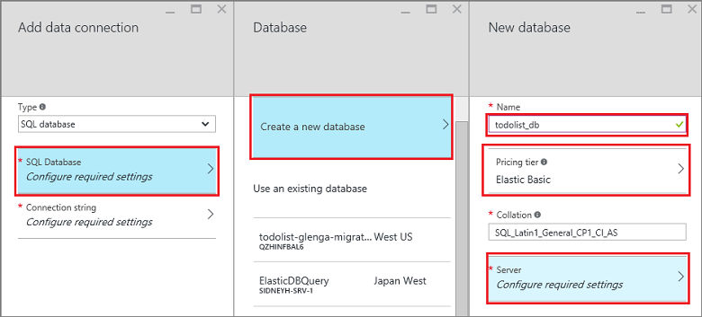

1. Meld u aan bij [Azure Portal].

2. Klik op **+NIEUW** > **Web en mobiel** > **Mobile App** en geef een naam op voor de nieuwe back-end van Mobile App.

3. Selecteer voor de **Resourcegroep** een bestaande resourcegroep of maak een nieuwe (gebruik dezelfde naam als uw app). 
 

 U kunt ofwel een ander App Service-abonnement selecteren of een nieuw maken. Zie [Azure App Service plans in-depth overview](../articles/app-service/azure-web-sites-web-hosting-plans-in-depth-overview.md) (Uitgebreid overzicht van Azure App Service-abonnementen) voor meer informatie over App Service-abonnementen en hoe u een nieuw abonnement maakt in een andere prijscategorie op de door u gewenste locatie.

4. Voor het **App Service-abonnement** is het standaardabonnement (in de [standaardcategorie](https://azure.microsoft.com/pricing/details/app-service/)) geselecteerd. U kunt ook een ander abonnement selecteren of [een nieuw abonnement maken](../app-service/azure-web-sites-web-hosting-plans-in-depth-overview.md#create-an-app-service-plan). De instellingen van het App Service-abonnement bepalen de [locatie, functies, kosten en rekenresources](https://azure.microsoft.com/pricing/details/app-service/) die aan uw app zijn gekoppeld. 

    Nadat u voor een beslissing hebt genomen met betrekking tot een bepaald abonnement, klikt u op **Maken**. Hiermee maakt u de back-end voor de mobiele app. 
    
6. In de blade **Instellingen** van de nieuwe back-end van de mobiele app klikt u op **Snel starten** > het platform van uw client-app > **Verbinding maken met een database**. 

    

7. In de blade **Gegevensverbinding toevoegen** klikt u op **SQL Database** > **Een nieuwe database maken**, typt u de **naam** van de database, kiest u een prijscategorie en klikt u vervolgens op **Server**.  U kunt deze nieuwe database opnieuw gebruiken. Als u al een database op dezelfde locatie hebt, kunt u in plaats daarvan **Een bestaande database gebruiken** kiezen. Het gebruik van een database op een andere locatie wordt niet aanbevolen vanwege bandbreedtekosten en hogere latentie.
 
    

8. In de blade **Nieuwe server** typt u een unieke naam in het veld **Servernaam**, typt u een aanmeldingsnaam en wachtwoord, schakelt u **Toegang van Azure-services tot server toestaan** in en klikt u op **OK**. Nu wordt de nieuwe database gemaakt.

9. Terug in de blade **Gegevensverbinding toevoegen** klikt u op **Verbindingsreeks**, typt u waarden voor de aanmeldingsnaam en het wachtwoord voor uw database en klikt u op **OK**. Wacht enkele minuten totdat de database is geïmplementeerd voordat u doorgaat.

<!-- URLs. -->
[Azure Portal]: https://portal.azure.com/

<!--HONumber=Jun16_HO2-->

