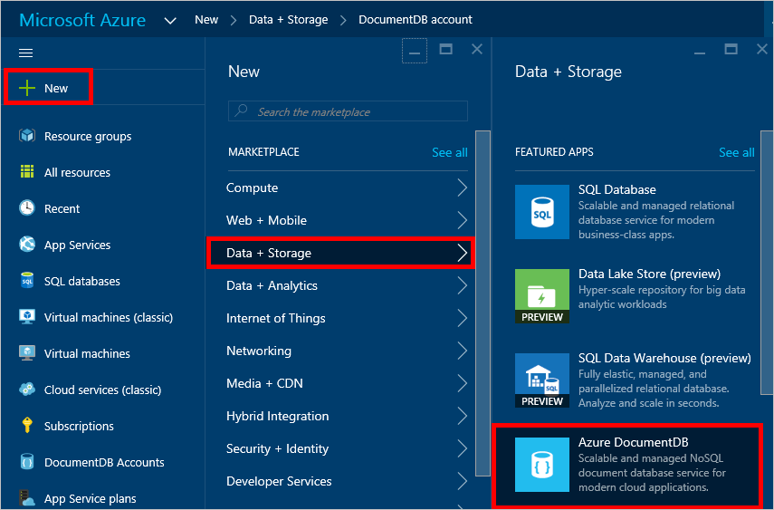
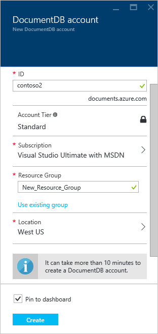
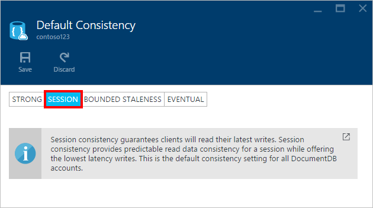

1.  Meld u online aan bij de [Microsoft Azure-portal](https://portal.azure.com/).
2.  Klik in de snelbalk op **Nieuw**, klik vervolgens op **Gegevens en opslag**, en klik vervolgens op **Azure DocumentDB**.

      

3. In de blade **Nieuw DocumentDB-account** geeft u de gewenste configuratie op voor het DocumentDB-account.

    

    - In het vak **ID** typt u de naam die het DocumentDB-account aanduidt.  Wanneer de **id** is gevalideerd, verschijnt een groen vinkje in het vak **ID**. De **ID**-waarde wordt de hostnaam binnen de URI. De **id** mag alleen kleine letters, cijfers en het minteken ('-') bevatten, en moet tussen 3 en 50 tekens zijn. Houd er rekening mee dat *documents.azure.com* wordt toegevoegd aan de eindpuntnaam die u kiest. Het resultaat hiervan wordt het eindpunt van uw DocumentDB-account.

    - Selecteer als **Abonnement** het Azure-abonnement dat u voor het DocumentDB-account wilt gebruiken. Als uw account slechts één abonnement heeft, wordt dit account standaard geselecteerd.

    - In **Resourcegroep** selecteert of maakt u een resourcegroep voor uw DocumentDB-account.  Standaard wordt een nieuwe resourcegroep gemaakt. Zie [Using the Azure portal to manage your Azure resources](../articles/azure-portal/resource-group-portal.md) (De Azure-portal gebruiken om uw Azure-resources te beheren) voor meer informatie.

    - Gebruik **Locatie** om de geografische locatie op te geven waar uw DocumentDB-account moet worden gehost. 
    
    - Schakel **Aan dashboard vastmaken** in, zodat u gemakkelijk toegang krijgt tot uw account en resources die u in de toekomst maakt.  

4.  Zodra de opties voor het nieuwe DocumentDB-account zijn geconfigureerd, klikt u op **Maken**. U kunt de voortgang op het startboard volgen als u de status van de implementatie wilt controleren.  
      

    Of u kunt de voortgang via Notification Hubs bekijken.  

      

    

5.  Nadat het DocumentDB-account is gemaakt, kan het meteen met de standaardinstellingen in de onlineportal worden gebruikt. Merk op dat de standaardconsistentie van de DocumentDB-account is ingesteld op **Sessie**.  U kunt de standaardinstelling voor consistentie aanpassen door te klikken op **Standaardconsistentie** in het menu. Zie [Consistency levels in DocumentDB](../articles/azure-portal/resource-group-portal.md) (Consistentieniveaus in DocumentDB) voor meer informatie over de consistentieniveaus die worden aangeboden door DocumentDB.

      

      

[Procedure: een DocumentDB-account maken]: #Howto
[Volgende stappen]: #NextSteps
[documentdb-manage]:../articles/documentdb/documentdb-manage.md

<!--HONumber=ago16_HO4-->

