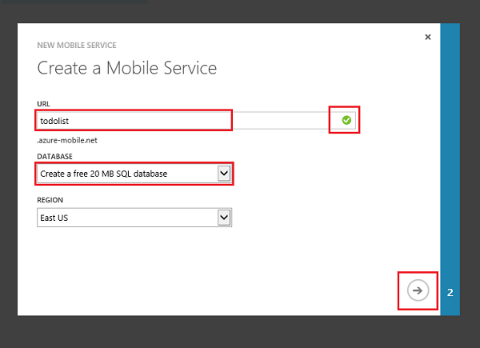
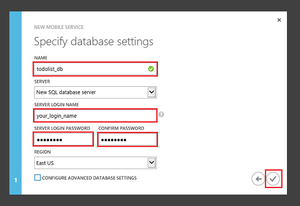

接下來，您將建立新的行動服務來取代記憶體內部資料儲存區清單。依照下列步驟即可建立新的行動服務。

1. 登入 [Azure 管理入口網站](https://manage.windowsazure.com/)。 
2.	在導覽窗格的底端，按一下 **[新增]**。

	

3.	展開 **[計算]** 和 **[行動服務]**，然後按一下 **[建立]**。

	

    隨即出現 **[新增行動服務]** 對話方塊。

4.	在 **[建立行動服務]** 頁面中，選取 **[Create a free 20 MB SQL database]**，然後在 **[URL]** 文字方塊中輸入新行動服務的子網域名稱，並等候進行名稱驗證。一旦名稱驗證完成之後，按一下向右鍵按鈕前往下一頁。

	

    這將顯示 **[指定資料庫設定]** 頁面。

    
	> [AZURE.NOTE]作為本教學課程的一部分，您需要建立新的 SQL 資料庫執行個體和伺服器。You can reuse this new database and administer it as you would any other SQL Database instance.如果新行動服務的區域已經有資料庫存在，您可以改選 **[使用現有資料庫]**，然後選取該資料庫。不建議您使用位在不同區域的資料庫，因為這會需要額外的頻寬成本和產生更高的延遲。

5.	在 **[名稱]** 中輸入新資料庫的名稱，然後輸入 **[登入名稱]** (也就是新 SQL Database 伺服器的系統管理員登入名稱)，輸入並確認密碼，然後按一下核取按鈕以完成程序。

	

    
	> [AZURE.NOTE]當您所提供的密碼不符合最低需求或密碼不相符時，便會顯示一則警告。
	>
	> 建議您記下您所指定的系統管理員登入名稱和密碼；您日後需要此資訊才能重複使用 SQL 資料庫執行個體或伺服器。

您現在已經建立可供行動應用程式使用的新行動服務。接下來，您將新增要用來儲存應用程式資料的資料表。應用程式將使用此資料表來取代記憶體內部收集。

<!---HONumber=July15_HO2-->